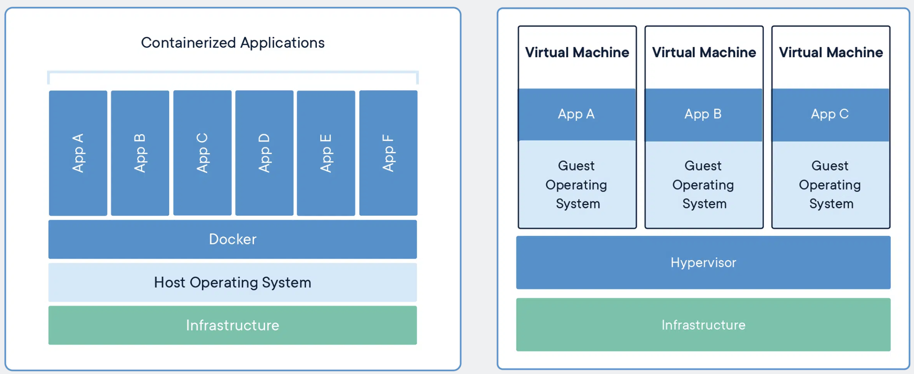
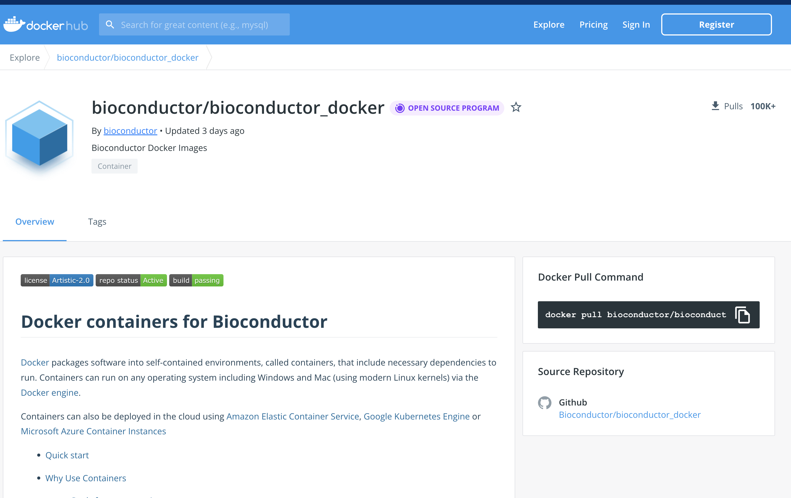
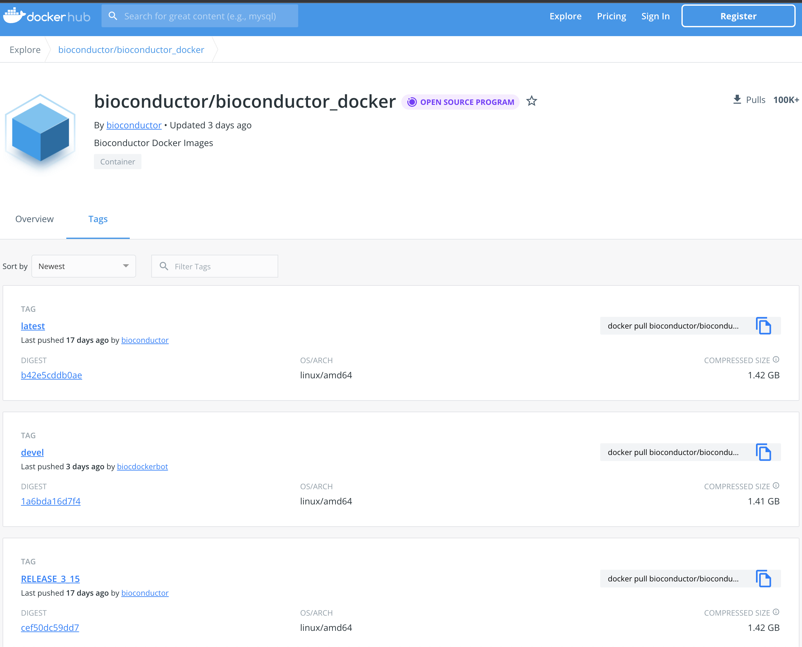

```{r style, echo = FALSE, results = 'asis'}
BiocStyle::markdown()
```

```{r setup, echo=FALSE}
knitr::opts_chunk$set(
    eval = as.logical(Sys.getenv("KNITR_EVAL", "TRUE")),
    cache = as.logical(Sys.getenv("KNITR_CACHE", "TRUE"))
)
```

# The problem

You may have come up with some of the following issues:

1. you want to use software that doesn’t exist for the operating system (Mac, Windows, Linux) you’d prefer.

2. you struggle with installing a software tool because you have to install a number of other dependencies first. 
   Those dependencies, in turn, require other things, and so on (i.e. combinatoric explosion).

3. the software you’re setting up involves many dependencies and only a subset of all possible versions of those
 dependencies actually works as desired.

4. you’re not actually sure what version of the software you’re using because the install process was so circuitous.

5. you and a colleague are using the same software but get different results because you have installed different versions
  and/or are using different operating systems.

6. Package installations take FOREVER! 

# What is Docker?

Docker enables you to separate your applications from your infrastructure. Containers and 
virtual machines have similar resource isolation and allocation benefits, but function differently
because containers virtualize the operating system instead of hardware. Containers are more portable
and efficient.

Deliver multiple applications hassle free and have them run the same way on all your environments 
including design, testing, staging and production – desktop or cloud-native.

**_NOTE: Another way to think about the same concept_**

_Think of an operating system as two primary components, the **kernel space**, and the **user space**. 
The **Kernel** talks to the hardware, and provides core system features.  The **user space** is the 
environment where applications, libraries and system services run. Traditionally you  use an operating 
system that has a fixed combination of kernel and user space.  Containers change the user space into a 
swappable component.




# Install Docker

Install docker if you don't already have it on your machine: https://docs.docker.com/get-docker/

*NOTE*: This takes a while, so ask me questions tomorrow if you are unable to get any of this going.

# Why use Docker for Bioconductor?

You get: 

- System dependencies
- Install > 99% bioconductor packages
- Ubuntu 20.04
- RStudio

# What are the current Bioconductor containers available?

Bioconductor distributes docker conatiners via Dockerhub




**Stable release** of Bioconductor - R 4.2.0 , Bioc 3.15.0

`bioconductor/bioconductor_docker:RELEASE_3_15`

**Development version** - R 4.2.0, Bioc 3.16.0

`bioconductor/bioconductor_docker:devel`



# Using Bioconductor docker containers

## Pull the container (download it)

```
docker pull bioconductor/bioconductor_docker:RELEASE_3_15
```

## Run the docker container

```{sh, eval=FALSE}
docker run \
     --rm \               # remove after use
     -e PASSWORD=bioc \   # set a password for RStudio
     -p 8787:8787 \       # set a port for RStudio
     bioconductor/bioconductor_docker:RELEASE_3_15  # name of container
```

RStudio is now hosted at https://localhost:8787.

## Mount volumes 

You can mount a local directory on to your docker container

```{sh, eval=FALSE}
  docker run \
      --rm \                                   # remove after use
      -v /Users/nitesh/demo/:/home/rstudio/ \  # mount local directory
      -e PASSWORD=password \                   # set password for rstudio
      -p 8787:8787 \                           # set a port
      bioconductor/bioconductor_docker:RELEASE_3_15
```

## Run the docker image with docker-compose

Simplify the running of the docker image by using `docker-compose`. 
You use a YAML file to configure your application’s services.

Easily build in the above commands in configuration file.

```{sh, eval=FALSE}
## Sample docker-compose.yaml file
version: "3.9"
services:
  bioc:
    container_name: bioc-3.15
    image: "bioconductor/bioconductor_docker:RELEASE_3_15"
    ports:
      - "8787:8787"
    environment:
      - PASSWORD=bioc
    volumes:
      - ${HOME}/R/bioconductor_docker/3.15:/usr/local/lib/R/host-site-library
      - ${HOME}/demo:/home/rstudio
```

Run this configuration in the same directory you copied the above docker compose
file.

```{sh, eval=FALSE}
docker-compose up
```

## Installing packages on Bioconductor containers

Binary packages are available!! Faster installs (7x-8x speed ups).

```{r, eval=FALSE}
BiocManager::install(c('rhdf5', 'Rhtslib', 'SingleCellExperiment'))
```

## Extend docker images

Docker Syntax

- `FROM`: Inherit from an container, in this case the `bioconductor/bioconductor_docker:RELEASE_3_15` container.

- `RUN`: Run a couple of shell commands, `curl` and then `R -f` which runs an R file - https://www.huber.embl.de/msmb/install_packages.R

For the purposes of this workshop, 

```
FROM bioconductor/bioconductor_docker:RELEASE_3_15

RUN curl -O https://www.huber.embl.de/msmb/install_packages.R \
    && R -f install_packages.R
```

To build this new image, i'd need to make a `Dockerfile`. Simply paste the above
in a new folder (call it anything), but in a file called Dockerfile.

```
docker build -t nitesh1989/bioconductor_msmb:RELEASE_3_15 .
```

## Example docker image

You can use this example docker image in the exact same manner described above

```
docker pull nitesh1989/bioconductor_msmb:RELEASE_3_15
```

# Singularity

Singularity was created to run complex applications on HPC clusters in a simple, portable, and reproducible way.

The latest `bioconductor/bioconductor_docker` images are easy to use on Singularity as well. Singularity is a container runtime just like Docker,

Doing the same thing as above using Singularity:

```
module load singularity
```

## Pull

```
singularity pull bioconductor-release-3-15.sif docker://bioconductor/bioconductor_docker:RELEASE_3_15
```

## Run

https://docs.sylabs.io/guides/3.1/user-guide/cli/singularity_run.html

```
singularity run --env PASSWORD=bioc bioconductor-release-3-15.sif
```

## Mount 

Mount directories on singularity

```
singularity exec --bind /path/to/existing/lib:/usr/local/lib/R/host-site-library bioconductor-release-3-15.sif
```

# Resources and links

https://bioconductor.org/help/docker/ 

https://hub.docker.com/r/bioconductor/bioconductor_docker

https://singularity.lbl.gov/

