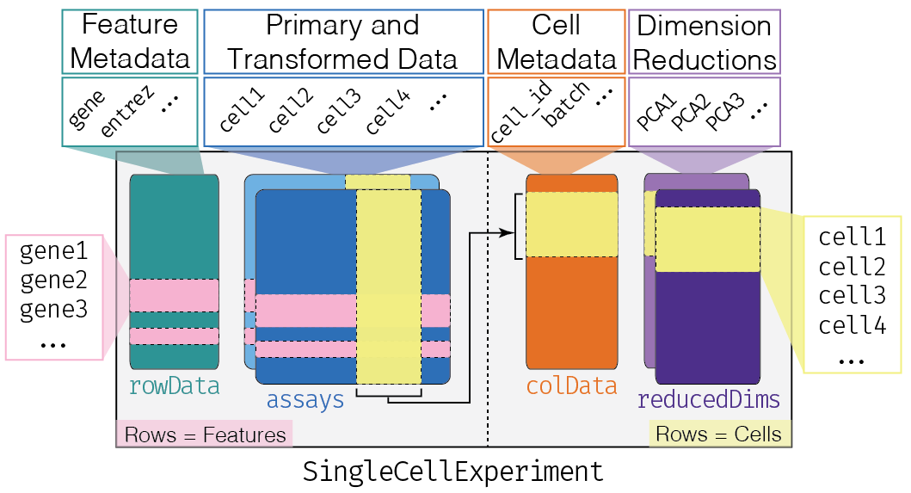

```{r setup, include=FALSE}
knitr::opts_chunk$set(cache = FALSE, error = FALSE, message = FALSE,
                      warning = FALSE, echo = TRUE, results = "markup",
                      fig.align = "center", collapse = TRUE)
```

# Introduction

In this tutorial we walk through a typical single-cell RNA-seq analysis using Bioconductor packages.
We will try to cover data from different protocols, but some of the EDA/QC steps will be focused on the 10X Genomics Chromium protocol.

We start from the output of the Cell Ranger preprocessing software. This is an open source software suite that allows to pre-process the FASTQ files generated by the sequencing platform and perform alignment and quantification. 

We will perform exploratory data analysis (EDA) and quality control (QC), focusing on single-cell, and sometimes droplet-specific, issues, such as the detection of empty droplet and of doublets.
We will then cover dimensionality reduction, cell type identification, pseudotime inference, and (briefly) multi-sample differential expression.

Most of the steps covered here (and much more!) are described in great details in the [Orchestrating Single Cell Analysis (OSCA)](https://bioconductor.org/books/release/OSCA/) book [@amezquita2020orchestrating]. I encourage everyone to use that as a reference for the most typical single-cell analyses with Bioconductor.

[Bioconductor](https://bioconductor.org/) [@Huber2015Orchestrating] has many packages supporting the analysis of single-cell RNA-seq data and their package vignettes constitute an excellent resource.

While not covered in this tutorial, there are packages and software tools for the analysis of single-cell data outside of Bioconductor too. Popular tools include the [Seurat R package](https://satijalab.org/seurat/) and the [scanpy python package](https://scanpy.readthedocs.io/en/stable/). The Bioconductor single-cell echosystem tries whenever possible to provide data structures and coercion functions that make it easy to interoperate between Bioconductor and external software.

## Experimental data

We will use several experimental datasets throughout this tutorial. In particular, we will use:

- Peripheral Blood Mononuclear Cell (PBMC) data from healthy donors provided by 10X Genomics as example datasets, available through the [TENxPBMCData Bioconductor package](https://bioconductor.org/packages/TENxPBMCData/).
- A Fluidigm C1 dataset that studies the differentiation of stem cells in the mouse olfactory epithelium [@fletcher2017deconstructing], available through the [scRNAseq Bioconductor package](https://bioconductor.org/packages/scRNAseq/).
- A 10X Genomics dataset that studies the effect of a treatment on mouse cortex [@crowell2020muscat], available through the [muscData Bioconductor package](https://bioconductor.org/packages/muscData/)

In particular, the [scRNAseq Bioconductor package](https://bioconductor.org/packages/scRNAseq/) contains a wide variety of experimental single-cell datasets that can be used for illustration, exploration, and methods development.

## The SingleCellExperiment class

One common feature of the datasets that we will use is that they are all stored as objects of the `SingleCellExperiment` class.

`SingleCellExperiment` is a S4 class that _extends_ `SummarizedExperiment` and can be used for efficiently storing and working with single-cell data in R/Bioconductor.

This class serves as the common infrastructure for across 70+ single-cell-related Bioconductor packages and allows users to mix and match packages by different developers. This class implements a data structure that stores all aspects of our single-cell data - gene-by-cell expression data, per-cell metadata and per-gene annotation - and manipulate them in a synchronized manner.

```{r, results="asis", out.width="100%", echo=FALSE}

```

A more thorough overview of `SingleCellExperiment` can be found in [Chapter 4 of OSCA](http://bioconductor.org/books/3.15/OSCA.intro/the-singlecellexperiment-class.html).

# Exploratory Data Analysis / Quality Control

In this section we focus on EDA/QC steps that are typical in a single-cell analysis.

We start by considering a dataset on Peripheral Blood Mononuclear Cell (PBMC) data from a healthy donor provided by 10X Genomics. We use the [DropletTestFiles Bioconductor package](https://bioconductor.org/packages/DropletTestFiles/) to download the raw (i.e., unfiltered) count matrix that contains the UMI counts of all genes in all droplets.

```{r}
library(DropletTestFiles)
raw.path <- getTestFile("tenx-2.1.0-pbmc4k/1.0.0/raw.tar.gz")
out.path <- file.path(tempdir(), "pbmc4k")
untar(raw.path, exdir=out.path)

library(DropletUtils)
fname <- file.path(out.path, "raw_gene_bc_matrices/GRCh38")
sce.pbmc <- read10xCounts(fname, col.names=TRUE)
sce.pbmc
```
The `read10xCounts` function starts from the output of the Cell Ranger software and imports the data into R as an object of class `SingleCellExperiment`.

We can notice that the dimension of the matrix is very big; in fact this matrix includes the UMI that have been detected in all the droplets that have been sequenced, including the empty droplets that may contain only ambient RNA.

This is a very sparse matrix, with a large fraction of zeros; `read10xCounts` is aware of this and stores the counts as a sparse matrix, which has a very small memory footprint.

```{r}
class(counts(sce.pbmc))
```

**Exercise**: Explore the `SingleCellExperiment` object and its slots. In particular, the `assay`, `counts`, `colData`, `rowData` assessors.

Before starting the analysis, it may be a good idea to store the names of the genes in a more human-friendly ID system. We can also include information on the chromosome location of the genes; this will be useful for e.g. identifying mitochondrial genes.

```{r}
library(scuttle)
rownames(sce.pbmc) <- uniquifyFeatureNames(
    rowData(sce.pbmc)$ID, rowData(sce.pbmc)$Symbol)

library(EnsDb.Hsapiens.v86)
rowData(sce.pbmc)$location <- mapIds(EnsDb.Hsapiens.v86,
                                     keys=rowData(sce.pbmc)$ID, 
                                     column="SEQNAME", keytype="GENEID")
rowData(sce.pbmc)
```
**Exercise**: compute the proportion of zero for each droplet (column) and draw the distribution across the dataset.

## Empty droplets

The first step is the identification of droplets that do not contain any live cell.

The reason why these droplets contain some RNA is that there may be some ambient RNA due to some cell leaking or they may contain dead or dying cells.

The `barcodeRanks` function can be used to rank the barcodes by number of UMIs and to estimate the knee and inflection point of the distribution.

```{r}
bcrank <- barcodeRanks(counts(sce.pbmc))

# Only showing unique points for plotting speed.
uniq <- !duplicated(bcrank$rank)
plot(bcrank$rank[uniq], bcrank$total[uniq], log="xy",
    xlab="Rank", ylab="Total UMI count", cex.lab=1.2)

abline(h=metadata(bcrank)$inflection, col="darkgreen", lty=2)
abline(h=metadata(bcrank)$knee, col="dodgerblue", lty=2)

legend("bottomleft", legend=c("Inflection", "Knee"), 
        col=c("darkgreen", "dodgerblue"), lty=2, cex=1.2)
```

There is a sharp distinction between droplets with very high counts, very likely to contain a live cell, and droplets with very low counts, very likely to be empty. 

However, it is not straightforward to classify the droplets in the middle of the distribution.

We can apply a statistical test of hypothesis to decide, for each droplet, if its RNA profile is significantly different from the profile of ambient RNA, estimated from the very low counts [@lun2019emptydrops].

We use a very low threshold on the False Discovery Rate to have very few false positive cells.

```{r}
set.seed(100)
e.out <- emptyDrops(counts(sce.pbmc))
summary(e.out$FDR <= 0.001)
```

The large majority of droplets are not tested, since by default all droplets with fewer than 100 UMIs are considered empty.

```{r}
table(colSums(counts(sce.pbmc))>100, e.out$FDR<=0.001, useNA = "ifany")
```

We can now proceed by removing the empty droplets and keep only the ones identified to be cells.

```{r}
sce.pbmc <- sce.pbmc[,which(e.out$FDR <= 0.001)]
sce.pbmc
```
## Data exploration

We will see in more details in the next section how to perform accurate dimensionality reduction. Here, we quickly perform a principal component analysis (PCA) and tSNE embedding to explore the data and highlight possible quality issues for some cells.

These embeddings can be quickly computed using the `runPCA` and `runTSNE` functions in `scater`. It is useful to log transform the data before PCA to more accurately reflect the signal.

The `logNormCounts` function divides by the total number of UMIs in addition to log transforming the counts to account for the difference in sequencing depths. This is not the best normalization approach, but for our current purpose of quickly visualizing the data, it is good enough.

We will need to recompute these embeddings after filtering and proper normalization to obtain a more accurate representation of our data.

```{r}
library(scater)
sce.pbmc <- logNormCounts(sce.pbmc)
sce.pbmc <- runPCA(sce.pbmc)
sce.pbmc <- runTSNE(sce.pbmc, dimred="PCA")
sce.pbmc
```

Note that it is generally a good strategy to start from PCA to compute the tSNE embedding; this is achieved using the `dimred` argument.

**Exercise**: Explore the `logcounts` accessor and the `assayNames`, `assays` and `assay` methods to extract the original counts and the log-normalized counts from the object; explore the `reducedDimNames` and `reducedDim` methods to explore the PCA and t-SNE embedding.

We can visualize the first two PCs and the tSNE embedding using the following `scater` functions.

```{r}
plotPCA(sce.pbmc)
plotTSNE(sce.pbmc)
```

## Quality control

The fact that the droplets are not empty does not automatically mean that they should be kept in the analysis. They may contain damaged or dying cells.

Our aim here is to identify and potentially remove those cells that have lower quality. There are several methods to identify such cells; here we use the simple but effective strategy of removing cells with high percentages of mitochondrial reads.

This is justified by the fact that mitochondiral genes are involved in biological processes in response to stress and apoptosis. Hence, high mitochondrial gene expression may be an indication of damaged or stressed cells.

The `perCellQCMetrics` function can be used to compute a set of metrics useful to evaluate the quality of the samples. The `isOutlier` function uses a data driven threshold to define cells of lower quality compared to the rest of the dataset.

```{r}
stats <- perCellQCMetrics(sce.pbmc,
            subsets=list(Mito=which(rowData(sce.pbmc)$location=="MT")))
high.mito <- isOutlier(stats$subsets_Mito_percent, type="higher")
table(high.mito)
```

Finally, it is convenient to include this information in the `colData` of the object, e.g. to use it in plotting functions.

```{r}
colData(sce.pbmc) <- cbind(colData(sce.pbmc), stats)
sce.pbmc$discard <- high.mito

plotColData(sce.pbmc, y="subsets_Mito_percent",
        colour_by="discard")
plotColData(sce.pbmc, y="detected",
        colour_by="discard")
plotColData(sce.pbmc, x="sum", y="subsets_Mito_percent",
    colour_by="discard") + scale_x_log10()
```

We can also color-code the cells by the QC metrics and/or by the indicator that we defined in the PCA and tSNE plots.

```{r}
plotTSNE(sce.pbmc, colour_by="subsets_Mito_percent")
plotTSNE(sce.pbmc, colour_by="discard")
```

We can see that there are a few cells with high mitochondrial reads scattered around two clusters. In addition, there seems to be a cluster made of only high-mitochondrial cells. It is unclear whether this is a technical artifact due to sample processing or a genuine PBMC cell population that expresses more mitochondrial genes. 

In this tutorial, we go ahead and remove these cells, but in a real analysis, careful thought must be given to whether these metrics are capturing technical noise or biological signal.

```{r}
sce.pbmc <- sce.pbmc[,!high.mito]
sce.pbmc
```

## Normalization

Here, we use the scran method to normalize the data for differences in sequencing depth. This approach is based on the deconvolution of size factors estimated from pools of cells [@l2016pooling].

Since we have a heterogeneous cell population, we perform a quick clustering to make sure that we pool together cells that are not too different from each other.

```{r}
library(scran)
cl <- quickCluster(sce.pbmc)
table(cl)
sce.pbmc <- computeSumFactors(sce.pbmc, clusters = cl)
summary(sizeFactors(sce.pbmc))
```

The function returns a `SingleCellExperiment` object with the estimated size factors stored in the `colData`. To actually normalize the data, we can use the `logNormCounts` function that will use the size factors stored in the object to normalize the data and save the log-normalized counts as a second assay in the object.

```{r}
sce.pbmc <- logNormCounts(sce.pbmc)
sce.pbmc
```

**Exercise**: Extract the size factors with the `colData` and `sizeFactors` accessors.

We can check that the estimated library sizes are not too far from the _library size factors_, estimated from the total number of counts.

```{r}
plot(librarySizeFactors(sce.pbmc), sizeFactors(sce.pbmc), xlab="Library size factor",
    ylab="Deconvolution size factor", log='xy', pch=16,
    col=as.integer(factor(cl)))
abline(a=0, b=1, col="red")
```

## Highly variable genes (HVGs)

We now have a `SingleCellExperiment` object with only the high-quality cells. We may also want to filter the genes to focus on those that are more likely to carry information rather than noise.

In fact, many of the genes that we stored in the object have no UMI in any cell. We can easily verify that by looking at the number of zero counts in each cell.

```{r}
summary(colMeans(counts(sce.pbmc)==0))
```

On average, 87% of the genes have 0 UMIs in a given cell.

Some genes will be expressed in a large fraction of cells, while others will almost always be 0.

```{r}
summary(rowMeans(counts(sce.pbmc)==0))
```

Hence, we can start off by removing those genes that are 0 across the board.

```{r}
allzero <- rowMeans(counts(sce.pbmc)==0)==1
table(allzero)
sce.pbmc <- sce.pbmc[which(!allzero),]
sce.pbmc
```
Note that we have removed more than 40% of the genes.

This loose filter is often not sufficient, and we usually prefer to focus on a set of highly variable genes for the subsequent analysis steps.

The rationale is that if the genes are carrying biologically relevant information, e.g., in distinguishing among cell types, they will not have a constant expression, but rather will vary between cells.


The simplest approach to quantifying per-gene variation is to compute the variance of the log-normalized expression values for each gene across all cells. We need to model the mean-variance relationship since the log is not a variance stabilizing transformation.


```{r}
set.seed(1001)
dec.pbmc <- modelGeneVar(sce.pbmc)
head(dec.pbmc)
```
At any given abundance, we assume that the variation in expression for most genes is driven by uninteresting processes like sampling noise. Under this assumption, the fitted value of the trend at any given gene’s abundance represents an estimate of its uninteresting variation, which we call the technical component. We then define the biological component for each gene as the difference between its total variance and the technical component. This biological component represents the "interesting" variation.

```{r}
plot(dec.pbmc$mean, dec.pbmc$total, pch=16, cex=0.5,
    xlab="Mean of log-expression", ylab="Variance of log-expression")
curfit <- metadata(dec.pbmc)
curve(curfit$trend(x), col='dodgerblue', add=TRUE, lwd=2)
```

The `modelGeneVar` function tests the null hypothesis that the biological component of the variance is 0 for each gene: small p-values indicate a gene with evidence of biological variation.
We can select the genes using a threshold on the adjusted p-values or simply ranking them by biological variation and selecting the top one or two thousand.

```{r}
top.pbmc <- getTopHVGs(dec.pbmc, n=1000)
head(top.pbmc)
```

## Doublet identification

As we have already mentioned, a single droplet may erroneously capture more than one cell; these are called _doublets_. There are some statistical methods that can be used 

To try and detect the doublets, we can use statistical algorithms, many of which are implemented in the `scDblFinder` package. We will focus on one technique that uses simulations to identify droplets that are likely to contain more than one cell.

Note that while we use a droplet terminology here, doublets can be observed in data from non-droplet protocols as well, e.g., in Fluidigm C1 Smart-seq2 datasets.

```{r}
library(scDblFinder)
dbl.dens <- computeDoubletDensity(sce.pbmc, subset.row=top.pbmc, 
    d=ncol(reducedDim(sce.pbmc)))
sce.pbmc$DoubletScore <- dbl.dens
summary(dbl.dens)
```

The function `computeDoubletDensity` identifies potential doublet cells based on the local density of simulated doublet expression profiles. 

Briefly, the strategy can be described in this way:

1. We simulate many artificial doublets by summing two random cells.
2. We compute the density of the simulated cells in the neighborhood of each real cell.
3. We compute the density of real cells in the neighborhood of each cell.
4. We compute the ratio between the two densities to obtain a cell-specific "doublet score".

These scores can be visualized in a tSNE plot.

```{r}
plotTSNE(sce.pbmc, colour_by="DoubletScore")
```

We can define a threshold to identify putative doublets.

```{r}
dbl.calls <- doubletThresholding(data.frame(score=dbl.dens),
    method="griffiths", returnType="call")
summary(dbl.calls)
```

And finally eliminate them from the dataset before continuing the analysis. 

Note that, similarly to what we have said for the removal of low-quality cells, one should be careful in removing putative doublets. Indeed, it may be difficult to distinguish between rare transient cell populations and doublet cells.

```{r}
sce.pbmc <- sce.pbmc[, dbl.calls == "singlet"]
sce.pbmc
```

# Dimensionality reduction

Now that we have removed low-quality cells and doublets, and we have identified highly variable genes, we can proceed with the next step of the analysis, dimentionality reduction.

In particular, we will focus on dimensionality reduction techniques useful as a preliminary step for statistical inference (e.g., clustering), such as PCA and count-based methods.

We can always apply visualization techniques, such as tSNE or UMAP, on top of these more formal dimensionality reduction techniques, but it is important that we do not base our inferential steps on them and we use them only for visualization.

## PCA

We have already seen the simplest dimensionality reduction technique, PCA, in the previous section. Here, we can recalculate the principal components, starting from the data normalized by scran and using only the selected HVGs. This will lead to a better representation of our biological signal.

```{r}
sce.pbmc <- runPCA(sce.pbmc, subset_row=top.pbmc)
```

Note that the `subset_row` argument ensures that we use the previously selected HVGs to compute the PCs. Also note that by default `runPCA` will store the PCs in the `PCA` slot, hence overwriting the previous PCs. In this case, this is what we want, as the previous results were based on a quick normalization and prior to removing noisy genes and cells. In other cases, it may be reasonable to keep more than one set of PCs: this can be achieved by specifying a different slot name via the `name` argument.

Finally, note that by default `scater` will compute the top 50 PCs. This is a reasonable choice, but it may be a good idea to explore the variance explained by each component to decide the number of components to retain. An alternative is to use the `denoisePCA` function from `scran` that aims at selecting the number of PCs that exlain biological variability.

```{r}
plotPCA(sce.pbmc)
```

Again, we can compute the tSNE embedding using the PCs. 

```{r}
sce.pbmc <- runTSNE(sce.pbmc, dimred="PCA")
plotTSNE(sce.pbmc)
```

## Count-based models

One problem of PCA is that it assumes continuous, roughly Gaussian data, while single-cell RNA-seq data are counts.

Computing the PCs on the log-normalized counts helps, but it can be shown that it is not always effective and in some cases technical features, such as sequencing depth, can affect the first PCs [@hicks2018missing].

Hence, it may be better to use count-based factor analysis models for dimentionality reduction. One advantage of these methods is that they can be applied directly to count data, without need for normalization and data transformation, which can be challenging.

We will see two alternative approaches:

- GLM-PCA based on a Poisson distribution [@townes2019feature]
- NewWave based on a Negative Binomial distribution [@agostinis2022newwave]

In both cases, we will start from the HVGs selected previously.

## GLM-PCA

GLM-PCA is implemented in the `scry` Bioconductor package; it uses a Poisson model by default, but this can be changed to use negative binomial, multinomial or binomial.

Unlike `runPCA`, the GLM-PCA function does not allow for a selection of genes. Hence, we will first create a filtered `SingleCellExperiment` object that contains only the HVGs.

Similarly to PCA, GLM-PCA needs the number of components (factors) that need to be calculated. Here, we compute 10 latent factors.

We use the `minibatch` argument to use only a random subset of observations to compute the gradient in the optimization algorithm. This speeds up computations and avoids memory problems in big datasets.

```{r}
library(scry)
set.seed(100000)
filtered <- sce.pbmc[top.pbmc,]
filtered <- GLMPCA(filtered, L=10, minibatch="stochastic")
filtered
```

To visualize the first two components of GLM-PCA, we can use the `plotReducedDim` function from `scater`.

```{r}
plotReducedDim(filtered, "GLMPCA")
```

## NewWave

An alternative method is implemented in the `NewWave` package, which implements a negative binomial factor analysis model and uses a  penalized likelihood to estimate the latent factors.

Also in this case we can use minibatches, and if multiple CPUs are available parallel computing, to speed up computations. The `n_gene_par`, `n_cell_par`, and `n_gene_disp` arguments allow the user to choose how many observations to use to estimate the gene- and cell-specific parameters. The `children` argument allows one to use multiple cores; here we use four, but you should change it depending on how many cores your computer has (see `parallel::detectCores()`).

```{r}
library(NewWave)
set.seed(100000)
filtered <- newWave(filtered, K=10, children=4,
                    n_gene_disp = 100, n_gene_par = 100, 
                    n_cell_par = 100)
filtered
```

```{r}
plotReducedDim(filtered, "newWave")
```

For visualization, it is also possible to compute the tSNE embedding of the 10-dimensional GLM-PCA or newWave representation.

```{r}
set.seed(2242)
filtered <- runTSNE(filtered, dimred="GLMPCA")
plotTSNE(filtered)
```

# Cell type assignment

There are essentially two alternative approaches for the identification of cell types:

1. Clustering
2. Annotation with external references

Typically, clustering is done on a low dimensional projection of the data, e.g., through PCA or count-based methods.

On the other hand, reference annotation starts from normalized data.

## Clustering

One of the most popular clustering methods for single-cell RNA-seq is the Louvain algorithm. This method starts from a cell network (graph), created by connecting cells that have shared nearest neighbors.

The first step is the creation of the _shared nearest neighbor graph_. Briefly, we start from the low dimensional representation of the data (e.g., by GLM-PCA) and construct a graph by linking cells that have neighbors in common. This is implemented in the `buildSNNgraph` function of the `scran` package; by default it uses `k=10` neighbors. 

```{r}
g <- buildSNNGraph(filtered, k=10, use.dimred = 'GLMPCA')
g
```
We can use e.g., the `GGally` package to visualize the graph, but this is often not very useful due to the large number of nodes and edges.

```{r}
library(GGally)
ggnet2(g, size=1)
```
We can then use the `igraph` package to identify communities (clusters) in the graph, e.g., by using the Louvain algorithm.

```{r}
library(igraph)
clust <- igraph::cluster_louvain(g)
ggnet2(g, color=membership(clust), size=1)
```

Finally, we store the results into the `colData` of our object and visualize the clusters in the t-SNE plot.

```{r}
filtered$Louvain <- factor(membership(clust))
plotTSNE(filtered, colour_by="Louvain")
```

Obviously, there are many other algorithms available for the clustering of single-cell data.

**Exercise**: repeat the clustering with a different graph partition algorithm (e.g. `cluster_walktrap`) starting from the same graph and compare the results.

## Identification of marker genes

Once we have cluster labels, we need to understand what each cluster represents. Typically, we look for marker genes to label the clusters.

It is not important to perform a formal differential expression test for this step. In fact, the p-values are not valid from an inferential point of view because we are using the data twice: to cluster the data and to test the difference in expression.

For this reason, we use simple methods, like a t-test that compares the average expression of one group versus the average of the others, and use the p-values only as a way to rank potentially interesting genes.

```{r}
markers <- findMarkers(filtered, filtered$Louvain)
head(markers[[1]])
```

We can for instance extract the top 10 genes from each comparison to use as cluster-specific markers.

```{r}
mm <- unique(unlist(lapply(markers, function(x) rownames(x)[1:10])))
plotGroupedHeatmap(filtered, features=mm, group="Louvain", center=TRUE)
```

By cross-checking the expression of these genes with databases of known immune cell type markers, we may be able to annotate the clusters in cell types.

## Annotation with external reference

Obviously, manually annotating clusters using gene markers is laborious and requires specific expertise. For this reason, algorithms that automatically annotate cells using external, already annotated reference datasets are becoming popular.

Most methods do not rely on a clustering algorighm, but annotate individual cells, by looking at some form of correlation between each cell in the query dataset and all the annotated samples in the reference.

This is the approach implemented in the `SingleR` Bioconductor package, which uses a simple yet effective algorithm, based on Spearman correlation. 

The `celldex` Bioconductor package includes several annotated reference datasets (for mouse and human) that can be used with `SingleR`. Specifically, it includes a few immune-specific reference datasets. We choose one of them, namely the Monaco datataset, which consists of 114 bulk RNA-seq samples of sorted immune cell populations. 

```{r}
library(SingleR)
library(celldex)
ref <- MonacoImmuneData()
ref
```

In the `colData` of this object, we have the labels of the sorted populations, at two levels of resolution. 

```{r}
colData(ref)
```

It is straightforward to annotate our cells, by simply selecting our dataset, the reference dataset and the column that corresponds to the annotation that we want to use.

```{r}
pred <- SingleR(test = sce.pbmc, ref = ref, 
    labels = ref$label.main, assay.type.test="logcounts")
head(pred)
```
The method returns a continuous score, which represents how similar each cell is to the annotated cell populations in the reference. Moreover, it returns the final prediction in the form of a cell-type label.

We can explore the scores, to visualize the uncertainty in the annotation.

```{r}
plotScoreHeatmap(pred)
```

We can include the predictions in the `SingleCellExperiment` object and visualize the results.

```{r}
filtered$singler <- factor(pred$pruned.labels)
plotTSNE(filtered, colour_by = "singler")
```

**Exercise**: repeat the classification with the finer cell type classification (`label.fine`).

We can compare the Louvain clusters with the predicted cell types.

```{r}
library(pheatmap)
pheatmap(log10(table(filtered$singler, filtered$Louvain)+1), scale = "none")
```

# Additional analyses

There are many additional analyses that are useful for single-cell RNA-seq data. Two that are particualrly important are:

- Pseudotime inference
- Multi-sample differential expression

While we do not have time to explore these analyses in detail here, these are covered in [Chapter 10 of the Advanced OSCA book](http://bioconductor.org/books/3.15/OSCA.advanced/trajectory-analysis.html) and in the [Multi-sample OSCA book](http://bioconductor.org/books/3.15/OSCA.multisample/), respectively.

I encourage you to explore these resources by yourselves.

# Session information

It is good practice to always include a list of the software versions that were used to perform a given analysis, for reproducibility and trouble-shooting purposes. One way of achieving this is via the `sessionInfo()` function.

```{r}
sessionInfo()
```

# References

