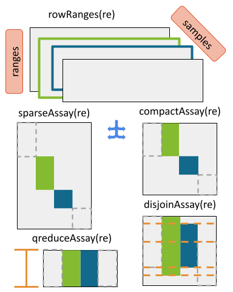

```{css, echo=FALSE}
.infobox {
  padding: 1em 1em 1em 4em;
  margin-bottom: 10px;
  border: 2px solid #008000;
  border-radius: 10px;
  background: #DCDCDC 5px center/3em no-repeat;
  color: #8B0000;
}

.center {
  text-align: center;
}
```

# Multi-omic Integration and Analysis of cBioPortal and TCGA data with MultiAssayExperiment

```{r, include=FALSE}
library(knitr)
opts_chunk$set(out.width="100%", cache=TRUE)
```

## Workshop participation

* See the instruction [Google slides](https://tinyurl.com/MultiAssayWorkshop)
* Browse to the [workshop website](https://waldronlab.io/MultiAssayWorkshop/). This page includes:
    - [A built version of this workshop](https://waldronlab.io/MultiAssayWorkshop/articles/Ramos_MultiAssayExperiment.html)
    - [List of available cBioPortal studies](https://waldronlab.io/MultiAssayWorkshop/articles/cBioPortal_Studies.html)
    - [TCGA terminology quick-reference](https://waldronlab.io/MultiAssayWorkshop/articles/curatedTCGAData_ref.html)
    - [TCGAutils package cheat-sheet](https://waldronlab.io/MultiAssayWorkshop/articles/TCGAutilsCheatsheet.html)
    - [Build your first MultiAssayExperiment interactive tutorial](https://waldronlab.io/MultiAssayWorkshop/tutorials/Exercise_MultiAssay.html)
    - [Download and use cBioPortal data interactive tutorial](https://waldronlab.io/MultiAssayWorkshop/tutorials/cBioPortalData_Intro.html)
* Run this workshop on the [free Orchestra Cloud platform](http://app.orchestra.cancerdatasci.org/) (search for title: "Multi-omic Integration of cBioPortal and TCGA data with MultiAssayExperiment")
* Docker users can run this workshop locally via:

```
docker run -e PASSWORD=bioc -p 8787:8787 mr148/multiassayworkshop:latest
```

## Requirements: R/Bioconductor packages

The workshop uses a Docker container with Bioconductor devel version `3.14`.
If you would like to install Bioconductor on your computer **at a later date**,
see the [Bioconductor installation](https://www.bioconductor.org/install)
instructions.

Here is a list of packages that we will be using:

```{r,include=TRUE,results="hide",message=FALSE,warning=FALSE}
library(MultiAssayExperiment)
library(curatedTCGAData)
library(cBioPortalData)
library(TCGAutils)
library(SingleCellMultiModal)
library(UpSetR)
library(GenomicDataCommons)
```

### Citing MultiAssayExperiment

Please use these citations [@Ramos2017-er] and [@Ramos2020-ya] when using
`MultiAssayExperiment`, `curatedTCGAData`, or `cBioPortalData`.
Your citations are very much appreciated!

### Overview of Packages

| Package              | Description |
|----------------------|----------------------------------------------------|
| MultiAssayExperiment | Infrastructure package to represent multi-omics data|
| curatedTCGAData      | Downloads TCGA data from ExperimentHub in MultiAssayExperiment form |
| cBioPortalData       | Access over 300 study datasets from the cBio Genomics Portal |
| TCGAutils            | Make use of utility functions for working with TCGA data |
| SingleCellMultiModal | Obtain single cell data from various multi-modality studies |

### Key Packages

#### `MultiAssayExperiment`

* provides an integrative representation for multi-omics data
* modelled after the `SummarizedExperiment` representation for expression data
* easy-to-use operations for manipulating multiple sets of data such as
copy number alterations, mutations, proteomics, methylation, and more

```{r, echo = FALSE, fig.cap="MultiAssayExperiment object schematic", out.width="\\maxwidth"}
knitr::include_graphics("MultiAssayExperiment.png")
```

#### `cBioPortalData`

* R/Bioconductor interface to cBioPortal data
* makes use of the revamped API with caching
* queries are handled for the user _in the background_
* easy-to-use interface (no knowledge of the cBioPortal data model required)
* see `getStudies()` for a list of available studies

#### `curatedTCGAData`

* Many tools exist for accessing and downloading [The Cancer Genome Atlas][]
data: `RTCGAToolbox`, `GenomicDataCommons`, `TCGAbiolinks`, `cBioPortal`
website, Broad GDAC Firehose, and more
* makes it easy to obtain user-friendly and integrative data at very little
cognitive overhead
* conveniently places data in the analysis platform of choice, R/Bioconductor
* provides 33 different cancer types from the [Broad GDAC Firehose][]
    * On-the-fly construction from 'flat' files
    * `hg19` data
    * `MultiAssayExperiment` representations

[Reference vignettes](articles/curatedTCGAData_ref.html):

* `Available Studies` -- (curatedTCGAData section) A list of available cancer
studies from `TCGAutils::diseaseCodes`.

* `OmicsTypes` -- A descriptive table of 'omics types in `curatedTCGAData`
(thanks to Ludwig G. `@lgeistlinger`)

#### `SingleCellMultiModal`

* Serves multi-modal datasets from GEO and other sources as
`MultiAssayExperiment` data representations. Some representations are out of
memory using the `HDF5` format as well as the `MTX` format.
* Available technologies are scNMT, 10X Multiome, seqFISH, (EC)CITEseq,
SCoPE2 and others.

#### `TCGAutils`

* allows additional exploration, and manipulation of samples and metadata
* User-friendly operations for subsetting, separating, converting, and
reshaping of sample and feature TCGA data
* developed specifically for TCGA data and `curatedTCGAData` outputs

It provides convenience / helper functions in three major areas:

1) conversion / summarization of row annotations to genomic ranges
2) identification and separation of samples
3) translation and interpretation of TCGA identifiers

For the cheatsheet reference table, see the
[TCGAutils Cheatsheet](articles/TCGAutilsCheatsheet.html).

To better understand how it all fits together, this schematic shows the
relationship among all as part of the curatedTCGAData pipeline.

```{r, echo = FALSE, fig.cap = "Schematic of curatedTCGAData Pipeline"}
knitr::include_graphics("TCGAMAEPipeline20190204.png")
```

### Data Classes

This section summarizes three fundamental data classes for the representation
of multi-omics experiments.

#### `(Ranged)SummarizedExperiment`

```{r, echo = FALSE, fig.cap = "A matrix-like container where rows represent features of interest and columns represent samples. The objects contain one or more assays, each represented by a matrix-like object of numeric or other mode."}
knitr::include_graphics("SummarizedExperiment.png")
```

* matrix-like representation of experimental data including RNA sequencing and
microarray experiments.
* stores multiple experimental data matrices of identical dimensions, with
associated metadata on:
    * the rows/genes/transcripts/other measurements (`rowData`)
    * column/sample phenotype or clinical data (`colData`)
    * overall experiment (`metadata`).
* `RangedSummarizedExperiment` associates a `GRanges` or `GRangesList` vector
with the rows

_Note_. Many other classes for experimental data are actually derived from
`SummarizedExperiment` (e.g., `SingleCellExperiment` for single-cell RNA
sequencing experiments)

```{r}
library(SingleCellExperiment)
extends("SingleCellExperiment")
```

#### `RaggedExperiment`

* flexible representation for segmented copy number, somatic mutations such as
represented in `.vcf` files, and other ragged array schema for genomic location
data.
* similar to the `GRangesList` class in  `GenomicRanges`
* used to represent _differing_ genomic ranges on each of a set of samples

```{r}
showClass("RaggedExperiment")
```

`RaggedExperiment` provides a flexible set of _*Assay_ methods to support
transformation of ranged list data to matrix format.

```{r, echo=FALSE, fig.cap="`RaggedExperiment` object schematic. Rows and columns represent genomic ranges and samples, respectively. Assay operations can be performed with (from left to right) compactAssay, qreduceAssay, and sparseAssay.", out.width="\\maxwidth"}

```

## The Integrative Container

```{r, echo = FALSE, fig.cap="`MultiAssayExperiment` object schematic. colData provides data about the patients, cell lines, or other biological units, with one row per unit and one column per variable. The experiments are a list of assay datasets of arbitrary class.  The sampleMap relates each column (observation) in ExperimentList to exactly one row (biological unit) in colData; however, one row of colData may map to zero, one, or more columns per assay, allowing for missing and replicate assays. sampleMap allows for per-assay sample naming conventions. Metadata can be used to store information in arbitrary format about the MultiAssayExperiment. Green stripes indicate a mapping of one subject to multiple observations across experiments.", out.width="\\maxwidth"}
knitr::include_graphics("MultiAssayExperiment.png")
```

### `MultiAssayExperiment`

* coordinates multi-omics experiment data on a set of biological specimens
* can contain any number of assays with different representations and
_dimensions_
* assays can be *ID-based*, where measurements are indexed identifiers of
genes, microRNA, proteins, microbes, etc.
* assays may be *range-based*, where measurements correspond to genomic ranges
that can be represented as `GRanges` objects, such as gene expression or copy
number.

<details>
  <summary>
**Click** on the fold to see what data classes are supported!
  </summary>

1. `matrix`: the most basic class for ID-based datasets, could be used for
example for gene expression summarized per-gene, microRNA, metabolomics, or
microbiome data.
2. `SummarizedExperiment` and derived methods: described above, could be used
for miRNA, gene expression, proteomics, or any matrix-like data where
measurements are represented by IDs.
3. `RangedSummarizedExperiment`: described above, could be used
for gene expression, methylation, or other data types referring to genomic
positions.
4. `ExpressionSet`: Another rich representation for ID-based datasets,
supported only for legacy reasons
5. `RaggedExperiment`: described above, for non-rectangular (ragged)
ranged-based datasets such as segmented copy number, where segmentation of
copy number alterations occurs and different genomic locations in each sample.
6. `RangedVcfStack`: For VCF archives broken up by chromosome (see `VcfStack`
class defined in the `GenomicFiles` package)
7. `DelayedMatrix`: An on-disk representation of matrix-like objects for large
datasets. It reduces memory usage and optimizes performance with delayed
operations. This class is part of the `DelayedArray` package.

</details>


_Note_. Data classes that support row and column naming and subsetting may be
used in a `MultiAssayExperiment`.

### `MatchedAssayExperiment`

* uniform subclass of `MultiAssayExperiment`
* "all patients have a sample in each assay"

```{r,eval=FALSE}
# coercion
as(x, "MatchedAssayExperiment")

# construction from MAE
MatchedAssayExperiment(mae)
```

_Note_. The `MultiAssayExperiment` package provides functionality to
merge replicate profiles for a single patient (`mergeReplicates()`).


::: {.infobox data-latex=""}

**Key points**

* `MultiAssayExperiment` coordinates different Bioconductor classes into
one unified object
* `MultiAssayExperiment` is an infrastructure package while `curatedTCGAData`
and `cBioPortalData` provide data on cancer studies including TCGA

:::


## Building from Scratch: `MultiAssayExperiment`

### `miniACC` Demo

Get started by trying out `MultiAssayExperiment` using a subset of the TCGA
adrenocortical carcinoma (ACC) dataset provided with the package. This dataset
provides five assays on 92 patients, although all five assays were not
performed for every patient:

1. **RNASeq2GeneNorm**: gene mRNA abundance by RNA-seq
2. **gistict**: GISTIC genomic copy number by gene
3. **RPPAArray**: protein abundance by Reverse Phase Protein Array
4. **Mutations**: non-silent somatic mutations by gene
5. **miRNASeqGene**: microRNA abundance by microRNA-seq.

```{r}
data("miniACC")
miniACC
```

### `shiny` Demo

[Click Here](../tutorials/Exercise_MultiAssay.html) to open the `shiny`
tutorial.

::: {.infobox data-latex=""}

**Key points**

* Extractor functions allow users to take components from the
`MultiAssayExperiment` object
* They're usually the same name as the component except for `experiments`
which extracts the `ExperimentList`

:::

## Notes on Working with MultiAssayExperiment

### API cheat sheet

```{r cheatsheet, echo = FALSE, fig.cap = "The MultiAssayExperiment API for construction, access, subsetting, management, and reshaping to formats for application of R/Bioconductor graphics and analysis packages.", out.width="\\maxwidth"}
knitr::include_graphics("MultiAssayExperiment_cheatsheet.png")
```

### MultiAssayExperiment construction and concatenation

#### constructor function

The `MultiAssayExperiment` constructor function accepts three arguments:

1. `experiments` - An `ExperimentList` or `list` of rectangular data
2. `colData` - A `DataFrame` describing the patients (or cell lines, or other
biological units)
3. `sampleMap` - A `DataFrame` of `assay`, `primary`, and `colname` identifiers

The miniACC object can be reconstructed as follows:

```{r}
MultiAssayExperiment(
    experiments = experiments(miniACC),
    colData = colData(miniACC),
    sampleMap = sampleMap(miniACC),
    metadata = metadata(miniACC)
)
```

#### Getting help with `prepMultiAssay`

The `prepMultiAssay` function allows the user to diagnose typical problems
when creating a `MultiAssayExperiment` object. See `?prepMultiAssay` for more
details.

#### Combining MultiAssayExperiment object with the `c` function

The `c` function allows the user to concatenate an additional experiment to an
existing `MultiAssayExperiment`. The optional `sampleMap` argument allows
concatenating an assay whose column names do not match the row names of
`colData`. For convenience, the _mapFrom_ argument allows the user to map from a
particular experiment **provided** that the **order** of the colnames is in the
**same**. A `warning` will be issued to make the user aware of this assumption.
For example, to concatenate a matrix of log2-transformed RNA-seq results:

```{r}
miniACC2 <- c(
    miniACC,
    log2rnaseq = log2(assays(miniACC)$RNASeq2GeneNorm),
    mapFrom=1L
)
experiments(miniACC2)
```

### colData - information biological units

This slot is a `DataFrame` describing the characteristics of biological units,
for example clinical data for patients. In the prepared datasets from
[The Cancer Genome Atlas][], each row is one patient and each column is a
clinical, pathological, subtype, or other variable. The `$` function provides a
shortcut for accessing or setting `colData` columns.

```{r}
colData(miniACC)[1:4, 1:4]
table(miniACC$race)
```

Note. `MultiAssayExperiment` supports both missing observations and replicate
observations, i.e., one row of `colData` can map to 0, 1, or more columns of
any of the experimental data matrices. One could therefore treat replicate
observations as one or multiple rows of `colData`. This can result in
different subsetting, `duplicated()`, and `wideFormat()` behaviors.

Note. Multiple time points, or distinct biological replicates, can be separate
rows of the `colData`.

::: {.infobox data-latex=""}

**Key points**

* Each row maps to zero or more observations in each experiment
* Usually, organized as one row per biological unit

:::


### ExperimentList - experiment data

Experimental datasets can be input as either a base `list` or `ExperimentList`
object for the set of samples collected. To see the experiments use the
`experiments` getter function.

```{r}
experiments(miniACC)
```

Note. Each matrix column must correspond to exactly one row in `colData`. In
other words, each patient or cell line must be traceable. However, multiple
columns can come from the same patient, or there can be no data for that
patient.

::: {.infobox data-latex=""}

*Key points:*

* One rectangular dataset per list element
* One column per assayed specimen.
* Matrix rows correspond to variables, e.g. genes or genomic ranges
* `ExperimentList` elements can be genomic range-based (e.g.
`SummarizedExperiment` or `RaggedExperiment`) or ID-based data
* Most rectangular-type data classes are supported

:::

Note. Any data class can be included in the `ExperimentList`, as long as it
supports: single-bracket subsetting (`[`), `dimnames`, and `dim`. Most data
classes defined in Bioconductor meet these requirements.

### sampleMap - relationship graph

`sampleMap` is a graph representation of the relationship between biological
units and experimental results. In simple cases where the column names of
`ExperimentList` data matrices match the row names of `colData`, the user won't
need to specify or think about a sample map, it can be created automatically by
the `MultiAssayExperiment` constructor.  `sampleMap` is a simple three-column
`DataFrame`:

1. `assay` column: the name of the assay, and found in the names of
`ExperimentList` list names
2. `primary` column: identifiers of patients or biological units, and found in
the row names of `colData`
3.  `colname` column: identifiers of assay results, and found in the column
names of `ExperimentList` elements
Helper functions are available for creating a map from a list. See `?listToMap`

```{r}
sampleMap(miniACC)
```

::: {.infobox data-latex=""}

*Key points:*

* relates experimental observations (`colnames`) to `colData`
* permits experiment-specific sample naming, missing, and replicate observations

:::

<p style="text-align: right;"> [back to top](#overview-of-key-data-classes) </p>

### metadata

Metadata can be used to keep additional information about patients, assays
performed on individuals or on the entire cohort, or features such as genes,
proteins, and genomic ranges. There are many options available for storing
metadata. First, `MultiAssayExperiment` has its own metadata for describing the
entire experiment:

```{r}
metadata(miniACC)
```

Additionally, the `DataFrame` class used by `sampleMap` and `colData`, as well
as the `ExperimentList` class, similarly support metadata. Finally, many
experimental data objects that can be used in the `ExperimentList` support
metadata. These provide flexible options to users and to developers of derived
classes.

## The Cancer Genome Atlas (TCGA) Data from `curatedTCGAData`

Most unrestricted TCGA data (from 33 cancer types) are available as
`MultiAssayExperiment` objects from the `curatedTCGAData` package. This
represents a lot of harmonization!

Here we list the available data for the Adrenocortical Carcinoma (`"ACC"`)
cancer type:

```{r,include=TRUE,message=FALSE,warning=FALSE}
library(curatedTCGAData)
curatedTCGAData("ACC", version = "2.0.1", dry.run = TRUE)
```

We then download the data with `dry.run` set to `FALSE`.

```{r,include=TRUE,message=FALSE,warning=FALSE}
acc <- curatedTCGAData(
    diseaseCode = "ACC",
    assays = c(
        "miRNASeqGene", "RPPAArray", "Mutation", "RNASeq2GeneNorm", "CNVSNP"
    ),
    version = "2.0.1",
    dry.run = FALSE
)
acc
```

These objects contain most unrestricted TCGA assay and clinical / pathological
data, as well as some curated data from the supplements of published TCGA
primary papers at the end of the colData columns:

```{r}
dim(colData(acc))
tail(colnames(colData(acc)), 10)
```

## `cBioPortalData`

To date, the [cBio Genomics Portal](https://www.cbioportal.org/) provides
access to more than 300 datasets collected and curated from different
instutions.

There are two main ways of accessing this data:

1. `cBioDataPack` - tarball (`.tar.gz`) data files
2. `cBioPortalData` - data from the API

_Note_. `pkgdown` reference website here: https://waldronlab.io/cBioPortalData/

### Listing the studies available

First, we create an API object using the `cBioPortal` function.
This will allow us to subsequently generate queries for the service.

```{r}
cbio <- cBioPortal()
getStudies(cbio)
```

We can also see the build status of the datasets using the `buildReport`
argument.

```{r}
getStudies(cbio, buildReport = TRUE)
```

This adds two additional columns to the end of the dataset reporting
the status of the builds. Not all studies can be converted to
`MultiAssayExperiment`. Some studies require additonal cleaning
to be represented with `MultiAssayExperiment`.

### cBioDataPack

```{r,include=TRUE,message=FALSE,warning=FALSE}
library(cBioPortalData)

(uvm <- cBioDataPack("uvm_tcga"))
```

### cBioPortalData

```{r}
(
    urcc <- cBioPortalData(
        cbio, studyId = "urcc_mskcc_2016", genePanelId = "IMPACT341"
    )
)
```

::: {.infobox data-latex=""}

**Key points**

* `curatedTCGAData` provides TCGA data with some curation including
tumor subtype information
* `cBioPortalData` has two main functions, one for downloading pre-packaged
data and another for sending queries through the cBioPortal API

:::


## Utilities for TCGA

Aside from the available reshaping functions already included in the
`MultiAssayExperiment` package, the `TCGAutils` package
provides additional helper functions for working with TCGA data.

A number of helper functions are available for managing datasets from
`curatedTCGAData`. These include:

- Conversions of `SummarizedExperiment` to `RangedSummarizedExperiment` based
on `TxDb.Hsapiens.UCSC.hg19.knownGene` for:
    - `mirToRanges()`: microRNA
    - `symbolsToRanges()`: gene symbols
    - `qreduceTCGA()`: convert `RaggedExperiment` objects to
`RangedSummarizedExperiment` with one row per gene symbol, for:
        - segmented copy number datasets ("CNVSNP" and "CNASNP")
        - somatic mutation datasets ("Mutation"), with a value of 1 for any
non-silent mutation and a value of 0 for no mutation or silent mutation

### (1) Conversion of row metadata for `curatedTCGAData` objects

#### `mirToRanges`

microRNA assays obtained from `curatedTCGAData` have annotated sequences
that can be converted to genomic ranges using the `mirbase.db` package.
The function looks up all sequences and converts them to ('hg19') ranges.
For those rows that cannot be found, an 'unranged' assay is introduced
in the resulting MultiAssayExperiment object.

```{r}
mirToRanges(acc)
```

#### `qreduceTCGA`

The `qreduceTCGA` function converts `RaggedExperiment` mutation data objects
to `RangedSummarizedExperiment` using `org.Hs.eg.db` and the `qreduceTCGA`
utility function from `RaggedExperiment` to summarize 'silent' and 'non-silent'
mutations based on a 'Variant_Classification' metadata column in the original
object.

```{r}
## Update build metadata to "hg19"
genome(acc[["ACC_Mutation-20160128"]]) <- "NCBI37"
seqlevelsStyle(acc[["ACC_Mutation-20160128"]]) <- "UCSC"

gnome <- genome(acc[["ACC_Mutation-20160128"]])
gnome <- translateBuild(gnome)
genome(acc[["ACC_Mutation-20160128"]]) <- gnome

qreduceTCGA(acc)
```

#### `symbolsToRanges`

In the cases where row annotations indicate gene symbols, the `symbolsToRanges`
utility function converts genes to genomic ranges and replaces existing
assays with `RangedSummarizedExperiment` objects. Gene annotations are given
as 'hg19' genomic regions.

```{r}
symbolsToRanges(acc)
```

#### `simplifyTCGA`

The `simplifyTCGA` function combines all of the above operations to create
a more managable `MultiAssayExperiment` object and using
`RangedSummarizedExperiment` assays where possible.

```{r}
TCGAutils::simplifyTCGA(acc)
```

### (2) Identification and Separation of Samples

### What types of samples are in the data?

**Solution**

The `sampleTables` function gives you an overview of samples in each assay:

```{r}
sampleTables(acc)
```

Interpretation of sample codes:

```{r}
data("sampleTypes")
head(sampleTypes)
```


### `splitAssays`: separate the data from different tissue types

TCGA datasets include multiple -omics for solid tumors, adjacent normal
tissues, blood-derived cancers and normals, and other tissue types, which may
be mixed together in a single dataset. The `MultiAssayExperiment` object
generated here has one patient per row of its `colData`, but each patient may
have two or more -omics profiles by any assay, whether due to assaying of
different types of tissues or to technical replication. `splitAssays` separates
profiles from different tissue types (such as tumor and adjacent normal) into
different assays of the `MultiAssayExperiment` by taking a vector of sample
codes, and partitioning the current assays into assays with an appended sample
code:

```{r}
split_acc <- splitAssays(acc, c("01", "11"))
```

Only about 43 participants have data across all experiments.

### Curated molecular subtypes

Is there subtype data available in the `MultiAssayExperiment` obtained from
`curatedTCGAData`?

**Solution**

The `getSubtypeMap` function will show actual variable names found in `colData`
that contain subtype information. This can only be obtained from
`MultiAssayExperiment` objects provided by `curatedTCGAData`.

```{r}
getSubtypeMap(acc)
head(colData(acc)$Histology)
```

### (3) Translation and Interpretation of TCGA identifiers

`TCGAutils` provides a number of ID translation functions.
These allow the user to translate from either file or case UUIDs to TCGA
barcodes and back. These functions work by querying the Genomic Data Commons API
via the `GenomicDataCommons` package (thanks to Sean Davis). These include:

#### `UUIDtoBarcode()` - UUID to TCGA barcode

Here we have a known case UUID that we want to translate into a TCGA barcode.

```{r}
UUIDtoBarcode("ae55b2d3-62a1-419e-9f9a-5ddfac356db4", from_type = "case_id")
```

In cases where we want to translate a known file UUID to the associated TCGA
patient barcode, we can use `UUIDtoBarcode`.

```{r}
UUIDtoBarcode("b4bce3ff-7fdc-4849-880b-56f2b348ceac", from_type = "file_id")
```

#### `barcodeToUUID()` - TCGA barcode to UUID

Here we translate the first two TCGA barcodes of the previous copy-number
alterations dataset to UUID:

```{r}
(xbarcode <- head(colnames(acc)[["ACC_CNVSNP-20160128"]], 4L))
barcodeToUUID(xbarcode)
```

#### `UUIDtoUUID()` - file and case IDs

We can also translate from file UUIDs to case UUIDs and vice versa as long as
we know the input type. We can use the case UUID from the previous example to
get the associated file UUIDs using `UUIDtoUUID`. Note that this translation
is a one to many relationship, thus yielding a `data.frame` of file UUIDs for a
single case UUID.

```{r}
head(UUIDtoUUID("ae55b2d3-62a1-419e-9f9a-5ddfac356db4", to_type = "file_id"))
```

One possible way to verify that file IDs are matching case UUIDS is to
browse to the Genomic Data Commons webpage with the specific file UUID.
Here we look at the first file UUID entry in the output `data.frame`:

https://portal.gdc.cancer.gov/files/0b4acc9e-3933-4d74-916a-a53c4a0665e6

In the page we check that the case UUID matches the input.

#### `filenameToBarcode()` - Using file names as input

```{r}
fquery <- files() |>
    GenomicDataCommons::filter(~ cases.project.project_id == "TCGA-ACC" &
        data_category == "Copy Number Variation" &
        data_type == "Copy Number Segment")

fnames <- head(results(fquery)$file_name)

filenameToBarcode(fnames)
```

See the `TCGAutils` vignette page for more details.

::: {.infobox data-latex=""}

**Key points**

* `TCGAutils` provides users additional tools for modifying row and column
metadata
* The package works mainly with TCGA data including barcode identifiers

:::

## Data Management with MultiAssayExperiment

### Single bracket `[` subsetting

In the pseudo code below, the subsetting operations work on the rows of the
following indices:

1. _i_ experimental data rows
2. _j_ the primary names (vector input) or the column names (`list` or `List`
  inputs)
3. _k_ assay

```
multiassayexperiment[i = rownames, j = primary or colnames, k = assay]
```

Subsetting operations always return another `MultiAssayExperiment`. For
example, the following will return any rows named "MAPK14" or "IGFBP2", and
remove any assays where no rows match:

```{r, results='hide'}
miniACC[c("MAPK14", "IGFBP2"), , ]
```

The following will keep only patients of pathological stage IV, and all their
associated assays:

```{r, results='hide'}
stg4 <- miniACC$pathologic_stage == "stage iv"
# remove NA values from vector
miniACC[, stg4 & !is.na(stg4), ]
```

And the following will keep only the RNA-seq dataset, and only patients for
which this assay is available:

```{r, results='hide'}
miniACC[, , "RNASeq2GeneNorm"]
```

### Subsetting by genomic ranges

If any ExperimentList objects have features represented by genomic ranges (e.g.
`RangedSummarizedExperiment`, `RaggedExperiment`), then a `GRanges` object in
the first subsetting position will subset these objects as in
`GenomicRanges::findOverlaps()`. Any non-ranged `ExperimentList` element will
be subset to zero rows.


### Double bracket `[[` subsetting

The "double bracket" method (`[[`) is a convenience function for extracting
a single element of the `MultiAssayExperiment` `ExperimentList`. It avoids
the use of `experiments(mae)[[1L]]`. For example, both of the following extract
the `ExpressionSet` object containing RNA-seq data:

```{r}
miniACC[[1L]]
## equivalently
miniACC[["RNASeq2GeneNorm"]]
```

To preserve the `colData` during the extraction, see `?getWithColData`.

### Complete cases

`complete.cases()` shows which patients have complete data for all assays:

```{r}
summary(complete.cases(miniACC))
```

The above logical vector could be used for patient subsetting. More simply,
`intersectColumns()` will select complete cases and rearrange each
`ExperimentList` element so its columns correspond exactly to rows of `colData`
in the same order:

```{r}
accmatched <- intersectColumns(miniACC)
```

Note, the column names of the assays in `accmatched` are not the same because of
assay-specific identifiers, but they have been automatically re-arranged to
correspond to the same patients. In these TCGA assays, the first three `-`
delimited positions correspond to patient, ie the first patient is
*TCGA-OR-A5J2*:

```{r}
colnames(accmatched)
```

### Row names that are common across assays

`intersectRows()` keeps only rows that are common to each assay, and aligns them
in identical order. For example, to keep only genes where data are available for
RNA-seq, GISTIC copy number, and somatic mutations:

```{r}
accmatched2 <- intersectRows(miniACC[, ,
    c("RNASeq2GeneNorm", "gistict", "Mutations")])
rownames(accmatched2)
```

<p style="text-align: right;"> [back to top](#overview-of-key-data-classes) </p>

### Extraction

### assay and assays

The `assay` and `assays` methods follow `SummarizedExperiment` convention.
The `assay` (singular) method will extract the first element of the
`ExperimentList` and will return a `matrix`.

```{r}
class(assay(miniACC))
```

The `assays` (plural) method will return a `SimpleList` of the data with each
element being a `matrix`.

```{r}
assays(miniACC)
```

::: {.infobox data-latex=""}

*Key point:*

* Whereas the `[[` returned an experiment in its original class, `assay()` and
`assays()` convert the assay data to matrix format.

:::

<p style="text-align: right;"> [back to top](#overview-of-key-packages-and-data-classes) </p>

### Summary of slots and accessors

Slot in the `MultiAssayExperiment` can be accessed or set using the respective
accessor functions:

| Slot | Accessor |
|------|----------|
| `ExperimentList` | `experiments()`|
| `colData` | `colData()` and `$` * |
| `sampleMap` | `sampleMap()` |
| `metadata` | `metadata()` |

__*__ The `$` operator on a `MultiAssayExperiment` returns a single
column of the `colData`.

### Transformation / reshaping

The `longFormat` or `wideFormat` functions will "reshape" and combine
experiments with each other and with `colData` into one `DataFrame`. These
functions provide compatibility with most of the common R/Bioconductor functions
for regression, machine learning, and visualization.

#### `longFormat`

In _long_ format a single column provides all assay results, with additional
optional `colData` columns whose values are repeated as necessary. Here *assay*
is the name of the ExperimentList element, *primary* is the patient identifier
(rowname of colData), *rowname* is the assay rowname (in this case genes),
*colname* is the assay-specific identifier (column name), *value* is the numeric
measurement (gene expression, copy number, presence of a non-silent mutation,
etc), and following these are the *vital_status* and *days_to_death* colData
columns that have been added:

```{r}
longFormat(miniACC[c("TP53", "CTNNB1"), , ],
    colDataCols = c("vital_status", "days_to_death"))
```

#### `wideFormat`

In _wide_ format, each feature from each assay goes in a separate column, with
one row per primary identifier (patient). Here, each variable becomes a new
column:

```{r}
wideFormat(miniACC[c("TP53", "CTNNB1"), , ],
    colDataCols = c("vital_status", "days_to_death"))
```

<p style="text-align: right;"> [back to top](#overview-of-key-packages-and-data-classes) </p>

::: {.infobox data-latex=""}

**Key points**

* Knowing how to subset a `MultiAssayExperiment` object is important to
be able to restrict observations and measurements to particular phenotypes
or sample types
* Functions such as `longFormat` and `wideFormat` are helpful for downstream
analysis functions that require a certain type of input format

:::

## SingleCellMultiModal

`SingleCellMultiModal` is an `ExperimentHub` package that serves multiple
datasets obtained from GEO and other sources and represents them as
`MultiAssayExperiment` objects. We provide several multi-modal datasets
including scNMT, 10X Multiome, seqFISH, CITEseq, SCoPE2, and others. The scope
of the package is is to provide data for benchmarking and analysis.

Users can access the data for a particular technology with the appropriate
function. For example, to obtain a small data.frame of what data is available
for `scNMT`, the user would enter:

```{r}
scNMT("mouse_gastrulation", dry.run = TRUE, version = '2.0.0')
```

We can see that there are a few assays for each modality.

The user can also use the help function to get a list of all the functions
available in the package:

```{r, eval=FALSE}
help(package = "SingleCellMultiModal", help_type = "html")
```

# K-M plots, cross-omic correlation, PCA, and other analyses


```{r,include=TRUE,results="hide",message=FALSE,warning=FALSE}
library(MultiAssayExperiment)
library(survival)
library(survminer)
library(pheatmap)
```

These provide exercises and solutions using the `miniACC` dataset.

## How many `miniACC` samples have data for each combination of assays?

**Solution**

The built-in `upsetSamples` creates an "upset" Venn diagram to answer this
question:

```{r}
data("miniACC")
upsetSamples(miniACC)
```

In this dataset only 43 samples have all 5 assays, 32 are missing reverse-phase
protein (RPPAArray), 12 have only mutations and gistict, 2 are missing
Mutations, 1 is missing gistict, etc.

## Kaplan-meier plot stratified by pathology_N_stage

Create a Kaplan-meier plot, using pathology_N_stage as a stratifying variable.

**Solution**

The colData provides clinical data for things like a Kaplan-Meier plot for
overall survival stratified by nodal stage.

```{r}
Surv(miniACC$days_to_death, miniACC$vital_status)
```

And remove any patients missing overall survival information:

```{r}
miniACCsurv <-
    miniACC[, complete.cases(miniACC$days_to_death, miniACC$vital_status), ]
miniACCsurv
```

```{r}
fit <- survfit(
    Surv(days_to_death, vital_status) ~ pathology_N_stage,
    data = colData(miniACCsurv)
)
ggsurvplot(fit, data = colData(miniACCsurv), risk.table = TRUE)
```

## Multivariate Cox regression including RNA-seq, copy number, and pathology

Choose the *EZH2* gene for demonstration. This subsetting will drop assays with
no row named EZH2:

```{r}
wideacc = wideFormat(miniACC["EZH2", , ],
    colDataCols=c("vital_status", "days_to_death", "pathology_N_stage"))
wideacc$y = Surv(wideacc$days_to_death, wideacc$vital_status)
head(wideacc)
```

Perform a multivariate Cox regression with *EZH2* copy number (gistict),
log2-transformed *EZH2* expression (RNASeq2GeneNorm), and nodal status
(pathology_N_stage) as predictors:

```{r}
coxph(
    Surv(days_to_death, vital_status) ~
        gistict_EZH2 + log2(RNASeq2GeneNorm_EZH2) + pathology_N_stage,
    data=wideacc
)
```

We see that *EZH2* expression is significantly associated with overal survival
(p < 0.001), but *EZH2* copy number and nodal status are not. This analysis
could easily be extended to the whole genome for discovery of prognostic
features by repeated univariate regressions over columns, penalized
multivariate regression, etc.

For further detail, see the main `MultiAssayExperiment` vignette.

## Correlation between RNA-seq and copy number

**Part 1**

For all genes where there is both recurrent copy number (gistict assay) and
RNA-seq, calculate the correlation between log2(RNAseq + 1) and copy number.
Create a histogram of these correlations. Compare this with the histogram of
correlations between all *unmatched* gene - copy number pairs.

**Solution**

First, narrow down `miniACC` to only the assays needed:

```{r}
subacc <- miniACC[, , c("RNASeq2GeneNorm", "gistict")]
```

Align the rows and columns, keeping only samples with both assays available:

```{r}
subacc <- intersectColumns(subacc)
subacc <- intersectRows(subacc)
```

Create a list of numeric matrices:

```{r}
subacc.list <- assays(subacc)
```

Log-transform the RNA-seq assay:

```{r}
subacc.list[[1]] <- log2(subacc.list[[1]] + 1)
```

Transpose both, so genes are in columns:

```{r}
subacc.list <- lapply(subacc.list, t)
```

Calculate the correlation between columns in the first matrix and columns in
the second matrix:

```{r}
corres <- cor(subacc.list[[1]], subacc.list[[2]])
```

And finally, create the histograms:

```{r}
hist(diag(corres))
hist(corres[upper.tri(corres)])
```

**Part 2**

For the gene with highest correlation to copy number, make a box plot of log2
expression against copy number.

**Solution**

First, identify the gene with highest correlation between expression and copy
number:

```{r}
which.max(diag(corres))
```

You could now make the plot by taking the EIF4E columns from each element of
the list subacc.list *list* that was extracted from the subacc
*MultiAssayExperiment*, but let's do it by subsetting and extracting from the
*MultiAssayExperiment*:

```{r}
df <- wideFormat(subacc["EIF4E", , ])
head(df)
```

```{r}
boxplot(RNASeq2GeneNorm_EIF4E ~ gistict_EIF4E,
        data=df, varwidth=TRUE,
        xlab="GISTIC Relative Copy Number Call",
        ylab="RNA-seq counts")
```

## Identifying correlated principal components

Perform Principal Components Analysis of each of the five assays, using samples
available on each assay, log-transforming RNA-seq data first.  Using the first
10 components, calculate Pearson correlation between all scores and plot these
correlations as a heatmap to identify correlated components across assays.

**Solution**

Here's a function to simplify doing the PCAs:

```{r}
getLoadings <-
    function(x, ncomp=10, dolog=FALSE, center=TRUE, scale.=TRUE) {
        if (dolog)
            x <- log2(x + 1)
        pc <- prcomp(x, center=center, scale.=scale.)
        t(pc$rotation[, 1:10])
    }
```

Although it would be possible to do the following with a loop, the different
data types do require different options for PCA (e.g. mutations are a 0/1
matrix with 1 meaning there is a somatic mutation, and gistict varies between
-2 for homozygous loss and 2 for a genome doubling, so neither make sense to
scale and center). So it is just as well to do the following one by one,
concatenating each PCA results to the MultiAssayExperiment:

```{r}
miniACC2 <- intersectColumns(miniACC)
miniACC2 <- c(miniACC2,
    rnaseqPCA = getLoadings(assays(miniACC2)[[1]], dolog=TRUE),
    gistictPCA = getLoadings(
        assays(miniACC2)[[2]], center=FALSE, scale.=FALSE
    ),
    proteinPCA = getLoadings(assays(miniACC2)[[3]]),
    mutationsPCA = getLoadings(
        assays(miniACC2)[[4]], center=FALSE, scale.=FALSE
    ),
    miRNAPCA = getLoadings(assays(miniACC2)[[5]]),
    mapFrom = 1:5
)
```

Now subset to keep *only* the PCA results:

```{r}
miniACC2 <- miniACC2[, , grep("PCA$", names(miniACC2))]
experiments(miniACC2)
```

Note, it would be equally easy (and maybe better) to do PCA on all samples
available for each assay, then do intersectColumns at this point instead.

Now, steps for calculating the correlations and plotting a heatmap:

* Use *wideFormat* to paste these together, which has the nice property of
adding assay names to the column names.
* The first column always contains the sample identifier, so remove it.
* Coerce to a matrix
* Calculate the correlations, and take the absolute value (since signs of
principal components are arbitrary)
* Set the diagonals to NA (each variable has a correlation of 1 to itself).

```{r}
df <- wideFormat(miniACC2)[, -1]
mycors <- cor(as.matrix(df))
mycors <- abs(mycors)
diag(mycors) <- NA
```

To simplify the heatmap, show only components that have at least one
correlation greater than 0.5.

```{r}
has.high.cor <- apply(mycors, 2, max, na.rm=TRUE) > 0.5
mycors <- mycors[has.high.cor, has.high.cor]
pheatmap(mycors)
```

The highest correlation present is between PC2 of the RNA-seq assay, and PC1 of
the protein assay.


[Broad GDAC Firehose]: https://gdac.broadinstitute.org
[The Cancer Genome Atlas]: https://www.cancer.gov/about-nci/organization/ccg/research/structural-genomics/tcga

# References
