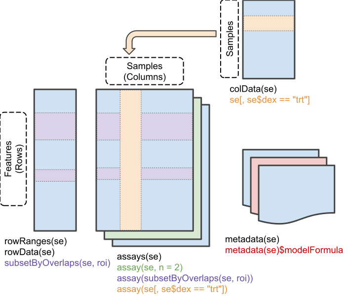
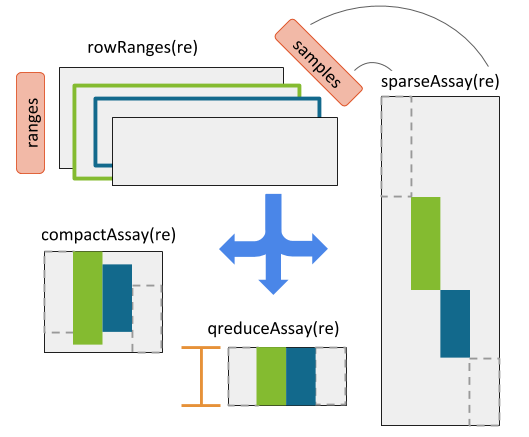
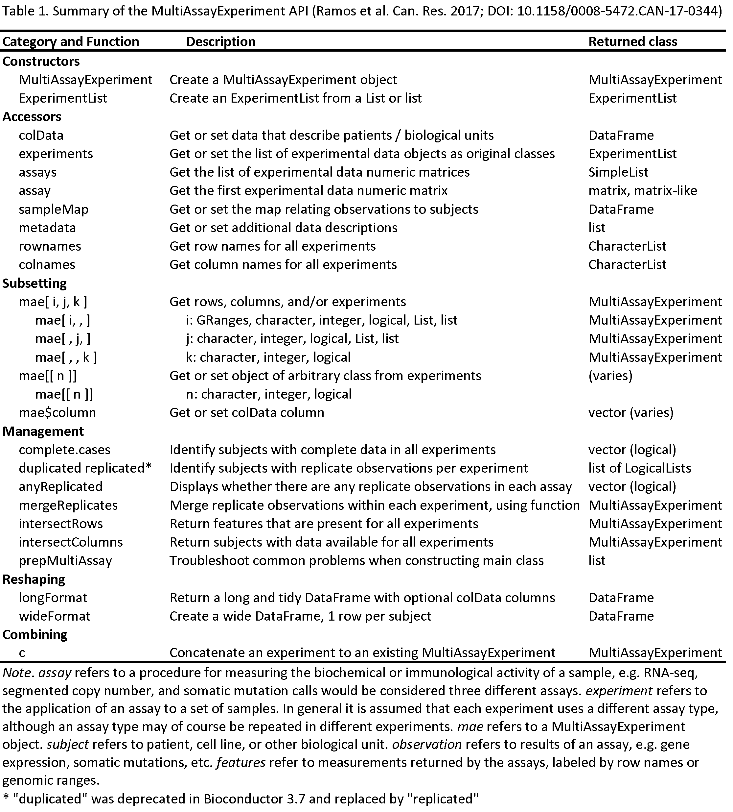

```{r setup, include=FALSE}
knitr::opts_chunk$set(cache = TRUE)
```

# R/Bioconductor packages used

Some of these analyses require a *very* recent version of the `r BiocStyle::Biocpkg("TCGAutils")` package:

```{r, eval=FALSE}
if(!require("BiocManager"))
  install.packages("BiocManager")
BiocManager::install("waldronlab/TCGAutils")
```

Other packages used:
```{r, eval = FALSE}
library(MultiAssayExperiment)
library(GenomicRanges)
library(RaggedExperiment)
library(curatedTCGAData)
library(GenomicDataCommons)
library(SummarizedExperiment)
library(SingleCellExperiment)
library(TCGAutils)
library(UpSetR)
library(mirbase.db)
library(AnnotationFilter)
library(EnsDb.Hsapiens.v86)
library(survival)
library(survminer)
library(pheatmap)
```

```{r, echo = FALSE}
suppressPackageStartupMessages({
    library(MultiAssayExperiment)
    library(GenomicRanges)
    library(RaggedExperiment)
    library(curatedTCGAData)
    library(GenomicDataCommons)
    library(SummarizedExperiment)
    library(SingleCellExperiment)
    library(TCGAutils)
    library(UpSetR)
    library(mirbase.db)
    library(AnnotationFilter)
    library(EnsDb.Hsapiens.v86)
    library(survival)
    library(survminer)
    library(pheatmap)
    library(S4Vectors)
})
```

# Workshop goals and objectives

* identify appropriate data structures for different 'omics data types
* gain familiarity with GRangesList and RaggedExperiment
* create MultiAssayExperiment objects for multi'omics data
* perform subsetting, reshaping, growing, and extraction of a MultiAssayExperiment
* link MultiAssayExperiment data with packages for differential expression,
machine learning, and plotting
* use curatedTCGAData to create custom TCGA MultiAssayExperiment objects
* perform survival and correlation analyses on a multi'omics dataset

# Overview of key data classes

This section summarizes three fundamental data classes for the representation of multi-omics
experiments. 

## `(Ranged)SummarizedExperiment`

```{r, echo = FALSE, fig.cap = "A matrix-like container where rows represent features of interest and columns represent samples. The objects contain one or more assays, each represented by a matrix-like object of numeric or other mode."}

```

`SummarizedExperiment` is the most important Bioconductor class for matrix-like 
experimental data, including from RNA sequencing and microarray experiments. It can store
multiple experimental data matrices of identical dimensions, with associated metadata on the rows/genes/transcripts/other measurements (`rowData`), column/sample phenotype or clinical data (`colData`),
and the overall experiment (`metadata`). The derivative class `RangedSummarizedExperiment` associates
a `GRanges` or `GRangesList` vector with the rows. These classes supersede the use of `ExpressionSet`. Note that many other classes for experimental data are actually derived from `SummarizedExperiment`; for example, the `SingleCellExperiment` class for single-cell RNA sequencing experiments extends `RangedSummarizedExperiment`, which in turn extends `SummarizedExperiment`:
```{r}
library(SingleCellExperiment)
extends("SingleCellExperiment")
```

Thus, although `SingleCellExperiment` provides additional methods over `RangedSummarizedExperiment`, it also inherits all the methods of `SummarizedExperiment` and `RangedSummarizedExperiment`, so everything you learn about `SummarizedExperiment` will be applicable to `SingleCellExperiment`.

## `RaggedExperiment`

`RaggedExperiment` is a flexible data representation for segmented copy number, somatic mutations such as
represented in `.vcf` files, and other ragged array schema for genomic location data. 
Like the `GRangesList` class from `GenomicRanges`, `RaggedExperiment` can be used to represent 
_differing_ genomic ranges on each of a set of samples. In fact, `RaggedExperiment` contains a `GRangesList`:
```{r}
showClass("RaggedExperiment")
```
However, `RaggedExperiment` provides a flexible set of _Assay_ methods to support transformation of such data 
to matrix format.

```{r, echo=FALSE, fig.cap="RaggedExperiment object schematic. Rows and columns represent genomic ranges and samples, respectively. Assay operations can be performed with (from left to right) compactAssay, qreduceAssay, and sparseAssay.", out.width="\\maxwidth"}

```

## `MultiAssayExperiment`

`MultiAssayExperiment` is an integrative container for coordinating multi-omics experiment data on a
set of biological specimens. As much as possible, its methods adopt the same vocabulary as `SummarizedExperiment`.
A `MultiAssayExperiment` can contain any number of assays with different representations. 
Assays may be *ID-based*, where measurements are indexed identifiers of
genes, microRNA, proteins, microbes, etc.  Alternatively, assays may be
*range-based*, where measurements correspond to genomic ranges that can be
represented as `GRanges` objects, such as gene expression or copy number.  
For ID-based assays, there is no requirement that the same IDs be
present for different experiments.  For range-based assays, there is also
no requirement that the same ranges be present for different experiments;
furthermore, it is possible for different samples within an experiment to be
represented by different ranges.  The following data classes have been tested 
to work as elements of a `MultiAssayExperiment`:

1. `matrix`: the most basic class for ID-based datasets, could be used for
example for gene expression summarized per-gene, microRNA, metabolomics, or
microbiome data.
2. `SummarizedExperiment` and derived methods: described above, could be used 
for miRNA, gene expression, proteomics, or any matrix-like data where
measurements are represented by IDs.
3. `RangedSummarizedExperiment`: described above, could be used
for gene expression, methylation, or other data types referring to genomic
positions.
4. `ExpressionSet`: Another rich representation for ID-based datasets, supported
only for legacy reasons
5. `RaggedExperiment`: described above, for non-rectangular (ragged) ranged-based datasets
such as segmented copy number, where segmentation of
copy number alterations occurs and different genomic locations in each sample.
6. `RangedVcfStack`: For VCF archives broken up by chromosome (see `VcfStack`
class defined in the `GenomicFiles` package)
7. `DelayedMatrix`: An on-disk representation of matrix-like objects for large
datasets. It reduces memory usage and optimizes performance with delayed
operations. This class is part of the `DelayedArray` package.

Note that any data class extending these classes, and in fact any data class supporting row and column names and subsetting can be used as an element of a `MultiAssayExperiment`.

```{r, echo = FALSE, fig.cap="MultiAssayExperiment object schematic. colData provides data about the patients, cell lines, or other biological units, with one row per unit and one column per variable. The experiments are a list of assay datasets of arbitrary class.  The sampleMap relates each column (observation) in ExperimentList to exactly one row (biological unit) in colData; however, one row of colData may map to zero, one, or more columns per assay, allowing for missing and replicate assays. sampleMap allows for per-assay sample naming conventions. Metadata can be used to store information in arbitrary format about the MultiAssayExperiment. Green stripes indicate a mapping of one subject to multiple observations across experiments.", out.width="\\maxwidth"}
knitr::include_graphics("MultiAssayExperiment.png")
```

# Working with RaggedExperiment

You can skip this section if you prefer to focus on the functionality of `MultiAssayExperiment`. In most use cases, you would likely convert a `RaggedExperiment`
to matrix or `RangedSummarizedExperiment` using one of the `Assay` functions below, and either concatenate this rectangular object to the `MultiAssayExperiment` or use it to replace the `RaggedExperiment`.  

## Constructing a `RaggedExperiment` object

We start with a toy example of two `GRanges` objects, providing ranges on two chromosomes
in two samples:

```{r}
sample1 <- GRanges(
    c(A = "chr1:1-10:-", B = "chr1:8-14:+", C = "chr1:15-18:+"),
    score = 3:5, type=c("germline", "somatic", "germline"))
sample2 <- GRanges(
    c(D = "chr1:1-10:-", E = "chr1:11-18:+"),
    score = 11:12, type=c("germline", "somatic"))
```

Include column data `colData` to describe the samples:

```{r}
colDat <- DataFrame(id=1:2, status = factor(c("control", "case")))
```

The `RaggedExperiment` can be constructed from individual `Granges`:
```{r}
(ragexp <- RaggedExperiment(
    sample1 = sample1,
    sample2 = sample2,
    colData = colDat))
```

Or from a `GRangesList`:
```{r}
grl <- GRangesList(sample1=sample1, sample2=sample2)
ragexp2 <- RaggedExperiment(grl, colData = colDat)
identical(ragexp, ragexp2)
```

Note that the original ranges are is represented as the `rowRanges` of the `RaggedExperiment`:

```{r}
rowRanges(ragexp)
```

## *Assay functions

A suite of *Assay operations allow users to resize the matrix-like
representation of ranges to varying row dimensions
(see [RaggedExperiment Figure](#raggedexperiment) for a visual example).

The four main _Assay_ functions for converting to matrix are: 

* [sparseAssay](#sparseassay): leave ranges exactly as-is
* [compactAssay](#compactassay): combine identical ranges
* [disjoinAssay](#disjoinassay): disjoin ranges that overlap across samples
* [qreduceAssay](#qreduceassay): find overlaps with provided "query" ranges

These each have a corresponding function for conversion to [RangedSummarizedExperiment](#Conversion to RangedSummarizedExperiment).  

### sparseAssay

The most straightforward matrix representation of a `RaggedExperiment` will
return a matrix with the number of rows equal to the total number of ranges defined across all
samples. *i.e.* the 5 rows of the `sparseAssay` result:
```{r}
sparseAssay(ragexp)
```
correspond to the ranges of the unlisted `GRangesList`:
```{r}
unlist(grl)
```
The rownames of the `sparseAssay` result are equal to the names of the `GRanges` elements.
The values in the matrix returned by `sparseAssay` correspond to the first columns of the 
`mcols` of each `GRangesList` element, in this case the "score" column. 

Note, this is the default `assay()` method of `RaggedExperiment`:
```{r}
assay(ragexp, "score")
assay(ragexp, "type")
```

### compactAssay

The dimensions of the `compactAssay` result differ from that of the `sparseAssay` result only 
if there are identical ranges in different samples. Identical ranges are placed in the same row in
the output. Ranges with any difference in start, end, or strand, will be
kept on different rows. Non-disjoint ranges are **not** collapsed.

```{r}
compactAssay(ragexp)
compactAssay(ragexp, "type")
```
Note that row names are constructed from the ranges, and the names of the `GRanges` vectors are 
lost, unlike in the `sparseAssay` result.

### disjoinAssay

This function is similar to `compactAssay` except the rows are _disjoint_[^1] ranges. Elements of the matrix are summarized by applying the `simplifyDisjoin` functional
argument to assay values of overlapping ranges.

```{r}
disjoinAssay(ragexp, simplifyDisjoin = mean)
```

[^1]: A _disjoint_ set of ranges has no overlap between any ranges of the set.

### qreduceAssay

The `qreduceAssay` function is the most complicated but likely the most useful of the `RaggedExperiment`
*Assay* functions. It requires you to provide a `query` argument that is a `GRanges` vector, and 
the rows of the resulting matrix correspond to the elements of this `GRanges`. The returned matrix will have
dimensions `length(query)` by `ncol(x)`. Elements of the resulting matrix correspond to the overlap of the
_i_ th `query` range in the _j_ th sample, summarized according to the `simplifyReduce` functional argument.
This can be useful, for example, to calculate per-gene copy number or mutation status by providing
the genomic ranges of every gene as the `query`.

The `simplifyReduce` argument in `qreduceAssay` allows the user to summarize
overlapping regions with a custom method for the given "query" region of
interest. We provide one for calculating a weighted average score per
query range, where the weight is proportional to the overlap widths between
overlapping ranges and a query range.

_Note_ that there are three arguments to this function. See the documentation
for additional details.

```{r}
weightedmean <- function(scores, ranges, qranges)
{
    isects <- pintersect(ranges, qranges)
    sum(scores * width(isects)) / sum(width(isects))
}
```

The call to `qreduceAssay` calculates the overlaps between the ranges of each sample:
```{r}
grl
```

with the query ranges (an arbitrary set is defined here for demonstration):
First create a demonstration "query" region of interest:
```{r}
(query <- GRanges(c("chr1:1-14:-", "chr1:15-18:+")))
```

using the `simplifyReduce` function to resolve overlapping ranges and return a matrix with rows 
corresponding to the query:
```{r}
qreduceAssay(ragexp, query, simplifyReduce = weightedmean)
```

## Conversion to RangedSummarizedExperiment

These methods all have corresponding methods to return a `RangedSummarizedExperiment` and preserve the `colData`:
```{r, results='hide'}
sparseSummarizedExperiment(ragexp)
compactSummarizedExperiment(ragexp)
disjoinSummarizedExperiment(ragexp, simplify = mean)
qreduceSummarizedExperiment(ragexp, query=query, simplify=weightedmean)
```


# Working with MultiAssayExperiment

## API cheat sheet

```{r cheatsheet, echo = FALSE, fig.cap = "The MultiAssayExperiment API for construction, access, subsetting, management, and reshaping to formats for application of R/Bioconductor graphics and analysis packages.", out.width="\\maxwidth"}

```


## The MultiAssayExperiment miniACC demo object

Get started by trying out `MultiAssayExperiment` using a subset of the TCGA
adrenocortical carcinoma (ACC) dataset provided with the package. This dataset
provides five assays on 92 patients, although all five assays were not performed
for every patient:

1. **RNASeq2GeneNorm**: gene mRNA abundance by RNA-seq
2. **gistict**: GISTIC genomic copy number by gene
3. **RPPAArray**: protein abundance by Reverse Phase Protein Array
4. **Mutations**: non-silent somatic mutations by gene
5. **miRNASeqGene**: microRNA abundance by microRNA-seq.

```{r}
data(miniACC)
miniACC
```

## colData - information biological units

This slot is a `DataFrame` describing the characteristics of biological units,
for example clinical data for patients. In the prepared datasets from
[The Cancer Genome Atlas][], each row is one patient and each column is a
clinical, pathological, subtype, or other variable. The `$` function provides a
shortcut for accessing or setting `colData` columns.

```{r}
colData(miniACC)[1:4, 1:4]
table(miniACC$race)
```

*Key points about the colData:*

* Each row maps to zero or more observations in each experiment in the
`ExperimentList`, below.
* One row per biological unit
    + `MultiAssayExperiment` supports both missing observations and replicate observations, ie one row of `colData` can map to 0, 1, or more columns of any of the experimental data matrices.
    + therefore you could treat replicate observations as one or multiple rows of `colData`, and this will result in different behaviors of functions you will learn later like subsetting, `duplicated()`, and `wideFormat()`.
    + multiple time points, or distinct biological replicates, should probably be separate rows of the `colData`.

## ExperimentList - experiment data

A base `list` or `ExperimentList` object containing the experimental datasets
for the set of samples collected. This gets converted into a class
`ExperimentList` during construction.

```{r}
experiments(miniACC)
```

*Key points:*

* One matrix-like dataset per list element (although they do not even need to be
matrix-like, see for example the `RaggedExperiment` package)
* One matrix column per assayed specimen. Each matrix column must correspond to
exactly one row of `colData`: in other words, you must know which patient or
cell line the observation came from. However, multiple columns can come from the
same patient, or there can be no data for that patient.
* Matrix rows correspond to variables, e.g. genes or genomic ranges
* `ExperimentList` elements can be genomic range-based (e.g.
`SummarizedExperiment::RangedSummarizedExperiment-class` or
`RaggedExperiment::RaggedExperiment-class`) or ID-based data (e.g.
`SummarizedExperiment::SummarizedExperiment-class`, `Biobase::eSet-class`
`base::matrix-class`, `DelayedArray::DelayedArray-class`, and derived classes)
* Any data class can be included in the `ExperimentList`, as long as it
supports: single-bracket subsetting (`[`), `dimnames`, and `dim`. Most data
classes defined in Bioconductor meet these requirements.

## sampleMap - relationship graph

`sampleMap` is a graph representation of the relationship between biological
units and experimental results. In simple cases where the column names of
`ExperimentList` data matrices match the row names of `colData`, the user won't
need to specify or think about a sample map, it can be created automatically by
the `MultiAssayExperiment` constructor.  `sampleMap` is a simple three-column
`DataFrame`:

1. `assay` column: the name of the assay, and found in the names of
`ExperimentList` list names
2. `primary` column: identifiers of patients or biological units, and found in
the row names of `colData`
3.  `colname` column: identifiers of assay results, and found in the column
names of `ExperimentList` elements
Helper functions are available for creating a map from a list. See `?listToMap`

```{r}
sampleMap(miniACC)
```

*Key points:*

* relates experimental observations (`colnames`) to `colData`
* permits experiment-specific sample naming, missing, and replicate observations

<p style="text-align: right;"> [back to top](#overview-of-key-data-classes) </p>

## metadata

Metadata can be used to keep additional information about patients, assays
performed on individuals or on the entire cohort, or features such as genes,
proteins, and genomic ranges. There are many options available for storing
metadata. First, `MultiAssayExperiment` has its own metadata for describing the
entire experiment:

```{r}
metadata(miniACC)
```

Additionally, the `DataFrame` class used by `sampleMap` and `colData`, as well
as the `ExperimentList` class, similarly support metadata. Finally, many
experimental data objects that can be used in the `ExperimentList` support
metadata. These provide flexible options to users and to developers of derived
classes.

# MultiAssayExperiment Subsetting

## Single bracket `[`

In pseudo code below, the subsetting operations work on the rows of the
following indices:
1. _i_ experimental data rows
2. _j_ the primary names or the column names (entered as a `list` or `List`)
3. _k_ assay

```
multiassayexperiment[i = rownames, j = primary or colnames, k = assay]
```

Subsetting operations always return another `MultiAssayExperiment`. For example,
the following will return any rows named "MAPK14" or "IGFBP2", and remove any
assays where no rows match:

```{r, results='hide'}
miniACC[c("MAPK14", "IGFBP2"), , ]
```

The following will keep only patients of pathological stage iv, and all their
associated assays:
```{r, results='hide'}
miniACC[, miniACC$pathologic_stage == "stage iv", ]
```

And the following will keep only the RNA-seq dataset, and only patients for
which this assay is available:
```{r, results='hide'}
miniACC[, , "RNASeq2GeneNorm"]
```

## Subsetting by genomic ranges

If any ExperimentList objects have features represented by genomic ranges (e.g.
`RangedSummarizedExperiment`, `RaggedExperiment`), then a `GRanges` object in
the first subsetting position will subset these objects as in
`GenomicRanges::findOverlaps()`. Any non-ranged `ExperimentList` element will 
be subset to zero rows.


## Double bracket `[[`

The "double bracket" method (`[[`) is a convenience function for extracting
a single element of the `MultiAssayExperiment` `ExperimentList`. It avoids
the use of `experiments(mae)[[1L]]`. For example, both of the following extract
the `ExpressionSet` object containing RNA-seq data:

```{r}
miniACC[[1L]]  #or equivalently, miniACC[["RNASeq2GeneNorm"]]
```

## Complete cases

`complete.cases()` shows which patients have complete data for all assays:

```{r}
summary(complete.cases(miniACC))
```

The above logical vector could be used for patient subsetting. More simply,
`intersectColumns()` will select complete cases and rearrange each
`ExperimentList` element so its columns correspond exactly to rows of `colData`
in the same order:

```{r}
accmatched = intersectColumns(miniACC)
```

Note, the column names of the assays in `accmatched` are not the same because of
assay-specific identifiers, but they have been automatically re-arranged to
correspond to the same patients. In these TCGA assays, the first three `-`
delimited positions correspond to patient, ie the first patient is
*TCGA-OR-A5J2*:

```{r}
colnames(accmatched)
```

## Row names that are common across assays

`intersectRows()` keeps only rows that are common to each assay, and aligns them
in identical order. For example, to keep only genes where data are available for
RNA-seq, GISTIC copy number, and somatic mutations:

```{r}
accmatched2 <- intersectRows(miniACC[, , c("RNASeq2GeneNorm", "gistict", "Mutations")])
rownames(accmatched2)
```

<p style="text-align: right;"> [back to top](#overview-of-key-data-classes) </p>

# Extraction

## assay and assays

The `assay` and `assays` methods follow `SummarizedExperiment` convention.
The `assay` (singular) method will extract the first element of the
`ExperimentList` and will return a `matrix`.

```{r}
class(assay(miniACC))
```

The `assays` (plural) method will return a `SimpleList` of the data with each
element being a `matrix`.

```{r}
assays(miniACC)
```

*Key point:*

* Whereas the `[[` returned an assay as its original class, `assay()` and
`assays()` convert the assay data to matrix form.

<p style="text-align: right;"> [back to top](#overview-of-key-data-classes) </p>

# Summary of slots and accessors

Slot in the `MultiAssayExperiment` can be accessed or set using their accessor
functions:

| Slot | Accessor |
|------|----------|
| `ExperimentList` | `experiments()`|
| `colData` | `colData()` and `$` * |
| `sampleMap` | `sampleMap()` |
| `metadata` | `metadata()` |

__*__ The `$` operator on a `MultiAssayExperiment` returns a single
column of the `colData`.

# Transformation / reshaping

The `longFormat` or `wideFormat` functions will "reshape" and combine
experiments with each other and with `colData` into one `DataFrame`. These
functions provide compatibility with most of the common R/Bioconductor functions
for regression, machine learning, and visualization.

## `longFormat`

In _long_ format a single column provides all assay results, with additional
optional `colData` columns whose values are repeated as necessary. Here *assay*
is the name of the ExperimentList element, *primary* is the patient identifier
(rowname of colData), *rowname* is the assay rowname (in this case genes),
*colname* is the assay-specific identifier (column name), *value* is the numeric
measurement (gene expression, copy number, presence of a non-silent mutation,
etc), and following these are the *vital_status* and *days_to_death* colData
columns that have been added:

```{r}
longFormat(miniACC[c("TP53", "CTNNB1"), , ],
           colDataCols = c("vital_status", "days_to_death"))
```

## `wideFormat`

In _wide_ format, each feature from each assay goes in a separate column, with
one row per primary identifier (patient). Here, each variable becomes a new
column:

```{r}
wideFormat(miniACC[c("TP53", "CTNNB1"), , ],
           colDataCols = c("vital_status", "days_to_death"))
```

# MultiAssayExperiment class construction and concatenation

## MultiAssayExperiment constructor function
The `MultiAssayExperiment` constructor function can take three arguments:

1. `experiments` - An `ExperimentList` or `list` of data
2. `colData` - A `DataFrame` describing the patients (or cell lines, or other
biological units)
3. `sampleMap` - A `DataFrame` of `assay`, `primary`, and `colname` identifiers

The miniACC object can be reconstructed as follows:
```{r}
MultiAssayExperiment(experiments=experiments(miniACC),
                     colData=colData(miniACC),
                     sampleMap=sampleMap(miniACC),
                     metadata=metadata(miniACC))
```


## `prepMultiAssay` - Constructor function helper

The `prepMultiAssay` function allows the user to diagnose typical problems
when creating a `MultiAssayExperiment` object. See `?prepMultiAssay` for more
details.

## `c` - concatenate to MultiAssayExperiment

The `c` function allows the user to concatenate an additional experiment to an
existing `MultiAssayExperiment`. The optional `sampleMap` argument allows
concatenating an assay whose column names do not match the row names of
`colData`. For convenience, the _mapFrom_ argument allows the user to map from a
particular experiment **provided** that the **order** of the colnames is in the
**same**. A `warning` will be issued to make the user aware of this assumption.
For example, to concatenate a matrix of log2-transformed RNA-seq results:

```{r}
miniACC2 <- c(miniACC, log2rnaseq = log2(assays(miniACC)$RNASeq2GeneNorm), mapFrom=1L)
experiments(miniACC2)
```

<p style="text-align: right;"> [back to top](#overview-of-key-data-classes) </p>

## Building a MultiAssayExperiment from scratch

To start from scratch building your own MultiAssayExperiment, see the package
[Coordinating Analysis of Multi-Assay Experiments vignette](https://bioconductor.org/packages/release/bioc/vignettes/MultiAssayExperiment/inst/doc/MultiAssayExperiment.html).
The package [cheat sheet](https://bioconductor.org/packages/release/bioc/vignettes/MultiAssayExperiment/inst/doc/MultiAssayExperiment_cheatsheet.pdf) is also helpful.

If anything is unclear, please ask a question at
https://support.bioconductor.org/ or create an issue on the [MultiAssayExperiment issue tracker](https://github.com/waldronlab/MultiAssayExperiment/issues).

# The Cancer Genome Atlas (TCGA)

Most unrestricted TCGA data are available as MultiAssayExperiment objects from
the `curatedTCGAData` package. This represents a lot of harmonization!

```{r}
library(curatedTCGAData)
curatedTCGAData("ACC")
suppressMessages({
    acc <- curatedTCGAData("ACC",
        assays = c("miRNASeqGene", "RPPAArray", "Mutation", "RNASeq2GeneNorm", "CNVSNP"),
        dry.run = FALSE)
})
acc
```

These objects contain most unrestricted TCGA assay and clinical / pathological
data, as well as material curated from the supplements of published TCGA primary
papers at the end of the colData columns:

```{r}
dim(colData(acc))
tail(colnames(colData(acc)), 10)
```

The `TCGAutils` package provides additional helper functions, see below. 

# Utilities for TCGA

Aside from the available reshaping functions already included in the
`MultiAssayExperiment` package, the `r Biocpkg("TCGAutils")` package provides additional
helper functions for working with TCGA data.

## "Simplification" of `curatedTCGAData` objects

A number of helper functions are available for managing datasets from
`curatedTCGAData`. These include:

- Conversions of `SummarizedExperiment` to `RangedSummarizedExperiment` based on `TxDb.Hsapiens.UCSC.hg19.knownGene` for:
    - `mirToRanges`: microRNA
    - `symbolsToRanges`: gene symbols 
- `qreduceTCGA`: convert `RaggedExperiment` objects to `RangedSummarizedExperiment` with one row per gene symbol, for:
    - segmented copy number datasets ("CNVSNP" and "CNASNP")
    - somatic mutation datasets ("Mutation"), with a value of 1 for any non-silent mutation and a value of 0 for no mutation or silent mutation

The `simplifyTCGA` function combines all of the above operations to create
a more managable `MultiAssayExperiment` object and using
`RangedSummarizedExperiment` assays where possible.

```{r}
(simpa <- TCGAutils::simplifyTCGA(acc))
```

## What types of samples are in the data?

**Solution**

The `sampleTables` function gives you an overview of samples in each assay:

```{r}
sampleTables(acc)

head(sampleTypes)
```

## Curated molecular subtypes

Is there subtype data available in the `MultiAssayExperiment` obtained from `curatedTCGAData`?

**Solution**

The `getSubtypeMap` function will show actual variable names found in `colData`
that contain subtype information. This can only be obtained from
`MultiAssayExperiment` objects provided by `curatedTCGAData`. 

```{r}
getSubtypeMap(acc)
head(colData(acc)$Histology)
```

## Converting TCGA UUIDs to barcodes and back

`TCGAutils` provides a number of ID translation functions.
These allow the user to translate from either file or case UUIDs to TCGA
barcodes and back. These functions work by querying the Genomic Data Commons API
via the `GenomicDataCommons` package (thanks to Sean Davis). These include: 

* `UUIDtoBarcode()`
* `barcodeToUUID()`
* `UUIDtoUUID()`
* `filenameToBarcode()`

See the `r BiocStyle::Biocpkg("TCGAutils")` help pages for details.

## Other TCGA data types

Helper functions to add TCGA exon files (legacy archive), copy number and 
GISTIC copy number calls to MultiAssayExperiment objects are also available in `r BiocStyle::Biocpkg("TCGAutils")`.

# Plotting, correlation, and other analyses

These provide exercises and solutions using the `miniACC` dataset.

## How many `miniACC` samples have data for each combination of assays?

**Solution**

The built-in `upsetSamples` creates an "upset" Venn diagram to answer this
question:

```{r}
upsetSamples(miniACC)
```

In this dataset only 43 samples have all 5 assays, 32 are missing reverse-phase
protein (RPPAArray), 2 are missing Mutations, 1 is missing gistict, 12 have only
mutations and gistict, etc.

## Kaplan-meier plot stratified by pathology_N_stage

Create a Kaplan-meier plot, using pathology_N_stage as a stratifying variable.

**Solution**

The colData provides clinical data for things like a Kaplan-Meier plot for
overall survival stratified by nodal stage.

```{r}
Surv(miniACC$days_to_death, miniACC$vital_status)
```

And remove any patients missing overall survival information:
```{r}
miniACCsurv <- miniACC[, complete.cases(miniACC$days_to_death, miniACC$vital_status), ]
```

```{r}
fit <- survfit(Surv(days_to_death, vital_status) ~ pathology_N_stage, data = colData(miniACCsurv))
ggsurvplot(fit, data = colData(miniACCsurv), risk.table = TRUE)
```

## Multivariate Cox regression including RNA-seq, copy number, and pathology

Choose the *EZH2* gene for demonstration. This subsetting will drop assays with
no row named EZH2:
```{r}
wideacc = wideFormat(miniACC["EZH2", , ],
    colDataCols=c("vital_status", "days_to_death", "pathology_N_stage"))
wideacc$y = Surv(wideacc$days_to_death, wideacc$vital_status)
head(wideacc)
```

Perform a multivariate Cox regression with *EZH2* copy number (gistict),
log2-transformed *EZH2* expression (RNASeq2GeneNorm), and nodal status
(pathology_N_stage) as predictors:
```{r}
coxph(Surv(days_to_death, vital_status) ~ gistict_EZH2 + log2(RNASeq2GeneNorm_EZH2) + pathology_N_stage,
      data=wideacc)
```

We see that *EZH2* expression is significantly associated with overal survival
(p < 0.001), but *EZH2* copy number and nodal status are not. This analysis
could easily be extended to the whole genome for discovery of prognostic
features by repeated univariate regressions over columns, penalized multivariate
regression, etc.

For further detail, see the main MultiAssayExperiment vignette.

<p style="text-align: right;"> [back to top](#overview-of-key-data-classes) </p>

## Correlation between RNA-seq and copy number

**Part 1**

For all genes where there is both recurrent copy number (gistict assay) and
RNA-seq, calculate the correlation between log2(RNAseq + 1) and copy number.
Create a histogram of these correlations. Compare this with the histogram of
correlations between all *unmatched* gene - copy number pairs.

**Solution**

First, narrow down `miniACC` to only the assays needed:

```{r}
subacc <- miniACC[, , c("RNASeq2GeneNorm", "gistict")]
```

Align the rows and columns, keeping only samples with both assays available:
```{r}
subacc <- intersectColumns(subacc)
subacc <- intersectRows(subacc)
```

Create a list of numeric matrices:
```{r}
subacc.list <- assays(subacc)
```

Log-transform the RNA-seq assay:
```{r}
subacc.list[[1]] <- log2(subacc.list[[1]] + 1)
```

Transpose both, so genes are in columns:
```{r}
subacc.list <- lapply(subacc.list, t)
```

Calculate the correlation between columns in the first matrix and columns in the
second matrix:

```{r}
corres <- cor(subacc.list[[1]], subacc.list[[2]])
```

And finally, create the histograms:
```{r}
hist(diag(corres))
hist(corres[upper.tri(corres)])
```

**Part 2**

For the gene with highest correlation to copy number, make a box plot of log2
expression against copy number.

**Solution**

First, identify the gene with highest correlation between expression and copy
number:
```{r}
which.max(diag(corres))
```

You could now make the plot by taking the EIF4E columns from each element of the
list subacc.list *list* that was extracted from the subacc
*MultiAssayExperiment*, but let's do it by subsetting and extracting from the
*MultiAssayExperiment*:

```{r}
df <- wideFormat(subacc["EIF4E", , ])
head(df)
```

```{r}
boxplot(RNASeq2GeneNorm_EIF4E ~ gistict_EIF4E,
        data=df, varwidth=TRUE,
        xlab="GISTIC Relative Copy Number Call",
        ylab="RNA-seq counts")
```

<p style="text-align: right;"> [back to top](#overview-of-key-data-classes) </p>

## Identifying correlated principal components

Perform Principal Components Analysis of each of the five assays, using samples
available on each assay, log-transforming RNA-seq data first.  Using the first
10 components, calculate Pearson correlation between all scores and plot these
correlations as a heatmap to identify correlated components across assays.

**Solution**

Here's a function to simplify doing the PCAs:
```{r}
getLoadings <- function(x, ncomp=10, dolog=FALSE, center=TRUE, scale.=TRUE){
  if(dolog){
    x <- log2(x + 1)
  }
  pc = prcomp(x, center=center, scale.=scale.)
  return(t(pc$rotation[, 1:10]))
}
```

Although it would be possible to do the following with a loop, the different
data types do require different options for PCA (e.g. mutations are a 0/1 matrix
with 1 meaning there is a somatic mutation, and gistict varies between -2 for
homozygous loss and 2 for a genome doubling, so neither make sense to scale and
center). So it is just as well to do the following one by one, concatenating
each PCA results to the MultiAssayExperiment:

```{r}
miniACC2 <- intersectColumns(miniACC)
miniACC2 <- c(miniACC2, rnaseqPCA=getLoadings(assays(miniACC2)[[1]], dolog=TRUE), mapFrom=1L)
miniACC2 <- c(miniACC2, gistictPCA=getLoadings(assays(miniACC2)[[2]], center=FALSE, scale.=FALSE), mapFrom=2L)
miniACC2 <- c(miniACC2, proteinPCA=getLoadings(assays(miniACC2)[[3]]), mapFrom=3L)
miniACC2 <- c(miniACC2, mutationsPCA=getLoadings(assays(miniACC2)[[4]], center=FALSE, scale.=FALSE), mapFrom=4L)
miniACC2 <- c(miniACC2, miRNAPCA=getLoadings(assays(miniACC2)[[5]]), mapFrom=5L)
```

Now subset to keep *only* the PCA results:
```{r}
miniACC2 <- miniACC2[, , 6:10]
experiments(miniACC2)
```

Note, it would be equally easy (and maybe better) to do PCA on all samples
available for each assay, then do intersectColumns at this point instead.

Now, steps for calculating the correlations and plotting a heatmap:
* Use *wideFormat* to paste these together, which has the nice property of
adding assay names to the column names.
* The first column always contains the sample identifier, so remove it.
* Coerce to a matrix
* Calculate the correlations, and take the absolute value (since signs of
principal components are arbitrary)
* Set the diagonals to NA (each variable has a correlation of 1 to itself).
```{r}
df <- wideFormat(miniACC2)[, -1]
mycors <- cor(as.matrix(df))
mycors <- abs(mycors)
diag(mycors) <- NA
```

To simplify the heatmap, show only components that have at least one correlation
greater than 0.5.
```{r}
has.high.cor <- apply(mycors, 2, max, na.rm=TRUE) > 0.5
mycors <- mycors[has.high.cor, has.high.cor]
pheatmap::pheatmap(mycors)
```

The highest correlation present is between PC2 of the RNA-seq assay, and PC1 of
the protein assay.

<p style="text-align: right;"> [back to top](#overview-of-key-data-classes) </p>

## Annotating with ranges
This section doesn't use the `TCGAutils` shortcuts, and is more generally applicable.

Convert all the `ExperimentList` elements in `miniACC`  to
`RangedSummarizedExperiment` objects.  Then use `rowRanges` to annotate these
objects with genomic ranges. For the microRNA assay, annotate instead with the
genomic coordinates of predicted targets.

**Solution**


The following shortcut function takes a list of human gene symbols and uses
`AnnotationFilter` and `EnsDb.Hsapiens.v86` to look up the ranges, and return
these as a GRangesList which can be used to replace the rowRanges of the
SummarizedExperiment objects:

```{r}
getrr <- function(identifiers, EnsDbFilterFunc=AnnotationFilter::SymbolFilter) {
    edb <- EnsDb.Hsapiens.v86::EnsDb.Hsapiens.v86
    afl <- AnnotationFilterList(
        EnsDbFilterFunc(identifiers),
        SeqNameFilter(c(1:21, "X", "Y")),
        TxBiotypeFilter("protein_coding"))
    gr <- genes(edb, filter=afl)
    grl <- split(gr, factor(identifiers))
    grl <- grl[match(identifiers, names(grl))]
    stopifnot(identical(names(grl), identifiers))
    return(grl)
}
```

For example:
```{r}
getrr(rownames(miniACC)[[1]])
```

Use this to set the rowRanges of experiments 1-4 with these GRangesList objects
```{r}
rseACC <- miniACC
withRSE <- c(1:3, 5)
for (i in withRSE){
  rowRanges(rseACC[[i]]) <- getrr(rownames(rseACC[[i]]))
}
```

Note that the class of experiments 1-4 is now `RangedSummarizedExperiment`:
```{r}
experiments(rseACC)
```

With ranged objects in the MultiAssayExperiment, you can then do subsetting by
ranges. For example, select all genes on chromosome 1 for the four
*rangedSummarizedExperiment* objects:
```{r}
rseACC[GRanges(seqnames="1:1-1e9"), , withRSE]
```

*Note about microRNA*: You can set ranges for the microRNA assay according to
the genomic location of those microRNA, or the locations of their predicted
targets, but we don't do it here. Assigning genomic ranges of microRNA targets
would be an easy way to subset them according to their targets.

<p style="text-align: right;"> [back to top](#overview-of-key-data-classes) </p>
