```{r setup, include=FALSE}
knitr::opts_chunk$set(
  echo = TRUE,
  cache = FALSE,
  collapse = TRUE,
  eval = TRUE,
  comment = "#>"
)
suppressPackageStartupMessages({
    require(BiocStyle)
})
htmltools::tagList(rmarkdown::html_dependency_font_awesome())
```

<!-- Fix until BiocStyle is updated with this style. -->
<style>
td > img {
  padding: 0px;
  max-width: 100%;
  display: inline;
}
</style>

# Interactive visualization of SummarizedExperiment objects with iSEE

This lab demonstrates how to use the `r Biocpkg("iSEE")` package to create and configure interactive applications for the exploration of various types of genomics data sets (e.g., bulk and single-cell RNA-seq, CyTOF, gene expression microarray).

## Preparation of example scRNAseq data {#prepare-scrnaseq-data}

We use example data from the `r Biocpkg("TENxPBMCData")` package.
This package provides an _R / Bioconductor_ resource for representing and manipulating different single-cell RNA-seq data sets profiling peripheral blood mononuclear cells (PBMC) generated by 10X Genomics (https://support.10xgenomics.com/single-cell-gene-expression/datasets).

```{r, message=FALSE}
library(TENxPBMCData)
```

The man page for the `TENxPBMCData()` function gives an idea of the datasets that are available from this package.
It can be opened with the following command.

```{r, eval=FALSE}
help(TENxPBMCData)
```

Here, we use the `"pbmc3k"` dataset, which contains gene expression profiles for 2,700 single peripheral blood mononuclear cells.
The first time this dataset is loaded, this command downloads the dataset to a local cache, which takes some time, depending on the speed of your internet connection.
Subsequent times, the same command loads the dataset directly from the local cache.

```{r, message=FALSE, warning=FALSE}
sce <- TENxPBMCData(dataset = "pbmc3k")
```

At this point we can inspect the dataset in the console.

```{r}
sce
```

The dataset is provided as an object of the `SingleCellExperiment` class.
In particular, this summary view indicates that the following pieces of information are available:

- An assay matrix named `"counts"`
- Row names (i.e. genes) are Ensembl gene IDs
- Row metadata include for each gene the official gene symbol, and the gene symbol used by the
10x CellRanger quantification pipeline
- Column names (i.e., cells) are not initialized and left to `NULL`
- Column metadata include diverse information for each cell, including the cell barcode (`"Barcode"`) and the donor identifier (`"Individual"`).

Note that a `SingleCellExperiment` object (or, more generally, any `SummarizedExperiment` object) like this one already contains sufficient information to launch an interactive application instance to visualize the available data and metadata, using the `iSEE()` function.

For the purpose of this workshop, we first apply some preprocessing to the `SingleCellExperiment` object, in order to populate it with more information that can be visualized with `iSEE`.
The steps below roughly follow those outlined in the `r Biocpkg("simpleSingleCell")` Bioconductor workflow.

We start by adding column names to the object, and use gene symbols instead of Ensembl IDs as row names.
In the case where multiple Ensembl identifiers correspond to the same gene symbol, the `scater::uniquifyFeatureNames` function concatenates the Ensembl ID and the gene symbol in order to generate unique feature names.

```{r, message=FALSE}
library(scater)
colnames(sce) <- paste0("Cell", seq_len(ncol(sce)))
rownames(sce) <- scater::uniquifyFeatureNames(
    ID = rowData(sce)$ENSEMBL_ID,
    names = rowData(sce)$Symbol_TENx
)
head(rownames(sce))
```

Next, we use the `r Biocpkg("scater")` package to calculate gene- and cell-level quality metrics.
These metrics are added as columns to the `rowData` and `colData` slots of the `SingleCellExperiment` object, respectively.

```{r, message = FALSE}
MT <- rownames(sce)[grep("^MT-", rownames(sce))]
sce <- scater::calculateQCMetrics(object = sce, 
                                  feature_controls = list(MT = MT))
sce
```

We filter out a few cells with a large fraction of the counts coming from mitochondrial genes, since these may be damaged cells.
Notice the reduced number of columns in the dataset below.

```{r}
(sce <- sce[, sce$pct_counts_MT < 5])
```

Next, we calculate size factors and normalized and log-transformed expression values, using the `r Biocpkg("scran")` and `r Biocpkg("scater")` packages.
Note that it is typically recommended to pre-cluster the cells before computing the size factors, as follows:

```{r}
# set.seed(1000)
# clusters <- scran::quickCluster(sce, BSPARAM = IrlbaParam())
# sce <- scran::computeSumFactors(sce, cluster = clusters, min.mean = 0.1)
```

However, for time reasons, we will skip the pre-clustering step in this workshop.

```{r, message=FALSE}
library(scran)
sce <- scran::computeSumFactors(sce, min.mean = 0.1)
summary(sizeFactors(sce))
sce <- scater::normalize(sce)
```

In order to extract the most informative genes, we first model the mean-variance trend and decompose the variance into biological and technical components.

```{r}
logcounts(sce) <- as.matrix(logcounts(sce))
new.trend <- scran::makeTechTrend(x = sce)
fit <- scran::trendVar(sce, use.spikes = FALSE, loess.args = list(span = 0.05))
fit$trend <- new.trend
dec <- scran::decomposeVar(fit = fit)
top.dec <- dec[order(dec$bio, decreasing = TRUE), ] 
head(top.dec)
```

Next, we apply Principal Components Analysis (PCA) and t-distributed Stochastic Neighbor Embedding (t-SNE) to generate low-dimensional representations of the cells in our data set.
These low-dimensional representations are added to the `reducedDim` slot of the `SingleCellExperiment` object.

```{r, message=FALSE}
library(BiocSingular)
set.seed(1000)
sce <- scran::denoisePCA(sce, technical = new.trend, BSPARAM = IrlbaParam())
ncol(reducedDim(sce, "PCA"))
set.seed(1000)
sce <- scater::runTSNE(sce, use_dimred = "PCA", perplexity = 30)
sce
```

Finally, we cluster the cells using a graph-based algorithm, and find 'marker genes' for each cluster as the genes that are significantly upregulated in the cluster compared to each of the other inferred clusters.
The adjusted p-values from this test, for each cluster, are added to the `rowData` slot of the object.

```{r}
snn.gr <- scran::buildSNNGraph(sce, use.dimred = "PCA")
clusters <- igraph::cluster_walktrap(snn.gr)
sce$Cluster <- factor(clusters$membership)
table(sce$Cluster)

markers <- scran::findMarkers(sce, clusters = sce$Cluster, 
                              direction = "up", pval.type = "all")
for (i in names(markers)) {
    rowData(sce)[, paste0("FDR_cluster", i)] <- 
        markers[[i]]$FDR[match(rownames(sce), 
                               rownames(markers[[i]]))]
}
sce
```

This concludes the preparation of the data.
We have now a `SingleCellExperiment` object that contains different types of abundance values, representations in reduced dimensions, as well as a range of row (feature) and column (cell) metadata.

We can launch an `r Biocpkg("iSEE")` instance for exploring this data set using the `iSEE()` function:

```{r, message=FALSE}
library(iSEE)
if (interactive()) {
    iSEE(sce)
}
```

The main argument to the `iSEE()` function is a `SummarizedExperiment` object, or an object of any class extending `SummarizedExperiment` (such as `SingleCellExperiment`, in this case).
No other restrictions are made on the type of data stored in the object, and `r Biocpkg("iSEE")` can be used for interactive visualization of many different types of data.
It is also worth noting that for various types of data, Bioconductor packages provides functionality for directly importing quantifications generated by external software packages into a `SummarizedExperiment` object.
For example, the `r Biocpkg("DropletUtils")` package can read quantifications from the 10x Genomics CellRanger pipeline for single-cell RNA-seq data, and the `r Biocpkg("tximeta")` package can be used to read data from transcript quantification pipelines into a `SummarizedExperiment` object.

## Overview of the _iSEE_ package {#isee-overview}

<!-- Talk a bit about the usefulness of visualization. -->

This section provides an overview of the graphical interface of `r Biocpkg("iSEE")` applications.
To follow along, make sure that you have launched an `r Biocpkg("iSEE")` instance as described in the code block at the end of the previous section.
Note that in the default configuration, the panels do not look exactly like the ones shown in the screenshots below.
For example, data points are not immediately colored, and the default annotation variables displayed by each panel may differ.
Later sections of this workshop demonstrate how to modify the content of the panels and how they are displayed. 

Note that for simplicity, we typically refer to a `SummarizedExperiment` in this workshop; however, `r Biocpkg("iSEE")` works seamlessly for objects of any class extending `SummarizedExperiment` as well (e.g., `SingleCellExperiment`, `DESeqDataSet`).
That said, some types of panels -- such as the `Reduced dimension plot` -- are only available for objects that contain a `reducedDim` slot (in particular, `SingleCellExperiment` objects); the basic `SummarizedExperiment` class does not contain this slot.
In this workshop, we refer to the rows of the `SummarizedExperiment` object as 'features' (these can be genes, transcripts, genomic regions, etc) and to the columns as 'samples' (which, in our example data set, are single cells).

### The user interface {#user-interface}

The `r Biocpkg("iSEE")` user interface consists of a number of panels, each displaying the data provided in the `SummarizedExperiment` from a specific perspective.
There are 8 standard panel types; 6 plot panels and 2 table panels, all showcased in the figure below.
In the default configuration, one panel of each type is included when launching the `r Biocpkg("iSEE")` user interface.
However, users are free to rearrange, resize, remove or add panels freely, as described in a [later section](#configuration-ui).
We provide a brief overview of each panel type in the following subsections.

In addition to the 8 standard panel types, user can create custom panels (both plots and tables).
The creation and configuration of custom panels is discussed later, in a [dedicated section](#custom-panels) of this workshop.

<!-- This is perhaps not very pedagogical - the app will not look like the one below if it is just opened with the object created above.
But it's nice to show the capabilities of the panels too, not just the default settings.
I added a few sentences to the introduction of this section to try to address this. --> 

<!-- `r knitr::include_graphics(file.path(system.file(package="iSEEWorkshop2019", "vignettes/img"), "iSEEinterface.png"))` -->


#### Reduced dimension plot {#reddimplot}

The reduced dimension plot can display any reduced dimension representation that is present in the `reducedDim` slot of the `SingleCellExperiment` object.

Note that this slot is not defined for the base `SummarizedExperiment` class, in which case the user interface does not allow the inclusion of panels of this type.
 
<!-- `r knitr::include_graphics(file.path(system.file(package="iSEEWorkshop2019", "vignettes/img"), "redDimPlot.png"))` -->

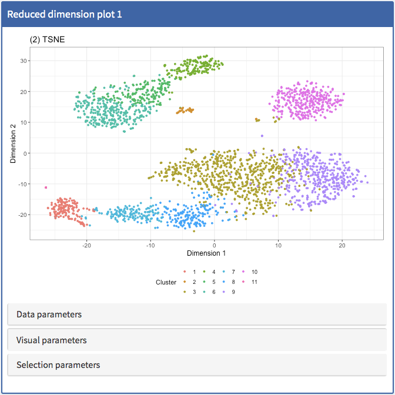

#### Column data plot {#coldataplot}

The column data plot can display one or two of the provided column annotations (from the `colData` slot).
Depending on the class of the selected annotations, the panel shows either a Hinton diagram [@Hinton1991-hintondiagram; @Bremner1994-hintonplots], a violin plot, or a scatter plot.

<!-- `r knitr::include_graphics(file.path(system.file(package="iSEEWorkshop2019", "vignettes/img"), "colDataPlot.png"))` -->

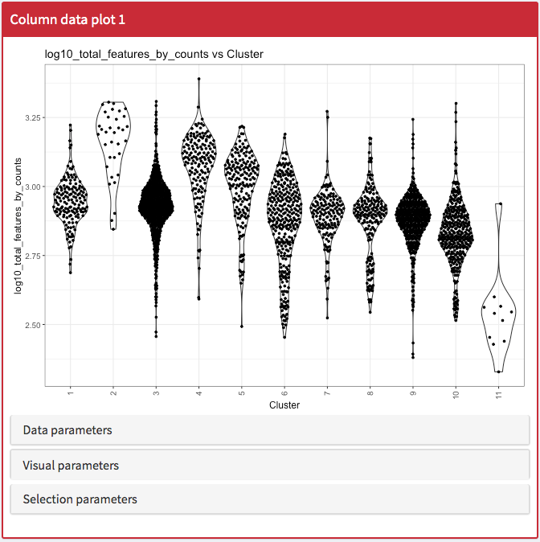

#### Row data plot {#rowdataplot}

Analogous to the [column data plot](#coldataplot) above, the row data plot displays one or two of the provided row annotations (from the `rowData` slot).
Depending on the class of the selected annotations, the panel displays either a Hinton plot, a violin plot, or a scatter plot.

<!-- `r knitr::include_graphics(file.path(system.file(package="iSEEWorkshop2019", "vignettes/img"), "rowDataPlot.png"))` -->

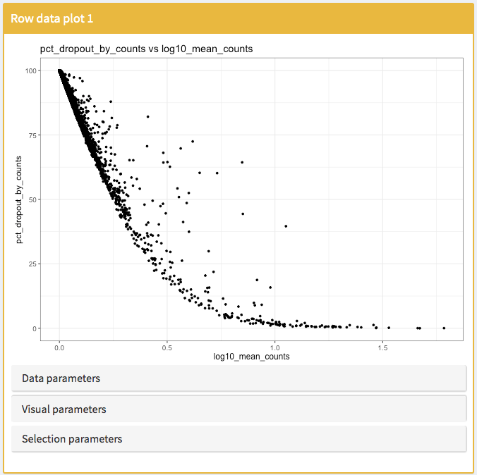

#### Heat map {#heatmap}

The heat map panel displays, for any assay, the observed values for a subset of the features across the samples.

<!-- `r knitr::include_graphics(file.path(system.file(package="iSEEWorkshop2019", "vignettes/img"), "heatMap.png"))` -->

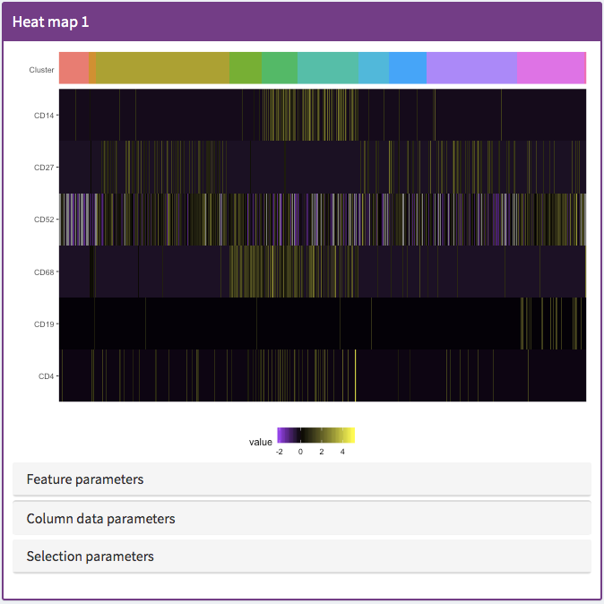

#### Feature assay plot {#featassayplot}

The feature assay plot displays the observed values for one feature across the samples.
It is also possible to plot the observed values for two features, in a scatter plot.

<!-- `r knitr::include_graphics(file.path(system.file(package="iSEEWorkshop2019", "vignettes/img"), "featAssayPlot.png"))` -->

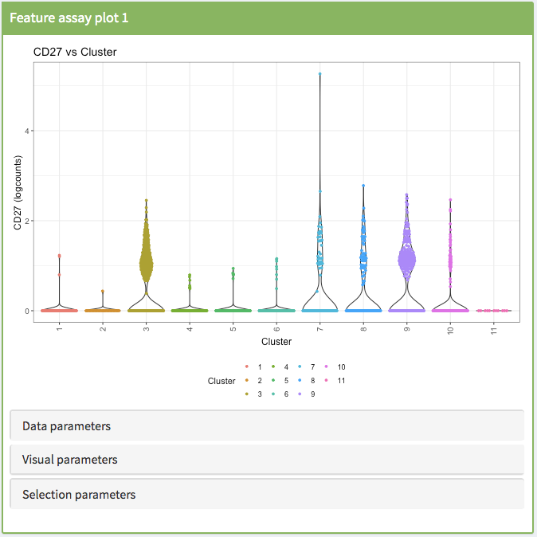

#### Sample assay plot {#sampassayplot}

Analogous to the [feature assay plot](#featassayplot) above, the sample assay plot shows the observed values for all features, for one of the samples.
It is also possible to plot the observed values for two samples, in a scatter plot.

<!-- `r knitr::include_graphics(file.path(system.file(package="iSEEWorkshop2019", "vignettes/img"), "sampAssayPlot.png"))` -->

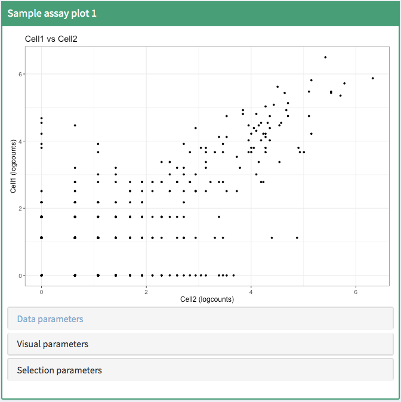

#### Row statistics table {#rowstattable}

The row statistics table displays all information provided in the `rowData` slot of the `SummarizedExperiment` object, leveraging the interactivity provided by the `r CRANpkg("DT")` package.

<!-- `r knitr::include_graphics(file.path(system.file(package="iSEEWorkshop2019", "vignettes/img"), "rowStatTable.png"))` -->

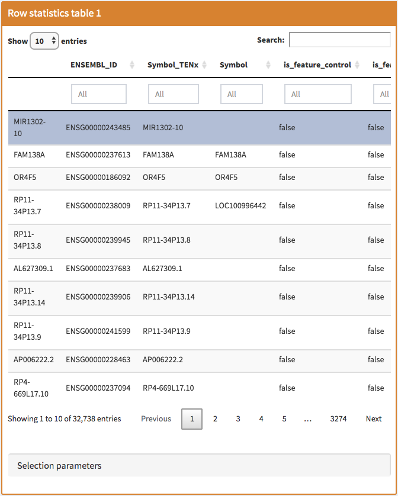

#### Column statistics table {#colstattable}

Analogous to the [row statistics table](#rowstattable) above, the column statistics table displays all information provided in the `colData` slot of the `SummarizedExperiment` object.

<!-- `r knitr::include_graphics(file.path(system.file(package="iSEEWorkshop2019", "vignettes/img"), "colStatTable.png"))` -->

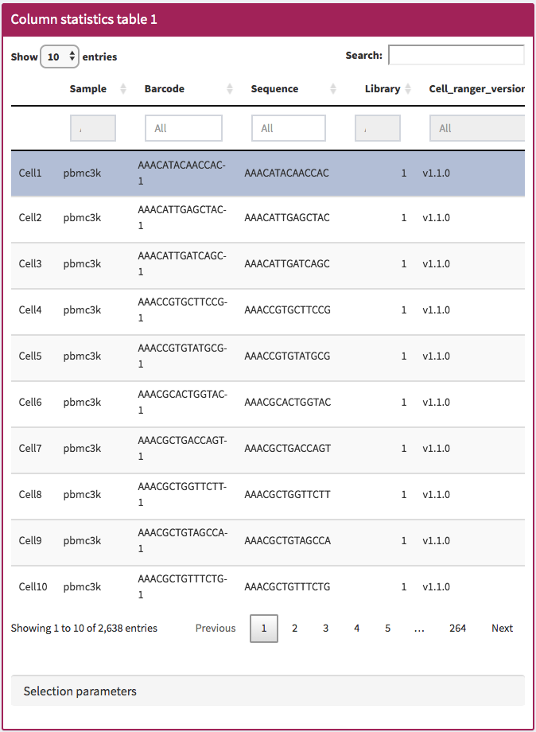

#### 'Data parameters' collapsible box {#data-parameters-box}

Each plot panel type has a `Data parameters` collapsible box.
This box has different content for the each panel types, but in all cases it lets the user control the data that is displayed in the plot.

<!-- `r knitr::include_graphics(file.path(system.file(package="iSEEWorkshop2019", "vignettes/img"), "colDataPlotDataParams.png"))` -->

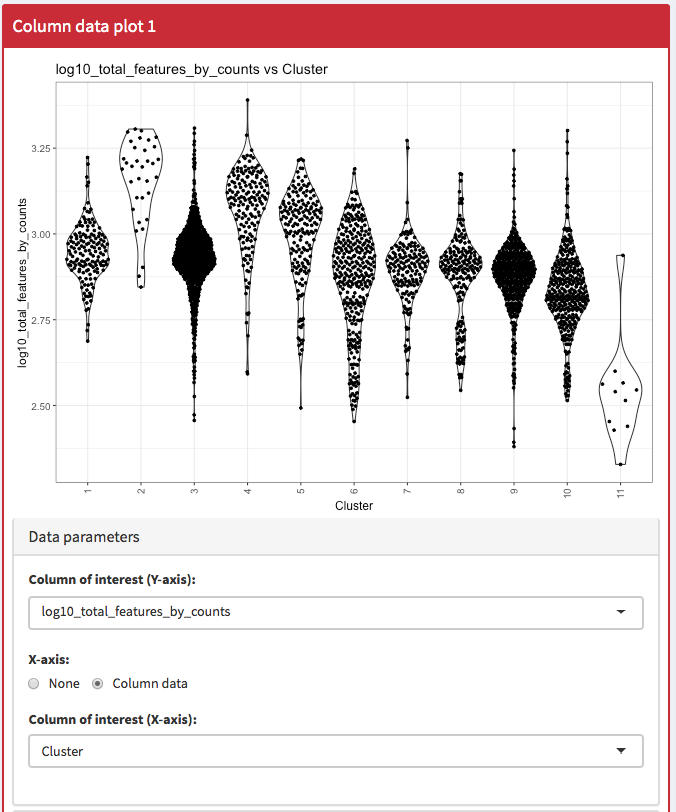

#### 'Visual parameters' collapsible box {#visual-parameters-box}

In contrast to the `Data parameters` collapsible box that lets users control _what_ is displayed in the plot, the `Visual parameters` box lets users control _how_ the information is displayed.

This collapsible box contains the controls to change the size, shape, opacity, and color of the points, to facet the plot by any available categorical annotation, to subsample points for increased speed of plot rendering, and to control how legends are displayed.

<!-- `r knitr::include_graphics(file.path(system.file(package="iSEEWorkshop2019", "vignettes/img"), "colDataPlotVisualParams.png"))` -->

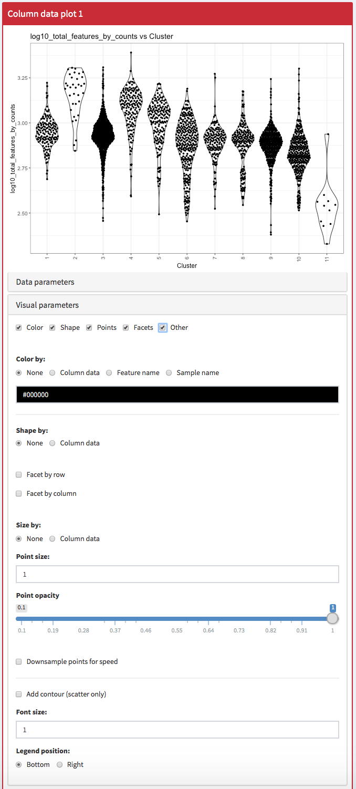

#### 'Selection parameters' collapsible box {#selection-parameter-box}

The `Selection parameters` collapsible box provides controls to transfer selections of points (features or samples) between panels.

We discuss point transmission in more detail [later in this workshop](#transmit-point-selections).

<!-- `r knitr::include_graphics(file.path(system.file(package="iSEEWorkshop2019", "vignettes/img"), "redDimPlotSelectionParams.png"))` -->

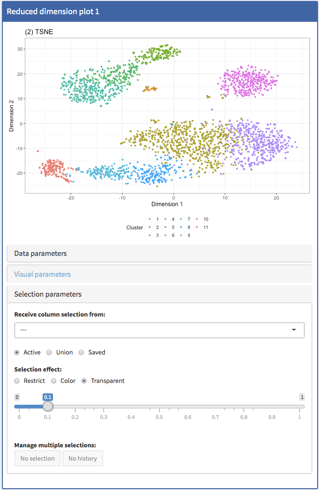

#### Additional controls {#additional-controls}

At the top-right corner of the iSEE application, users can find additional controls for reproducibility, configuration, and help.
Each of these is discussed in more detail later in this workshop.
Links are provided in the last column of the table below.


|                    |                                                                     |                                        |
|--------------------|:-------------------------------------------------------------------:|----------------------------------------|
| Panel organization | 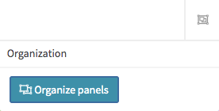 | [Organize panels](#configuration-ui) |
| Diagnostics        | 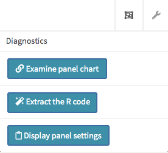       | [Examine panel chart](#transmit-point-selections), [Extract R code](#reproducibility), [Display panel settings](#configuration-ui) |
| Documentation      | 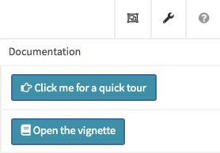     | [Quick tour](#sharing-tours), [Open the vignette](#more-resources) |
| Additional info    |     | [About this session](#reproducibility), [About iSEE](#more-resources) |

<!-- |                    |                                                                     |                                        |
|--------------------|:-------------------------------------------------------------------:|----------------------------------------|
| Panel organization | `r knitr::include_graphics(file.path(system.file(package="iSEEWorkshop2019", "vignettes/img"), "PanelOrganization.png"))` | [Organize panels](#configuration-ui) |
| Diagnostics        | `r knitr::include_graphics(file.path(system.file(package="iSEEWorkshop2019", "vignettes/img"), "Diagnostics.png"))`       | [Examine panel chart](#transmit-point-selections), [Extract R code](#reproducibility), [Display panel settings](#configuration-ui) |
| Documentation      | `r knitr::include_graphics(file.path(system.file(package="iSEEWorkshop2019", "vignettes/img"), "Documentation.png"))`     | [Quick tour](#sharing-tours), [Open the vignette](#more-resources) |
| Additional info    | `r knitr::include_graphics(file.path(system.file(package="iSEEWorkshop2019", "vignettes/img"), "additionalInfo.png"))`    | [About this session](#reproducibility), [About iSEE](#more-resources) | -->


<!-- Show how to change what is plotted, faceting, changing appearance/color -->
<!-- Transmit selections -->
<!-- Subsampling --> 

### Configuration of the app interface {#configuration-ui}

As mentioned above, the default behaviour of the `iSEE()` function is to launch an instance of the user interface that displays one panel of each of the standard types (provided the underlying data is available, e.g. for reduced dimension plots the `reducedDim` slot is required).
However, in some cases it is desirable to have multiple panels of the same type, and/or exclude some panel types.

In order to accommodate such situations, users can add, remove, change the order of and resize all panels via the `Panel organization` menu in the top-right corner.

> <i class="fa fa-wrench fa-2x"></i> **Action:** Using your open `r Biocpkg("iSEE")` instance, open the `Organization` menu (<i class="fa fa-object-group"></i>) and click on the `Organize panels` (<i class="fa fa-object-ungroup"></i>) button.
Try to add and remove panels, and resize the existing ones.
Remember to click on `Apply settings` (<i class="fa fa-object-ungroup"></i>) to apply the changes you have made to the interface. 

Clicking in the selectize box listing all current panels will present you with a drop-down menu from which you can choose additional panels to add. 
Similarly, panels can be removed by clicking on the <i class="fa fa-times"></i> icon associated with the panel name.

Each panel can be individually resized by changing the width and height.
Note that the total width of a row in the interface is 12 units.
When the width of a panel is greater than the space available, the panel is moved to a new row.

It can take a great amount of time to achieve a satisfactory panel configuration.
To avoid the need to manually organize the panels each time the app is opened, `r Biocpkg("iSEE")` offers the possibility to export the current panel settings.

> <i class="fa fa-wrench fa-2x"></i> **Action:** click on the wrench icon (<i class="fa fa-wrench"></i>) in the top-right corner, and select 'Display panel settings'.
Scroll to the end of the code in the popup window and copy the definition of the `initialPanels` variable.

For example:

```{r}
initialPanels <- DataFrame(
    Name=c("Reduced dimension plot 1", "Column data plot 1", 
           "Row data plot 1", "Heat map 1", 
           "Feature assay plot 1", "Sample assay plot 1", 
           "Row statistics table 1", "Column statistics table 1"
        ),
    Width=c(3L, 3L, 3L, 3L, 3L, 3L, 3L, 3L),
    Height=c(460L, 460L, 460L, 460L, 460L, 460L, 460L, 460L)
)
```

> <i class="fa fa-wrench fa-2x"></i> **Action:** Close the application, run the code that you just copied in your _R_ session, and relaunch the application, now with the additional argument `initialPanels` set:

```{r}
if (interactive()) {
    iSEE(sce, initialPanels = initialPanels)
}
```

Notice how the panel configuration at startup is now identical to the one you saw just before displaying the panel settings.

Now that we have an application consisting of a suitable collection of panels for our data set, we'll explore the collapsible boxes below each plot, which lets us control their appearance. 

#### Displaying a different reduced dimension representation {#choose-reduced-dimension}

By default, each _Reduced dimension plot_ displays the first reduced dimension representation provided (contained in the `reducedDim` slot of the `SingleCellExperiment` object). 
If additional reduced dimension representations are included, the one chosen for the display can be changed in the `Data parameters` collapsible box in the _Reduced dimension plot_ panel.

> <i class="fa fa-wrench fa-2x"></i> **Action:** Use this control to show the t-SNE representation instead of the PCA.

Notably, the instance can be preconfigured to immediately display the t-SNE representation when the application is launched.

> <i class="fa fa-wrench fa-2x"></i> **Action:** Close the application and run the following block of code to show two _Reduced dimension plot_ panels; one showing the PCA representation, one showing the t-SNE representation.

```{r}
redDimArgs <- redDimPlotDefaults(sce, 2)
redDimArgs[1, "Type"] <- "PCA"
redDimArgs[2, "Type"] <- "TSNE"
initialPanels <- DataFrame(
    Name=c("Reduced dimension plot 1", "Reduced dimension plot 2"),
    Width=c(4L, 4L),
    Height=c(400, 400)
)
if (interactive()) {
    iSEE(sce, redDimArgs = redDimArgs, initialPanels = initialPanels)
}
```

<!-- `r knitr::include_graphics(file.path(system.file(package="iSEEWorkshop2019", "vignettes/img"), "ReducedDimensionType.png"))` -->

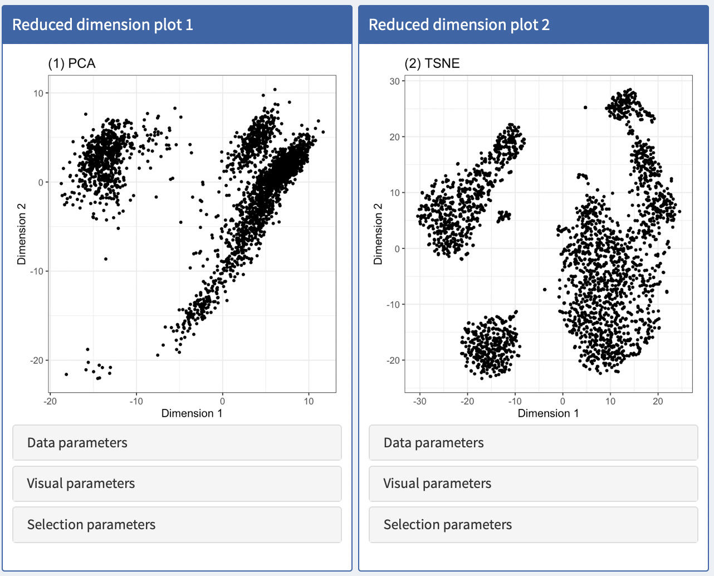

#### Coloring points by row/column annotation {#color-by-annotation}

With default settings, all points are colored black.
However, any provided row (for features) or column (for samples) annotation can be used to color the points.

> <i class="fa fa-wrench fa-2x"></i> **Action:** To demonstrate this, open the `Visual parameters` collapsible box in one of the _Reduced dimension plot_ panels, and set `Color by:` to `Column data`.
Scroll through the dropdown menu that appears to see all the sample annotations that can be used to color the points.
All these values are taken from the `colData` slot of the provided object.

> <i class="fa fa-wrench fa-2x"></i> **Action:** First, color the cells by `Cluster`, which contains the cluster labels that were assigned to the cells in the preprocessing step [in a previous section](#prepare-scrnaseq-data).
Note how a discrete color scheme is selected, since the variable is categorical.

> <i class="fa fa-wrench fa-2x"></i> **Action:** Next, color the cells by the log10-transformed number of detected genes (`log10_total_features_by_counts`).
Notice how the color scale is now continuous.

The instance can be preconfigured to control the coloring of data points, to display the same result on startup.

> <i class="fa fa-wrench fa-2x"></i> **Action:** Close the application and run the following block of code to continue editing the configuration of the two _Reduced dimension plot_ panels prepared in the [previous section](#choose-reduced-dimension).


```{r}
redDimArgs[["ColorBy"]] <- "Column data"
redDimArgs[1, "ColorByColData"] <- "log10_total_features_by_counts"
redDimArgs[2, "ColorByColData"] <- "Cluster"
initialPanels <- DataFrame(
    Name=c("Reduced dimension plot 1", "Reduced dimension plot 2"),
    Width=c(4L, 4L),
    Height=c(400, 400)
)
if (interactive()) {
    iSEE(sce, redDimArgs = redDimArgs, initialPanels = initialPanels)
}
```

<!-- `r knitr::include_graphics(file.path(system.file(package="iSEEWorkshop2019", "vignettes/img"), "ColorByColData.png"))` -->

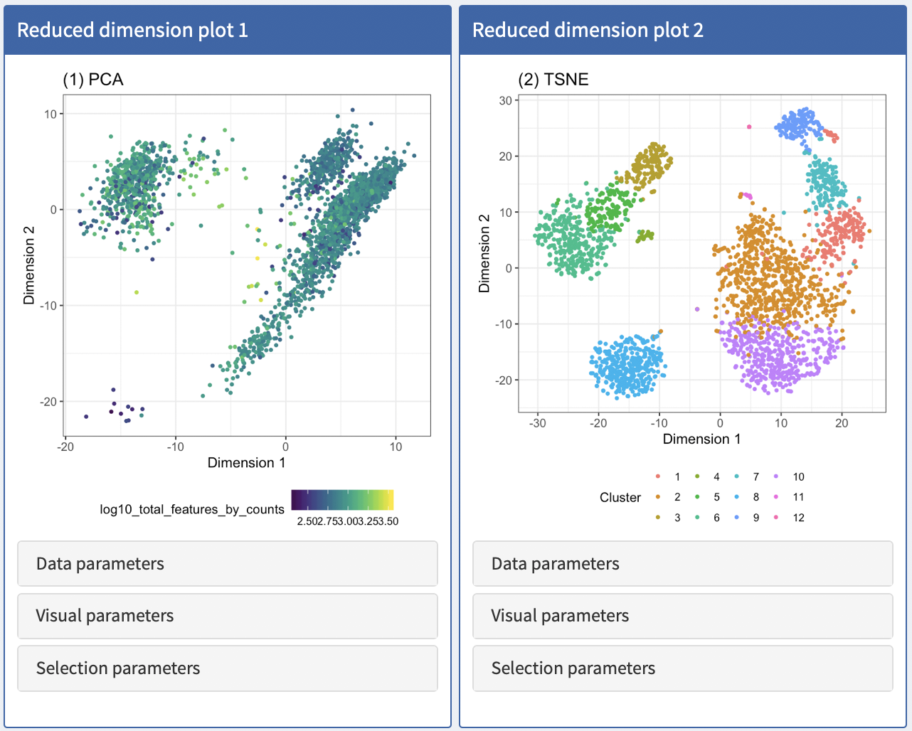

`r Biocpkg("iSEE")` allows precise control over the color schemes used.
More information about this can be found in the `r Biocpkg("iSEE", "ecm.html", "ExperimentColorMap")` vignette.

#### Coloring points by feature value {#color-by-feature}

In addition to coloring cells by the provided annotations as above, we can also color them by the observed values for a given feature (as provided in one of the `assays`).

> <i class="fa fa-wrench fa-2x"></i> **Action:** Set `Color by:` to `Feature name` in one of the _Reduced dimension plot_ panels, and select one of the genes from the dropdown menu.
You can search for a gene of interest by typing in the dropdown box.
You can also choose which assay should be used to extract the values to color according to.

Again, the same result can be achieved by preconfiguring the application as follows.

> <i class="fa fa-wrench fa-2x"></i> **Action:** Close the application and run the following block of code to set up 3 panels, all displaying the t-SNE representation.
In the first panel, we color cells by their `Cluster` label.
In the second and third panel, we display _CD79A_ and _CD74_, a combination of gene markers typically observed in B cells.

```{r}
## The displayed features IDs must be row names of the object
c("CD79A", "CD74") %in% rownames(sce)

redDimArgs <- redDimPlotDefaults(sce, 3)
redDimArgs[["Type"]] <- "TSNE"
redDimArgs[1, "ColorBy"] <- "Column data"
redDimArgs[1, "ColorByColData"] <- "Cluster"
redDimArgs[2:3, "ColorBy"] <- "Feature name"
redDimArgs[2, "ColorByFeatName"] <- "CD79A"
redDimArgs[3, "ColorByFeatName"] <- "CD74"
initialPanels <- DataFrame(
    Name=paste("Reduced dimension plot", 1:3),
    Width=rep(4L, 3L),
    Height=rep(400, 3L)
)
if (interactive()) {
    iSEE(sce, redDimArgs = redDimArgs, initialPanels = initialPanels)
}
```

<!-- `r knitr::include_graphics(file.path(system.file(package="iSEEWorkshop2019", "vignettes/img"), "ColorByFeature.png"))` -->


#### Highlighting a single point {#highlight}

The `Color by: Sample name` option in the _Reduced dimension plot_ can also be used to highlight a single sample.

> <i class="fa fa-wrench fa-2x"></i> **Action:** Set `Color by:` to `Sample name` in the _Reduced dimension plot_, and use the dropdown menu underneath to change the highlighted cell.

Again, the same result can be achieved by preconfiguring the application as follows.
Note that it is more robust to provide the numerical index of the sample in the `sce` object (see the `match` statements in the code chunk below).

> <i class="fa fa-wrench fa-2x"></i> **Action:** Close the app and run the following block of code to continue editing the configuration of the two _Reduced dimension plot_ panels prepared in the [previous section](#color-by-feature).
We also open the _Visual parameters_ collapsible box to highlight the preconfigured options.

```{r}
redDimArgs[2:3, "ColorBy"] <- "Sample name"
redDimArgs[2, "ColorBySampName"] <- match("Cell2439", colnames(sce))
redDimArgs[3, "ColorBySampName"] <- match("Cell673", colnames(sce))
redDimArgs[["VisualBoxOpen"]] <- TRUE
initialPanels <- DataFrame(
    Name=paste("Reduced dimension plot", 1:3),
    Width=rep(4L, 3L),
    Height=rep(400, 3L)
)
if (interactive()) {
    iSEE(sce, redDimArgs = redDimArgs, initialPanels = initialPanels)
}
```

<!-- `r knitr::include_graphics(file.path(system.file(package="iSEEWorkshop2019", "vignettes/img"), "ColorBySample.png"))` -->


#### Changing the size, shape and opacity of points {#change-shape-opacity}

By default, only the `Color` options are displayed in the `Visual parameters` box.
Additional controls can be shown by clicking the check boxes for `Shape`, `Points`, `Facets` and `Other`.
The `Shape` and `Points` panels let you set the shape and size of points according to provided annotations (or to resize all points), and to set the point opacity.
Here, you can also downsample points to increase the speed of rendering, which can be useful for data sets with large numbers of points.

> <i class="fa fa-wrench fa-2x"></i> **Action:** Close the app and run the following block of code to continue editing the configuration of the two _Reduced dimension plot_ panels prepared in the [previous section](#color-by-feature).
Here, we reduce the point size and increase the transparency (i.e. reduce the value for the alpha attribute).
We also apply a downsampling grid of 100 horizontal and vertical bins to the plot, where only a single data point is plotted (if any) for each bin.
Finally, we display the `Shape` and `Points` options.

```{r}
redDimArgs[2:3, "PointSize"] <- 0.4
redDimArgs[2:3, "PointAlpha"] <- 0.4
redDimArgs[["VisualBoxOpen"]] <- TRUE
redDimArgs[["Downsample"]] <- TRUE
redDimArgs[["SampleRes"]] <- 200
redDimArgs[["VisualChoices"]][[2]] <- list("Shape", "Points")
redDimArgs[["VisualChoices"]][[3]] <- list("Shape", "Points")
initialPanels <- DataFrame(
    Name=paste("Reduced dimension plot", 1:3),
    Width=rep(4L, 3L),
    Height=rep(400, 3L)
)
if (interactive()) {
    iSEE(sce, redDimArgs = redDimArgs, initialPanels = initialPanels)
}
```

<!-- `r knitr::include_graphics(file.path(system.file(package="iSEEWorkshop2019", "vignettes/img"), "ConfigureVisualParameters.png"))` -->

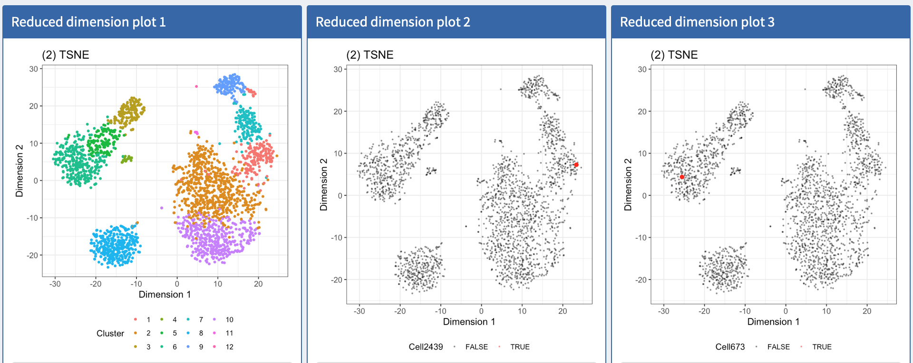

#### Changing the displayed metadata {#change-metadata-displayed}

The _Column data plot_ and _Row data plot_ panels are used to display the information in the `colData` and `rowData` slots of the `SummarizedExperiment` object.
These panels can display either one or two annotations.
By default, the first annotation in the respective metadata table is selected.

The plot layout adapts automatically to the type of annotation(s) displayed.

* When all chosen annotations are categorical, `r Biocpkg("iSEE")` displays a Hinton plot, consisting of rectangles with an area proportional to the number of observations they represent.
* For a single continuous variable, or one continuous and one categorical variable, `r Biocpkg("iSEE")` uses violin plot(s).
* If two continuous variables are chosen, `r Biocpkg("iSEE")` displays a scatter plot.

As a side note, categorical variables with "too many" unique values (which is typically the case for sample IDs, for instance) are represented as numeric variables, by replacing each value by an index.
The limit for what is considered "too many" unique values can be set using `options(iSEE.maxlevels = 30)`.

> <i class="fa fa-wrench fa-2x"></i> **Action:** Explore the different types of plots provided in the Column data or Row data plot panels by selecting different annotations as the `Column of interest (Y-axis)` and/or setting `X-axis:` to `Column data` and selecting an additional annotation.

In the following code chunk we demonstrate the preconfiguration of an app instance that immediately displays two panels.

> <i class="fa fa-wrench fa-2x"></i> **Action:** Close the app and run the following block of code to set up one _Column data plot_ and one _Row data plot_ panel.
We set up the _Column data plot_ panel to immediately examine the proportion of counts assigned to mitochondrial features in each cluster.
We set up the _Row data plot_ panel to examine the proportion of cells with detectable expression against the log-transformed total counts for each gene.

```{r}
colDataArgs <- colDataPlotDefaults(sce, 1)
colDataArgs[1, "YAxis"] <- "pct_counts_MT"
colDataArgs$XAxis <- "Column data"
colDataArgs[1, "XAxisColData"] <- "Cluster"
rowDataArgs <- rowDataPlotDefaults(sce, 1)
rowDataArgs[1, "YAxis"] <- "n_cells_by_counts"
rowDataArgs$XAxis <- "Row data"
rowDataArgs[1, "XAxisRowData"] <- "log10_total_counts"
initialPanels <- DataFrame(
    Name=c("Column data plot 1", "Row data plot 1"),
    Width=rep(4L, 2L),
    Height=rep(400, 2L)
)
if (interactive()) {
    iSEE(sce, colDataArgs = colDataArgs, rowDataArgs = rowDataArgs, initialPanels = initialPanels)
}
```

<!-- `r knitr::include_graphics(file.path(system.file(package="iSEEWorkshop2019", "vignettes/img"), "ConfigureDataPlotPanels.png"))` -->


#### Displaying gene expression {#display-gene-expression}

The _Feature assay plot_ is used to display the observed values for one feature across the samples on the Y-axis.
By default, the first feature in the `rownames` of the dataset is selected, displaying its distribution across the entire dataset.

While continuous measurements are more common (e.g., gene expression),  discrete assays are also supported (e.g., single nucleotide polymorphisms), and displayed as a Hinton plot, consisting of rectangles with an area proportional to the number of samples they represent.

It is also possible to plot the observed values a second feature on the X-axis.
This will result in a scatter plot or Hinton plot, depending on the continuous or discrete nature of the data, respectively.

Alternatively, the X-axis can also be used to stratify gene expression according to a discrete sample metadata in the form of a violin plot, while a continuous metadata will generate a scatter plot.

> <i class="fa fa-wrench fa-2x"></i> **Action:** Explore the different types of plots generated by the Feature assay plot panel using the choices available for the two axes.

Similarly to all other panels, _Feature assay plot_ can be preconfigured to immediately display specific information when the app is launched.

> <i class="fa fa-wrench fa-2x"></i> **Action:** Close the app and run the following block of code to set up three _Feature assay plot_ panels demonstrating different configurations.
All three panels display the same gene on the Y-axis and color data points according to their cluster label.
On the X-axis, the first panel displays a discrete sample metadata variable, the cluster label; the second panel display a continuous sample metadata variable, the log-transformed library size; the third panel displays the expression of a second gene.

```{r}
featAssayArgs <- featAssayPlotDefaults(sce, 3)
featAssayArgs[["ColorBy"]] <- "Column data"
featAssayArgs[["ColorByColData"]] <- "Cluster"
featAssayArgs[["YAxisFeatName"]] <- match("CD3D", rownames(sce))
featAssayArgs[1, "XAxis"] <- "Column data"
featAssayArgs[1, "XAxisColData"] <- "Cluster"
featAssayArgs[2, "XAxis"] <- "Column data"
featAssayArgs[2, "XAxisColData"] <- "log10_total_counts"
featAssayArgs[3, "XAxis"] <- "Feature name"
featAssayArgs[3, "XAxisFeatName"] <- match("CD40LG", rownames(sce))
featAssayArgs[["DataBoxOpen"]] <- TRUE
initialPanels <- DataFrame(
    Name=paste("Feature assay plot", 1:3),
    Width=rep(4L, 3L),
    Height=rep(400, 3L)
)
if (interactive()) {
    iSEE(sce, featAssayArgs = featAssayArgs, initialPanels = initialPanels)
}
```

<!-- `r knitr::include_graphics(file.path(system.file(package="iSEEWorkshop2019", "vignettes/img"), "featAssayPlotDataParams.png"))` -->


#### Linking panels and transmitting point selections {#transmit-point-selections}

When exploring data, it is often useful to be able to select a subset of points and investigate different aspects of their characteristic features. 
In `r Biocpkg("iSEE")`, this can be achieved by _selecting_ points in one panel, and _transmitting_ this selection to one or more other panels. 

> <i class="fa fa-wrench fa-2x"></i> **Action:** Select a set of points in one of the _Feature assay plot_ panels, by drawing a rectangle around them. 
Then open the _Selection parameters_ collapsible box of one of the other _Feature assay plot_ panels, and select the _Feature assay plot_ panel where you made the point selection from the dropdown menu under **Receive column selection from**. 
Note how the points corresponding to the cells that you selected in the first panel are highlighted in the receiving panel. 
You can highlight the points in different ways by changing the **Selection effect**.

Also the brushing and point selection can be preconfigured. 
In the example below, we configure three types of panels: a _Feature assay plot_, a _Reduced dimension plot_, and a _Column data plot_.
For visual convenience, we color data points in all three panels by the cluster label.

To demonstrate the feature, we define a Shiny brush in the _Feature assay plot_ panel to select cells with detectable levels of the _CD3D_ gene.
For the other two panels, pay particular attention to the `"SelectByPlot"` instruction which declares that they should both receive the data points selected in the _Feature assay plot_ panel.
In addition, we specify that the _Reduced dimension plot_ should highlight the selection by applying a transparency effect to _unselected_ data points.
Alternatively, we use the _Column data plot_ to demonstrate how the selection can also be highlighted by applying a given color (here, red) to the selected data points.

> <i class="fa fa-wrench fa-2x"></i> **Action:** Close the app and run the following block of code to launch the example application described above.

```{r}
featAssayArgs <- featAssayPlotDefaults(sce, 2)
featAssayArgs[1, "YAxisFeatName"] <- match("CD3D", rownames(sce))
featAssayArgs$BrushData[[1]] <-  list(
    xmin = 0.5, xmax = 12.5, ymin = 0.5, ymax = 5.7,
    mapping = list(x = "X", y = "Y", group = "GroupBy"),
    direction = "xy", 
    brushId = "featAssayPlot1_Brush", outputId = "featAssayPlot1")
featAssayArgs[1, "XAxis"] <- "Column data"
featAssayArgs[1, "XAxisColData"] <- "Cluster"
featAssayArgs[1, "ColorBy"] <- "Column data"
featAssayArgs[1, "ColorByColData"] <- "Cluster"
redDimArgs <- redDimPlotDefaults(sce, 2)
redDimArgs[1, "SelectByPlot"] <- "Feature assay plot 1"
redDimArgs[1, "Type"] <- match("TSNE", reducedDimNames(sce))
redDimArgs[1, "ColorBy"] <- "Column data"
redDimArgs[1, "ColorByColData"] <- "Cluster"
redDimArgs[1, "SelectBoxOpen"] <- TRUE
colDataArgs <- colDataPlotDefaults(sce, 2)
colDataArgs[1, "SelectByPlot"] <- "Feature assay plot 1"
colDataArgs[1, "SelectEffect"] <- "Color"
colDataArgs[1, "YAxis"] <- "log10_total_counts"
colDataArgs[1, "XAxis"] <- "Column data"
colDataArgs[1, "XAxisColData"] <- "pct_counts_MT"
colDataArgs[1, "ColorBy"] <- "Column data"
colDataArgs[1, "ColorByColData"] <- "Cluster"
colDataArgs[1, "SelectBoxOpen"] <- TRUE
initialPanels <- DataFrame(
    Name=c(
        "Feature assay plot 1", "Reduced dimension plot 1", "Column data plot 1",
        "Feature assay plot 2", "Reduced dimension plot 2", "Column data plot 2"),
    Width=rep(4L, 3L),
    Height=rep(400, 3L)
)
if (interactive()) {
    iSEE(
        sce,
        redDimArgs = redDimArgs, colDataArgs = colDataArgs, featAssayArgs = featAssayArgs,
        initialPanels = initialPanels
    )
}
```

`r knitr::include_graphics(file.path(system.file(package="iSEEWorkshop2019", "vignettes/img"), "LinkingPanelsExample.png"))`

Notably, iSEE can display active links transmitting point selections between panel using the "[Examine panel chart](#additional-controls)" menu.
Visible panels that do not send or receive a selection are also shown.

<!-- `r knitr::include_graphics(file.path(system.file(package="iSEEWorkshop2019", "vignettes/img"), "GraphSelectionLinks.png"))` -->

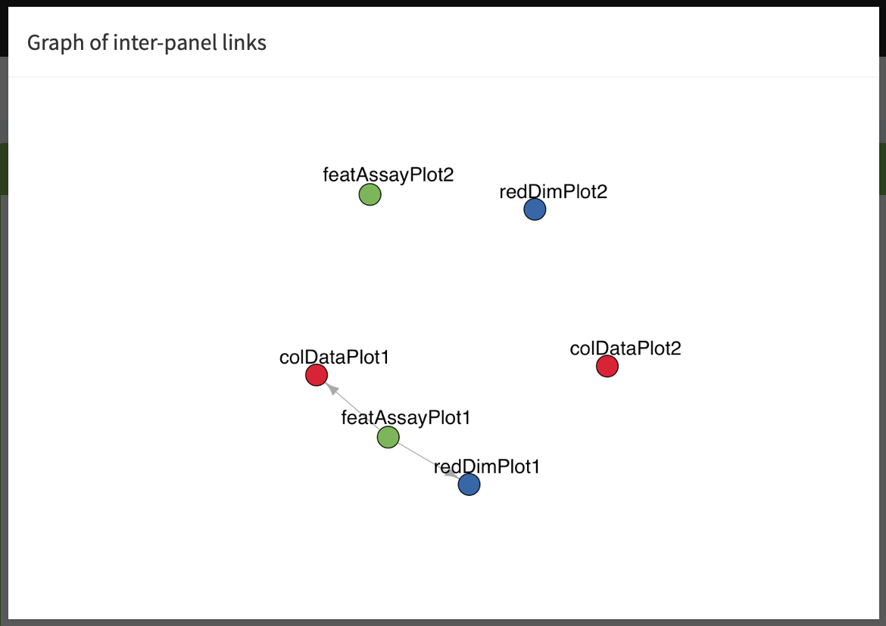

#### Zooming into a plot subregion {#zoom-subregion}

iSEE allows you to zoom into a subregion of a plot, by simply drawing a rectangle around the area of interest and double-clicking inside the rectangle.
To zoom back out to the full plot, double-click anywhere in the plot.

To demonstrate the feature, we set up two _Reduced dimension plot_ panels.
In the first panel, we draw a Shiny brush to indicate an area of interest in the reduced dimension plot.
We preconfigure the second panel to display only that area.
In both panels, we color data points by cluster label using the same color map, to help visualize the zoom relationship between the two panels.

> <i class="fa fa-wrench fa-2x"></i> **Action:** Close the app and run the following block of code to launch the example application described above.
Double-click on the area selected in the first panel to zoom and display the same view as the second panel.
Double click again anywhere in the panel to zoom out.

```{r}
redDimArgs <- redDimPlotDefaults(sce, 2)
redDimArgs[["Type"]] <- "TSNE"
redDimArgs[["ColorBy"]] <- "Column data"
redDimArgs[["ColorByColData"]] <- "Cluster"
redDimArgs[1, "PointSize"] <- 1
redDimArgs[2, "PointSize"] <- 2
redDimArgs[["BrushData"]][[1]] <- list(
    xmin = 3.4, xmax = 27.3, ymin = 0.8, ymax = 30.0, 
    log = list(x = NULL, y = NULL), mapping = list(x = "X", y = "Y", colour = "ColorBy"),
    direction = "xy", brushId = "redDimPlot1_Brush", outputId = "redDimPlot1")
redDimArgs[["ZoomData"]] [[2]] <- c(xmin = 3.4, xmax = 27.3, ymin = 0.8, ymax = 30.0)
initialPanels <- DataFrame(
    Name=c("Reduced dimension plot 1", "Reduced dimension plot 2"),
    Width=rep(6L, 2L),
    Height=rep(400, 2L)
)
if (interactive()) {
    iSEE(sce, redDimArgs = redDimArgs, initialPanels = initialPanels)
}
```

<!-- `r knitr::include_graphics(file.path(system.file(package="iSEEWorkshop2019", "vignettes/img"), "Zoom.png"))` -->

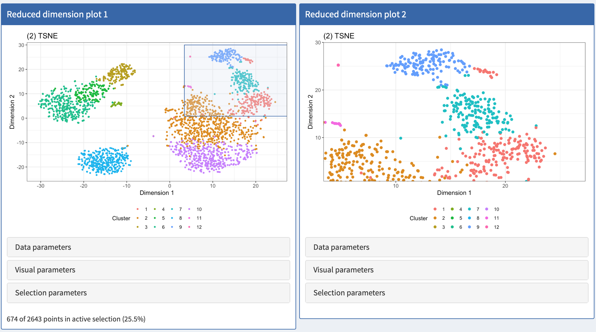

#### Filtering tables {#filter-table}

Tables may also be preconfigured to immediately display a subset of rows according to their filters or select a row different from the first one when the app is launched.

For simplicity, we demonstrate this feature using a subset of 3 column metadata--namely "Cluster", "total_counts", and "pct_counts_MT"--out of the set of column metadata computed by the [workflow above](#prepare-scrnaseq-data).

In the example below, we preconfigure a _Column statistics table_ to display only cells with cluster labels "3" and "5", and a library size between 5,000 and 15,844 (the maximum library size in the dataset).
In addition, we also preselect the cell named "Cell684".

> <i class="fa fa-wrench fa-2x"></i> **Action:** Close the app and run the following block of code to launch the example application described above.

```{r}
sce1 <- sce
colData(sce1) <- colData(sce1)[, c("Cluster", "total_counts", "pct_counts_MT")]
colStatArgs <- colStatTableDefaults(sce1, 1)
colStatArgs[["SearchColumns"]][[1]] <- c("[\"3\", \"5\"]", "5000 ... 15844", "")
colStatArgs[["Selected"]] <- match("Cell684", colnames(sce1))
initialPanels <- DataFrame(
    Name=c("Column statistics table 1"),
    Width=c(12L),
    Height=c(600)
)
if (interactive()) {
    iSEE(sce1, colStatArgs = colStatArgs, initialPanels = initialPanels)
}
```

<!-- `r knitr::include_graphics(file.path(system.file(package="iSEEWorkshop2019", "vignettes/img"), "FilteredTable.png"))` -->

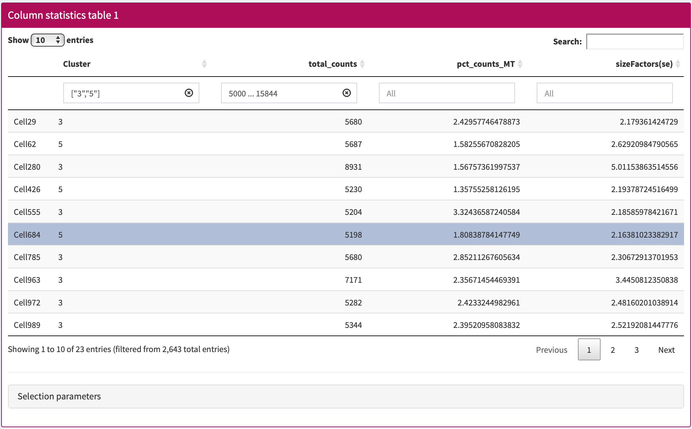

Notably the preselected cell can be used to immediately establish a relationship with another panel and highlighted the selection in a different panel [as demonstrated earlier](#transmit-point-selections).

> <i class="fa fa-wrench fa-2x"></i> **Action:** Close the app and run the following block of code to launch an application that includes a _Reduced dimension plot_ panel dynamically higlighting the cell selected in the _Column statistics table_.
Select different rows of the cell to see the _Reduced dimension plot_ panel update accordingly.

```{r}
redDimArgs <- redDimPlotDefaults(sce1, 1)
redDimArgs[["Type"]] <- "TSNE"
redDimArgs$VisualBoxOpen <- TRUE
redDimArgs$ColorBy <- "Sample name"
redDimArgs$ColorByColTable <- "Column statistics table 1"
initialPanels <- DataFrame(
    Name=c("Column statistics table 1", "Reduced dimension plot 1"),
    Width=c(6L, 6L),
    Height=c(600, 400)
)
if (interactive()) {
    iSEE(sce1, redDimArgs = redDimArgs, colStatArgs = colStatArgs,
        initialPanels = initialPanels)
}
```

<!-- `r knitr::include_graphics(file.path(system.file(package="iSEEWorkshop2019", "vignettes/img"), "LinkTableToPlot.png"))` -->


### Saving and restoring the state of the application {#save-and-restore-user-interface}

In the previous sections we have seen how we can specify the initial state of each panel by modifying the columns of the corresponding `*Args` argument.
Often, the initial exploration of a data set, including reorganization and configuration of panels is done interactively.
Once a satisfactory panel setup has been achieved, the corresponding settings can be exported and used to restore the state of the app at startup.

> <i class="fa fa-wrench fa-2x"></i> **Action:** Click on the wrench icon (<i class="fa fa-wrench"></i>) in the top-right corner, and select 'Display panel settings'.
Copy all the code shown in the pop-up window. 
Close the app and paste this code in your R session.
Then launch a new instance using the following code. 
Note how the app starts in the same configuration as it was before closing.
Of course, it is still possible to continue exploring the data interactively - we have only changed the starting configuration.

```{r}
if (interactive()) {
    iSEE(sce, redDimArgs = redDimPlotArgs, colDataArgs = colDataPlotArgs,
         featAssayArgs = featAssayPlotArgs, rowStatArgs = rowStatTableArgs,
         rowDataArgs = rowDataPlotArgs, sampAssayArgs = sampAssayPlotArgs,
         colStatArgs = colStatTableArgs, customDataArgs = customDataPlotArgs,
         customStatArgs = customStatTableArgs, heatMapArgs = heatMapPlotArgs,
         initialPanels = initialPanels)
}
```

### Custom panels {#custom-panels}

In addition to the standard panel types, `r Biocpkg("iSEE")` allows the user to create _custom_ panels, displaying any type of plot or table. 
The custom panels can receive row and column selections from the standard panels. 
In order to create a custom panel, we need to define a function that generates the desired output. 
This function must receive a `SummarizedExperiment` object as it first input. 
In addition, if only one selection is to be transmitted (i.e., if `iSEE(..., customSendAll=FALSE)`) it should take a vector of row names as the second argument, and a vector of column names as the third argument.
If `iSEE(..., customSendAll=TRUE)`, all selections (active and saved) are transmitted.

#### Example: Custom PCA plot

We will first show how to create a custom panel that performs dimension reduction (here, PCA) on a subset of the rows and columns, selected in and transmitted from other panels in the interface.

> <i class="fa fa-wrench fa-2x"></i> **Action:** Copy the code below in your R session in order to define the custom function.

```{r}
library(scater)
CUSTOM_PCA <- function(se, rows, columns,
                       colour_by = NULL, scale_features = TRUE
) {
    if (!is.null(columns)) {
        kept <- se[, columns]
    } else {
        return(
            ggplot() + theme_void() + geom_text(
                aes(x, y, label = label),
                data.frame(x = 0, y = 0, label = "No column data selected."),
                size = 5)
            )
    }

    scale_features <- as.logical(scale_features)
    kept <- runPCA(kept, feature_set = rows, scale_features = scale_features)
    plotPCA(kept, colour_by = colour_by)
}
```

> <i class="fa fa-wrench fa-2x"></i> **Action:** Next, launch an iSEE session with the custom PCA plot panel, as well as a Reduced dimension plot and a Row data plot, from which the column and row selections for the custom PCA are obtained. 
Select subsets of the points in each of these two panels and note how the PCA plot in the custom panel is updated. 
Then, in the Data parameters box in the custom panel, use the 'Custom arguments' field to select another annotation (or a feature name) to color the points by. 
Note how iSEE detects that the input arguments were changed, and prompts you to update the plot. 

```{r}
customDataArgs <- customDataPlotDefaults(sce, 1)
customDataArgs$Function <- "CUSTOM_PCA"
customDataArgs$Arguments <- "colour_by Cluster\nscale_features FALSE"
customDataArgs$ColumnSource <- "Reduced dimension plot 1"
customDataArgs$RowSource <- "Row data plot 1"
customDataArgs$DataBoxOpen <- TRUE
rowDataArgs <- rowDataPlotDefaults(sce, 1)
rowDataArgs$YAxis <- "pct_dropout_by_counts"
rowDataArgs$XAxis <- "Row data"
rowDataArgs$XAxisRowData <- "log10_mean_counts"
redDimArgs <- redDimPlotDefaults(sce, 1)
redDimArgs$Type <- "TSNE"
redDimArgs$ColorBy <- "Column data"
redDimArgs$ColorByColData <- "Cluster"
initialPanels <- DataFrame(
    Name = c("Reduced dimension plot 1", "Row data plot 1", "Custom data plot 1"),
    Width = c(4L, 4L, 4L)
)
if (interactive()) {
  iSEE(
      sce,
      customDataArgs = customDataArgs,
      rowDataArgs = rowDataArgs, redDimArgs = redDimArgs,
      initialPanels = initialPanels,
      customDataFun = list(CUSTOM_PCA = CUSTOM_PCA)
  )
}
```

<!-- `r knitr::include_graphics(file.path(system.file(package="iSEEWorkshop2019", "vignettes/img"), "customPCA.png"))` -->

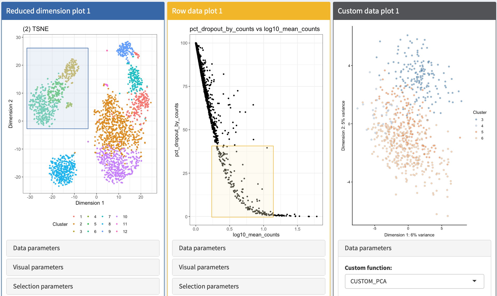

<!-- Here we could mention the custom coverage plot, and link to bulk RNA-seq data -->

#### Example: Multiple selections and differential expression

<!-- Multiple selections -> DE -->

In the example below, we demonstrate the use of `iSEE(..., customSendAll=TRUE)` to transmit all selections (active and saved).
This information is used to compute the log-fold change between the active selection and each of the other saved selections.

> <i class="fa fa-wrench fa-2x"></i> **Action:** Copy the code below in your R session in order to define the custom function.

```{r}
CUSTOM_DIFFEXP <- function(se, ri, ci, assay="logcounts") {
    ri <- ri$active
    if (is.null(ri)) { # ignoring saved gene selections for now.
        ri <- rownames(se)
    }
    if (is.null(ci$active) || length(ci$saved)==0L) {
        return(data.frame(row.names=character(0), LogFC=integer(0))) # dummy value.
    }

    assayMatrix <- assay(se, assay)[ri, , drop=FALSE]
    active <- rowMeans(assayMatrix[,ci$active,drop=FALSE])

    lfcs <- vector("list", length(ci$saved))
    for (i in seq_along(lfcs)) {
        saved <- rowMeans(assayMatrix[,ci$saved[[i]],drop=FALSE])
        lfcs[[i]] <- active - saved
    }
    names(lfcs) <- sprintf("LogFC/%i", seq_along(lfcs))

    output <- do.call(data.frame, lfcs)
    rownames(output) <- ri
    output
}
```

> <i class="fa fa-wrench fa-2x"></i> **Action:** Next, launch an iSEE session with the custom table panel, as well as a Reduced dimension plot and a Row data plot, from which the column and row selections for the custom table are obtained.
Select multiple subsets of the points in the reduced dimension plot (e.g., clusters) and note how the DE table in the custom panel is updated. 

```{r}
customStatArgs <- customStatTableDefaults(sce, 1)
customStatArgs$Function <- "CUSTOM_DIFFEXP"
customStatArgs$Arguments <- ""
customStatArgs$ColumnSource <- "Reduced dimension plot 1"
customStatArgs$RowSource <- "Row data plot 1"
customStatArgs$DataBoxOpen <- TRUE
rowDataArgs <- rowDataPlotDefaults(sce, 1)
rowDataArgs$YAxis <- "pct_dropout_by_counts"
rowDataArgs$XAxis <- "Row data"
rowDataArgs$XAxisRowData <- "log10_mean_counts"
redDimArgs <- redDimPlotDefaults(sce, 1)
redDimArgs$Type <- "TSNE"
redDimArgs$ColorBy <- "Column data"
redDimArgs$ColorByColData <- "Cluster"
redDimArgs$SelectBoxOpen <- TRUE
initialPanels <- DataFrame(
    Name = c("Reduced dimension plot 1", "Row data plot 1", "Custom statistics table 1"),
    Width = c(4L, 4L, 4L)
)
if (interactive()) {
  iSEE(
      sce,
      customStatArgs = customStatArgs,
      rowDataArgs = rowDataArgs, redDimArgs = redDimArgs,
      initialPanels = initialPanels,
      customStatFun = list(CUSTOM_DIFFEXP = CUSTOM_DIFFEXP),
    customSendAll = TRUE
  )
}
```

<!-- `r knitr::include_graphics(file.path(system.file(package="iSEEWorkshop2019", "vignettes/img"), "customMultipleDifferentialExpression.png"))` -->

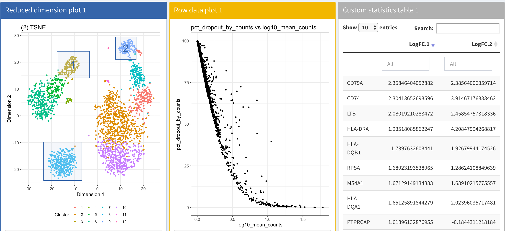

<!-- If time is enough: Kev's comparison of reduced dimensionality could be also nice - just to show, maybe, and then link to the iSEE_custom repo -->

More examples of custom panels can be found at https://github.com/kevinrue/iSEE_custom and in the Custom panels vignette (https://bioconductor.org/packages/release/bioc/vignettes/iSEE/inst/doc/custom.html).

### Reproducibility {#reproducibility}

The fact that data exploration is done interactively is no reason to forego reproducibility! 
To this end, `r Biocpkg("iSEE")` lets you export the exact R code used to create each of the currently visible plots.

> <i class="fa fa-wrench fa-2x"></i> **Action:** Close the application and run the following block of code to set up 3 panels, all displaying the t-SNE representation.

```{r}
redDimArgs <- redDimPlotDefaults(sce, 3)
redDimArgs[["Type"]] <- "TSNE"
redDimArgs[1, "ColorBy"] <- "Column data"
redDimArgs[1, "ColorByColData"] <- "Cluster"
redDimArgs[2:3, "ColorBy"] <- "Feature name"
redDimArgs[2, "ColorByFeatName"] <- "CD79A"
redDimArgs[3, "ColorByFeatName"] <- "CD74"
initialPanels <- DataFrame(
    Name=paste("Reduced dimension plot", 1:3),
    Width=rep(4L, 3L),
    Height=rep(400, 3L)
)
if (interactive()) {
    iSEE(sce, redDimArgs = redDimArgs, initialPanels = initialPanels)
}
```

> Then click on the wrench icon (<i class="fa fa-wrench"></i>) in the top-right corner, and select 'Extract the R code'.
Copy the preamble and the code for the first _Reduced dimension plot_ from the pop-up window. 
Close the app and paste the code in your R session.
Note how this recreates the first reduced dimension plot from the app. 

```{r}
se <- sce
colData(se)[,"sizeFactors(se)"] <- sizeFactors(se)
colormap <- ExperimentColorMap()
colormap <- synchronizeAssays(colormap, se)
all_coordinates <- list()
custom_data_fun <- NULL
custom_stat_fun <- NULL

################################################################################
## Reduced dimension plot 1
################################################################################

red.dim <- reducedDim(se, 2);
plot.data <- data.frame(X = red.dim[, 1], Y = red.dim[, 2], row.names=colnames(se));
plot.data$ColorBy <- colData(se)[,"Cluster"];
plot.data <- subset(plot.data, !is.na(X) & !is.na(Y));

# Saving data for transmission
all_coordinates[['redDimPlot1']] <- plot.data

# Creating the plot
ggplot() +
    geom_point(aes(x = X, y = Y, color = ColorBy), alpha = 1, plot.data, size=1) +
    labs(x = "Dimension 1", y = "Dimension 2", color = "Cluster", title = "(2) TSNE") +
    coord_cartesian(xlim = range(plot.data$X, na.rm = TRUE),
        ylim = range(plot.data$Y, na.rm = TRUE), expand = TRUE) +
    scale_color_manual(values=colDataColorMap(colormap, "Cluster", discrete=TRUE)(12), na.value='grey50', drop=FALSE) +
    scale_fill_manual(values=colDataColorMap(colormap, "Cluster", discrete=TRUE)(12), na.value='grey50', drop=FALSE) +
    theme_bw() +
    theme(legend.position = 'bottom', legend.box = 'vertical', legend.text=element_text(size=9), legend.title=element_text(size=11),
            axis.text=element_text(size=10), axis.title=element_text(size=12), title=element_text(size=12))

```

### Sharing and communication {#sharing-tours}

One important aspect of visualization is the ability to share your insights with others. 
A powerful way of easily getting people unfamiliar with your data up to speed is to provide a walk-through of the interface and the different types of plots that are displayed. 
With `r Biocpkg("iSEE")`, this can be achieved using _tours_. 
To configure a tour, you need to create a text file with two columns; named `element` and `intro`, with the former describing the UI element to highlight in each step, and the latter providing the descriptive text that will be displayed.

> <i class="fa fa-wrench fa-2x"></i> **Action:** Run the code below to generate a data frame configuring a tour for the app generated in the previous step.
Then launch a new instance, providing the data frame to the `tour` argument.

```{r}
tour <- data.frame(
    element = c(
        "#Welcome",
        "#redDimPlot1",
        "#redDimPlot2",
        "#Conclusion"),
    intro = c(
        "Welcome to this tour!",
        "This is the first reduced dimension plot",
        "And here is the second one",
        "Thank you for taking this tour!"),
    stringsAsFactors = FALSE)
if (interactive()) {
    iSEE(sce, redDimArgs = redDimArgs, initialPanels = initialPanels, tour = tour)
}
```

To see an example of a more complex tour in action, visit https://marionilab.cruk.cam.ac.uk/iSEE_pbmc4k/.
The code used to create this app and the associated tour is available from https://github.com/LTLA/iSEE2018/tree/master/tours/pbmc4k.

<!-- If there is enough time: draft a mini tour live (challenging: anchors might be tricky - rewarding: once it works, it is surely a OOOH thing) -->

## Additional resources {#more-resources}

* Bioconductor landing page: https://bioconductor.org/packages/iSEE/
* Publication (F1000Research, 2018): https://f1000research.com/articles/7-741/v1
* Deployed examples: https://marionilab.cruk.cam.ac.uk/, code at https://github.com/ltla/iSEE2018
  * Further deployments in the https://github.com/federicomarini/iSEE_instances repo
  * `r Biocpkg("iSEE")` in production: http://www.teichlab.org/singlecell-treg
* Custom panel examples: https://github.com/kevinrue/iSEE_custom
* Development version (bug reports etc): https://github.com/csoneson/iSEE

## Session info {-}

```{r}
sessionInfo()
```

# References
