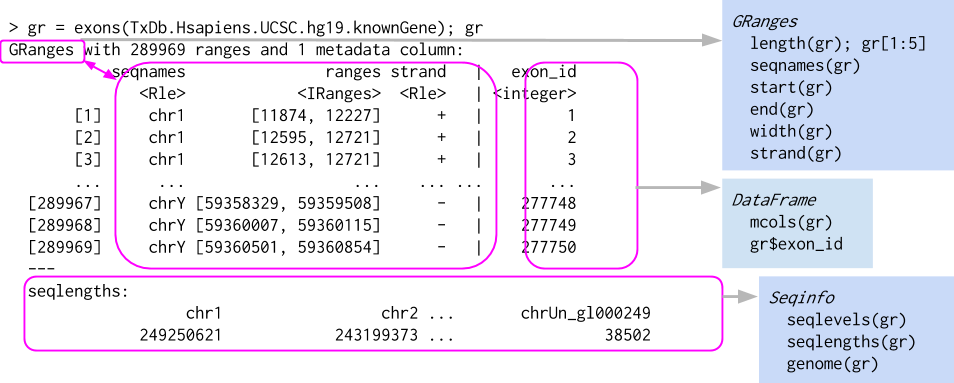
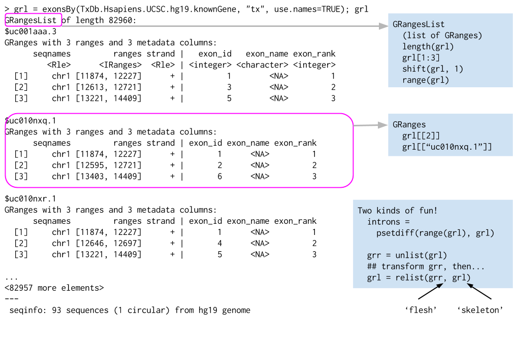

```{r style, echo = FALSE, results = 'asis'}
knitr::opts_chunk$set(
    collapse = TRUE,
    eval=as.logical(Sys.getenv("KNITR_EVAL", "TRUE")),
    cache=as.logical(Sys.getenv("KNITR_CACHE", "TRUE")))
```

```{r setup, echo=FALSE}
suppressPackageStartupMessages({
    library(Biostrings)
    library(GenomicRanges)
    library(SummarizedExperiment)
})
```

# Introduction

Started 2002 as a platform for understanding analysis of microarray
data

More than 2,100 packages. Domains of expertise:

- Sequencing (Single-cell, RNASeq, ChIPSeq, single-cell, called
  variants, ...)
- Microarrays (methylation, expression, copy number, ...)
- flow cytometry
- proteomics
- ...

Important themes

- Reproducible research
- Interoperability between packages & work kflows
- Usability

Resources

- https://bioconductor.org
- https://bioconductor.org/packages -- software, annotation, experiment, workflow
- https://support.bioconductor.org

# High-throughput sequence work flow


# DNA Sequences

[Biostrings][] themes

- _Valid_ data, e.g., alphabet
- 'Vector' interface: `length()`, `[`, ...
- Specialized operations, e.g,. `reverseComplement()`

```{r}
library(Biostrings)

dna <- DNAStringSet(c("AAACTG", "CCCTTCAAC", "TACGAA"))
dna

length(dna)
dna[c(1, 3, 1)]

width(dna)
reverseComplement(dna)
```

Help!

```{r, eval=FALSE}
methods(class="DNAStringSet")
?"DNAStringSet"
browseVignettes(package="Biostrings")
```

# Genomic Ranges



[GenomicRanges][]

- Data (e.g., aligned reads, called peaks, copy number)
- Annotations (e.g., genes, exons, transcripts)
- Close relation to BED files (see `rtracklayer::import.bed()` and
  [HelloRanges][])
- Also vector interface -- `length()`, `[`, etc.

```{r}
library(GenomicRanges)

gr <- GRanges(c("chr1:100-120", "chr1:115-130", "chr2:200-220"))
gr
```

Intra-range operations

- e.g., `shift()`, `narrow()`, `flank()`

Inter-range operations

- e.g., `reduce()`, `coverage()`, `gaps()`, `disjoin()`

Between-range operations

- e.g., `countOverlaps()`, `findOverlaps()`, `summarizeOverlaps()`

```{r}
shift(gr, 1)

reduce(gr)

anno <- GRanges(c("chr1:110-150", "chr2:150-210"))
countOverlaps(anno, gr)
```

Help!

```{r, eval=FALSE}
methods(class="GRanges")
methods(class="GRangesList")
?"GRanges"
?"GRangesList"
browseVignettes(package="GenomicRanges")
```

## Lists of Genomic Ranges



- e.g., exons-within-transcripts, alignments-within-reads

# Summarized Experiments


Component parts

- three components -- underlying 'matrix', 'row' annotations (genomic
  features), 'column' annotations (sample descriptions)

```{r}
counts <- read.csv("lecture-01-data/airway_counts.csv", row.names=1)
counts <- as.matrix(counts)
head(counts, 3)

colData <- read.csv("lecture-01-data/airway_colData.csv", row.names=1)
colData[, 1:4]

rowRanges <- readRDS("lecture-01-data/airway_rowRanges.rds")
rowRanges
```

Could manipulate independently...

```{r, fig.asp=1}
cidx <- colData$dex == "trt"
plot(
    rowMeans(1 + counts[, cidx]) ~ rowMeans(1 + counts[, !cidx]),
    log="xy"
)
```

- very fragile, e.g., what if `colData` rows had been re-ordered?

Solution: coordinate in a single object -- [SummarizedExperiment][]

```{r, fig.asp=1}
library(SummarizedExperiment)

se <- SummarizedExperiment(counts, rowRanges = rowRanges, colData = colData)
cidx <- se$dex == "trt"
plot(
    rowMeans(1 + assay(se)[, cidx]) ~ rowMeans(1 + assay(se)[, !cidx]),
    log="xy"
)
```

- Much more robust to 'bookkeeping' errors
- matrix-like interface: `dim()`, two-dimensional `[`, ...
- accessors: `assay()`, `rowData()` / `rowRanges()`, `colData()`, ...

Help!

```{r, eval=FALSE}
methods(class="SummarizedExperiment")
?"SummarizedExperiment"
browseVignettes(package="SummarizedExperiment")
```

# _Bioconductor_ packages for high-throughput genomic analysis

Web site, https://bioconductor.org

2140 'software' packages, https://bioconductor.org/packages

- Sequence analysis (Single-cell, RNASeq, ChIPSeq, called variants,
  copy number, ...)
- Microarrays (methylation, copy number, classical expression, ...)
- Annotation (more about annotations later this morning...)
- Flow cytometry
- Proteomics, image analysis, ...

Discovery and use, e.g., [DESeq2][]

- https://bioconductor.org/packages
- Landing pages: title, description (abstract), installation instructions,
  badges
- Vignettes!
- [Workflows][], [course material][], [videos][], ...

Support site, https://support.bioconductor.org

## Single-cell analysis

Check out [Orchestrating Single-Cell Analysis with Bioconductor][OSCA]!

[OSCA]: https://bioconductor.org/books/release/OSCA/

[Biostrings]: https://bioconductor.org/packages/Biostrings
[GenomicRanges]: https://bioconductor.org/packages/GenomicRanges
[rtracklayer]: https://bioconductor.org/packages/rtracklayer
[HelloRanges]: https://bioconductor.org/packages/HelloRanges
[SummarizedExperiment]: https://bioconductor.org/packages/SummarizedExperiment
[DESeq2]: https://bioconductor.org/packages/DESeq2
[Workflows]: https://bioconductor.org/packages/release/BiocViews.html#___Workflow
[course material]: https://bioconductor.org/help/course-materials/
[videos]: https://www.youtube.com/user/bioconductor

# End matter

## Session Info {.unlisted .unnumbered}

```{r}
sessionInfo()
```

## Acknowledgements {.unlisted .unnumbered}

Research reported in this tutorial was supported by the National Human
Genome Research Institute and the National Cancer Institute of the
National Institutes of Health under award numbers U41HG004059 and
U24CA180996.

This project has received funding from the European Research Council
(ERC) under the European Union's Horizon 2020 research and innovation
programme (grant agreement number 633974)
