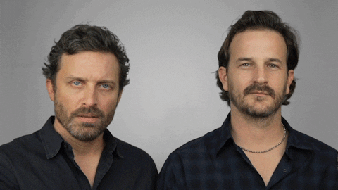

<style scoped>
ul > li:before {
    color: #1a81c2;
    vertical-align: middle;
    font-family: "Arial Black";
    font-weight: 900;
    margin-left: -.85em;
	}
	</style>


```{r style, echo = FALSE, results = 'asis'}
knitr::opts_chunk$set(
    eval=as.logical(Sys.getenv("KNITR_EVAL", "TRUE")),
    cache=as.logical(Sys.getenv("KNITR_CACHE", "TRUE")))
```

```{r setup, echo=FALSE}
suppressPackageStartupMessages({
    library(Biostrings)
    library(GenomicRanges)
    library(SummarizedExperiment)
    library(BSgenome)
    library(BSgenome.Hsapiens.UCSC.hg19)
    library(TxDb.Hsapiens.UCSC.hg19.knownGene)
    library(rtracklayer)
    library(GenomicAlignments)
})
```

## Introduction

<font size="3">
Started 2002 as a platform for understanding analysis of microarray
data

More than 1,741 packages. Domains of expertise:

- Sequencing (RNASeq, ChIPSeq, single-cell, called variants, ...)
- Microarrays (methylation, expression, copy number, ...)
- flow cytometry
- proteomics
- ...

Important themes

- Reproducible research
- Interoperability between packages & work kflows
- Usability

Resources

- https://bioconductor.org
- https://bioconductor.org/packages -- software, annotation, experiment, workflow
- https://support.bioconductor.org

</font>

## High-throughput sequence work flow

```{r, out.width = "90%", echo = FALSE}

knitr::include_graphics("lecture-02-figures/SequencingEcosystem.png")

```

## Genomic Sequences

```{r, out.width = "90%", out.height="75%", echo = FALSE}

knitr::include_graphics("lecture-02-figures/triplet_code.jpg")

```


## Genomic Sequences

[Biostrings][]

- _Valid_ data, e.g., alphabet
- 'Vector' interface: `length()`, `[`, ...
- Specialized operations, e.g,. `reverseComplement()`

Classes

- BString / BStringSet
- DNAString / DNAStringSet
- RNAString / RNAStringSet
- AAString / AAStringSet


## DNA Sequence Example

```{r}
library(Biostrings)

dna <- DNAStringSet(c("AAACTG", "CCCTTCAAC", "TACGAA"))
dna

length(dna)
dna[c(1, 3, 1)]
```

## DNA Sequence Example cont.

```{r}
width(dna)
as.character(dna[c(1,2)])
reverseComplement(dna)
```

```{r, fig.align='center', out.width = "20%", out.height="20%", echo = FALSE}

knitr::include_graphics("lecture-02-figures/biostrings.png")

```

## Importing Genomic Sequence

Import Methods from FASTA/FASTQ

- readBStringSet / readDNAStringSet / readRNAStringSet / readAAStringSet

```{r, out.width=100}
filepath1 <- system.file("extdata", "someORF.fa", package="Biostrings")
x1 <- readDNAStringSet(filepath1)
x1
```

## Importing Genomic Sequences

Utilizing [BSgenome][] Packages


BSgenome packages contain sequence information for a given
species/build. There are many such packages - you can get a listing
using `BiocManager::available("BSgenome")`

```{r, warning = FALSE}

library(BSgenome)
head(BiocManager::available("BSgenome"))

```

## BSgenome 

We can load and inspect a BSgenome package

```{r, warning = FALSE}

library(BSgenome.Hsapiens.UCSC.hg19)
BSgenome.Hsapiens.UCSC.hg19

```

## Subsetting a BSgenome

The main accessor is `getSeq`, and you can get data by sequence (e.g.,
entire chromosome or unplaced scaffold), or by
passing in a _GRanges_ object, to get just a region.

```{r, warning = FALSE}

getSeq(BSgenome.Hsapiens.UCSC.hg19, "chr1")

getSeq(BSgenome.Hsapiens.UCSC.hg19, GRanges("chr6:35310335-35395968"))
```

## What is a GRanges object?

```{r, out.width = "90%", out.height="75%", echo = FALSE}

knitr::include_graphics("lecture-02-figures/whatWhat.gif")

```
<font size=5> giphy.com </font>

## Genomic Ranges

[GenomicRanges][]

```{r, out.width = "90%", echo = FALSE}

knitr::include_graphics("lecture-02-figures/GRanges.png")

```

GenomicRanges objects allow for easy selection and subsection of data
based on genomic position information. 

## Where are GenomicRanges used?

Everywhere... 
<br>

- Data (e.g., aligned reads, called peaks, copy number)
- Annotations (e.g., genes, exons, transcripts, [TxDb][])
- Close relation to BED files (see `rtracklayer::import.bed()` and
  [HelloRanges][])
-  Anywhere there is Genomic positioning information 

<br>
<br>

Utility

- Also vector interface -- `length()`, `[`, etc.
- Tidyverse: [plyranges][]

## GenomicRanges

```{r}
library(GenomicRanges)
gr <- GRanges(c("chr1:100-120", "chr1:115-130"))
gr
gr <- GRanges(c("chr1:100-120", "chr1:115-130", "chr2:200-220"),
strand=c("+","+","-"), GC = seq(1, 0, length=3), id = paste0("id",1:3))
gr
```

There are lots of utility functions for _GRange_ objects

<font size="3"> Help! </font>
```{r, eval=FALSE}
methods(class="GRanges")
methods(class="GRangesList")
?"GRanges"
?"GRangesList"
```

## GRanges functions

Intra-range operations

- e.g., `shift()`, `narrow()`, `flank()`

Inter-range operations

- e.g., `reduce()`, `coverage()`, `gaps()`, `disjoin()`

Between-range operations

- e.g., `countOverlaps()`, `findOverlaps()`, `summarizeOverlaps()`

```{r, fig.align='center', out.width = "20%", out.height="20%", echo = FALSE}

knitr::include_graphics("lecture-02-figures/GenomicRangesSticker.png")

```

## GRanges Example
```{r}
shift(gr, 1)

reduce(gr)

anno <- GRanges(c("chr1:110-150", "chr2:150-210"))
countOverlaps(anno, gr)
```

## Lists of Genomic Ranges


```{r, out.width = "90%", echo = FALSE}

knitr::include_graphics("lecture-02-figures/GRangesList.png")

```
- e.g., exons-within-transcripts, alignments-within-reads


## More examples

Returning to BSGenome: Get the sequences for three UTR regions?
<font size=3>`threeUTRsByTranscript()` returns a GRangesList</font>

```{r}
library(TxDb.Hsapiens.UCSC.hg19.knownGene)
txdb <- TxDb.Hsapiens.UCSC.hg19.knownGene

threeUTR <-  threeUTRsByTranscript(txdb, use.names=TRUE)
threeUTR_seq <- extractTranscriptSeqs(Hsapiens, threeUTR)
options(showHeadLines = 3, showTailLines = 2)
threeUTR_seq
```

## More examples 
How many genes are between 2858473 and 3271812 on chr2 in the hg19 genome?
```{r}
gns <- genes(txdb)
gns[gns %over%  GRanges("chr2:2858473-3271812")]

## OR

subsetByOverlaps(gns, GRanges("chr2:2858473-3271812"))
```

## Importing a BED file

We said earlier, GRanges are closely related to bed files. Lets look at the 
example in the rtracklayer::import.bed help page:

```{r}
library(rtracklayer)
test_bed <- system.file(package = "rtracklayer", "tests", "test.bed")
test <- import(test_bed)
test
```

## Bed file continued

In fact this class _Extends_ the GenomicRange GRange class
```{r}
is(test, "GRanges")

```
So you can use GRange functions

```{r}
subsetByOverlaps(test, GRanges("chr7:127471197-127472368"))
```

## Side Note:

Utilizing Bioconductor recommended import/export methods, classes, etc.  has other benefits as well...

BED files have 0-based half-open intervals (left end point included, right endpoint 'after' the end of the range),

whereas in other parts of the bioinformatic community and in bioc the coordinates are 1-based and closed 

Using `import()` converts BED coordinates into bioc coordinates.

## Working with BAM files

```{r}
library(GenomicAlignments)
fls <- list.files(system.file("extdata", package="GenomicAlignments"),
                  recursive=TRUE, pattern="*bam$", full=TRUE)
names(fls) <- basename(fls)
bf <- BamFileList(fls, index=character(), yieldSize=1000)
genes <- GRanges(
    seqnames = rep(c("chr2L", "chr2R", "chr3L"), c(4, 5, 2)),
    ranges = IRanges(c(1000, 3000, 4000, 7000, 2000, 3000, 3600, 
                       4000, 7500, 5000, 5400), 
                     width=c(rep(500, 3), 600, 900, 500, 300, 900, 
                             300, 500, 500))) 
se <- summarizeOverlaps(genes, bf)
se
# Start differential expression analysis with the DESeq2 or edgeR
```

## What is a RangedSummarizedExperiment?

```{r, out.width = "90%", out.height="75%", echo = FALSE}

knitr::include_graphics("lecture-02-figures/overwhelmed.gif")

```
<font size=4>giphy.com</font>

## SummarizedExperiments
<font size="3">
SummarizedExperiment objects are popular objects for representing expression
data and other rectangular data (feature x sample data). Incoming packages are
now strongly recommended to use this class representation instead of
ExpressionSet.
</font>

```{r, out.width = "70%", echo = FALSE}

knitr::include_graphics("lecture-02-figures/subset.png")

```

<font size="3">
  three components:
  underlying 'matrix' 
  'row' annotations (genomic features) 
  'column' annotations (sample descriptions)
</font>

## ExpressionSet

```{r, out.width = "90%", out.height="75%", echo = FALSE}



```
<font size=4>giphy.com</font>

## Summarized Experiments

```{r, out.width = "70%", echo = FALSE}

knitr::include_graphics("lecture-02-figures/SummarizedExperiment.png")

```

## Components  1.

Main matrix of values / count data / expression values / etc ... 

```{r}
counts <- as.matrix(read.csv("lecture-02-data/airway_counts.csv", row.names=1))
head(counts, 3)

```

## Component 2. 

Sample data / Phenotypic data / Sample specific information / etc ... 

```{r}
colData <- read.csv("lecture-02-data/airway_colData.csv", row.names=1)
colData[, 1:4]
```

## Component 3. 

Genomic position information / Information about features / etc ... 

```{r}
rowRanges <- readRDS("lecture-02-data/airway_rowRanges.rds")
options(showHeadLines = 3, showTailLines = 2)
rowRanges
```

## Benefit of Containers


Could manipulate independently...

```{r, out.width="50%", out.height="50%"}
cidx <- colData$dex == "trt"
plot(
    rowMeans(1 + counts[, cidx]) ~ rowMeans(1 + counts[, !cidx]),
    log="xy"
)
```

- very fragile, e.g., what if `colData` rows had been re-ordered?


## SummarizedExperiment

Solution: coordinate in a single object -- [SummarizedExperiment][]

```{r, out.width="50%", out.height="50%"}
library(SummarizedExperiment)

se <- SummarizedExperiment(counts, rowRanges = rowRanges, colData = colData)
cidx <- se$dex == "trt"
plot(
    rowMeans(1 + assay(se)[, cidx]) ~ rowMeans(1 + assay(se)[, !cidx]),
    log="xy"
)
```


## Benefits 

- Much more robust to 'bookkeeping' errors
- matrix-like interface: `dim()`, two-dimensional `[`, ...
- accessors: `assay()`, `rowData()` / `rowRanges()`, `colData()`, ...

```{r}
dim(se)
colnames(se[1:2,3:4])
names(colData)
```

## Popular

Many package make use of or extend the ideas of SummarizedExperiment

  - SingleCellExpeirment
  - TimeSeriesExperiment
  - LoomExperiment
  - TreeSummarizedExperiment
  - MultiAssayExperiment


```{r, out.width = "20%", out.height="20%", echo = FALSE}

knitr::include_graphics("lecture-02-figures/SE.png")


knitr::include_graphics("lecture-02-figures/SCE.png")
```

## Help

In R: 

```{r, eval=FALSE}

methods(class="SummarizedExperiment")
?"SummarizedExperiment"
browseVignettes(package="SummarizedExperiment")

```

- Support site, https://support.bioconductor.org
- Bioc-devel,  bioc-devel@r-project.org

Website:  https://bioconductor.org

```{r, fig.align='center', out.width = "25%", out.height="25%", echo = FALSE}

knitr::include_graphics("lecture-02-figures/bioC.png")
```

[Biostrings]: https://bioconductor.org/packages/Biostrings
[BSgenome]: https://bioconductor.org/packages/BSgenome
[GenomicRanges]: https://bioconductor.org/packages/GenomicRanges
[HelloRanges]: https://bioconductor.org/packages/HelloRanges
[plyranges]: https://bioconductor.org/packages/plyranges
[TxDb]: https://bioconductor.org/packages/release/BiocViews.html#___TxDb
[SummarizedExperiment]: https://bioconductor.org/packages/SummarizedExperiment