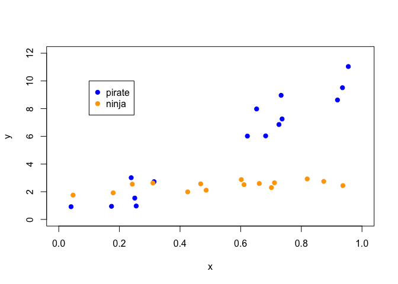
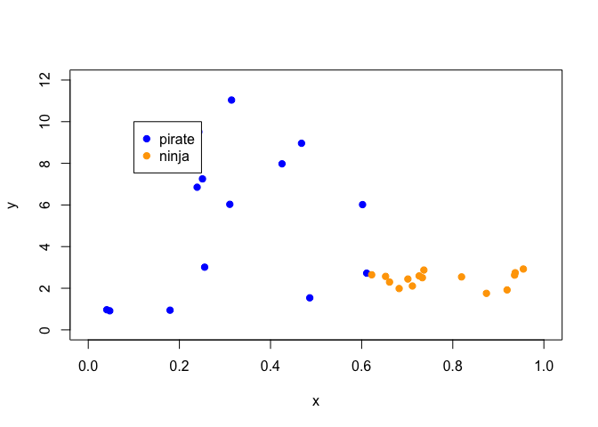
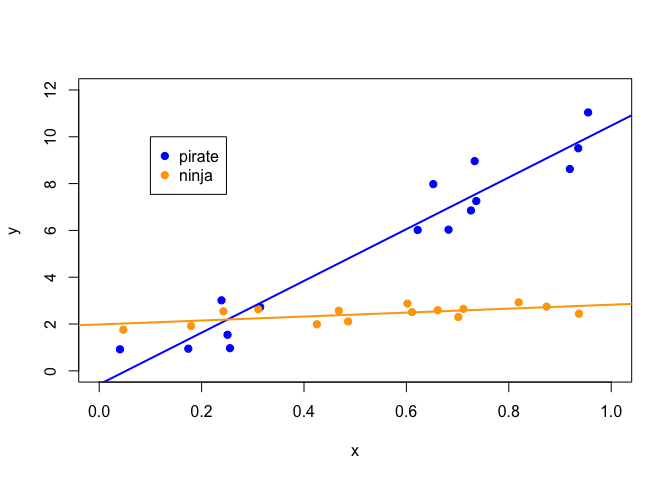
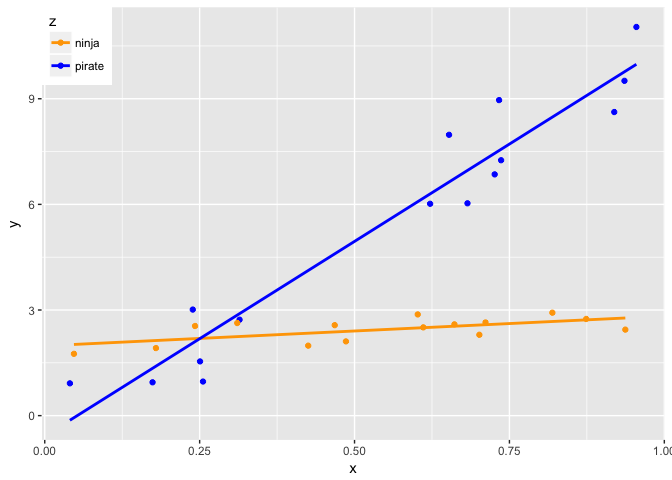

Learn to love the data frame
================
Jenny Bryan
2017-06-12

Let's make a random dataset, in a repeatable way.

``` r
set.seed(432)
```

If dataset = separate objects lying around the global environment. then dataset = just a state of mind

``` r
n <- 15
z <- rep(c("pirate", "ninja"), each = n)
x <- rep(runif(2 * n))
y <- ifelse(z == "pirate",
            0 + 10 * x + rnorm(n),
            2 + 1 * x + rnorm(n, sd = 0.3))
x
#>  [1] 0.25541255 0.04059619 0.91917321 0.17399523 0.72620473 0.93566938
#>  [7] 0.73654196 0.23890687 0.68228995 0.95488898 0.65253384 0.73329639
#> [13] 0.25063656 0.62198699 0.31441384 0.71140109 0.46804961 0.70144126
#> [19] 0.42523263 0.93705536 0.48611353 0.66121789 0.61101690 0.60201968
#> [25] 0.24257130 0.04712450 0.17947719 0.31063734 0.87390471 0.81929538
y
#>  [1]  0.9680962  0.9176334  8.6229245  0.9466420  6.8520662  9.5095919
#>  [7]  7.2541425  3.0122949  6.0306244 11.0386772  7.9761349  8.9621587
#> [13]  1.5399524  6.0168382  2.7247242  2.6460428  2.5695790  2.2965978
#> [19]  1.9871341  2.4431899  2.1087483  2.5928496  2.5070472  2.8743188
#> [25]  2.5458048  1.7551936  1.9192565  2.6305317  2.7457404  2.9239544
z
#>  [1] "pirate" "pirate" "pirate" "pirate" "pirate" "pirate" "pirate"
#>  [8] "pirate" "pirate" "pirate" "pirate" "pirate" "pirate" "pirate"
#> [15] "pirate" "ninja"  "ninja"  "ninja"  "ninja"  "ninja"  "ninja" 
#> [22] "ninja"  "ninja"  "ninja"  "ninja"  "ninja"  "ninja"  "ninja" 
#> [29] "ninja"  "ninja"
```

Talk me through this:

scatterplot plot of x vs y, with pirate points in blue, ninja in orange

``` r
plot(x, y, xlim = c(0, 1), ylim = c(0, 12), type = "n")
points(x[z == "pirate"], y[z == "pirate"], col = "blue", pch = 19)
points(x[z == "ninja"], y[z == "ninja"], col = "orange", pch = 19)
legend(x = 0.1, y = 10, c("pirate", "ninja"), col = c("blue", "orange"),
       pch = 19)
```



What if we want to fit a model to pirates and ninjas? And add fitted lines to plot? Talk me through this:

fit a model to pirates fit a model to ninjas add a line for pirate fit add a line for ninja fit

``` r
pirate_fit <- lm(y[z == "pirate"] ~ x[z == "pirate"])
ninja_fit <- lm(y[z == "ninja"] ~ x[z == "ninja"])
abline(pirate_fit, col = "blue", lwd = 2)
#> Error in int_abline(a = a, b = b, h = h, v = v, untf = untf, ...): plot.new has not been called yet
abline(ninja_fit, col = "orange", lwd = 2)
#> Error in int_abline(a = a, b = b, h = h, v = v, untf = untf, ...): plot.new has not been called yet
```

Talk me through this:

sort x from smallest to largest then re-use our plotting code

``` r
#x <- ???
#copy/paste the plotting code
```

What's gone wrong? How would I need to fix this?

``` r
x <- sort(x)

plot(x, y, xlim = c(0, 1), ylim = c(0, 12), type = "n")
points(x[z == "pirate"], y[z == "pirate"], col = "blue", pch = 19)
points(x[z == "ninja"], y[z == "ninja"], col = "orange", pch = 19)
legend(x = 0.1, y = 10, c("pirate", "ninja"), col = c("blue", "orange"),
       pch = 19)
```



BIG IDEA: Keep x, y, z together in a data frame Talk me through this: Starting from scratch... Get the same x, y, z into a data frame named df

``` r
set.seed(432)
n <- 15
df <- data.frame(
  z = rep(c("pirate", "ninja"), each = n),
  x = rep(runif(2 * n))
)
df$y <- ifelse(df$z == "pirate",
               0 + 10 * df$x + rnorm(n),
               2 + 1 * df$x + rnorm(n, sd = 0.3))
df
#>         z          x          y
#> 1  pirate 0.25541255  0.9680962
#> 2  pirate 0.04059619  0.9176334
#> 3  pirate 0.91917321  8.6229245
#> 4  pirate 0.17399523  0.9466420
#> 5  pirate 0.72620473  6.8520662
#> 6  pirate 0.93566938  9.5095919
#> 7  pirate 0.73654196  7.2541425
#> 8  pirate 0.23890687  3.0122949
#> 9  pirate 0.68228995  6.0306244
#> 10 pirate 0.95488898 11.0386772
#> 11 pirate 0.65253384  7.9761349
#> 12 pirate 0.73329639  8.9621587
#> 13 pirate 0.25063656  1.5399524
#> 14 pirate 0.62198699  6.0168382
#> 15 pirate 0.31441384  2.7247242
#> 16  ninja 0.71140109  2.6460428
#> 17  ninja 0.46804961  2.5695790
#> 18  ninja 0.70144126  2.2965978
#> 19  ninja 0.42523263  1.9871341
#> 20  ninja 0.93705536  2.4431899
#> 21  ninja 0.48611353  2.1087483
#> 22  ninja 0.66121789  2.5928496
#> 23  ninja 0.61101690  2.5070472
#> 24  ninja 0.60201968  2.8743188
#> 25  ninja 0.24257130  2.5458048
#> 26  ninja 0.04712450  1.7551936
#> 27  ninja 0.17947719  1.9192565
#> 28  ninja 0.31063734  2.6305317
#> 29  ninja 0.87390471  2.7457404
#> 30  ninja 0.81929538  2.9239544
class(df)
#> [1] "data.frame"
summary(df)
#>       z            x                y          
#>  ninja :15   Min.   :0.0406   Min.   : 0.9176  
#>  pirate:15   1st Qu.:0.2692   1st Qu.: 2.1557  
#>              Median :0.6165   Median : 2.6383  
#>              Mean   :0.5438   Mean   : 3.9640  
#>              3rd Qu.:0.7315   3rd Qu.: 6.0272  
#>              Max.   :0.9549   Max.   :11.0387
```

Let's remake our plot to make sure data looks same.

Let's take advantage of data = df.

``` r
plot(y ~ x, data = df, xlim = c(0, 1), ylim = c(0, 12), type = "n")
points(y ~ x, data = df, subset = z == "pirate", col = "blue", pch = 19)
points(y ~ x, data = df, subset = z == "ninja", col = "orange", pch = 19)
legend(x = 0.1, y = 10, c("pirate", "ninja"), col = c("blue", "orange"),
       pch = 19)
pirate_fit <- lm(y ~ x, data = df, subset = z == "pirate")
ninja_fit <- lm(y ~ x, data = df, subset = z == "ninja")
abline(pirate_fit, col = "blue", lwd = 2)
abline(ninja_fit, col = "orange", lwd = 2)
```


Let's revisit sorting by x.

``` r
df <- df[order(df$x), ]
plot(y ~ x, data = df, xlim = c(0, 1), ylim = c(0, 12), type = "n")
points(y ~ x, data = df, subset = z == "pirate", col = "blue", pch = 19)
points(y ~ x, data = df, subset = z == "ninja", col = "orange", pch = 19)
legend(x = 0.1, y = 10, c("pirate", "ninja"), col = c("blue", "orange"),
       pch = 19)
pirate_fit <- lm(y ~ x, data = df, subset = z == "pirate")
ninja_fit <- lm(y ~ x, data = df, subset = z == "ninja")
abline(pirate_fit, col = "blue", lwd = 2)
abline(ninja_fit, col = "orange", lwd = 2)
```



yes, looks the same! So we kept the variables "in sync". Lessons so far:

-   keeping vars in a data frame is **safer**
-   passing data frames to fxns let's you type less code

Go back to the slides here

``` r
library(tidyverse)
#> + ggplot2 2.2.1             Date: 2017-06-12
#> + tibble  1.3.3                R: 3.3.2
#> + tidyr   0.6.3               OS: OS X El Capitan 10.11.6
#> + readr   1.1.1              GUI: X11
#> + purrr   0.2.2.9000      Locale: en_CA.UTF-8
#> + dplyr   0.7.0               TZ: Europe/Rome
#> + stringr 1.2.0           
#> + forcats 0.2.0
#> Conflicts -----------------------------------------------------------------
#> * filter(),  from dplyr, masks stats::filter()
#> * lag(),     from dplyr, masks stats::lag()

set.seed(432)
n <- 15
df <- tibble(
  z = rep(c("pirate", "ninja"), each = n),
  x = rep(runif(2 * n)),
  y = ifelse(z == "pirate",
             0 + 10 * x + rnorm(n),
             2 + 1 * x + rnorm(n, sd = 0.3))
)
df
#> # A tibble: 30 x 3
#>         z          x          y
#>     <chr>      <dbl>      <dbl>
#>  1 pirate 0.25541255  0.9680962
#>  2 pirate 0.04059619  0.9176334
#>  3 pirate 0.91917321  8.6229245
#>  4 pirate 0.17399523  0.9466420
#>  5 pirate 0.72620473  6.8520662
#>  6 pirate 0.93566938  9.5095919
#>  7 pirate 0.73654196  7.2541425
#>  8 pirate 0.23890687  3.0122949
#>  9 pirate 0.68228995  6.0306244
#> 10 pirate 0.95488898 11.0386772
#> # ... with 20 more rows
class(df)
#> [1] "tbl_df"     "tbl"        "data.frame"
summary(df)
#>       z                   x                y          
#>  Length:30          Min.   :0.0406   Min.   : 0.9176  
#>  Class :character   1st Qu.:0.2692   1st Qu.: 2.1557  
#>  Mode  :character   Median :0.6165   Median : 2.6383  
#>                     Mean   :0.5438   Mean   : 3.9640  
#>                     3rd Qu.:0.7315   3rd Qu.: 6.0272  
#>                     Max.   :0.9549   Max.   :11.0387

pn_colors <- c(pirate = "blue", ninja = "orange")

ggplot(df, aes(x, y, colour = z)) +
  geom_point() +
  geom_smooth(method = "lm", se = FALSE) +
  scale_color_manual(values = pn_colors) +
  theme(legend.justification = c(0,1), legend.position = c(0,1))
```



Let's revisit sorting by x.

``` r
df <- arrange(df, x)
head(df)
#> # A tibble: 6 x 3
#>        z          x         y
#>    <chr>      <dbl>     <dbl>
#> 1 pirate 0.04059619 0.9176334
#> 2  ninja 0.04712450 1.7551936
#> 3 pirate 0.17399523 0.9466420
#> 4  ninja 0.17947719 1.9192565
#> 5 pirate 0.23890687 3.0122949
#> 6  ninja 0.24257130 2.5458048
tail(df)
#> # A tibble: 6 x 3
#>        z         x         y
#>    <chr>     <dbl>     <dbl>
#> 1  ninja 0.8192954  2.923954
#> 2  ninja 0.8739047  2.745740
#> 3 pirate 0.9191732  8.622925
#> 4 pirate 0.9356694  9.509592
#> 5  ninja 0.9370554  2.443190
#> 6 pirate 0.9548890 11.038677
## resubmit the ggplot code as a visual check all is well
```

More lessons:

-   tbl\_df or "tibble" is a variant of the data frame
-   various annoying or arguably unsafe things about data frames have been eliminated
-   tidyverse packages
    -   use tibbles
    -   obey common conventions and principles about interface

Go back to the slides here
