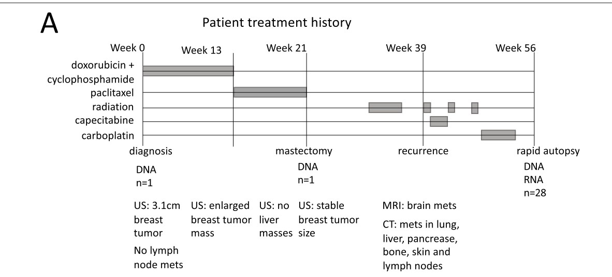
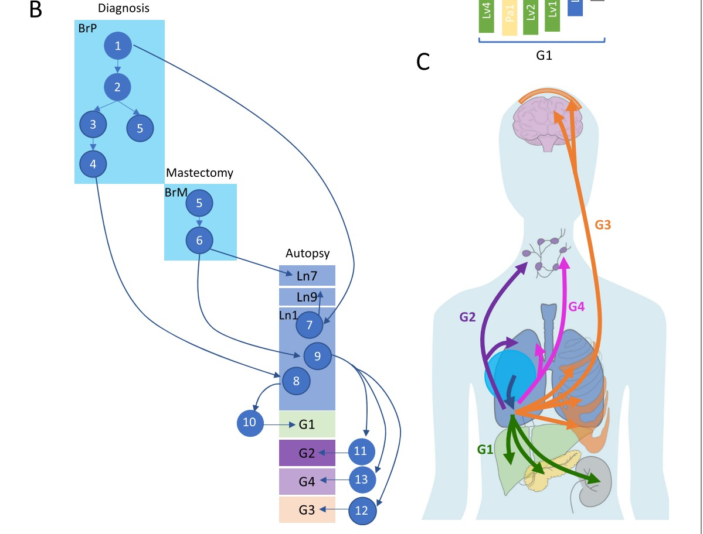

# Road map

- Exploring a cluster analysis of copy-number aberration measures in 28 tumors from one patient
    - interactive heatmap
    - comparing Euclidean and correlation (1-cor) distances
    - comparing agglomeration methods
    - the silhouette as a measure of clustering adequacy
    - the bluster tools for cluster diagnostics
- bluster applied to scRNA-seq
    - Grun pancreas data
    - NNGraphParam

Acquire the csamaDist package via `BiocManager::install("vjcitn/csamaDist")`.

# Quick review of correlation interpretation: Anscombe's quartet

```{r ansc,echo=FALSE,message=FALSE,results="hide"}
require(stats); require(graphics)
     summary(anscombe)
     
     ##-- now some "magic" to do the 4 regressions in a loop:
     ff <- y ~ x
     mods <- setNames(as.list(1:4), paste0("lm", 1:4))
     for(i in 1:4) {
       ff[2:3] <- lapply(paste0(c("y","x"), i), as.name)
       ## or   ff[[2]] <- as.name(paste0("y", i))
       ##      ff[[3]] <- as.name(paste0("x", i))
       mods[[i]] <- lmi <- lm(ff, data = anscombe)
     }
     
     ## See how close they are (numerically!)
     sapply(mods, coef)
     lapply(mods, function(fm) coef(summary(fm)))
```
```{r cont,echo=FALSE,message=FALSE}
     op <- par(mfrow = c(2, 2), mar = 0.1+c(4,4,1,1), oma =  c(0, 0, 2, 0))
     for(i in 1:4) {
       ff[2:3] <- lapply(paste0(c("y","x"), i), as.name)
       plot(ff, data = anscombe, col = "red", pch = 21, bg = "orange", cex = 1.2,
            xlim = c(3, 19), ylim = c(3, 13))
       abline(mods[[i]], col = "blue")
     }
     mtext("Anscombe's 4 Regression data sets", outer = TRUE, cex = 1.5)
     par(op)
```

# Application: inferring steps in tumor metastasis in a breast cancer patient

We'll examine data distributed with a [2021 Genome Biology paper](https://genomemedicine.biomedcentral.com/articles/10.1186/s13073-021-00989-6) from the Gabor Marth lab.



Here US denotes ultrasound.




## A view of copy number aberrations for 1Mb tiling

28 tumors were sampled and sequenced in a rapid autopsy procedure.  Copy number
variation was assessed using [FACETS](https://www.ncbi.nlm.nih.gov/pmc/articles/PMC5027494/).

The tissues from which tumors were taken are Br (Breast), Bo (Bone), Bn (Brain),
Ln (Lung), Lv (Liver), Pa (Pancreas), Ly (Lymph nodes), Kd (Kidney)

<a href="cnv-heatmap.html">A plotly-based visualization</a>

The (vertical) ordering of tissues is chosen to exemplify certain similarities.

For example the block of blue on chr10 is seen for only three samples.
This is an indication of a deletion.

## A cluster analysis proposed in support of the evolutionary map

This code is lightly modified from a script distributed at 
https://github.com/xiaomengh/tumor-evo-rapid-autopsy.git.

```{r doclus,message=FALSE}
suppressPackageStartupMessages({
 library(csamaDist)
 library(bioDist)
 library(bluster)
 library(cluster)
 library(scater)
 library(scran)
 library(scRNAseq)
 library(scuttle)
})
data(cnv_log_R)
data = cnv_log_R
samples = c('Ln7','Ln9','Ln1','BrM','BrP',
           'Ln11','Ly2','Ln3',
           'Bo3','Ln10','Bo1','Ln8','Lv3','Ln5','Bo2','Bn2','Bn1','Bn3','Bn4','Ln2',
           'Ly1','Ln6',
           'Kd1','Ln4','Lv4','Lv2','Lv1','Pa1')
rownames(data) = samples
d = dist(data, method="euclidean")
fit = hclust(d, method="average")
# the following line changes the order of the samples to produce the Fig.S3B but doesn't change the phylogenetic relationship
fit$order = c(1,4,2,5,3,13,10,20,16,11,12,15,9,17,19,14,18,21,22,7,6,8,25,27,26,28,23,24)
plot(fit)
```

## Drilling down on the clustering

### Comparing Euclidean and Correlation distances

Here is a very elementary visualization.
```{r dodists}
cd = cor.dist(cnv_log_R) # from bioDist
ed = dist(cnv_log_R)
plot(as.numeric(ed), as.numeric(cd), 
    xlab="All pairwise Euclidean distances", ylab="All pairwise correlation distances")
```

We add interactive "tooltips" to the points to permit identification of
tissue sample pairs corresponding to each point.

```{r doply,message=FALSE}
library(combinat)
library(ggplot2)
library(plotly)
cdn = attr(cd, "Labels")
c2 = combn(cdn,2)  
cdnn = data.frame(v1=c2[1,], v2=c2[2,], cordist=as.numeric(cd), eucdist=as.numeric(ed))
pl1 = ggplot(cdnn, aes(x=eucdist, y=cordist, text=paste(v1,v2,sep=":"))) + geom_point()
ggplotly(pl1)
```


For a given correlation distance value, there can be wide variation in euclidean distance,
and vice versa.

Open question: What distance metric is most relevant for biological interpretation of CNV?

### A pair with discrepant correlation and euclidean distance values (over entire genome)

The Ln1:Ly1 pair has a large euclidean distance but a relatively small correlation distance.

We'll have a look at the first 100Mb on chr1.
```{r lk1mb}
plot(cnv_log_R["Ly1",1:100],pch=19, main="chr1, first 100Mb", ylab="FACETS CNV log R", xlab="chr1")
points(cnv_log_R["Ln1",1:100], col="red",pch=19)
legend(60, -.5, pch=19, col=c("black", "red"), legend=c("Ly1", "Ln1"))
#cor(cnv_log_R["Ly1", 1:100], cnv_log_R["Ln1", 1:100])
edist = function(x,y) sqrt(sum((x-y)^2))
edist(cnv_log_R["Ly1", 1:100], cnv_log_R["Ln1", 1:100])
plot(jitter(cnv_log_R["Ly1", 1:100]), cnv_log_R["Ln1", 1:100], xlab="Ly1", ylab="Ln1")
abline(0,1)
```

### Redo clustering with alternative distance and agglomeration method
```{r redo}
fit2 = hclust(cd, method="ward.D2")
plot(fit2)
abline(h=.3, lty=2)
```

### Silhouette measure
 
From ?silhouette with the cluster library:

```
For each observation i, the _silhouette width_ s(i) is defined as follows:

     Put a(i) = average dissimilarity between i and all other points of
     the cluster to which i belongs (if i is the _only_ observation in
     its cluster, s(i) := 0 without further calculations).  For all
     _other_ clusters C, put d(i,C) = average dissimilarity of i to all
     observations of C.  The smallest of these d(i,C) is b(i) := \min_C
     d(i,C), and can be seen as the dissimilarity between i and its
     "neighbor" cluster, i.e., the nearest one to which it does _not_
     belong.  Finally,

                   s(i) := ( b(i) - a(i) ) / max( a(i), b(i) ).         
     
     'silhouette.default()' is now based on C code donated by Romain
     Francois (the R version being still available as
     'cluster:::silhouette.default.R').

     Observations with a large s(i) (almost 1) are very well clustered,
     a small s(i) (around 0) means that the observation lies between
     two clusters, and observations with a negative s(i) are probably
     placed in the wrong cluster.
```

```{r init}
ct1 = cutree(fit2, h=.3)
c2 = cnv_log_R
rownames(c2) = paste(rownames(c2), as.numeric(ct1))
sil = silhouette(ct1, cd)
plot(sil)
```

# Clustering single cell RNA-seq

This code is taken verbatim from the bluster "diagnostics" vignette.

## Acquire Grun et al's single cell RNA-seq dataset

[Grun 2016] (https://www.sciencedirect.com/science/article/pii/S1934590916300947)
define an algorithm,
StemID, that infers candidate multipotent cell populations in the human pancreas.

```{r getdatetc,cache=TRUE}
library(scRNAseq)
sce <- GrunPancreasData()

# Quality control to remove bad cells.
library(scuttle)
qcstats <- perCellQCMetrics(sce)
qcfilter <- quickPerCellQC(qcstats, sub.fields="altexps_ERCC_percent")
sce <- sce[,!qcfilter$discard]

# Normalization by library size.
sce <- logNormCounts(sce)

# Feature selection.
library(scran)
dec <- modelGeneVar(sce)
hvgs <- getTopHVGs(dec, n=1000)

# Dimensionality reduction.
set.seed(1000)
library(scater)
sce <- runPCA(sce, ncomponents=20, subset_row=hvgs)
sce <- runTSNE(sce, subset_row=hvgs)
```

## Clustering using a nearest-neighbor graph; visualization via TSNE and PCA

From bluster's makeSNNGraph help page

```
   The 'makeSNNGraph' function builds a shared nearest-neighbour
   graph using observations as nodes. For each observation, its 'k'
   nearest neighbours are identified using the 'findKNN' function,
   based on distances between their expression profiles (Euclidean by
   default). An edge is drawn between all pairs of observations that
   share at least one neighbour, weighted by the characteristics of
   the shared nearest neighbors - see "Weighting Schemes" below.

   The aim is to use the SNN graph to perform clustering of
   observations via community detection algorithms in the 'igraph'
   package. This is faster and more memory efficient than
   hierarchical clustering for large numbers of observations. In
   particular, it avoids the need to construct a distance matrix for
   all pairs of observations. Only the identities of nearest
   neighbours are required, which can be obtained quickly with
   methods in the 'BiocNeighbors' package.
```


```{r graphclust}
library(bluster)
mat <- reducedDim(sce)
clust.info <- clusterRows(mat, NNGraphParam(), full=TRUE)
clusters <- clust.info$clusters
table(clusters)
plot(reducedDims(sce)$TSNE, col=clusters, pch=19, main="TSNE")
plot(reducedDims(sce)$PCA, col=clusters, pch=19, main="PCA")
pairs(reducedDims(sce)$PCA[,1:4], col=clusters, pch=19, main="PCA")
```

## Assessment via pairwiseModularity

```{r dopairw}
g <- clust.info$objects$graph
ratio <- pairwiseModularity(g, clusters, as.ratio=TRUE)

cluster.gr <- igraph::graph_from_adjacency_matrix(log2(ratio+1), 
    mode="upper", weighted=TRUE, diag=FALSE)

# Increasing the weight to increase the visibility of the lines.
set.seed(1100101)
plot(cluster.gr, edge.width=igraph::E(cluster.gr)$weight*5,
    layout=igraph::layout_with_lgl)
```

