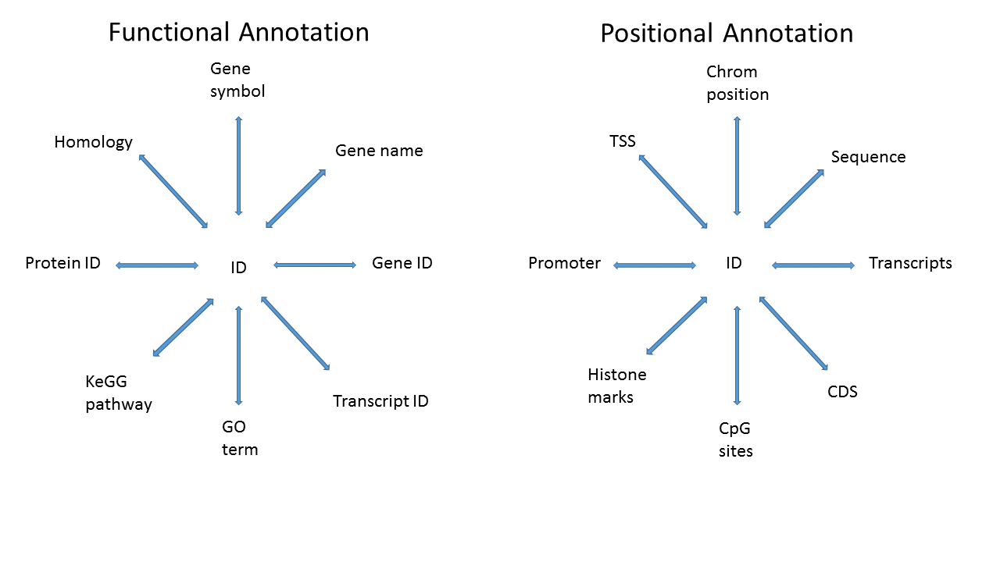

<style scoped>
ul > li:before {
    color: #1a81c2;
    vertical-align: middle;
    font-family: "Arial Black";
    font-weight: 900;
    margin-left: -.85em;
	}
	</style>


```{r setup, echo=FALSE}
suppressPackageStartupMessages({
    library(hugene20sttranscriptcluster.db)
    library(org.Hs.eg.db)
    library(TxDb.Hsapiens.UCSC.hg19.knownGene)
    library(Homo.sapiens)
    library(BSgenome)
    library(BSgenome.Hsapiens.UCSC.hg19)
    library(AnnotationHub)
    library(AnnotationDbi)
    library(Organism.dplyr)
    library(biomaRt)
    library(airway)
})
```


## Description

There are various annotation packages provided by the Bioconductor project that can be used to incorporate additional information to results from high-throughput experiments. This can be as simple as mapping Ensembl IDs to corresponding HUGO gene symbols, to much more complex queries involving multiple data sources. We will briefly cover the various classes of annotation packages, what they contain, and how to use them efficiently. 


## Task

1. Start with set of identifers that are measured

2. Map to new identifiers. 

   Why: 

  * more familiar to collaborators
  * can be used for further analyses. 
  
As an example, RNA-Seq data may only have Entrez Gene IDs for each gene measured, and as part of the output you may want to include the gene symbols, which are more likely to be familiar to a Biologist.


## What do we mean by annotation?

Map a known ID to other functional or positional information

```{r, out.width = "75%", echo = FALSE}



```

## Annotation sources

```{r, results = "asis", echo = FALSE, warning = FALSE}

df <- data.frame("Package type" = c("OrgDb","TxDb/EnsDb","OrganismDb","BSgenome","Others","AnnotationHub","biomaRt", "ChipDb"),
		 Example = c("org.Hs.eg.db","TxDb.Hsapiens.UCSC.hg19.knownGene; EnsDb.Hsapiens.v75",
			     "Homo.sapiens","BSgenome.Hsapiens.UCSC.hg19","GO.db", "Online resource","Online resource","hugene20sttranscriptcluster.db"), check.names = FALSE)
knitr::kable(df)

```


## Interacting with AnnoDb packages

The main function is `select`:

AnnotationDbi::select(*annopkg*, *keys*, *columns*, *keytype*)

Where

* annopkg is the annotation package

* keys are the IDs that we **know**

* columns are the values we **want**

* keytype is the type of key used
    + if the keytype is the **central** key, it can remain unspecified

help:  `?AnnotationDbi::select`<br>
other useful functions: `columns`, `keytypes`, `mapIds`


## Simple Example

The data in the airway package is a RangedSummarizedExperiment constructed from an RNA-Seq experiment. Let map the ensembl gene
identifiers to gene symbol. 

```{r, warning=FALSE}

library(airway)
library(org.Hs.eg.db)
data(airway)
ids = head(rownames(airway))
ids
select(org.Hs.eg.db, ids, "SYMBOL", "ENSEMBL")
```

## Questions!

How do you know what the central keys are?

* If it's a ChipDb, the central key are the manufacturer's probe IDs

* It's sometimes in the name - org.Hs.eg.db, where 'eg' means Entrez
  Gene ID

* You can see examples using e.g., head(keys(*annopkg*)), and infer
  from that

* But note that it's never necessary to know the central key, as long
  as you specify the keytype

## More questions!

What keytypes or columns are available for a given annotation package?

```{r, warning = FALSE}
library(org.Hs.eg.db)
keytypes(org.Hs.eg.db)
columns(org.Hs.eg.db)
```
## Another example

There is one issue with `select` however.

```{r, warning = FALSE}

brca <- c("BRCA1", "BRCA2")
select(org.Hs.eg.db, brca, c("MAP", "ONTOLOGY"), "SYMBOL")

```

```{r, fig.align='center', out.width = "25%", out.height="25%", echo = FALSE}


```

## The `mapIds` function
<font size=3.5>
An alternative to `select` is `mapIds`, which gives control of
duplicates

* Same arguments as `select` with slight differences

    - The columns argument can only specify one column

    - The keytype argument **must** be specified

    - An additional argument, multiVals used to control duplicates
</font>
```{r, warning = FALSE}

mapIds(org.Hs.eg.db, brca, "ONTOLOGY", "SYMBOL")

```
```{r, fig.align='center', out.width = "25%", out.height="25%", echo = FALSE}

knitr::include_graphics("lecture-08-figures/WheresTheRest.jpeg")

```

## Choices for multiVals

Default is `first`, where we just choose the first of the
duplicates. Other choices are `list`, `CharacterList`, `filter`,
`asNA` or a user-specified function.

```{r, warning = FALSE}

mapIds(org.Hs.eg.db, brca, "ONTOLOGY", "SYMBOL", multiVals = "list")

mapIds(org.Hs.eg.db, brca, "ONTOLOGY", "SYMBOL", multiVals = "CharacterList")
```

## What about positional annotation? 

```{r, out.width = "90%", out.height="75%", echo = FALSE}


```


## TxDb packages

TxDb packages contain positional information; the contents can be
inferred by the package name

**TxDb.Species.Source.Build.Table**

* TxDb.Hsapiens.UCSC.hg19.knownGene

	- *Homo sapiens*

	- UCSC genome browser

	- hg19 (their version of GRCh37)

	- knownGene table

TxDb.Dmelanogaster.UCSC.dm3.ensGene
TxDb.Athaliana.BioMart.plantsmart22


## Transcript packages

As with ChipDb and OrgDb packages, `select` and `mapIds` can be used
to make queries

```{r, warning = FALSE}
library(TxDb.Hsapiens.UCSC.hg19.knownGene)
columns(TxDb.Hsapiens.UCSC.hg19.knownGene)
select(TxDb.Hsapiens.UCSC.hg19.knownGene, c("1","10"),
       c("TXNAME","TXCHROM","TXSTART","TXEND"), "GENEID")

```

## But using `select` and `mapIds` are not how one normally uses TxDb objects...

```{r, out.width = "90%", out.height="75%", echo = FALSE}

knitr::include_graphics("lecture-08-figures/wait.gif")

```
<font size=4>giphy.com</font>

## GRanges
<font size=4>

The normal use case for transcript packages is to extract positional information into a `GRanges` or `GRangesList` object. 

Positional information can be extracted for `transcripts()`, `genes()`, coding sequences `cds()`, `promoters()`  and `exons()`.

An example is the genomic position of all genes:

```{r, warning = FALSE}

gns <- genes(TxDb.Hsapiens.UCSC.hg19.knownGene)
gns

```
</font>

## GRangesList

<font size=4>
Or the genomic position of all transcripts **by** gene:

```{r, warning = FALSE, size="tiny"}
txs <- transcriptsBy(TxDb.Hsapiens.UCSC.hg19.knownGene, by="gene")
txs
```
</font>

## GRangesList

These **by** functions group based on another type of genomic features
<br><font size=3>help: `?GenomicFeatures::cdsBy`</font>

```{r}
cds <- cdsBy(TxDb.Hsapiens.UCSC.hg19.knownGene, "tx", use.names=TRUE)
head(names(cds))
cds["uc009vjk.2"]
```


## Why *Ranges objects

<font size=4>

The main rationale for *Ranges objects is to allow us to easily select and subset data based on genomic position information. This is really powerful!

`GRanges` and `GRangesLists` act like vectors and lists, and can be subsetted using the `[` or `[[` function. As a really artificial example:

```{r, warning = FALSE}

txs[txs %over% gns[1]]

```
</font>

## Another Example

Earlier we got the coding sequence regions by transcripts using cdsBy. This can be used in conjunction with the appropriate `BSgenome` package to extract the transcript sequences

```{r}
# Lets do this for the first two transcripts
library(BSgenome.Hsapiens.UCSC.hg19)
seq_cds <- extractTranscriptSeqs(BSgenome.Hsapiens.UCSC.hg19, cds[1:2])
seq_cds
```

We can then translate the sequences using Biostrings::translate

```{r}
translate(seq_cds)
```

## It's so complicated? What if you want both?!

```{r, out.width = "90%", out.height="75%", echo = FALSE}

knitr::include_graphics("lecture-08-figures/NoIdea.jpeg")

```


## Organism.dplyr package

* Combines the data from TxDb, Org.Db, GO.db associated packages into local database.

* Allows functions from both _org.\*_ and _TxDb.\*_
    - `keytypes()`, `select()`, ...
    - `exons()`, `promoters()`, ...

* Allows for filtering and display of combined TxDb and Org.Db information
  through `dplyr` functions.

```{r, warning = FALSE}
library(Organism.dplyr)

# src = src_organism("TxDb.Hsapiens.UCSC.hg19.knownGene")
# ?src_organism
src <- src_organism(dbpath = hg38light())
src
```

## Organism.dplyr 

Get promoters from a TxDb object (we use a small version)

```{r, warning = FALSE, out.width=100}
prm = promoters(src)
head(prm, 3)
length(prm)

```

## Organism.dplyr 

Extract a table from the underlying database

```{r, warning = FALSE}

tbl(src, "id")

```

## Organism.dplyr

Make a complex query between tables in the underlying database

```{r, warning = FALSE}

inner_join(tbl(src, "id"), tbl(src, "ranges_gene")) %>%
		    dplyr::filter(symbol %in% c("ADA", "NAT2")) %>%
		    dplyr::select(gene_chrom, gene_start, gene_end,
		    gene_strand, symbol, alias, map)

```

## What about sequences?

```{r, out.width = "90%", out.height="50%", echo = FALSE}

knitr::include_graphics("lecture-08-figures/ACTG.jpg")

```


## BSgenome packages

BSgenome packages contain sequence information for a given
species/build. There are many such packages - you can get a listing using
`available.genomes` or `BiocManager::available`

```{r, warning = FALSE}

library(BSgenome)
head(BiocManager::available("BSgenome"))

```
## BSgenome packages

We can load and inspect a BSgenome package

```{r, warning = FALSE}

library(BSgenome.Hsapiens.UCSC.hg19)
Hsapiens

```

## Deja vu? 

```{r, out.width = "90%", out.height="65%", echo = FALSE}


```
<font size=4>giphy.com</font>

## BSgenome packages

The main accessor is `getSeq`, and you can get data by sequence (e.g.,
entire chromosome or unplaced scaffold), or by
passing in a GRanges object, to get just a region.

```{r, warning = FALSE}

getSeq(Hsapiens, "chr1")
getSeq(Hsapiens, gns["5467",])


```
The Biostrings package contains most of the code for dealing with
these `*StringSet` objects - please see the Biostrings vignettes and help pages for more information.

## Web based resources

```{r, out.width = "90%", out.height="75%", echo = FALSE}

knitr::include_graphics("lecture-08-figures/web.gif")

```
<font size=4>giphy.com</font>


## AnnotationHub

AnnotationHub is a package that allows us to query and download many different annotation objects, without having to explicitly install them.

<br>

We will talk more about AnnotationHub when we talk about BiocFileCache and Bioconductor Hubs in a different lecture. 

```{r, out.width = "25%", out.height="25%", echo = FALSE}

knitr::include_graphics("lecture-08-figures/BFC.png")

knitr::include_graphics("lecture-08-figures/EH.png")
```

## biomaRt

The biomaRt package allows queries to an Ensembl Biomart server. We
can see the choices of servers that we can use:

```{r, warning = FALSE}

library(biomaRt)
listMarts()

```
## biomaRt data sets

And we can then check for the available data sets on a particular
server.

```{r, warning = FALSE}

mart <- useMart("ENSEMBL_MART_ENSEMBL")
head(listDatasets(mart))

```
## biomaRt queries

After setting up a `mart` object pointing to the server and data set
that we care about, we can make queries. We first set up the `mart` object.

```{r, warning = FALSE}

mart <- useMart("ENSEMBL_MART_ENSEMBL","hsapiens_gene_ensembl")

```
Queries are of the form

getBM(*attributes*, *filters*, *values*, *mart*)

where

* attributes are the things we **want**

* filters are the *types of* IDs we **have**

* values are the IDs we **have**

* mart is the `mart` object we set up

## biomaRt attributes and filters

Both attributes and filters have rather inscrutable names, but a
listing can be accessed using

```{r, warning = FALSE}

atrib <- listAttributes(mart)
filts <- listFilters(mart)
head(atrib)
head(filts)

```

## biomaRt query

A simple example query

```{r, warning = FALSE}

afyids <- c("1000_at","1001_at","1002_f_at","1007_s_at")
getBM(c("affy_hg_u95av2", "hgnc_symbol"), c("affy_hg_u95av2"), afyids, mart)

```


## biomaRt

Current maintainer:  Mike Smith

```{r, fig.align='center', out.width = "25%", out.height="25%", echo = FALSE}

knitr::include_graphics("lecture-08-figures/biomart.png")

```

## Other: 

Johannes Rainer
<br>
ensembldb/EnsDb

```{r, fig.align='center', out.width = "25%", out.height="25%", echo = FALSE}

knitr::include_graphics("lecture-08-figures/ensemblDB.png")

```