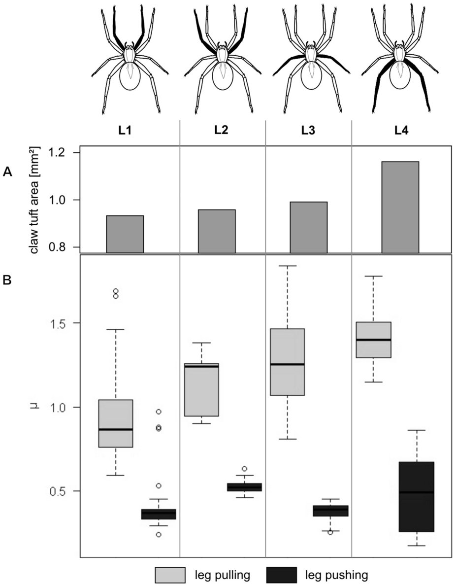
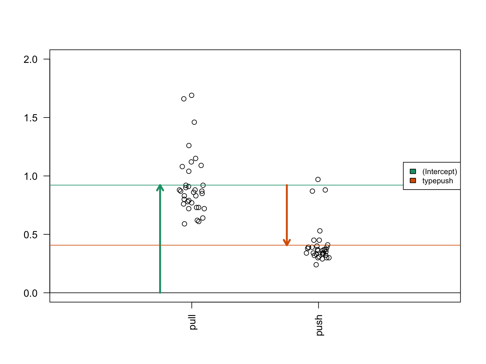

---
title: "Introduction to Linear Models"
author: "Levi Waldron, CUNY School of Public Health"
date: "June 14, 2017"
output:
  slidy_presentation: null
  ioslides_presentation: default
---

## Outline for Introduction to Linear Models

* Multiple linear regression
    + Continuous and categorical predictors
    + Interactions
* Model formulae
* Design matrix
* Generalized Linear Models
    + Linear, logistic, log-Linear links
    + Poisson, Negative Binomial error distributions
    + Zero inflation

Based on:

1. Love and Irizarry, [Data Analysis for the Life Sciences](https://leanpub.com/dataanalysisforthelifesciences), Chapter 5
2. Vittinghoff E, Glidden DV, Shiboski SC, McCulloch CE. Regression Methods in Biostatistics: Linear, Logistic, Survival, and Repeated Measures Models (Statistics for Biology and Health). Springer; 2005.

# Introduction to Linear Models

## Example: friction of spider legs

* Wolff & Gorb, [Radial arrangement of Janus-like setae permits friction control in spiders](http://www.nature.com/articles/srep01101), *Sci. Rep.* 2013.

<div class="columns-2">
<center>  </center>

- **(A)** Barplot showing total claw tuft area of the corresponding legs. 
- **(B)** Boxplot presenting friction coefficient data illustrating median, interquartile range and extreme values.
</div>

## Example: friction of spider legs

<div class="columns-2">
<center>  </center>

- Are the pulling and pushing friction coefficients different?
- Are the friction coefficients different for the different leg pairs?
- Does the difference between pulling and pushing friction coefficients vary by leg pair?
</div>


## Example: friction of spider legs


```r
table(spider$leg,spider$type)
```

```
##     
##      pull push
##   L1   34   34
##   L2   15   15
##   L3   52   52
##   L4   40   40
```

```r
summary(spider)
```

```
##  leg        type        friction     
##  L1: 68   pull:141   Min.   :0.1700  
##  L2: 30   push:141   1st Qu.:0.3900  
##  L3:104              Median :0.7600  
##  L4: 80              Mean   :0.8217  
##                      3rd Qu.:1.2400  
##                      Max.   :1.8400
```


## What are linear models?

- Linear models model a response variable $Y_i$ as a linear combination of predictors, plus randomly distributed noise.
- A common use case is where $Y_i$ are log-transformed microarray data
    + predictors are treatment vs. control, male vs. female, amount of exposure, etc

## Multiple linear regression model

- Linear models can have any number of predictors
- Systematic part of model:

$$
E[y|x] = \beta_0 + \beta_1 x_1 + \beta_2 x_2 + ... + \beta_p x_p
$$

- $E[y|x]$ is the expected value of $y$ given $x$
- $y$ is the outcome, response, or dependent variable
- $x$ is the vector of predictors / independent variables 
- $x_p$ are the individual predictors or independent variables
- $\beta_p$ are the regression coefficients

## Multiple linear regression model

Systematic plus random components of model:

$y_i = E[y_i|x_i] + \epsilon_i$

Assumptions of linear models: $\epsilon_i \stackrel{iid}{\sim} N(0, \sigma_\epsilon^2)$

* Normal distribution
* Mean zero at every value of predictors
* Constant variance at every value of predictors
* Values that are statistically independent

## Continuous predictors

* **Coding:** as-is, or may be scaled to unit variance (which results in _adjusted_ regression coefficients)
* **Interpretation for linear regression:** An increase of one unit of the predictor results in this much difference in the continuous outcome variable

## Binary predictors (2 levels)

* **Coding:** indicator or dummy variable (0-1 coding)
* **Interpretation for linear regression:** the increase or decrease in average outcome levels in the group coded “1”, compared to the reference category (“0”)
   + _e.g._ $E(y|x) = \beta_0 + \beta_1 x$ 
   + where x={ 1 if push friction, 0 if pull friction }

## Multilevel categorical predictors (ordinal or nominal)

* **Coding:** $K-1$ dummy variables for $K$-level categorical variable
* Comparisons with respect to a reference category, *e.g.* `L1`:
    * `L2`={1 if $2^{nd}$ leg pair, 0 otherwise}, 
    * `L3`={1 if $3^{nd}$ leg pair, 0 otherwise}, 
    * `L4`={1 if $4^{th}$ leg pair, 0 otherwise}.

- R re-codes factors to dummy variables automatically. 
- Note that factors can be *ordered* or *unordered*

# Model formulae in R

## Model formulae in R

[Model formulae tutorial](http://ww2.coastal.edu/kingw/statistics/R-tutorials/formulae.html)

* regression functions in R such as `aov()`, `lm()`, `glm()`, and `coxph()` use a "model formula" interface.
* The formula determines the model that will be built (and tested) by the R procedure. The basic format is:

`> response variable ~ explanatory variables`

* The tilde means "is modeled by" or "is modeled as a function of." 

## Regression with a single predictor

Model formula for simple linear regression: 

`> y ~ x`

* where "x" is the explanatory (independent) variable
* "y" is the response (dependent) variable. 

## Return to the spider legs

Friction coefficient for leg type of first leg pair:


```r
spider.sub <- spider[spider$leg=="L1", ]
fit <- lm(friction ~ type, data=spider.sub)
summary(fit)
```

```
## 
## Call:
## lm(formula = friction ~ type, data = spider.sub)
## 
## Residuals:
##      Min       1Q   Median       3Q      Max 
## -0.33147 -0.10735 -0.04941 -0.00147  0.76853 
## 
## Coefficients:
##             Estimate Std. Error t value Pr(>|t|)    
## (Intercept)  0.92147    0.03827  24.078  < 2e-16 ***
## typepush    -0.51412    0.05412  -9.499  5.7e-14 ***
## ---
## Signif. codes:  0 '***' 0.001 '**' 0.01 '*' 0.05 '.' 0.1 ' ' 1
## 
## Residual standard error: 0.2232 on 66 degrees of freedom
## Multiple R-squared:  0.5776,	Adjusted R-squared:  0.5711 
## F-statistic: 90.23 on 1 and 66 DF,  p-value: 5.698e-14
```

## Regression on spider leg type

Regression coefficients for `friction ~ type` for first set of spider legs:


```r
fit.table <- xtable::xtable(fit, label=NULL)
print(fit.table, type="html")
```

<!-- html table generated in R 3.4.0 by xtable 1.8-2 package -->
<!-- Tue Jun 13 16:51:49 2017 -->
<table border=1>
<tr> <th>  </th> <th> Estimate </th> <th> Std. Error </th> <th> t value </th> <th> Pr(&gt;|t|) </th>  </tr>
  <tr> <td align="right"> (Intercept) </td> <td align="right"> 0.9215 </td> <td align="right"> 0.0383 </td> <td align="right"> 24.08 </td> <td align="right"> 0.0000 </td> </tr>
  <tr> <td align="right"> typepush </td> <td align="right"> -0.5141 </td> <td align="right"> 0.0541 </td> <td align="right"> -9.50 </td> <td align="right"> 0.0000 </td> </tr>
   </table>

<p></p>
* How to interpret this table?
    * Coefficients for **(Intercept)** and **typepush**
    * Coefficients are t-distributed when assumptions are correct
    * Standard Error is the sampling variance of the estimates

## Interpretation of coefficients

<div class="figure">

<p class="caption">Diagram of the estimated coefficients in the linear model. The green arrow indicates the Intercept term, which goes from zero to the mean of the reference group (here the 'pull' samples). The orange arrow indicates the difference between the push group and the pull group, which is negative in this example. The circles show the individual samples, jittered horizontally to avoid overplotting.</p>
</div>

## Regression on spider leg **position**

Remember there are positions 1-4

```r
fit <- lm(friction ~ leg, data=spider)
```


```r
fit.table <- xtable::xtable(fit, label=NULL)
print(fit.table, type="html")
```

<!-- html table generated in R 3.4.0 by xtable 1.8-2 package -->
<!-- Tue Jun 13 16:51:50 2017 -->
<table border=1>
<tr> <th>  </th> <th> Estimate </th> <th> Std. Error </th> <th> t value </th> <th> Pr(&gt;|t|) </th>  </tr>
  <tr> <td align="right"> (Intercept) </td> <td align="right"> 0.6644 </td> <td align="right"> 0.0538 </td> <td align="right"> 12.34 </td> <td align="right"> 0.0000 </td> </tr>
  <tr> <td align="right"> legL2 </td> <td align="right"> 0.1719 </td> <td align="right"> 0.0973 </td> <td align="right"> 1.77 </td> <td align="right"> 0.0784 </td> </tr>
  <tr> <td align="right"> legL3 </td> <td align="right"> 0.1605 </td> <td align="right"> 0.0693 </td> <td align="right"> 2.32 </td> <td align="right"> 0.0212 </td> </tr>
  <tr> <td align="right"> legL4 </td> <td align="right"> 0.2813 </td> <td align="right"> 0.0732 </td> <td align="right"> 3.84 </td> <td align="right"> 0.0002 </td> </tr>
   </table>

- Interpretation of the dummy variables legL2, legL3, legL4 ?

## Regression with multiple predictors

Additional explanatory variables can be added as follows: 

`> y ~ x + z`

Note that "+" does not have its usual meaning, which would be achieved by:

`> y ~ I(x + z)`

## Regression on spider leg **type** and **position**

Remember there are positions 1-4

```r
fit <- lm(friction ~ type + leg, data=spider)
```


```r
fit.table <- xtable::xtable(fit, label=NULL)
print(fit.table, type="html")
```

<!-- html table generated in R 3.4.0 by xtable 1.8-2 package -->
<!-- Tue Jun 13 16:51:50 2017 -->
<table border=1>
<tr> <th>  </th> <th> Estimate </th> <th> Std. Error </th> <th> t value </th> <th> Pr(&gt;|t|) </th>  </tr>
  <tr> <td align="right"> (Intercept) </td> <td align="right"> 1.0539 </td> <td align="right"> 0.0282 </td> <td align="right"> 37.43 </td> <td align="right"> 0.0000 </td> </tr>
  <tr> <td align="right"> typepush </td> <td align="right"> -0.7790 </td> <td align="right"> 0.0248 </td> <td align="right"> -31.38 </td> <td align="right"> 0.0000 </td> </tr>
  <tr> <td align="right"> legL2 </td> <td align="right"> 0.1719 </td> <td align="right"> 0.0457 </td> <td align="right"> 3.76 </td> <td align="right"> 0.0002 </td> </tr>
  <tr> <td align="right"> legL3 </td> <td align="right"> 0.1605 </td> <td align="right"> 0.0325 </td> <td align="right"> 4.94 </td> <td align="right"> 0.0000 </td> </tr>
  <tr> <td align="right"> legL4 </td> <td align="right"> 0.2813 </td> <td align="right"> 0.0344 </td> <td align="right"> 8.18 </td> <td align="right"> 0.0000 </td> </tr>
   </table>

* this model still doesn't represent how the friction differences between different leg positions are modified by whether it is pulling or pushing

## Interaction (effect modification)


  
Image credit: http://personal.stevens.edu/~ysakamot/

## Interaction (effect modification)

Interaction is modeled as the product of two covariates:
$$
E[y|x] = \beta_0 + \beta_1 x_1 + \beta_2 x_2 + \beta_{12} x_1*x_2
$$

## Summary: model formulae

symbol  | example | meaning
------- | ------------ | --------------------------  
+ | + x	| include this variable  
-	| - x	| delete this variable  
:	| x : z	| include the interaction  
*	| x * z	| include these variables and their interactions  
^	| (u + v + w)^3	| include these variables and all interactions up to three way
1 | -1 | intercept: delete the intercept  

## Summary: types of standard linear models

```
lm( y ~ u + v)
```
`u` and `v` factors: **ANOVA**  
`u` and `v` numeric: **multiple regression**  
one factor, one numeric: **ANCOVA**

* R does a lot for you based on your variable classes
    * be **sure** you know the classes of your variables
    * be sure all rows of your regression output make sense

# The Design Matrix

## The Design Matrix

Recall the multiple linear regression model:

$y_i = \beta_0 + \beta_1 x_{1i} + \beta_2 x_{2i} + ... + \beta_p x_{pi} + \epsilon_i$

- $x_{ji}$ is the value of predictor $x_j$ for observation $i$

## The Design Matrix

Matrix notation for the multiple linear regression model:

$$
\,
\begin{pmatrix}
y_1\\
y_2\\
\vdots\\
y_N
\end{pmatrix} = 
\begin{pmatrix}
1&x_1\\
1&x_2\\
\vdots\\
1&x_N
\end{pmatrix}
\begin{pmatrix}
\beta_0\\
\beta_1
\end{pmatrix} +
\begin{pmatrix}
\varepsilon_1\\
\varepsilon_2\\
\vdots\\
\varepsilon_N
\end{pmatrix}
$$

or simply: 

$$
\mathbf{Y}=\mathbf{X}\boldsymbol{\beta}+\boldsymbol{\varepsilon}
$$

* The design matrix is $\mathbf{X}$
    * which the computer will take as a given when solving for $\boldsymbol{\beta}$ by minimizing the sum of squares of residuals $\boldsymbol{\varepsilon}$.
    
## Choice of design matrix
    
* there are multiple possible and reasonable design matrices for a given study design
* the model formula encodes a default model matrix, e.g.:


```r
group <- factor( c(1, 1, 2, 2) )
model.matrix(~ group)
```

```
##   (Intercept) group2
## 1           1      0
## 2           1      0
## 3           1      1
## 4           1      1
## attr(,"assign")
## [1] 0 1
## attr(,"contrasts")
## attr(,"contrasts")$group
## [1] "contr.treatment"
```

## Choice of design matrix

What if we forgot to code group as a factor?

```r
group <- c(1, 1, 2, 2)
model.matrix(~ group)
```

```
##   (Intercept) group
## 1           1     1
## 2           1     1
## 3           1     2
## 4           1     2
## attr(,"assign")
## [1] 0 1
```

## More groups, still one variable


```r
group <- factor(c(1,1,2,2,3,3))
model.matrix(~ group)
```

```
##   (Intercept) group2 group3
## 1           1      0      0
## 2           1      0      0
## 3           1      1      0
## 4           1      1      0
## 5           1      0      1
## 6           1      0      1
## attr(,"assign")
## [1] 0 1 1
## attr(,"contrasts")
## attr(,"contrasts")$group
## [1] "contr.treatment"
```

## Changing the baseline group


```r
group <- factor(c(1,1,2,2,3,3))
group <- relevel(x=group, ref=3)
model.matrix(~ group)
```

```
##   (Intercept) group1 group2
## 1           1      1      0
## 2           1      1      0
## 3           1      0      1
## 4           1      0      1
## 5           1      0      0
## 6           1      0      0
## attr(,"assign")
## [1] 0 1 1
## attr(,"contrasts")
## attr(,"contrasts")$group
## [1] "contr.treatment"
```

## More than one variable


```r
diet <- factor(c(1,1,1,1,2,2,2,2))
sex <- factor(c("f","f","m","m","f","f","m","m"))
model.matrix(~ diet + sex)
```

```
##   (Intercept) diet2 sexm
## 1           1     0    0
## 2           1     0    0
## 3           1     0    1
## 4           1     0    1
## 5           1     1    0
## 6           1     1    0
## 7           1     1    1
## 8           1     1    1
## attr(,"assign")
## [1] 0 1 2
## attr(,"contrasts")
## attr(,"contrasts")$diet
## [1] "contr.treatment"
## 
## attr(,"contrasts")$sex
## [1] "contr.treatment"
```

## With an interaction term


```r
model.matrix(~ diet + sex + diet:sex)
```

```
##   (Intercept) diet2 sexm diet2:sexm
## 1           1     0    0          0
## 2           1     0    0          0
## 3           1     0    1          0
## 4           1     0    1          0
## 5           1     1    0          0
## 6           1     1    0          0
## 7           1     1    1          1
## 8           1     1    1          1
## attr(,"assign")
## [1] 0 1 2 3
## attr(,"contrasts")
## attr(,"contrasts")$diet
## [1] "contr.treatment"
## 
## attr(,"contrasts")$sex
## [1] "contr.treatment"
```

## Design matrix to contrast what we want

- Spider leg friction example:
    - The question of whether push vs. pull difference is different in L2 compared to L1 is answered by the term `typepush:legL2` in a model with interaction terms:


```r
fitX <- lm(friction ~ type * leg, data=spider)
```

<!-- html table generated in R 3.4.0 by xtable 1.8-2 package -->
<!-- Tue Jun 13 16:51:50 2017 -->
<table border=1>
<tr> <th>  </th> <th> Estimate </th> <th> Std. Error </th> <th> t value </th> <th> Pr(&gt;|t|) </th>  </tr>
  <tr> <td align="right"> (Intercept) </td> <td align="right"> 0.9215 </td> <td align="right"> 0.0327 </td> <td align="right"> 28.21 </td> <td align="right"> 0.0000 </td> </tr>
  <tr> <td align="right"> typepush </td> <td align="right"> -0.5141 </td> <td align="right"> 0.0462 </td> <td align="right"> -11.13 </td> <td align="right"> 0.0000 </td> </tr>
  <tr> <td align="right"> legL2 </td> <td align="right"> 0.2239 </td> <td align="right"> 0.0590 </td> <td align="right"> 3.79 </td> <td align="right"> 0.0002 </td> </tr>
  <tr> <td align="right"> legL3 </td> <td align="right"> 0.3524 </td> <td align="right"> 0.0420 </td> <td align="right"> 8.39 </td> <td align="right"> 0.0000 </td> </tr>
  <tr> <td align="right"> legL4 </td> <td align="right"> 0.4793 </td> <td align="right"> 0.0444 </td> <td align="right"> 10.79 </td> <td align="right"> 0.0000 </td> </tr>
  <tr> <td align="right"> typepush:legL2 </td> <td align="right"> -0.1039 </td> <td align="right"> 0.0835 </td> <td align="right"> -1.24 </td> <td align="right"> 0.2144 </td> </tr>
  <tr> <td align="right"> typepush:legL3 </td> <td align="right"> -0.3838 </td> <td align="right"> 0.0594 </td> <td align="right"> -6.46 </td> <td align="right"> 0.0000 </td> </tr>
  <tr> <td align="right"> typepush:legL4 </td> <td align="right"> -0.3959 </td> <td align="right"> 0.0628 </td> <td align="right"> -6.30 </td> <td align="right"> 0.0000 </td> </tr>
   </table>

**What if we want to ask this question for L3 vs L2?

## Design matrix to contrast what we want

What if we want to contrast...

`typepush:legL3 - typepush:legL2`

There are many ways to construct this design, one is with `library(multcomp)`: 

```r
names(coef(fitX))
```

```
## [1] "(Intercept)"    "typepush"       "legL2"          "legL3"         
## [5] "legL4"          "typepush:legL2" "typepush:legL3" "typepush:legL4"
```

```r
C <- matrix(c(0,0,0,0,0,-1,1,0), 1) 
L3vsL2interaction <- multcomp::glht(fitX, linfct=C) 
```

## Design matrix to contrast what we want

Is there a difference in pushing friction for L3 vs L2?


```r
summary(L3vsL2interaction)
```

```
## 
## 	 Simultaneous Tests for General Linear Hypotheses
## 
## Fit: lm(formula = friction ~ type * leg, data = spider)
## 
## Linear Hypotheses:
##        Estimate Std. Error t value Pr(>|t|)    
## 1 == 0 -0.27988    0.07893  -3.546  0.00046 ***
## ---
## Signif. codes:  0 '***' 0.001 '**' 0.01 '*' 0.05 '.' 0.1 ' ' 1
## (Adjusted p values reported -- single-step method)
```

## Summary: applications of model matrices

* Major differential expression packages recognize them:
    * LIMMA (VOOM for RNA-seq)
    * DESeq2 for all kinds of count data
    * EdgeR
* Can fit coefficients **directly** to your contrast of interest
    * *e.g.*: what is the difference between push/pull friction for each spider-leg pair?

# Generalized Linear Models

## Generalized Linear Models

* Linear regression is a special case of a broad family of models called "Generalized Linear Models" (GLM)
* This unifying approach allows to fit a large set of models using maximum likelihood estimation methods (MLE) (Nelder & Wedderburn, 1972)
* Can model many types of data directly using appropriate distributions, e.g. Poisson distribution for count data
* Transformations of $Y$ not needed

## Components of a GLM

$$
g\left( E[y|x] \right) = \beta_0 + \beta_1 x_{1i} + \beta_2 x_{2i} + ... + \beta_p x_{pi}
$$

* **Random component** specifies the conditional distribution for the response variable
    + doesn’t have to be normal
    + can be any distribution in the "exponential" family of distributions
* **Systematic component** specifies linear function of predictors (linear predictor)
* **Link** [denoted by g(.)] specifies the relationship between the expected value of the random component and the systematic component
    + can be linear or nonlinear  

## Linear Regression as GLM

* Useful for binary outcomes, e.g. Single Nucleotide Polymorphisms or somatic variants

* **The model**: $y_i = E[y|x] + \epsilon_i = \beta_0 + \beta_1 x_{1i} + \beta_2 x_{2i} + ... + \beta_p x_{pi} + \epsilon_i$

* **Random component** of $y_i$ is normally distributed:   $\epsilon_i \stackrel{iid}{\sim} N(0, \sigma_\epsilon^2)$

* **Systematic component** (linear predictor): $\beta_0 + \beta_1 x_{1i} + \beta_2 x_{2i} + ... + \beta_p x_{pi}$

* **Link function** here is the _identity link_: $g(E(y | x)) = E(y | x)$.  We are modeling the mean directly, no transformation.

## Logistic Regression as GLM

* **The model**: 
$$
Logit(P(x)) = log \left( \frac{P(x)}{1-P(x)} \right) = \beta_0 + \beta_1 x_{1i} + \beta_2 x_{2i} + ... + \beta_p x_{pi}
$$

* **Random component**: $y_i$ follows a Binomial distribution (outcome is a binary variable)

* **Systematic component**: linear predictor 
$$
\beta_0 + \beta_1 x_{1i} + \beta_2 x_{2i} + ... + \beta_p x_{pi}
$$

* **Link function**: _logit_ (log of the odds that the event occurs)

$$
g(P(x)) = logit(P(x)) = log\left( \frac{P(x)}{1-P(x)} \right)
$$

$$
P(x) = g^{-1}\left( \beta_0 + \beta_1 x_{1i} + \beta_2 x_{2i} + ... + \beta_p x_{pi}
 \right)
$$

## Log-linear GLM

The systematic part of the GLM is:

$$
log\left( E[y|x] \right) = \beta_0 + \beta_1 x_{1i} + \beta_2 x_{2i} + ... + \beta_p x_{pi} + log(t_i)
$$

* Common for count data
    + can account for differences in sequencing depth by an *offset* $log(t_i)$
    + guarantees non-negative expected number of counts
    + often used in conjunction with Poisson or Negative Binomial error models
    
## Poisson error model

$$
f(k, \lambda) = e^{-\lambda} \frac{\lambda^k}{k!}
$$

* where $f$ is the probability of $k$ events (e.g. # of reads counted), and
* $\lambda$ is the mean number of events, so $E[y|x]$
* $\lambda$ is also the variance of the number of events

## Negative Binomial error model

* *aka* gamma–Poisson mixture distribution

$$
f(k, \lambda, \theta) = \frac{\Gamma(\frac{1}{\theta}+k)}{k! \, \Gamma(\frac{1}{\theta})} 
    \left(\frac{\theta m}{1+\theta m}\right)^k 
    \left(\frac{1}{1+\theta m}\right)^r 
    \quad\text{for }k = 0, 1, 2, \dotsc
$$

* An additional **dispersion parameter** $\theta$ is estimated:
    + $\theta \rightarrow 0$: Poisson distribution
    + $\theta \rightarrow \infty$: Gamma distribution    
* The Poisson model can be considered as **nested** within the Negative Binomial model
    + A likelihood ratio test comparing the two models is possible

## Zero Inflation

* Can be used when count data have extra zeros generated by something other than the Poisson / Negative Binomial distribution
* Can think of it as a two-step model:
    1. logistic model to determine whether count is zero or Poisson/NB
    2. Poisson or Negative Binomial distribution for observations not set to zero by *1.*
* Or as a mixture of:
    1. a point mass at zero, and
    2. a Poisson or Negative Binomial count distribution

* **Warning**: be aware of what your logistic model is
    + in some implementations default includes same predictors as log-linear model, but
    + more than intercept-only becomes hard to interpret and is probably not justified

## Additive vs. multiplicative models

* Linear regression is an _additive_ model
    + _e.g._ for two binary variables $\beta_1 = 1.5$, $\beta_2 = 1.5$.
    + If $x_1=1$ and $x_2=1$, this adds 3.0 to $E(y|x)$
* Logistic and log-linear models are _multiplicative_:
    + If $x_1=1$ and $x_2=1$, this adds 3.0 to $log(\frac{P}{1-P})$
    + Odds-ratio $\frac{P}{1-P}$ increases 20-fold: $exp(1.5+1.5)$ or $exp(1.5) * exp(1.5)$


## Summary

- **Generalized Linear Models** extend linear regression to:
    - binary $Y$ (logistic regression)
    - count $Y$ (log-linear regression with e.g. Poisson or Negative Binomial link functions) 
- The basis for identifying differential expression / differential abundance
- Know the model formula interface, but
    - use model matrices to directly fit coefficients that you want to interpret

## Links

- A built [html][] version of this lecture is available.
- The [source][] R Markdown is also available from Github.

[html]: http://rpubs.com/lwaldron/CSAMA2017_IntroLinearModels
[source]: https://github.com/Bioconductor/CSAMA/tree/2017/lecture/3-wednesday/lec10-linear-models-basic-intro
