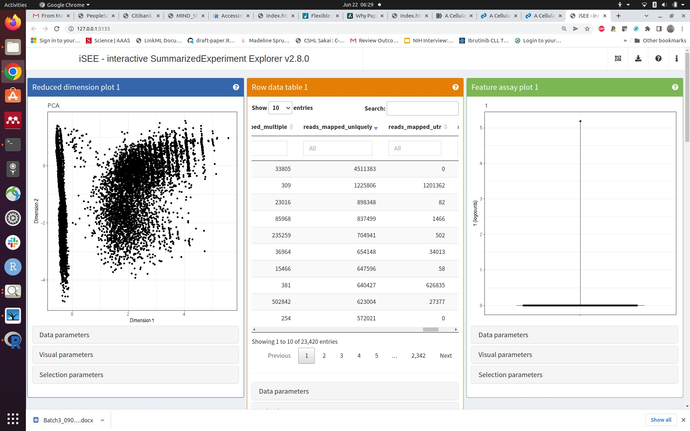
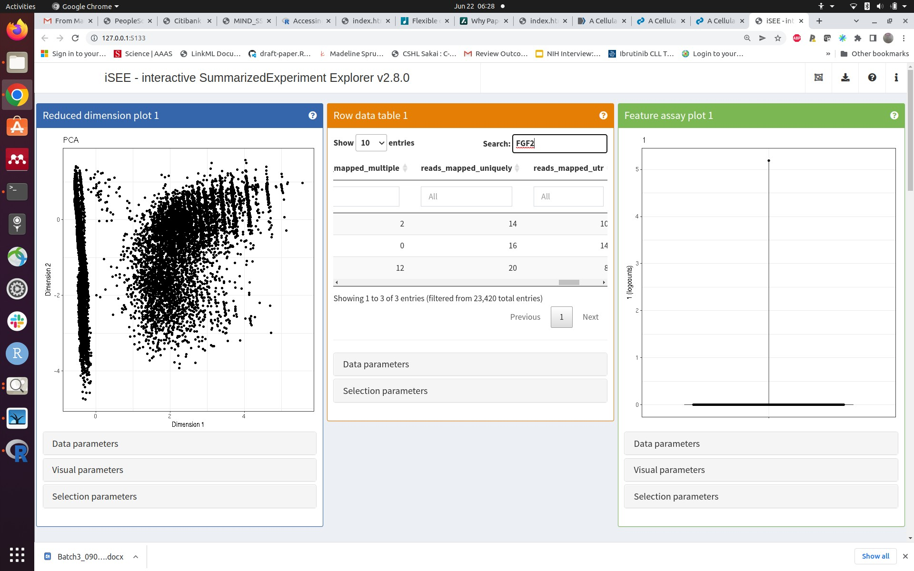

# Road map

- Bioconductor reads a paper
- ontoProc and rols help with ontologies
- shiny helps communicate

# A paper on the atlas of the prostate


## The hca package

### Surveying projects of the HCA

```{r startup}
library(hca)
p = projects()
library(DT)
datatable(as.data.frame(p))
```

### Picking a project; Enumerating and downloading loom files

```{r do1, cache=TRUE}
projectId = "53c53cd4-8127-4e12-bc7f-8fe1610a715c"
file_filter <- filters(
    projectId = list(is = projectId),
    fileFormat = list(is = "loom")
)
pfile = files(file_filter)
pfile$projectTitle[1]
#pfile |> files_download()
```

### Working with loom

Very superficial filtering (to 60000 cells) and
development of PCA

```{r chk, eval=FALSE}
library(LoomExperiment)
f1 = import("/home/stvjc/.cache/R/hca/36e582f7c6e_36e582f7c6e.loom")
f1
names(colData(f1))
library(scater)
sf1 = as(f1, "SingleCellExperiment")
sf1
library(scuttle)
assay(sf1[1:4,1:4])
assayNames(sf1) = "counts"
litsf1 = sf1[,1:60000]
z = DelayedArray::rowSums(assay(litsf1))
mean(z==0)
todrop = which(z==0)
litsf2 = litsf1[-todrop,]
assay(litsf2)
litsf2 = logNormCounts(litsf2)
litsf2 = runPCA(litsf2)
```

Whatchaget:
```{r lkstuf}
if (!exists("litsf2")) load("litsf2.rda") # run code above, must have HDF5 in cache
metadata(litsf2)
```

```
> str(litsf2) # 22MB on disk (no quantifications)
Formal class 'DelayedMatrix' [package "DelayedArray"] with 1 slot
  ..@ seed:Formal class 'DelayedAperm' [package "DelayedArray"] with 2 slots
  .. .. ..@ perm: int [1:2] 2 1
  .. .. ..@ seed:Formal class 'DelayedSubset' [package "DelayedArray"] with 2 slots
  .. .. .. .. ..@ index:List of 2
  .. .. .. .. .. ..$ : int [1:60000] 1 2 3 4 5 6 7 8 9 10 ...
  .. .. .. .. .. ..$ : int [1:23420] 13 20 22 23 31 33 34 35 36 37 ...
  .. .. .. .. ..@ seed :Formal class 'HDF5ArraySeed' [package "HDF5Array"] with 7 slots
  .. .. .. .. .. .. ..@ filepath : chr "/home/stvjc/.cache/R/hca/36e582f7c6e_36e582f7c6e.loom"
  .. .. .. .. .. .. ..@ name     : chr "/matrix"
  .. .. .. .. .. .. ..@ as_sparse: logi FALSE
  .. .. .. .. .. .. ..@ type     : chr NA
  .. .. .. .. .. .. ..@ dim      : int [1:2] 382197 58347
  .. .. .. .. .. .. ..@ chunkdim : int [1:2] 64 64
  .. .. .. .. .. .. ..@ first_val: int 0
```

```
stvjc@stvjc-XPS-13-9300:~/CSAMA_HCA$ ls -tl /home/stvjc/.cache/R/hca/36e582f7c6e_36e582f7c6e.loom
-rw-rw-r-- 1 stvjc stvjc 1206062245 Jun 21 22:37 /home/stvjc/.cache/R/hca/36e582f7c6e_36e582f7c6e.loom
```


### Working with iSEE

- Question: where is the "stop/exit" button?
- Question: can we embed iSEE (or components) in a vignette?  Or is there an iSEE server?





## Upshots

- easy to survey HCA with hca package
- easy to get experiments, metadata, quantifications for projects of interest
- iSEE really accelerates exploration and elaboration of data and claims

# Ontologies, EBI OLS, rols (thanks Laurent Gatto!), ontoProc::ctmarks

## rols: Basic idea

- OLS is ontology lookup service
- has API
- rols package help to interrogate the service
- ontologies are everywhere

## Learn about 'smooth muscle' with rols

```{r getrols}
library(rols)
ss = OlsSearch("smooth muscle", rows=100)
ss
tt = olsSearch(ss)
dd = as(tt, "data.frame")
datatable(dd)
```

## ontoProc -- capitalizing on ontologyIndex (thanks Daniel Greene!), Rgraphviz (thanks Kasper Hansen!)

Innovation here: walk through linked ontologies such as PR and present additional facets
about the concept in focus

Limitation: the OBO representation in use is outdated and out-links are sparse

```
library(ontoProc)
cl = getCellOnto()
chk = ctmarks(cl)
```

Projects: 
- use rols to get more interesting information about terms into the app
- update the ontology resources
- go beyond OBO ... but not all the way to OWL?  Evaluate the UI/UX needed to broaden ontology usage
- impacts: data integration, precision of annotation, cognitive efficiency

# shinywow2 - check out vjcitn.shinyapps.io/tnt4dn8 but be patient and don't do it while i am doing it ...
