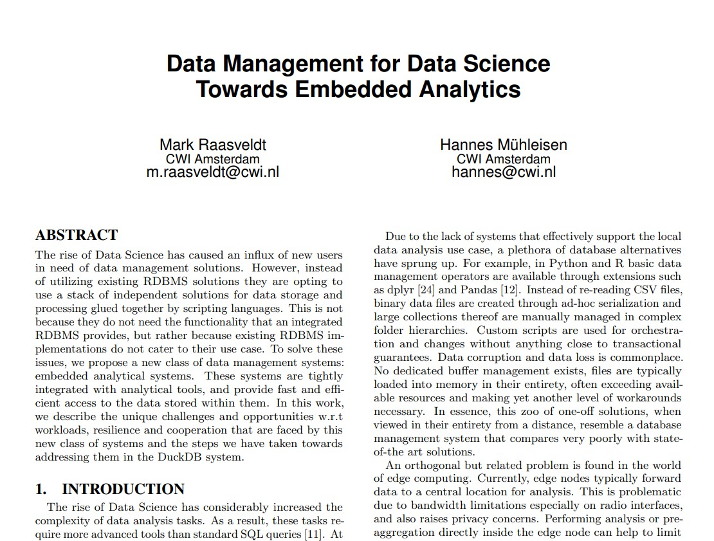
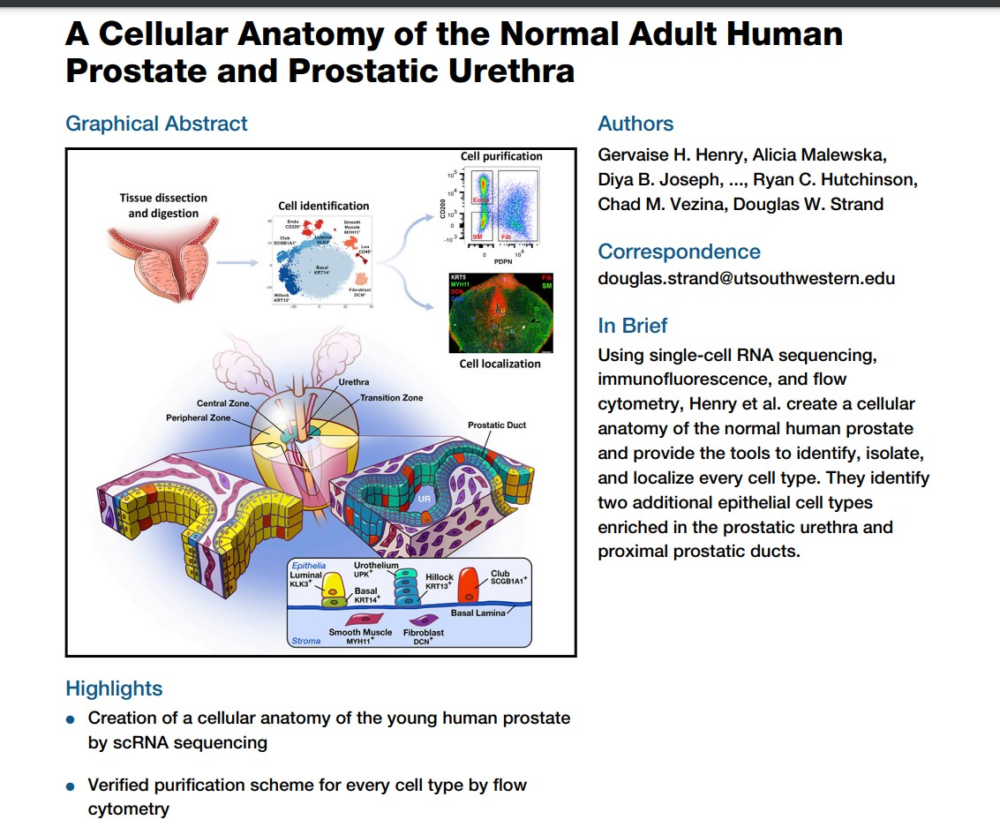
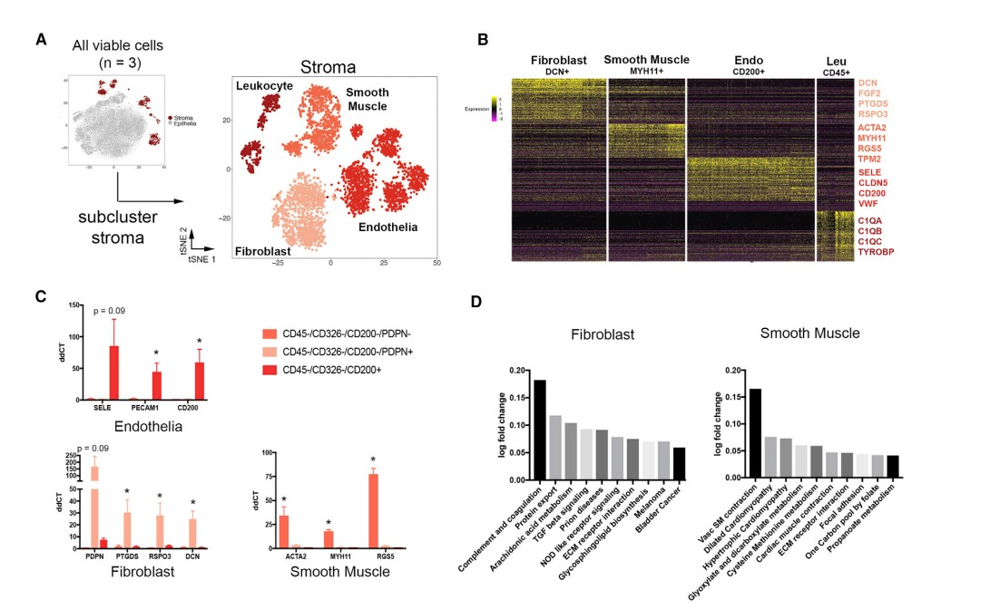

```{=html}
<!--
# Road map

-   Edge thickness in graph-based clustering plot
-   Information science innovation: OLAP vs OLTP; duckdb; parquet;
    CuratedAtlasQueryR
-   Bioconductor reads a paper
-   ontoProc and rols help with ontologies
-   shiny helps communicate
-->
```
# What was the interpretation of the edge thickness in the final plot of last lecture?

-   use NNGraph algorithm for efficient clustering based on walktrap
    community detection
-   cells are assigned to nodes, but graph may include edges between
    cells in different nodes
-   the width of the edge between two nodes in the display is
    proportional to the ratio of the number of observed between-node
    edges to the expected number of between-node edges under a model of
    random links between cells

# Online analytical processing support (OLAP)



[Full paper](https://hannes.muehleisen.org/publications/CIDR2020-raasveldt-muehleisen-duckdb.pdf)

## motivation for a new approach

-   metadata about single cells -- highly repetitive, substantial role
    for run-length encoding or other compression schemes

## example of CuratedAtlasQueryR

-   [CuratedAtlasQueryR](https://github.com/stemangiola/CuratedAtlasQueryR)
    is from WEHI institute, will appear in Bioc 3.18, and is a
    comprehensive reprocessing of the HumanCellAtlas with harmonized
    annotations

```{r getcaq, message=FALSE}
library(CuratedAtlasQueryR)
md = get_metadata()
md
```

-   How it works

```{r useq}
single_cell_counts = 
    md |>
    dplyr::filter(
        ethnicity == "African" &
        stringr::str_like(assay, "%10x%") &
        tissue == "lung parenchyma" &
        stringr::str_like(cell_type, "%CD4%")
    ) |>
    get_single_cell_experiment()
```

-   after tidyverse query:

```{r lkd}
single_cell_counts
```

-   Apropos shiny: Does the query above suggest some aspects of a
    desirable GUI? Let's discuss.

# A paper on the atlas of the prostate





## The hca package

### Surveying projects of the HCA

```{r startup,message=FALSE}
library(hca)
p = projects()
library(DT)
datatable(as.data.frame(p))
```

### Picking a project; Enumerating and downloading loom files

```{r do1, cache=TRUE}
projectId = "53c53cd4-8127-4e12-bc7f-8fe1610a715c"
file_filter <- filters(
    projectId = list(is = projectId),
    fileFormat = list(is = "loom")
)
pfile = files(file_filter)
pfile$projectTitle[1]
#pfile |> files_download()
```

### Working with loom

Very superficial filtering (to 60000 cells) and development of PCA

```{r chk, eval=FALSE}
library(LoomExperiment)
f1 = import("/home/stvjc/.cache/R/hca/36e582f7c6e_36e582f7c6e.loom")
f1
names(colData(f1))
library(scater)
sf1 = as(f1, "SingleCellExperiment")
sf1
library(scuttle)
assay(sf1[1:4,1:4])
assayNames(sf1) = "counts"
litsf1 = sf1[,1:60000]
z = DelayedArray::rowSums(assay(litsf1))
mean(z==0)
todrop = which(z==0)
litsf2 = litsf1[-todrop,]
assay(litsf2)
litsf2 = logNormCounts(litsf2)
litsf2 = runPCA(litsf2)
```

Whatchaget:

```{r lkstuf}
if (!exists("litsf2")) load("litsf2.rda") # run code above, must have HDF5 in cache
S4Vectors::metadata(litsf2)
```

```         
> str(litsf2) # 22MB on disk (no quantifications)
Formal class 'DelayedMatrix' [package "DelayedArray"] with 1 slot
  ..@ seed:Formal class 'DelayedAperm' [package "DelayedArray"] with 2 slots
  .. .. ..@ perm: int [1:2] 2 1
  .. .. ..@ seed:Formal class 'DelayedSubset' [package "DelayedArray"] with 2 slots
  .. .. .. .. ..@ index:List of 2
  .. .. .. .. .. ..$ : int [1:60000] 1 2 3 4 5 6 7 8 9 10 ...
  .. .. .. .. .. ..$ : int [1:23420] 13 20 22 23 31 33 34 35 36 37 ...
  .. .. .. .. ..@ seed :Formal class 'HDF5ArraySeed' [package "HDF5Array"] with 7 slots
  .. .. .. .. .. .. ..@ filepath : chr "/home/stvjc/.cache/R/hca/36e582f7c6e_36e582f7c6e.loom"
  .. .. .. .. .. .. ..@ name     : chr "/matrix"
  .. .. .. .. .. .. ..@ as_sparse: logi FALSE
  .. .. .. .. .. .. ..@ type     : chr NA
  .. .. .. .. .. .. ..@ dim      : int [1:2] 382197 58347
  .. .. .. .. .. .. ..@ chunkdim : int [1:2] 64 64
  .. .. .. .. .. .. ..@ first_val: int 0
```

```         
stvjc@stvjc-XPS-13-9300:~/CSAMA_HCA$ ls -tl /home/stvjc/.cache/R/hca/36e582f7c6e_36e582f7c6e.loom
-rw-rw-r-- 1 stvjc stvjc 1206062245 Jun 21 22:37 /home/stvjc/.cache/R/hca/36e582f7c6e_36e582f7c6e.loom
```

## Upshots

-   CuratedAtlasQueryR
    -   duckdb/parquet enables 40x reduction in size of metadata for
        harmonized HCA in CuratedAtlasQueryR
    -   dplyr-like querying of resource
-   easy to survey HCA with hca package
-   several ways to get experiments, metadata, quantifications for
    projects of interest
-   Once you've queried the atlas, iSEE accelerates exploration and
    elaboration of data and claims
    -   check out the [voice-activated control
        capability](https://www.bioconductor.org/packages/devel/bioc/vignettes/iSEE/inst/doc/voice.html)

# Ontologies, EBI OLS, rols (thanks Laurent Gatto!), ontoProc::ctmarks

## rols: Basic idea

-   OLS is ontology lookup service
-   has API
-   rols package help to interrogate the service
-   ontologies are everywhere

## Learn about 'smooth muscle' with rols

```{r getrols}
library(rols)
ss = OlsSearch("smooth muscle", rows=100)
ss
tt = olsSearch(ss)
dd = as(tt, "data.frame")
datatable(dd)
```

## ontoProc -- capitalizing on ontologyIndex (thanks Daniel Greene!), Rgraphviz (thanks Kasper Hansen!)


```         
library(ontoProc)
cl = getOnto("cellOnto")
chk = ctmarks(cl) # disappointment relative to an older version ...
```

# vjcitn.shinyapps.io/ctmarks

# vjcitn.shinyapps.io/gwasCatSearch

if time permits
