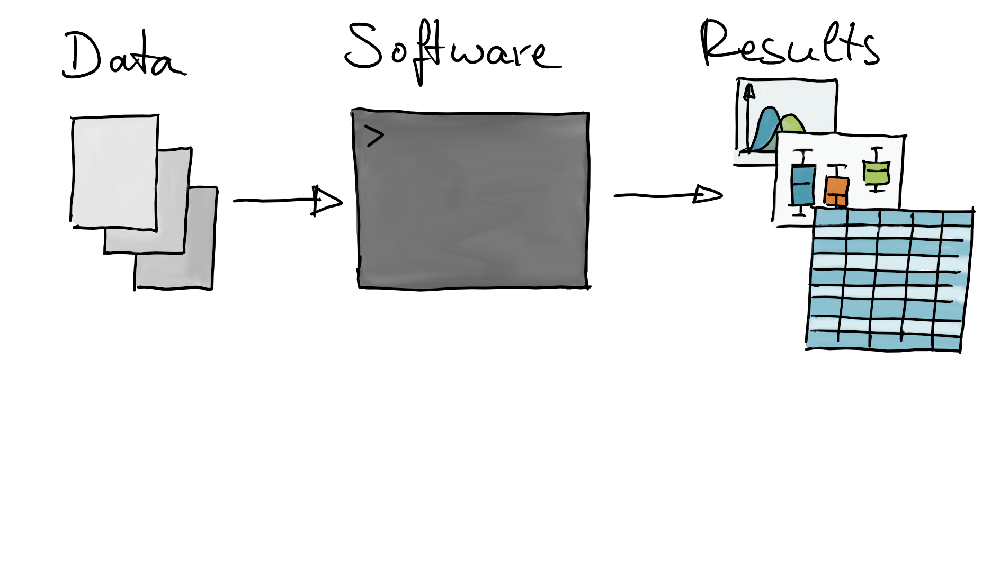
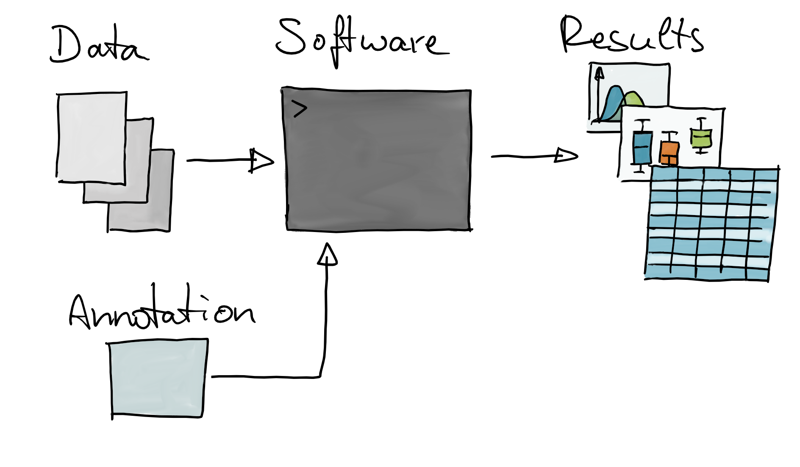

<style type="text/css">

slides > slide:not(.nobackground):after {
  content: '';
}

slides > slide {
    -webkit-transition:none !important;transition:none !important;
}

.build > * {
  -webkit-transition: opacity 0.1s ease-in-out;
  -webkit-transition-delay: 0.1s;
  -moz-transition: opacity 0.1s ease-in-out 0.1s;
  -o-transition: opacity 0.1s ease-in-out 0.1s;
  transition: opacity 0.1s ease-in-out 0.1s;
}

.reveal .slides section .slideContent{
    font-size: 10pt;
}

</style>


```{r setup, echo = FALSE, message = FALSE, warning = FALSE}
packs <- c("hugene20sttranscriptcluster.db",
           "org.Hs.eg.db",
           "TxDb.Hsapiens.UCSC.hg19.knownGene",
           "Homo.sapiens",
           "BSgenome",
           "BSgenome.Hsapiens.UCSC.hg19",
           "AnnotationHub",
           "AnnotationDbi",
           "Organism.dplyr",
           "biomaRt",
           "airway")
BiocManager::install(packs, ask = FALSE)
for (p in packs)
    library(p, character.only = TRUE)
```

## What is annotation data? {.build}


```{r, out.width = "80%", echo = FALSE}

```


## What is annotation data? {.notransition}


```{r, out.width = "80%", echo = FALSE}

```


## What is annotation data? {.notransition}


```{r, out.width = "80%", echo = FALSE}

```

- Annotation data: usually external data that is used to *make sense* of
  measured entities.

  
## Typical annotation use cases {.build}

<div>
- get HUGO gene symbols for gene identifiers (e.g. Entrezgene, Ensembl...).
</div>
<div>
- map positions on the genome to transcripts (genes).
</div>
<div>
- map genes to biological pathways.
</div>
<div>
- assign peptide sequences to proteins.
</div>
<div>
- identify metabolites based on fragment spectra.
</div>
<div>
- **Annotation**: map one type of ID to another type of ID.
</div>


## Annotation resources {.build}

<div>
- NCBI: https://www.ncbi.nlm.nih.gov/ 
</div>
<div>
- Ensembl: http://www.ensembl.org/index.html
</div>
<div>
- Uniprot: https://www.uniprot.org/
</div>
<div>
- Pubchem: https://pubchem.ncbi.nlm.nih.gov/
</div>
<div>
- Reactome: https://reactome.org/
- ...
</div>
<div>
- Can be downloaded or queried through an API.
</div>

## Annotation resources in **Bioconductor** {.build}

<div>
- Annotation packages: 
  - *org.Hs.eg.db*
  - *BSgenome.Hsapiens.UCSC.hg19*
  - *TxDb.Hsapiens.UCSC.hg19.knownGene*
  - *GO.db*
  - ...
</div>
<div>
- *AnnotationHub*: query and retrieve annotations, cache them locally.
</div>
<div>
- Online resources: *biomaRt*, *KEGGREST*.
</div>

## Annotation packages in Bioconductor {.build}

- *org.Hs.eg.db*: package with various annotations for homo sapiens.

```{r, message = FALSE, warning = FALSE}
BiocManager::install("org.Hs.eg.db")
library(org.Hs.eg.db)
org.Hs.eg.db
```


## 

<div style="position:absolute; top:45%">
**How can we get access to the data in a Bioconductor annotation resource?**
</div>

## | **A common annotation interface:** *AnnotationDbi* {.build}

<div>
The main function is `select`:

AnnotationDbi::select(*anno*, *keys*, *columns*, *keytype*)
</div>
<div>
Where

- *anno* is the annotation package (or object)
- *keys* are the IDs that we **have**
- *columns* are the values we **want**
- *keytype* is the type of key used
</div>

## Simple Example {.build}

<div>
- *Task*: annotate gene identifiers to HUGO symbols.
</div>
<div>
- The *airway* package provides a `RangedSummarizedExperiment` with results from
  an RNA-Seq experiment.
- Genes are identified by their Ensembl IDs.
</div>

```{r, warning=FALSE}
library(airway)
data(airway)
ids <- head(rownames(airway))
ids
select(org.Hs.eg.db, ids, "SYMBOL", "ENSEMBL")
```


## What annotations are provided? {.build}

- Use `columns` to list annotations available in specific annotation object.

```{r}
columns(org.Hs.eg.db)
```

- Use `keytypes` to list supported *key types*.

```{r}
keytypes(org.Hs.eg.db)
```


## Another example {.build}

- Get OMIM IDs for two genes.

```{r, warning = FALSE}
brca <- c("BRCA1", "BRCA2")
select(org.Hs.eg.db, brca, c("GENENAME", "OMIM"), "SYMBOL")

```

- We no longer have a 1:1 mapping!

## Alternative: the `mapIds` function {.build}

- Same as `select` (but for single annotations!).
- Parameter `multiVals` allows to specify how to deal with 1:many mappings.

```{r, warning = FALSE}
mapIds(org.Hs.eg.db, brca, "OMIM", "SYMBOL", multiVals = "first")

```

- OK, but where's the rest?


## Choices for `multiVals` {.build}

<div>
- `multiVals = "first"` (default): take the first element.
</div>
<div>
- `multiVals = "asNA"`: `NA` is returned for any 1:many mapping.
</div>
<div>
- `multiVals = "list"`: multiple elements are collapsed into a `list`.
</div>
<div>
- `multiVals = "CharacterList"`: results are returned as a `CharacterList`.
</div>

```{r, warning = FALSE}
mapIds(org.Hs.eg.db, brca, "OMIM", "SYMBOL", multiVals = "CharacterList")
```


## But... {.build}

<div>
- *AnnotationDbi* is a very powerful framework, but:
</div>
<div>
- For some annotations or queries different approaches might be more suitable.
</div>
<div>
- Not guaranteed that all annotation packages/objects support the
  *AnnotationDbi* framework.
</div>


## What about positional annotation? {.build}

<div>
- Annotation for positions on the genome (exons, transcripts, genes).
</div>
<div>
- Annotation for positions along protein sequences (protein domains...).
</div>
<div>
- Mostly used for gene quantification in RNA-seq data.
</div>


## | Positional annotations: `TxDb` and `EnsDb` objects {.build}

<div>
- `TxDb` (*GenomicFeatures* package) and `EnsDb` (*ensembldb* package) objects
  contain positional annotations. 
- `EnsDb` contain additional annotations such as gene symbols, Entrezgene IDs,
  GC content, gene/transcript biotypes and protein annotations.
</div>
<div>
- `TxDb` and `EnsDb` resources can be installed as packages
  (e.g. *TxDb.Hsapiens.UCSC.hg19.knownGene*, *EnsDb.Hsapiens.v86*).
- Preferred way: through *AnnotationHub*.
</div>
<div>
- **Why?** 
  - Provides annotation databases for all species, all Ensembl releases.
  - Guarantees reproducibility.
</div>


## Query *AnnotationHub* {.build}

- Search annotation resource for a specific species and release.

```{r, message = FALSE}
library(AnnotationHub)
ah <- AnnotationHub()
query(ah, c("EnsDb", "hsapiens", "102"))
```


## Fetch from *AnnotationHub* {.build}

- Download and cache this annotation.

```{r, message = FALSE}
edb <- ah[["AH89180"]]
edb
```


## Extract annotations from an `EnsDb` or `TxDb` {.build}

- Using *AnnotationDbi*:

```{r, warning = FALSE}
columns(edb)
select(edb, "ENSG00000139618",
       c("SYMBOL", "SEQNAME"), "GENEID")

```


## Extract positional annototations {.build}

- `genes`, `transcripts`,`exons` to extract their genomic coordinates.
- Result returned as `GRanges` object (with additional *metadata columns*).

```{r, warning = FALSE}
genes(edb)
```

## Query data for specific genes {.build}

- Get all transcripts for a gene with the gene symbol (name) *BRCA2*.

```{r}
transcripts(edb, filter = ~ symbol == "BRCA2")
```


## For read counting/gene quantification {.build}

- Extract exons grouped by transcript for all genes encoded on chromosome *Y*.

```{r}
exs <- exonsBy(edb, by = "tx", filter = ~ seq_name == "Y")
exs
```


## Genomic sequences {.build}

<div>
- *BSgenome* packages (e.g. *BSgenome.Hsapiens.UCSC.hg19*).
</div>
<div>
- *AnnotationHub*:
</div>

```{r}
query(ah, c("TwoBitFile", "GRCh38"))
```

## Extracting transcript sequences {.build}

- *Task:* Get sequences for previously extracted transcripts.

```{r}
gn <- ah[["AH49723"]]
extractTranscriptSeqs(gn, exs)
```

## Extracting genomic sequences {.build}

- Get the genomic sequence for a particular region. 
- `getSeq` takes the data object and a `GRanges` defining which (sub)sequence to
  extract.

```{r}
rng <- GRanges("X:10000-15000")
getSeq(gn, rng)
```

- See *Biostrings* package for more information on how to handle and process
  sequences.


## Online resources: *biomaRt* {.build}

- Biomart is an Ensembl service providing a web API to retrieve annotations.
- Bioconductor's *biomaRt* package allows to query Ensembl Biomart servers.

```{r, warning = FALSE}
library(biomaRt)
listMarts()
```

- Connect to a Biomart server.

```{r, warning = FALSE}
mart <- useMart("ENSEMBL_MART_ENSEMBL")
```

## *biomaRt* data sets {.build}

- And we can then check for the available data sets on a particular
  server.

```{r, warning = FALSE}
listDatasets(mart) |> head()
```

- We've got annotations for almost all species.


## *biomaRt* queries {.build}

- Connect to a particular Biomart data set.

```{r, warning = FALSE}
mart <- useMart("ENSEMBL_MART_ENSEMBL","hsapiens_gene_ensembl")
```

- Query the resource using `getBM(attributes, filters, values, mart)`.

where

- *attributes* are the things we **want** (*columns*)
- *filters* are the *types of* IDs we **have** (*keytypes*)
- *values* are the IDs we **have** (*keys*)
- *mart* is the `mart` object we set up


## *biomaRt* attributes and filters {.build}

- Use `listAttributes` and `listFilters` to get available annotations and
  supported filters.

```{r, warning = FALSE}
listAttributes(mart) |> head()
listFilters(mart) |> head()

```


## *biomaRt* query {.build}

- Example: get Ensembl gene ID and chromosome names for two genes.

```{r, warning = FALSE}
sym <- c("BRCA1", "BRCA2")
getBM(c("ensembl_gene_id", "hgnc_symbol", "chromosome_name"),
      "hgnc_symbol", sym, mart)

```

<div>
**Notes**

- Requires internet connection.
- By default uses *current* release, but `listEnsemblArchives()` would allow
  to select URLs for previous (Ensembl) releases.
</div>

## What else? {.build}

<div>
- Annotations for **chemical compounds**.
- Annotation resources: [Human Metabolome Database (HMDB)](https://hmdb.ca), 
  [PubChem](https://pubchem.ncbi.nlm.nih.gov/),
  [ChEBI](https://www.ebi.ac.uk/chebi/), 
  [MassBank](https://massbank.eu/MassBank/), 
  [MoNA](https://mona.fiehnlab.ucdavis.edu/), ...
</div> 

<div>
<div style="position:absolute; left:7%; top:40%;">
 
</div> 

<div style="position:absolute;left:30%; top: 47.5%;">
- Store compound annotations (mass, name, chemical formula etc).
- Fragment spectra (structural information).
</div>
</div>

## Last words {.build}

<div>
- Stick whenever possible with one annotation resource (Ensembl, NCBI, UCSC).
</div>
<div>
- Ensure you're using the same annotation version through your full analysis
  (e.g. aligning reads, gene quantification, annotation of genes).
</div>
<div>
- Prefer *AnnotationHub* over annotation packages: better control of the
  annotation version.
</div>


## 

<div style="position:absolute; top:48%; left:33%;">
**Thank you for your attention**
</div>
