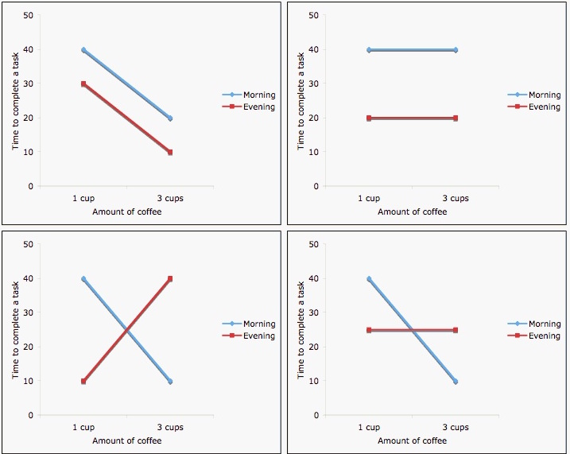

---
title: "Introduction to Linear Models"
author: "Levi Waldron, CUNY School of Public Health"
date: "June 14, 2017"
output:
  slidy_presentation: null
  ioslides_presentation: default
---

## Outline for Introduction to Linear Models

Based on Love and Irizarry, [Data Analysis for the Life Sciences](https://leanpub.com/dataanalysisforthelifesciences), Chapter 5

* Multiple linear regression
    + Continuous and categorical predictors
    + Interactions
* Model formulae
* Design matrix
* Analysis of Variance

# Introduction to Linear Models

## Example: friction of spider legs

* Wolff & Gorb, [Radial arrangement of Janus-like setae permits friction control in spiders](http://www.nature.com/articles/srep01101), *Sci. Rep.* 2013.

<div class="columns-2">
<center>  </center>

- **(A)** Barplot showing total claw tuft area of the corresponding legs. 
- **(B)** Boxplot presenting friction coefficient data illustrating median, interquartile range and extreme values.
</div>

## Example: friction of spider legs

<div class="columns-2">
<center>  </center>

- Are the pulling and pushing friction coefficients different?
- Are the friction coefficients different for the different leg pairs?
- Does the difference between pulling and pushing friction coefficients vary by leg pair?
</div>

```{r, echo=FALSE}
url <- "https://raw.githubusercontent.com/genomicsclass/dagdata/master/inst/extdata/spider_wolff_gorb_2013.csv"
filename <- "spider_wolff_gorb_2013.csv"
library(downloader)
if (!file.exists(filename))
    download(url, filename)
spider <- read.csv(filename, skip=1)
```

## Example: friction of spider legs

```{r}
table(spider$leg,spider$type)
summary(spider)
```


## What are linear models?

- Linear models model a response variable $Y_i$ as a linear combination of predictors, plus randomly distributed noise.
- Which of the following are examples of linear models?

1. $y_i = \beta_0 + \beta_1 x_i + \varepsilon_i$
2. $y_i = \beta_0 + \beta_1 x_i + \beta_2 x_i^2 + \varepsilon_i$
3. $y_i = \beta_0 + \beta_1 x_i + \times 2^{\beta_2 x_i} + \varepsilon_i$

Where: $i=1,\dots,N$

Assumption: $\varepsilon_i \stackrel{iid}{\sim} N(0, \sigma_\epsilon^2)$

## What are linear models?

The following are examples of linear models:

1. $y_i = \beta_0 + \beta_1 x_i + \varepsilon_i$ (simple linear regression)
2. $y_i = \beta_0 + \beta_1 x_i + \beta_2 x_i^2 + \varepsilon_i$ (quadratic regression)

## Multiple linear regression model

- Linear models can have any number of predictors
- Systematic part of model:

$$
E[y|x] = \beta_0 + \beta_1 x_1 + \beta_2 x_2 + ... + \beta_p x_p
$$

- $E[y|x]$ is the expected value of $y$ given $x$
- $y$ is the outcome, response, or dependent variable
- $x$ is the vector of predictors / independent variables 
- $x_p$ are the individual predictors or independent variables
- $\beta_p$ are the regression coefficients

## Multiple linear regression model

Random part of model:

$y_i = E[y_i|x_i] + \epsilon_i$

Assumptions of linear models: $\epsilon_i \stackrel{iid}{\sim} N(0, \sigma_\epsilon^2)$

* Normal distribution
* Mean zero at every value of predictors
* Constant variance at every value of predictors
* Values that are statistically independent

## Continuous predictors

* **Coding:** as-is, or may be scaled to unit variance (which results in _adjusted_ regression coefficients)
* **Interpretation for linear regression:** An increase of one unit of the predictor results in this much difference in the continuous outcome variable

## Binary predictors (2 levels)

* **Coding:** indicator or dummy variable (0-1 coding)
* **Interpretation for linear regression:** the increase or decrease in average outcome levels in the group coded “1”, compared to the reference category (“0”)
   + _e.g._ $E(y|x) = \beta_0 + \beta_1 x$ 
   + where x={ 1 if push friction, 0 if pull friction }

## Multilevel categorical predictors (ordinal or nominal)

* **Coding:** $K-1$ dummy variables for $K$-level categorical variable
* Comparisons with respect to a reference category, *e.g.* `L1`:
    * `L2`={1 if $2^{nd}$ leg pair, 0 otherwise}, 
    * `L3`={1 if $3^{nd}$ leg pair, 0 otherwise}, 
    * `L4`={1 if $4^{th}$ leg pair, 0 otherwise}.

- R re-codes factors to dummy variables automatically. 
- Note that factors can be *ordered* or *unordered*

# Model formulae in R

## Model formulae in R

[Model formulae tutorial](http://ww2.coastal.edu/kingw/statistics/R-tutorials/formulae.html)

* regression functions in R such as `aov()`, `lm()`, `glm()`, and `coxph()` use a "model formula" interface.
* The formula determines the model that will be built (and tested) by the R procedure. The basic format is:

`> response variable ~ explanatory variables`

* The tilde means "is modeled by" or "is modeled as a function of." 

## Regression with a single predictor

Model formula for simple linear regression: 

`> y ~ x`

* where "x" is the explanatory (independent) variable
* "y" is the response (dependent) variable. 

## Return to the spider legs

Friction coefficient for leg type of first leg pair:

```{r, results='show'}
spider.sub <- spider[spider$leg=="L1", ]
fit <- lm(friction ~ type, data=spider.sub)
summary(fit)
```

## Regression on spider leg type

Regression coefficients for `friction ~ type` for first set of spider legs:

```{r, results="asis", echo=TRUE}
fit.table <- xtable::xtable(fit, label=NULL)
print(fit.table, type="html")
```

<p></p>
* How to interpret this table?
    * Coefficients for **(Intercept)** and **typepush**
    * Coefficients are t-distributed when assumptions are correct
    * Standard Error is the sampling variance of the estimates

## Interpretation of coefficients

```{r spider_main_coef, fig.cap="Diagram of the estimated coefficients in the linear model. The green arrow indicates the Intercept term, which goes from zero to the mean of the reference group (here the 'pull' samples). The orange arrow indicates the difference between the push group and the pull group, which is negative in this example. The circles show the individual samples, jittered horizontally to avoid overplotting.",echo=FALSE}
set.seed(1) #same jitter in stripchart
stripchart(split(spider.sub$friction, spider.sub$type), 
           vertical=TRUE, pch=1, method="jitter", las=2, xlim=c(0,3), ylim=c(0,2))
coefs <- coef(fit)
a <- -0.25
lgth <- .1
library(RColorBrewer)
cols <- brewer.pal(3,"Dark2")
abline(h=0)
arrows(1+a,0,1+a,coefs[1],lwd=3,col=cols[1],length=lgth)
abline(h=coefs[1],col=cols[1])
arrows(2+a,coefs[1],2+a,coefs[1]+coefs[2],lwd=3,col=cols[2],length=lgth)
abline(h=coefs[1]+coefs[2],col=cols[2])
legend("right",names(coefs),fill=cols,cex=.75,bg="white")
```

## Regression on spider leg **position**

Remember there are positions 1-4
```{r}
fit <- lm(friction ~ leg, data=spider)
```

```{r, results="asis", echo=TRUE, message=FALSE}
fit.table <- xtable::xtable(fit, label=NULL)
print(fit.table, type="html")
```

- Interpretation of the dummy variables legL2, legL3, legL4 ?

## Regression with multiple predictors

Additional explanatory variables can be added as follows: 

`> y ~ x + z`

Note that "+" does not have its usual meaning, which would be achieved by:

`> y ~ I(x + z)`

## Regression on spider leg **type** and **position**

Remember there are positions 1-4
```{r}
fit <- lm(friction ~ type + leg, data=spider)
```

```{r, results="asis", echo=TRUE, message=FALSE}
fit.table <- xtable::xtable(fit, label=NULL)
print(fit.table, type="html")
```

* this model still doesn't represent how the friction differences between different leg positions are modified by whether it is pulling or pushing

## Interaction (effect modification)


  
Image credit: http://personal.stevens.edu/~ysakamot/

## Interaction (effect modification)

Interaction is modeled as the product of two covariates:
$$
E[y|x] = \beta_0 + \beta_1 x_1 + \beta_2 x_2 + \beta_{12} x_1*x_2
$$

## Summary: model formulae

symbol  | example | meaning
------- | ------------ | --------------------------  
+ | + x	| include this variable  
-	| - x	| delete this variable  
:	| x : z	| include the interaction  
*	| x * z	| include these variables and their interactions  
^	| (u + v + w)^3	| include these variables and all interactions up to three way
1 | -1 | intercept: delete the intercept  

## Summary: types of standard linear models

```
lm( y ~ u + v)
```
`u` and `v` factors: **ANOVA**  
`u` and `v` numeric: **multiple regression**  
one factor, one numeric: **ANCOVA**

* R does a lot for you based on your variable classes
    * be **sure** you know the classes of your variables
    * be sure all rows of your regression output make sense

# The Design Matrix

## The Design Matrix

Recall the multiple linear regression model:

$y_i = \beta_0 + \beta_1 x_{1i} + \beta_2 x_{2i} + ... + \beta_p x_{pi} + \epsilon_i$

- $x_{ji}$ is the value of predictor $x_j$ for observation $i$

## The Design Matrix

Matrix notation for the multiple linear regression model:

$$
\,
\begin{pmatrix}
y_1\\
y_2\\
\vdots\\
y_N
\end{pmatrix} = 
\begin{pmatrix}
1&x_1\\
1&x_2\\
\vdots\\
1&x_N
\end{pmatrix}
\begin{pmatrix}
\beta_0\\
\beta_1
\end{pmatrix} +
\begin{pmatrix}
\varepsilon_1\\
\varepsilon_2\\
\vdots\\
\varepsilon_N
\end{pmatrix}
$$

or simply: 

$$
\mathbf{Y}=\mathbf{X}\boldsymbol{\beta}+\boldsymbol{\varepsilon}
$$

* The design matrix is $\mathbf{X}$
    * which the computer will take as a given when solving for $\boldsymbol{\beta}$ by minimizing the sum of squares of residuals $\boldsymbol{\varepsilon}$.
    
## Choice of design matrix
    
* there are multiple possible and reasonable design matrices for a given study design
* the model formula encodes a default model matrix, e.g.:

```{r}
group <- factor( c(1, 1, 2, 2) )
model.matrix(~ group)
```

## Choice of design matrix

What if we forgot to code group as a factor?
```{r}
group <- c(1, 1, 2, 2)
model.matrix(~ group)
```

## More groups, still one variable

```{r}
group <- factor(c(1,1,2,2,3,3))
model.matrix(~ group)
```

## Changing the baseline group

```{r}
group <- factor(c(1,1,2,2,3,3))
group <- relevel(x=group, ref=3)
model.matrix(~ group)
```

## More than one variable

```{r}
diet <- factor(c(1,1,1,1,2,2,2,2))
sex <- factor(c("f","f","m","m","f","f","m","m"))
model.matrix(~ diet + sex)
```

## With an interaction term

```{r}
model.matrix(~ diet + sex + diet:sex)
```

## Design matrix to contrast what we want

- Spider leg friction example:
    - The question of whether push vs. pull difference is different in L2 compared to L1 is answered by the term `typepush:legL2` in a model with interaction terms:

```{r}
fitX <- lm(friction ~ type * leg, data=spider)
```

```{r, results="asis", echo=FALSE, message=FALSE}
fit.table <- xtable::xtable(fitX, label=NULL)
print(fit.table, type="html")
```

**What if we want to ask this question for L3 vs L2?

## Design matrix to contrast what we want

What if we want to contrast...

`typepush:legL3 - typepush:legL2`

There are many ways to construct this design, one is with `library(multcomp)`: 
```{r}
names(coef(fitX))
C <- matrix(c(0,0,0,0,0,-1,1,0), 1) 
L3vsL2interaction <- multcomp::glht(fitX, linfct=C) 
```

## Design matrix to contrast what we want

Is there a difference in pushing friction for L3 vs L2?

```{r}
summary(L3vsL2interaction)
```

## Summary: applications of model matrices

* Major differential expression packages recognize them:
    * LIMMA (VOOM for RNA-seq)
    * DESeq2 for all kinds of count data
    * EdgeR
* Can fit coefficients **directly** to your contrast of interest
    * *e.g.*: what is the difference between push/pull friction for each spider-leg pair?

# Analysis of Variance

## Why Analysis of Variance?

* Analysis of Variance allows inference on the inclusion of a categorical or continuous variable
    * not just on re-coded "dummy" variables (e.g. for each spider leg pair)

```{r, fig.height=5, fig.align='center', echo=FALSE}
boxplot(spider$friction ~ spider$type * spider$leg,
        col=c("grey90","grey40"), las=2,
        main="Friction coefficients of different leg pairs")
```

## Compare ANOVA table to regression table

```{r, results='asis'}
print(xtable::xtable(summary(fit)), type="html")
```

```{r, results='asis'}
print(xtable::xtable(anova(fit)), type="html")
```

$F = \frac{\textrm{variability between groups}}{\textrm{variability within groups}} = \frac{\textrm{reduction in variance from adding variable}}{\textrm{variance of residuals}}$

## Analysis of Variance: F test

- Compares *between* group variance to *within* group variance
    - $F = \frac{\textrm{variability between groups}}{\textrm{variability within groups}} = \frac{\textrm{reduction in variance from adding variable}}{\textrm{variance of residuals}}$
- The F distribution depends on both *numerator* (df1) and *denominator* (df2) degrees of freedom
- Rejection region is in the right tail only:

```{r, echo=FALSE}
x=seq(0.01, 10, by=0.01)
y=df(x, df1=5, df2=5)
plot(x, y, type="l", main="df(df1=5, df2=5)", xlab="F", ylab="Probability")
Fcrit = qf(0.95, df1=5, df2=5)
abline(v=Fcrit, lty=2)
abline(h=0)
arrows(x0=Fcrit, x1=Fcrit+1, y0=0.4, y1=0.4)
text(x=Fcrit, y=0.3, label="Probability = 0.05", pos=4)
```

## Summary

- Linear models are the basis for identifying differential expression / differential abundance
    - continuous $Y$; any kind of $X$ variables
- **Assumptions**: 
    1. normal, homoscedastic errors,
    2. a linear relationship, and
    3. independent observations.

- Note that **t** and **F** tests are *robust* and *conservative* to violations of 1 and 2
    - extremely so for $n>30$

## Summary (cont'd)

- Know the model formula interface, but
    - use model matrices to directly fit coefficients that you want to interpret
- **Generalized Linear Models** extend these methods to:
    - binary $Y$ (logistic regression)
    - count $Y$ (log-linear regression with e.g. Poisson or Negative Binomial link functions) 

## Links

- A built [html][] version of this lecture is available.
- The [source][] R Markdown is also available from Github.

[html]: http://rpubs.com/lwaldron/CSAMA2016_IntroLinearModels
[source]: https://github.com/waldronlab/presentations/tree/master/Waldron_2016-07-11_CSAMA_linearmodels
