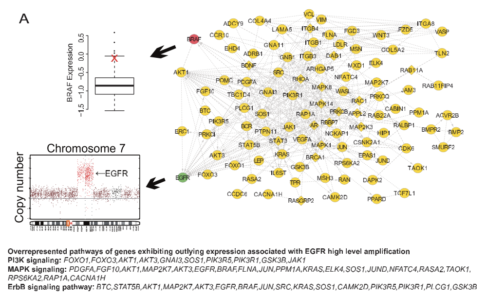
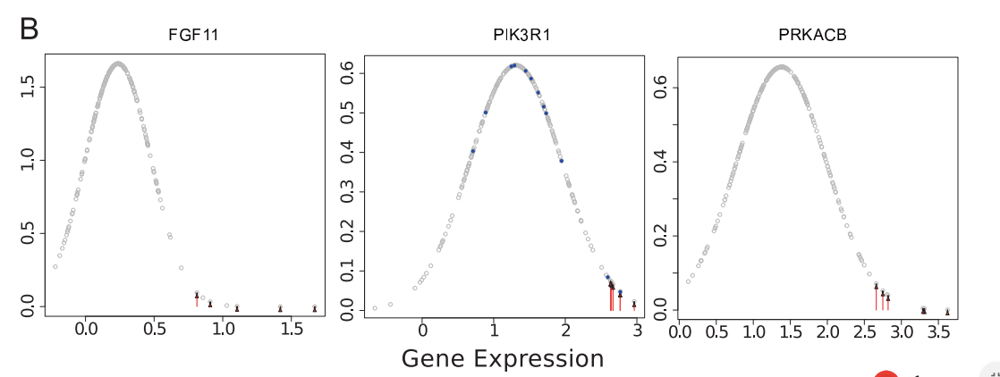
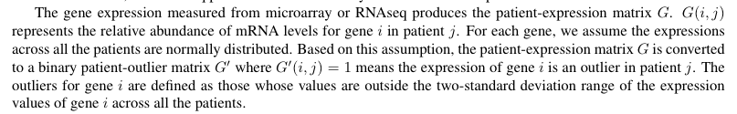
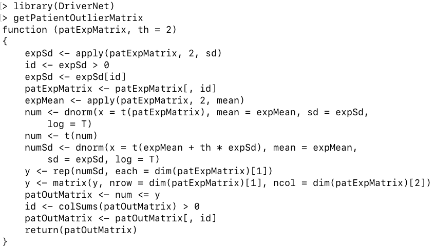
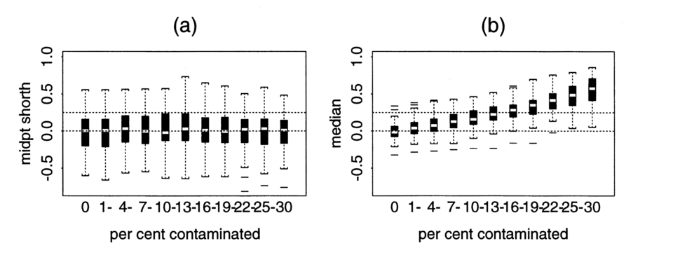
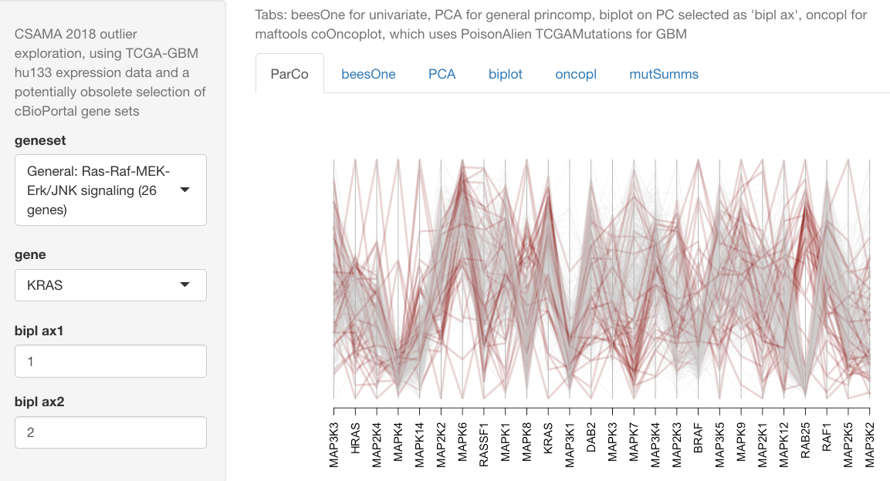
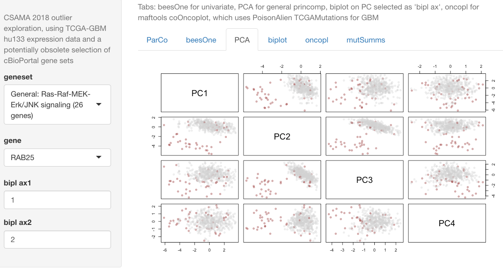
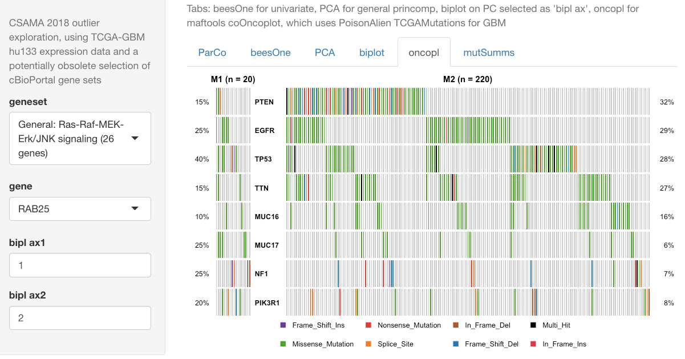

```{r dop,echo=FALSE}
library(parody)
library(ggplot2)
library(beeswarm)
options(digits=4)
```

## Overview

- Applications of the outlier concept: IvyGlimpse, DriverNet 
- Critique of simplistic outlier labeling; alternatives
    - robustness vs. efficiency tradeoff
    - inward peeling, outward testing: formal univariate and multivariate outlier identification
- Relating tumor expression profiles, multivariate outlier identification,
and mutation patterns in TCGA-GBM

## Example 1: Image analysis in glioblastoma


## A cohort of image annotations, grab from the tail


## Expression patterns for included/excluded


## Upshots

- Annotation of tumor images is an expensive process, and
use of annotated features for prediction is highly desirable

- In the scatterplot of (normalized areas) CT vs CTHBV, we see that CTHBV
scores have a skewed distribution

- Individuals contributing images in the tail of this distribution seem
to have relatively shorter survival times

- Marginal distributions of expression for genes are summarized
using boxplots

- Careful analysis of image features, expression patterns, and
their clinical correlates must reflect complexities of design; see the
IvyGAP white paper

## Example 2: DriverNet (from the lab of Sohrab Shah)



## EGFR mutation associated with extreme expression values in diverse genes



## Overall DriverNet schema


## Outliers for DriverNet



## Patient-outlier code: default threshold is 2 SD from mean



## Comments

- DriverNet algorithm used in the most recent catalog
of driver mutations in cancer


## Comments (2)

- The two-standard deviation rule does not identify outliers
specifically

- It reliably identifies observations with values of relatively
large magnitude in an approximately Gaussian population

- In other situations the **non-robustness** of mean and standard
deviation vitiates straightforward interpretation of the procedure 

- Robust estimation methods depend on technical definitions
    - intuitively, robust estimators retain interpretations of their
non-robust counterparts under weaker assumptions about
the underlying populations

## Location estimator

- Location estimators answer questions like: Around what value $m$ can we expect observations to vary, with
approximately equal numbers above and below $m$?
    - Gaussian population: choose $m = \bar{x}$, the sample mean
    - more generally: choose $m = \mbox{med}~x$, the sample
median
        - the median achieves the goal by definition
        - if the Gaussian population assumption is correct, the
median is more variable than the mean (constitutes less _efficient_ use
of the information)
        - this is a simple illustration of the robustness vs. efficiency tradeoff

## Location estimation: median loses information in ideal case, but is less sensitive to "contamination"

```{r dopl, echo=FALSE}
par(mfrow=c(2,1))
hist(replicate(10000, mean(rnorm(50))), freq=FALSE, xlim=c(-1,1), 
   main="N=50, x~N(0,1)")
lines(density(replicate(10000, mean(c(rnorm(50))))))
lines(density(replicate(10000, median(c(rnorm(50))))), lty=2, col="red")
hist(replicate(10000, mean(rnorm(50))), freq=FALSE, xlim=c(-1,1), 
   main="N=49, x~N(0,1); N=1, x=4.5")
lines(density(replicate(10000, mean(c(rnorm(50),4.5)))))
lines(density(replicate(10000, median(c(rnorm(50),4.5)))), lty=2, col="red")
```

## Median has breakdown bound 50% but is still affected by contaminants; midpoint of shorth is more robust



## Relation to outlier identification

- Basic intuition: outliers $x$ have large values of $|x-c|/s$ where
$c$ locates the center of the **inlier** distribution and $s$
measures the scale of the **inlier** distribution
- Simple rules for determining the center of a distribution
are likely to fail if outliers are present
    - simple linear estimator (mean) has zero **breakdown bound**: a single
observation can exert arbitrarily large influence
    - median has breakdown bound 50%: will only take arbitrary
values if 50% or more of the data are contaminated
    - intermediate estimators: trimmed means, winsorized means

## Scale estimation

- SD has zero breakdown bound
- IQR has breakdown bound 25% -- related to boxplot display
- MAD (median absolute deviation) has breakdown bound 50%
- Proposal of Tibshirani and Hastie (Biostatistics 2007): 
    - use (x - median)/MAD(controls) to standardize all observations 
    - define high outliers using the 75th percentile + IQR of this standardized expression value
    - define low outliers using the 25th percentile - IQR
    - choose the largest outlier sum as a measure of outlier-proneness of genes

## More systematic approaches

- Formalize the outlier concept: 
    - a base population distribution exists and is identified 
    - outliers are observations unlikely to be members of the base population
- Control the probability of "Type I error": declaring an observation
to be an outlier when it is actually an observation from the base
population
- Deal explicitly with the fact that multiple outliers can have
effects that are more complex than those induced by single outliers
- Consider the concept of **multivariate outlyingness**

## The Extreme Studentized Deviate and a "peeling" sequence

Given $n$ observations, define the ESD as follows:

   - $x_1, \ldots x_n$ have sample mean $\bar{x}$ and sample
standard deviation $s$.
   - the sample value $x$ maximizing the quantity $|x-\bar{x}|/s$
is denoted the ESD

A sequence of $k$ subsamples and deviates is generated by repeating
this process on the $n-1$, $n-2, \ldots, n-k$ sized subsets created
by excluding the associated ESD

At each stage a new sample mean and standard deviation are computed
and used

## Inward peeling illustrated

Large negative outlier masks multiple positive ones for the
mean $\pm$ 2SD approach.  Red dots are points corresponding to stagewise ESD

```{r lkpeel, echo=FALSE}
set.seed(1234)
esdind = function(x) which.max(abs(x-mean(x))/sd(x))

bsseq = function(x=rnorm(20), k=5) {
  par(mfrow=c(1,k+1), mar=c(4,7,2,2), mai=c(.2,.4,.2,.2))
  yl = range(x)+c(-.5,.5)
  beeswarm(x, ylab="observed data", ylim=yl, axes=FALSE,
     pch=19, cex=1.4, cex.lab=1)
  axis(2)
  mx = mean(x)
  sx = sd(x)
  abline(h=mx, lwd=2)
  abline(h=mx-2*sx, lty=2, lwd=2)
  abline(h=mx+2*sx, lty=2, lwd=2)
  for (i in 1:k) {
    dr = esdind(x)
    col = rep("blue", length(x))
    col[dr] = "red"
    beeswarm(x, pwcol = col, ylim=yl, axes=FALSE,
     pch=19, cex=1.4, main=paste("k =", i))
    mx = mean(x)
    sx = sd(x)
    abline(h=mx, lwd=2)
    abline(h=mx-2*sx, lty=2, lwd=2)
    abline(h=mx+2*sx, lty=2, lwd=2)
    x = x[-dr]
    }
}
set.seed(1234); bsseq(kp <- c(rnorm(20),5,5.1,5.2,-7.4))
```

## Outward testing: parody::calout.detect(meth="GESD")

- Once we have found the sequence of ESDs/truncated samples,
we test, from the inside out, each ESD for compatibility with the
"inlier" distribution using the inlier mean and standard deviation

- The critical values for this sequential procedure are available

    - for finite samples, by simulation
    - for large samples, using formalism in Rosner, Technometrics 1983 

- The thresholds provided bound to any desired level the probability of falsely
labeling as an outlier a member of the base population, allowing tests for up to half the sample size

- When one ESD is deemed an outlier, it is joined in this 
characterization by all the more extreme deviates identified
earlier in the peeling process

## Upshots

- Don't use naive approaches to outlier labeling
- Robust location and scale estimation methods have a long
history and interesting variations
- Of greater interest: multivariate analog of GESD

## mv.calout.detect: GESD sequence for multivariate Gaussian population (Caroni+Prescott JRSS-C 1992)


## The peeling process for contaminated BVN

```{r lklk,echo=FALSE}
library(MASS)
set.seed(1234)
bivo = biv = mvrnorm(100, c(0,0), diag(2))
biv[1,] = bivo[1,] = c(5,3)
cands = c(1L, 100L, 78L, 92L, 81L, 62L, 20L, 75L, 38L, 35L, 4L, 74L, 93L, 
59L, 66L, 57L, 86L, 37L, 95L, 23L, 41L, 67L, 47L, 53L, 25L, 42L, 
71L, 98L, 69L, 68L, 83L, 28L, 31L, 70L, 56L, 87L, 85L, 3L, 94L, 
99L, 15L, 61L, 51L, 77L, 27L, 5L, 24L, 6L, 96L, 26L)
chull = function(x,y=NULL) {cc = grDevices::chull(x,y); c(cc, cc[1])}
par(mfrow=c(2,3), mar=c(4,3,2,2),cex=1.5)
plot(biv, xlab=" ", ylab=" ", axes=FALSE, xlim=c(-3.5,6), ylim=c(-3,3.2))
points(bivo[cands[1],1], bivo[cands[1],2], col="red", pch=19)
axis(1)
axis(2)
lines(biv[chull(biv),])
for (i in 2:6) {
  biv = bivo[-cands[1:(i-1)],]
  plot(biv, xlab=" ", ylab=" ", axes=FALSE, xlim=c(-3.5,6), ylim=c(-3,3.2))
  points(bivo[cands[i],1], bivo[cands[i],2], col="red", pch=19)
  axis(1)
  axis(2)
  lines(biv[chull(biv),])
}
```

## Recap

- Sequential peeling: find the most extreme data point using
efficient estimation of location and scale, peel it away,
and repeat, until only half the data remains
- Outward testing: Establish criteria that bound the probability 
of erroneously declaring an outlier to be present through
the sequence of tests
- Works in univariate and multivariate settings
- Alternatives to Gaussian base model?

## Multivariate expression outliers in glioblastoma
  


## Discordance of labeling procedures for RAB25


## PCA for 26 genes, coloring multivariate outliers



## Mutation burdens for expression outliers/inliers



## Conclusions

- Robust statistical methods are extremely useful in modern genomics
- Systematic identification of unusual data configurations is a continual concern
    - quality issues
    - search for mechanisms underlying variability
- We've focused on robust estimation (high breakdown bound)
    - univariate location (median), scale (MAD, length of shorth)
    - multivariate scale (covariance of peeled dataset)
    - there are many other options
- Application: are aberrant expression patterns readily linked to distinctive patterns of somatic mutation?
    - not low-hanging fruit: outlier cohort likely an amalgam of diverse
mutational events
    - these pieces can be combined with other omics and clinical data fairly easily to test more compelling hypotheses

## References and software

