```{r setup, include=FALSE}
# options(htmltools.dir.version = FALSE)
knitr::opts_chunk$set(cache = FALSE, error = FALSE, message = FALSE,
                      warning = FALSE, echo = FALSE, results = "hide",
                      fig.align = "center", fig.width = 4.7, fig.height = 3,
                      eval = TRUE)

library(zinbwave)
library(scater)
library(edgeR)
library(airway)
library(scater)
library(BiocSingular)
library(DelayedArray)
library(dplyr)
library(ggplot2)
theme_set(theme_classic())
```

# Introduction

## Single-cell RNA-seq

```{r, results="asis", out.width="80%", out.height="75%"}
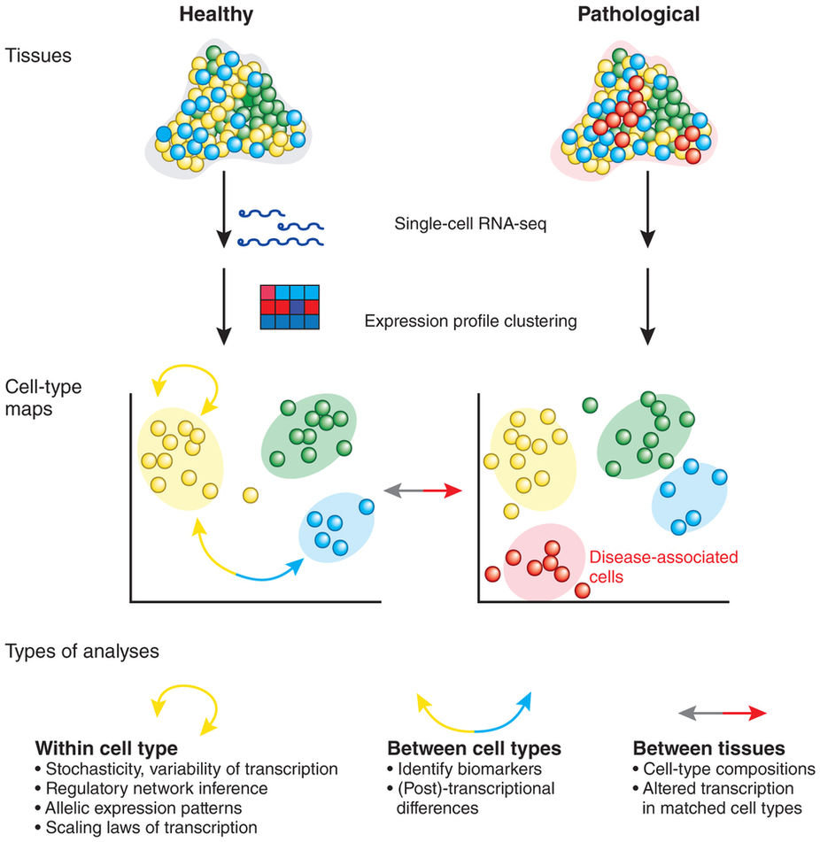
```

\flushright{{\footnotesize Sandberg (2014). \textit{Nature Methods}}}

## Single-cell signal is noisy

```{r, results="asis", out.width="90%"}
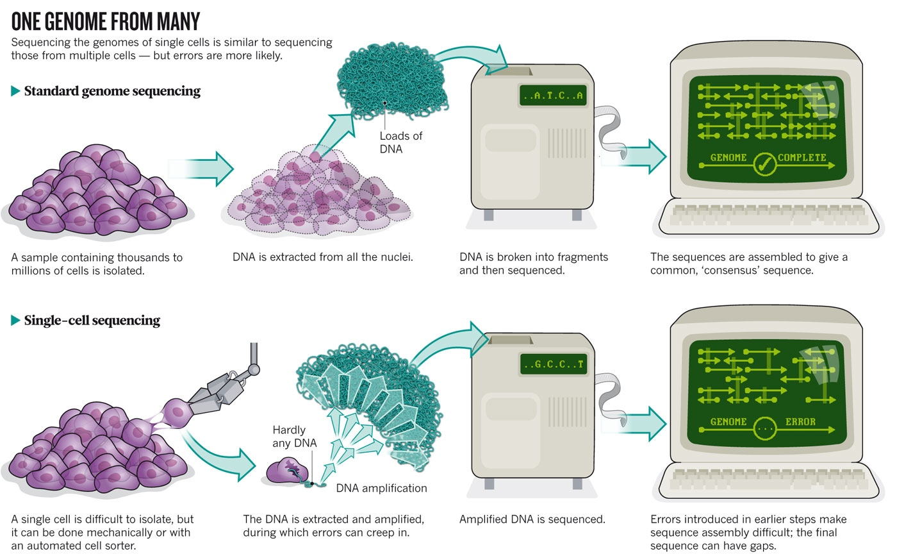
```

\flushright{{\footnotesize Owens (2012). \textit{Nature}}}

## Single-cell data let us ask new questions

```{r, results="asis", out.width="77%"}
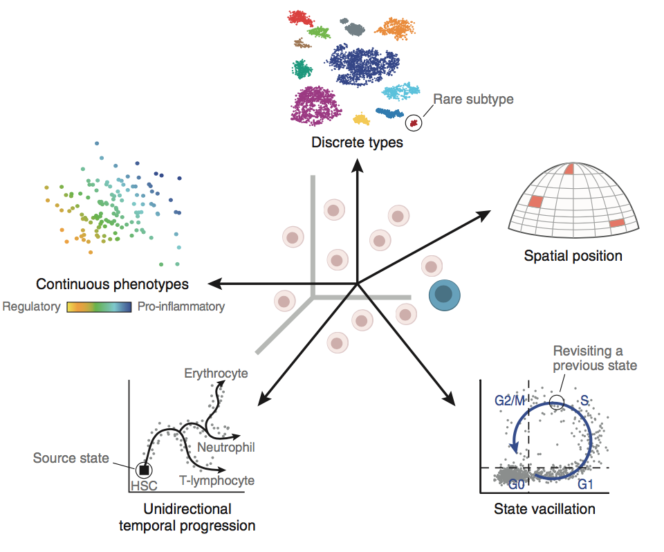
```

\flushright{{\footnotesize Wagner, Regev, Yosef (2016). \textit{Nature Biotechnology}}}

## Single-cell data meets big data

```{r, results="asis", out.width="100%"}
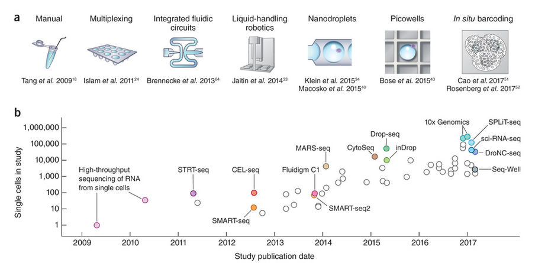
```

\flushright{{\footnotesize Svensson, Vento-Tormo, Teichmann (2018). \textit{Nature Protocols}}}

## Single-cell meets big data

- BRAIN Initiative "mini" brain atlas

    - $340{,}000$ cells and nuclei from the Mouse Primary Motor Cortex
    - Plans to sequence 3M cells for the whole brain (less than $1\%$).

- The Human Cell Atlas "preview" dataset

    - $530{,}000$ cells from umbilical cord blood and bone marrow
    - Millions expected "soon".

\vspace{1cm}

\begin{columns}

\begin{column}{.5\linewidth}

```{r, results="asis", out.width="50%"}

```

\end{column}
\begin{column}{.5\linewidth}

```{r, results="asis", out.width="100%"}

```

\end{column}
\end{columns}

## A typical workflow

```{r, results="asis", out.width="100%", eval=TRUE}
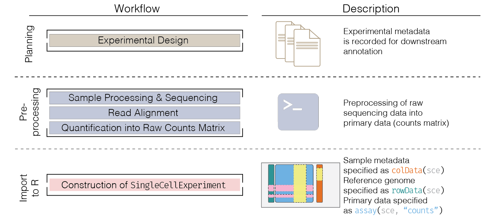
```

## A typical workflow

```{r, results="asis", out.width="100%", eval=TRUE}
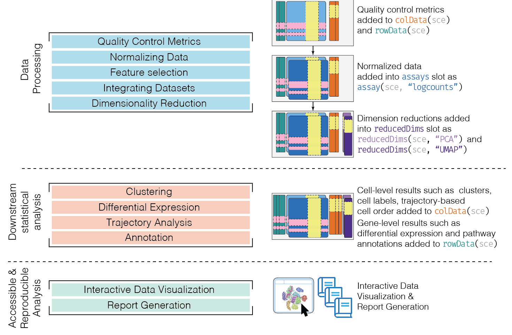
```

## The `SingleCellExperiment` class

```{r, results="asis", out.width="100%"}
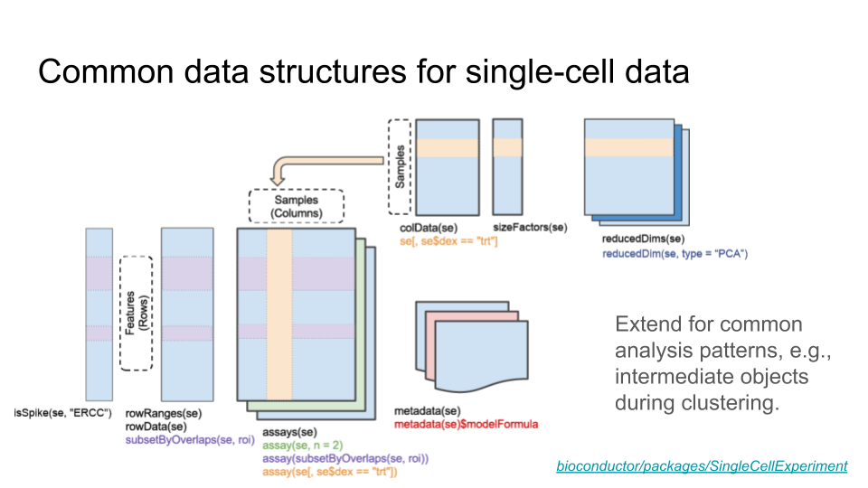
```

## The `SingleCellExperiment` class

```{r}
if(!file.exists("data/sce.rds")) {
    sce1 <- TENxPBMCData::TENxPBMCData("frozen_pbmc_donor_a")
    sce2 <- TENxPBMCData::TENxPBMCData("frozen_pbmc_donor_b")
    sce <- cbind(sce1, sce2)
    
    ribo_idx <- grep("^RPL", rowData(sce)$Symbol)
    mito_idx <- grep("^MT", rowData(sce)$Symbol)

    set.seed(244)
    sce <- sce[, sample(seq_len(ncol(sce)), 1000)]
    counts(sce) <- as.matrix(counts(sce))

    sce <- scater::calculateQCMetrics(sce, feature_controls = list(ribo = ribo_idx, mito = mito_idx))
    num_reads <- 1
    num_cells <- 0.05*ncol(sce)
    keep <- which(rowSums(counts(sce) >= num_reads ) >= num_cells)
    sce <- sce[keep,]
    
    sce <- scater::normalize(sce)

    vars <- rowVars(logcounts(sce))
    names(vars) <- rownames(sce)
    vars <- sort(vars, decreasing = TRUE)
    
    for_pca <- t(logcounts(sce)[names(vars)[1:1000],])
    
    pca <- BiocSingular::runPCA(for_pca, rank = 10,
                                scale = TRUE,
                                BSPARAM = RandomParam(deferred = FALSE))
    
    reducedDim(sce, "PCA") <- pca$x
    # sce <- runTSNE(sce, use_dimred = "PCA")
    colnames(sce) <- paste0("Cell", seq_len(ncol(sce)))
    sce <- zinbsurf(sce, K = 10, X = "~Sample + pct_counts_mito + pct_counts_ribo", which_genes = names(vars)[1:100])
    
    dir.create("data")
    saveRDS(sce, file="data/sce.rds")
} else {
    sce <- readRDS("data/sce.rds")
}
```

\small

```{r, echo=TRUE, results='markup'}
sce
```

## Resources

- A step-by-step workflow for low-level analysis of single-cell RNA-seq data with Bioconductor
    - https://f1000research.com/articles/5-2122/v2
- Bioconductor workflow for single-cell RNA sequencing
    - https://f1000research.com/articles/6-1158/v1
- [github.com/seandavi/awesome-single-cell](https://github.com/seandavi/awesome-single-cell)
- [scrna-tools.org](https://www.scrna-tools.org)
- Seurat
    - https://satijalab.org/seurat/
- Bioconductor workshop materials
    - https://bioconductor.org/help/course-materials/
- Orchestrating Single Cell Analysis review
    - https://www.biorxiv.org/content/10.1101/590562v1.abstract
    - https://osca.bioconductor.org

# Model specification

##

```{r, results="asis", out.width="77%"}
knitr::include_graphics("img/extrapolating.png")
```

## Statistical Inference

Statistical inference is the process of _learning some properties of the population_
starting _from a sample_ drawn from this population.

For instance, we may be interested in learning about the difference in the gene expression of immune cells among cancer patients, but we cannot measure the whole population.

We can however measure the expression of a _random sample_ of the population
and then _infer_ or generalize the results to the entire population.

## Statistical Inference

There are some terms that we need to define.

- The _data generating distribution_ is the _unknown_ probability distribution that generates the data.
- The _empirical distribution_ is the _observable_ distribution of the data in the sample.

We are usually interested in a _function_ of the data generating distribution.
This is often referred to as _parameter_ (or the parameter of interest).

We use the sample to estimate the parameter of interest, using a function of the
empirical distribution, referred to as _estimator_.

## Data generating distribution

The data generating distribution is unknown.

However, we can make _some assumptions_ about it. 
These assumptions are sometimes based on domain knowledge or on 
mathematical convenience.

One commonly used strategy is to assume a _family of distributions_ for the data
generating distribution, for instance the _Gaussian distribution_.

## Data generating distribution for RNA-seq

The sequencing process can be seen as a _simple random sampling_ of the reads along the genome.

Hence, if we sequence a total number $w$ of reads, we can model the number of reads mapped to a gene $j$ as
$$ 
X_j \sim Bi(w, p_j = \theta_j \, l_j), 
$$
where $p_j$ is proportional to the _number of RNA copies_ for gene $j$ ($\theta_j$) and to its length ($l_j$).

Since $w$ is big and $p_j$ is small, the binomial is well approximated by the Poisson distribution
$$
X_j \sim Poi(\lambda = w \, \theta_j \, l_j)
$$

## Poisson approximation

```{r, results="asis", out.width="77%"}
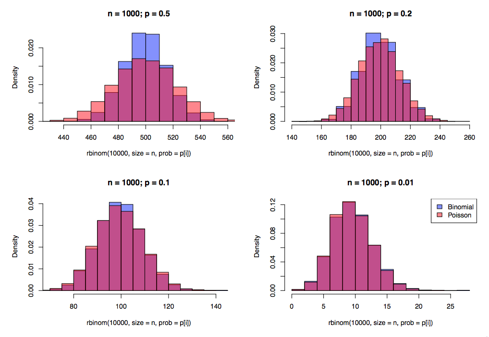
```

## Overdispersion

The Poisson distribution has one important property:
$$
E[Y] = Var(Y) = \lambda.
$$

Because of biological variability, RNA-seq counts exhibit higher variance, leading to _overdispersion_.

## Overdispersion

```{r}
data(airway)

dge <- DGEList(assay(airway))
dge <- calcNormFactors(dge)

design <- model.matrix(~ dex, data = colData(airway))
dge <- estimateDisp(dge, design)

plotMeanVar(dge, show.raw.vars = TRUE, show.ave.raw.vars = TRUE, ylab = "Variance (log10 scale)")
```

## The negative binomial distribution

For any $\mu\geq 0$ and $\phi>0$, the probability mass function
(PMF) of the negative binomial (NB) distribution is 

$$
f_{NB}(y;\mu,\phi) = \frac{\Gamma(y+\phi^{-1})}{\Gamma(y+1)\Gamma(\phi^{-1})} \left(\frac{1}{1+\mu\phi}\right)^{\phi^{-1}} \left(\frac{\mu}{\mu + \phi^{-1}}\right)^y, \quad \forall y\in\mathbb{N}.
$$


The mean of the NB distribution is $\mu$ and its variance is:
$$
\quad Var(Y) = \mu + \phi \, \mu^2.
$$
In particular, the NB distribution boils down to a Poisson
distribution when $\phi \to 0$.

## Interpretation in the context of RNA-seq

The negative binomial can be derived as a _Gamma-Poisson mixture_.

$$
Y | \lambda \sim Poi(\lambda)
$$

e 
$$
\lambda \sim Ga\left(\frac{1}{\phi}, \frac{1}{\phi \mu}\right)
$$
hence
$$
Y \sim NB(\mu, \phi).
$$

## Interpretation in the context of RNA-seq

In other words,

- $\lambda_{ij}$ can be interpreted as the true (unobserved) value of gene $j$ in sample $i$;

- For each gene $j$, $\lambda_{ij}$ varies between samples according to a Gamma distribution (biological variation).

- The observed counts, $Y_{ij}$  are the results of biological variation + technical variation due to the sequencing process, which can be modeled as a Poisson.

## Interpretation in the context of RNA-seq

Recall the the variance function can be written as
$$
V(\mu) = \mu + \phi \mu^2.
$$

Dividing for the square of the expected value, we obtain the square of the _coefficient of variation_.

$$
CV^2 = \frac{1}{\mu} + \phi.
$$

$CV^2$ can be interpreted as the sum of two terms:

- The first, given by the Poisson distribution, describes technical variability and tends to 0 as we sequence more reads;
- The second, which does not depend on the mean, represents biological variability.

## Interpretation in the context of RNA-seq

```{r}
plotMeanVar(dge, show.raw.vars = TRUE, show.ave.raw.vars = TRUE,
            NBline = TRUE, ylab = "Variance (log10 scale)")
```

## Enters single-cell RNA-seq

```{r, results="asis", out.width="100%"}
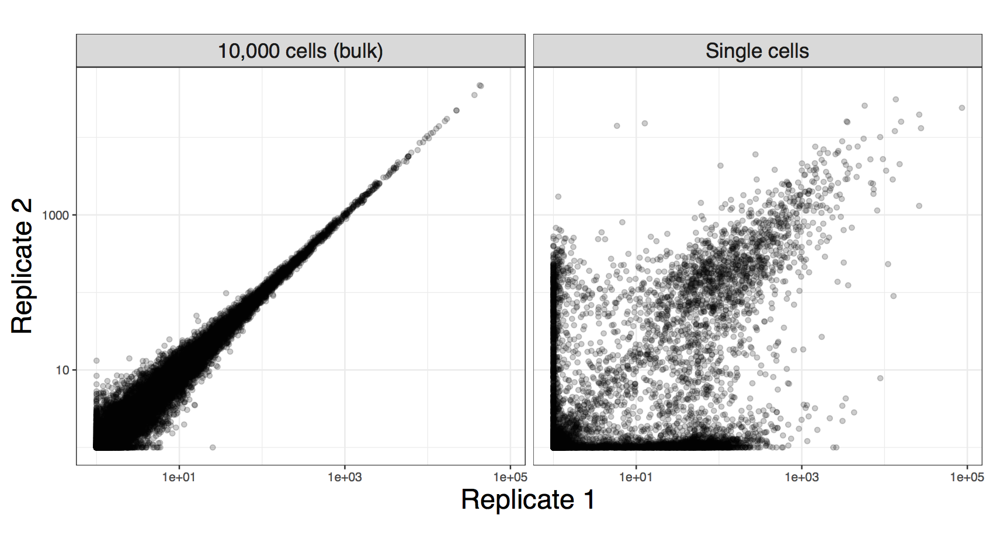
```

## Single-cell data have more zeros than bulk RNA-seq

```{r, results="asis", out.width="100%"}
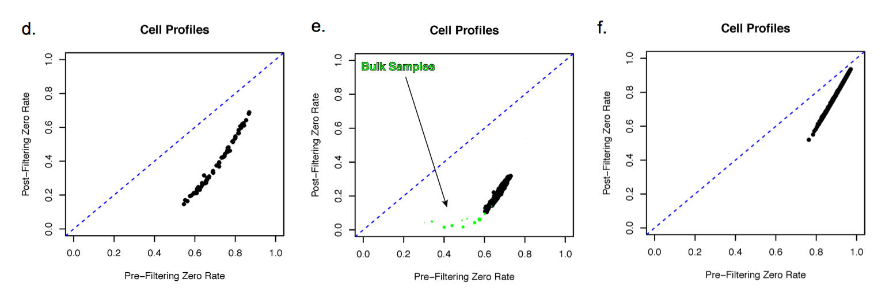
```

\flushright{{\footnotesize Cole et al. (2019). \textit{Cell Systems}}}

## The zero-inflated negative binomial

For any $\pi\in[0,1]$, 
the PMF of the zero-inflated negative binomial (ZINB) distribution is
given by

$$
f_{ZINB}(y;\mu,\theta, \pi) = \pi \delta_0(y) + (1 - \pi) f_{NB}(y;\mu,\theta), \quad \forall y\in\mathbb{N},
$$

where $\delta_0(\cdot)$ is the Dirac function. 

Here, $\pi$ can be interpreted as the probability that a $0$ is observed instead of the actual count, resulting in an inflation of zeros compared to the NB distribution, hence the name ZINB.

## Single-cell RNA-seq read counts

```{r, results="asis", out.width="100%"}
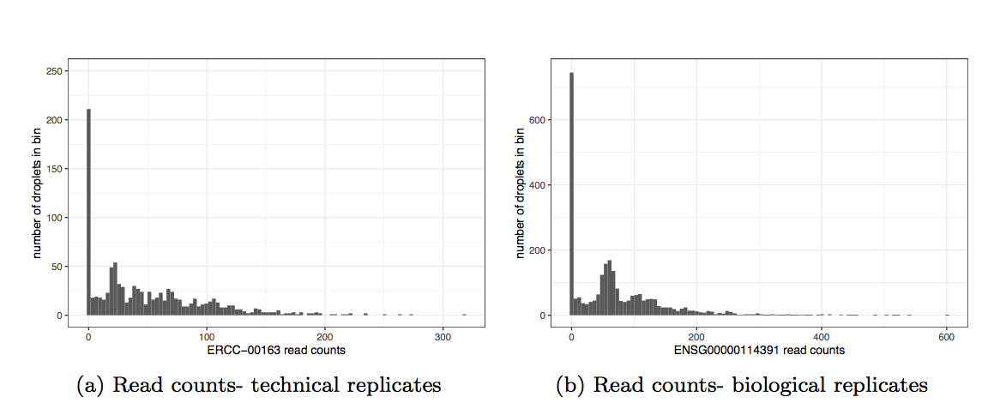
```

\flushright{{\footnotesize Townes et al. (2019). \textit{bioRxiv}}}

## UMIs help!

```{r, results="asis", out.width="100%"}
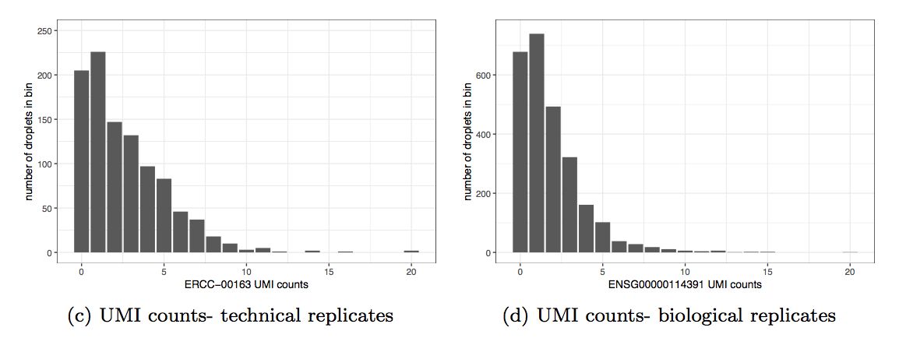
```

\flushright{{\footnotesize Townes et al. (2019). \textit{bioRxiv}}}

## Log transformation does not!

```{r, results="asis", out.width="100%"}
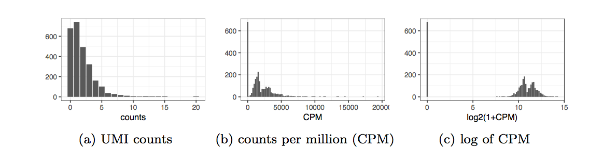
```

\flushright{{\footnotesize Townes et al. (2019). \textit{bioRxiv}}}

## Do we need to account for the extra zeros in the model?

- Non-UMI data: yes!

- UMI data: probably not...

Recent results suggest that in UMI data, in particular in droplet-based data, zero-inflation may not be an important issue.

## Do we need to account for the extra zeros in the model?

```{r, results="asis", out.width="100%"}
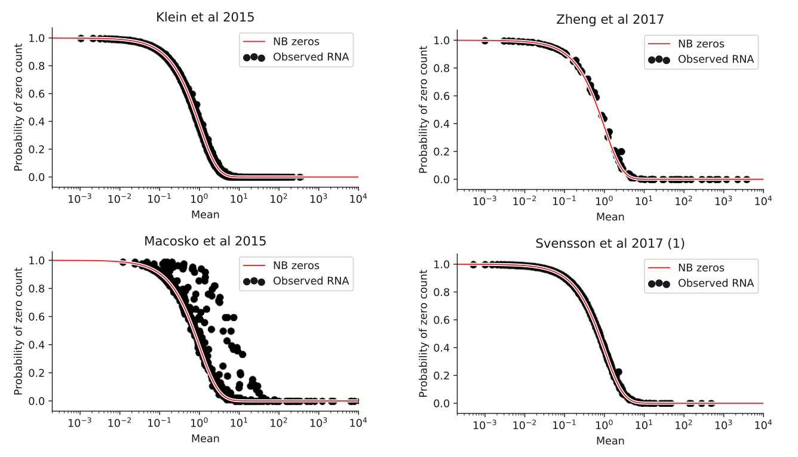
```

\flushright{{\footnotesize Svensson (2019). \textit{bioRxiv}}}

# Quality Control and Filtering

##

```{r, results="asis", out.width="100%"}

```

## Quality Control and Filtering

Exploratory data analysis (EDA) and quality control (QC) are of utmost importance in genomics.

\bigskip

With single cell data we have the luxury of having a large number of samples, hence we can filter out low quality cells as well as lowly expressed genes.

\bigskip

There are some simple metrics that we can compute as a proxy of the quality of the samples.

## Identifying empty droplets

```{r, results="asis", out.width="100%"}
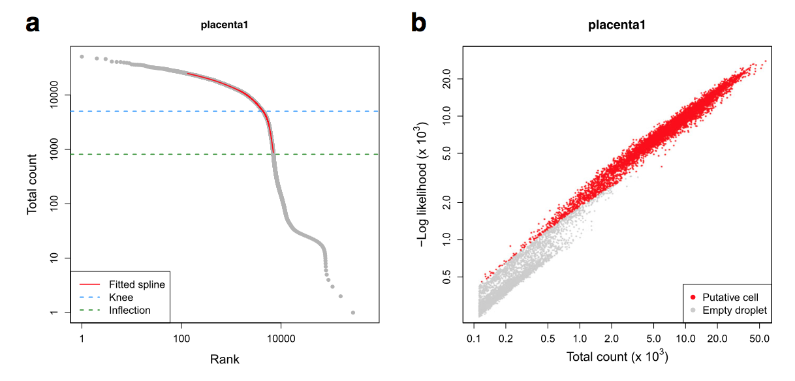
```

\flushright{{\footnotesize \textit{DropletUtils Bioconductor package}}}

## Computing QC metrics

```{r, echo=TRUE, eval=FALSE}
sce <- TENxPBMCData::TENxPBMCData("pbmc4k")
sce <- scater::calculateQCMetrics(sce)
```

## Filtering genes and samples

```{r, results="asis", out.width="100%"}
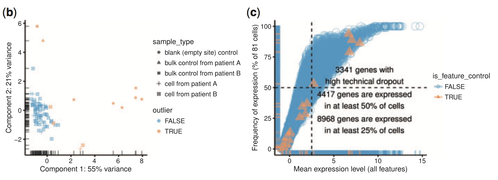
```

\flushright{{\footnotesize \textit{scater Bioconductor package}}}

## Exploring batch effects

```{r, results="asis", out.width="100%"}
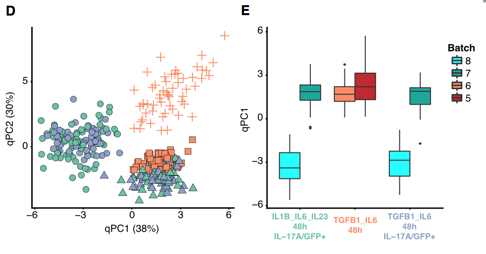
```

\flushright{{\footnotesize \textit{scone Bioconductor package}}}

# Normalization

##

```{r, results="asis", out.width="77%"}
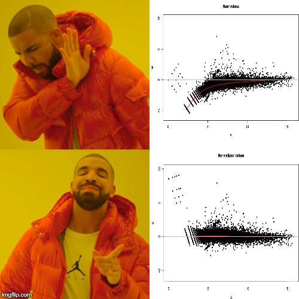
```

## Normalization

As with bulk RNA-seq, it is important to account for the differences in sequencing depth and the other biases that may affect the expression levels.

```{r, results="asis", out.width="100%"}
knitr::include_graphics("img/norm.png")
```

\flushright{{\footnotesize Vallejos et al (2017). \textit{Nature Methods}}}

## Bulk RNA-seq normalization do not always work

```{r, results="asis", out.width="77%"}
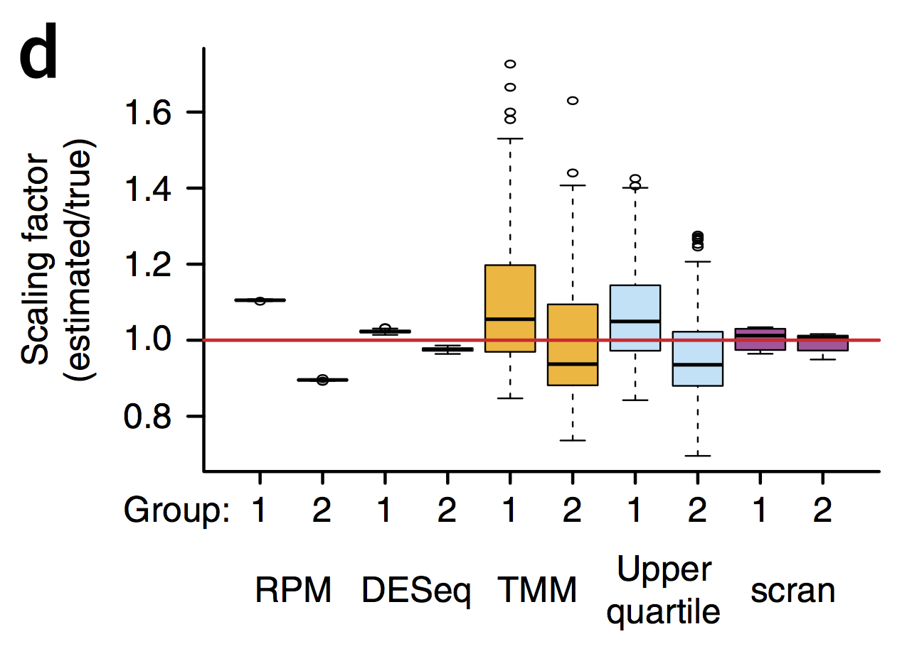
```

\flushright{{\footnotesize Vallejos et al (2017). \textit{Nature Methods}}}

## Pooling across cells helps

```{r, results="asis", out.width="90%"}
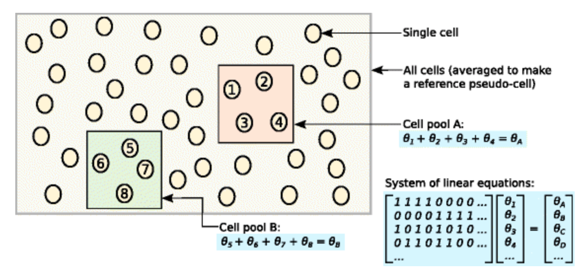
```

\flushright{{\footnotesize \textit{scran Bioconductor package}}}

## Non-linear normalization

```{r, results="asis", out.width="100%"}
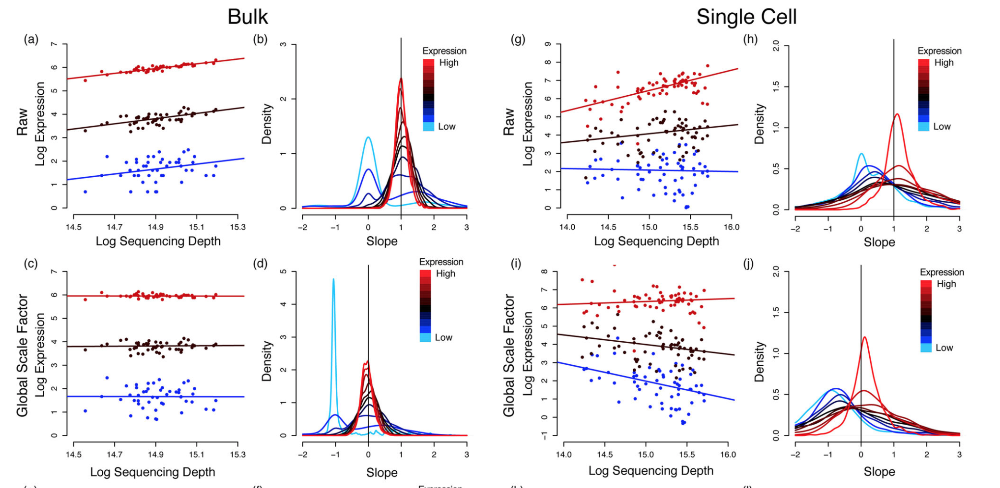
```

\flushright{{\footnotesize \textit{SCnorm Bioconductor package}}}

## Ranking normalization by performance

```{r, results="asis", out.width="60%"}
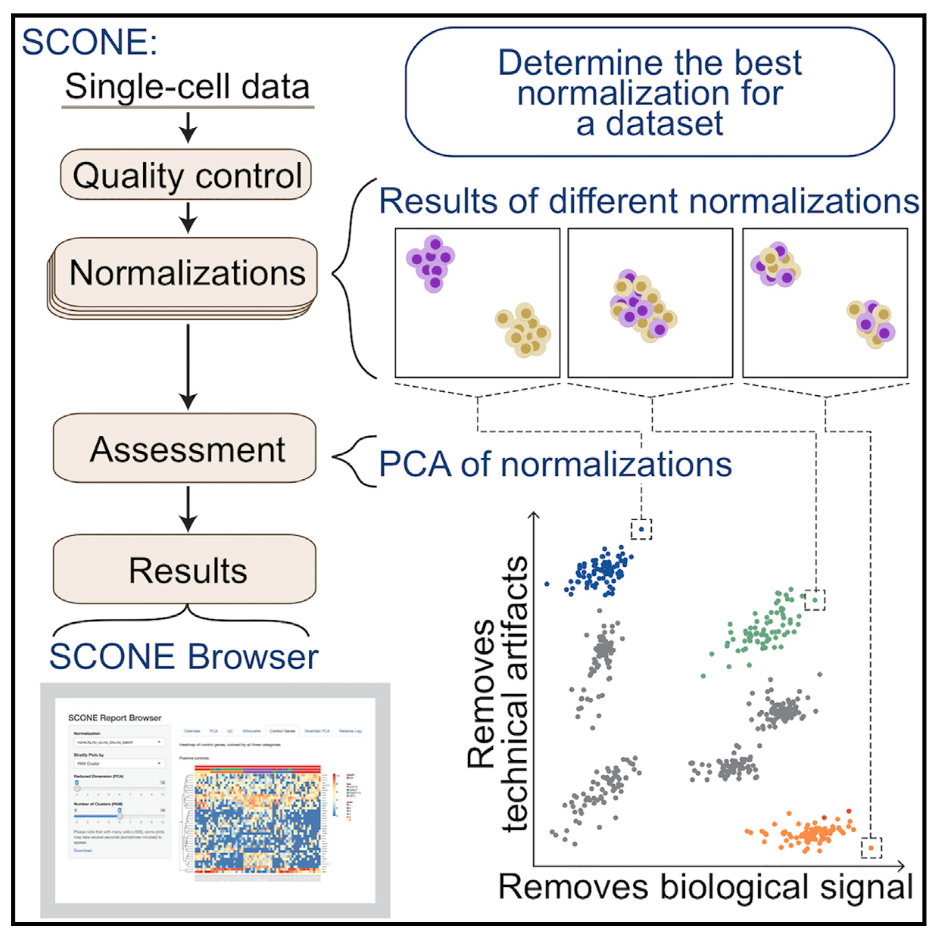
```

\flushright{{\footnotesize \textit{scone Bioconductor package}}}

## Model-based approach

An alternative, is to include normalization as a parameter of the statistical model.

This has the advantage of propagating the uncertainty in the estimation of the scaling factors.

This is the approach of the _BASiCS_ and _zinbwave_ Bioconductor packages.

# Dimensionality reduction

##

```{r, results="asis", out.width="77%"}
knitr::include_graphics("img/fuck_grapefruit.png")
```

## Dimensionality reduction

Dimensionality reduction is useful for two related goals

1. _Visualize_ high dimensional data (usually in two dimensions)
    - PCA
    - t-SNE
    - UMAP
    
2. _Infer_ low-rank signal from high dimensional data (2 -- 50 dimensions)
    - PCA as a factor analysis model
    - ZIFA
    - ZINB-WaVE
    
## Principal Component Analysis (PCA)

_Principal component analysis_ (PCA) is a dimensionality reduction technique that provides a parsimonious summarization of the data by replacing the original variables by fewer _linear combinations_ of these variables, that are _orthogonal_ and have successively _maximal variance_.  

\bigskip
Such linear combinations seek to "separate out" the observations, while loosing as little information as possible.

## Sample quality affects PCA

```{r}
df <- data.frame(reducedDim(sce, "PCA")[,1:2],
                 Batch = sce$Sample,
                 TotReads = sce$log10_total_counts,
                 TotGenes = sce$log10_total_features_by_counts)

ggplot(df, aes(x = PC1, y = PC2, color = TotReads)) +
  geom_point(size = .5) + scale_color_continuous(low = "blue", high = "yellow") -> pca1
pca1 + ggtitle("12K PBMC (10X Genomics)")
```

## Batch effects!

```{r}
ggplot(df, aes(x = PC1, y = PC2, color = Batch)) +
  geom_point(size = .5) + scale_color_brewer(palette = "Set1") -> pca2
pca2 + ggtitle("12K PBMC (10X Genomics)")
```

## Desired properties

> - Accounting for zero inflation (dropouts), over-dispersion, and the count nature of the data.

> - General and flexible.

> - Extract low-dimensional signal from the data.

> - Adjust for complex, non-linear effects (batch effects)

> - Scalable


## The ZINB-WaVE model

Given $n$ samples and $J$ genes, let
$Y_{ij}$ denote the count of gene $j$ (for $j=1,\ldots,J$) for
sample $i$ (for $i=1,\ldots,n$). 

```{r, results="asis", out.width="100%"}
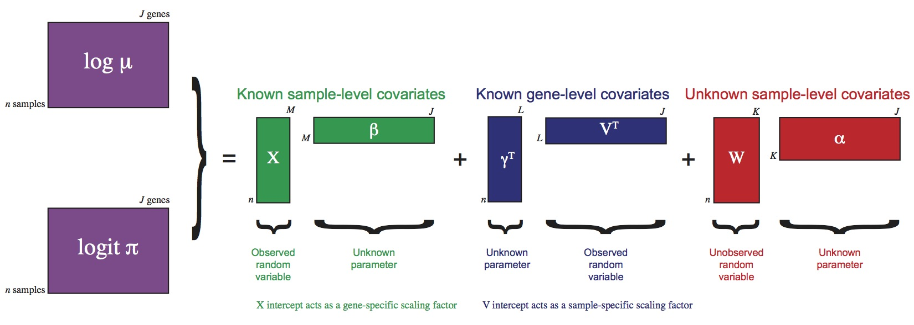
```

## Sample quality affects PCA

```{r}
qc <- as.matrix(colData(sce)[,c("log10_total_features_by_counts", "log10_total_counts", "pct_counts_in_top_50_features", "pct_counts_in_top_100_features", "pct_counts_in_top_200_features", "pct_counts_in_top_500_features", "pct_counts_mito", "pct_counts_ribo")])

pca <- reducedDim(sce, "PCA")
cors <- lapply(1:5, function(i) abs(cor(pca, qc, method="spearman")))
cors <- unlist(cors)
bars <- data.frame(AbsoluteCorrelation=cors,
                   QC=factor(rep(colnames(qc), 5), levels=colnames(qc)),
                   Dimension=as.factor(rep(paste0("PC", 1:5), each=ncol(qc))))

bars %>%
  ggplot(aes(Dimension, AbsoluteCorrelation, group=QC, fill=QC)) +
  geom_bar(stat="identity", position='dodge') +
  scale_fill_brewer(palette = "Set1") + ylim(0, 1) +
  theme(legend.text=element_text(size=6)) + ggtitle("PCA")
```

## ZINB-WaVE adjusts for quality

```{r}
W <- reducedDim(sce, "zinbwave")
cors <- lapply(1:5, function(i) abs(cor(W, qc, method="spearman")))
cors <- unlist(cors)
bars <- data.frame(AbsoluteCorrelation=cors,
                   QC=factor(rep(colnames(qc), 5), levels=colnames(qc)),
                   Dimension=as.factor(rep(paste0("W", 1:5), each=ncol(qc))))

bars %>%
  ggplot(aes(Dimension, AbsoluteCorrelation, group=QC, fill=QC)) +
  geom_bar(stat="identity", position='dodge') +
  scale_fill_brewer(palette = "Set1") + ylim(0, 1) +
  theme(legend.text=element_text(size=6)) + ggtitle("zinbwave")
```

## Evident batch effects

```{r}
pca2 + ggtitle("PCA")
```

## ZINB-WaVE adjusts for batch effects

```{r}
df3 <- data.frame(Z1 = reducedDim(sce, "zinbwave")[,1],
                  Z2 = reducedDim(sce, "zinbwave")[,2],
                  Batch = sce$Sample)

ggplot(df3, aes(x = Z1, y = Z2, color = Batch)) +
  geom_point(size = .5) + scale_color_brewer(palette = "Set1") +
    ggtitle("zinbwave")
```

## ZINB-WaVE adjusts for batch effects

```{r, eval=FALSE, echo=TRUE}
library(zinbwave)

sce <- zinbwave(sce, X = "~batch", K = 10)
```

## GLM-PCA

In droplet-based data, it might be safe to ignore zero inflation.

\bigskip
We can of course use a simpler "NB-WAVE" model.

\bigskip
Alternatively, we can exploit the fact that the negative binomial distribution (with known dispersion) belongs to the exponential family.

\bigskip
The GLM-PCA method is a generalization of PCA for the exponential family.

\bigskip
Townes et al. (2019) propose a fast approximation to GLM-PCA based on deviance residuals that is much faster than ZINB-WAVE and gives comparable results.

## Approximate PCA

Even regular PCA is not scalable enough to very large datasets (millions of cells) and approximations are needed.

\bigskip

The _BiocSingular_ package provides implementations of the random PCA algorithm and the implicitly restarted Lanczos bidiagonalization algorithm (IRLBA).

# Lineage Inference

##

```{r, results="asis", out.width="77%"}
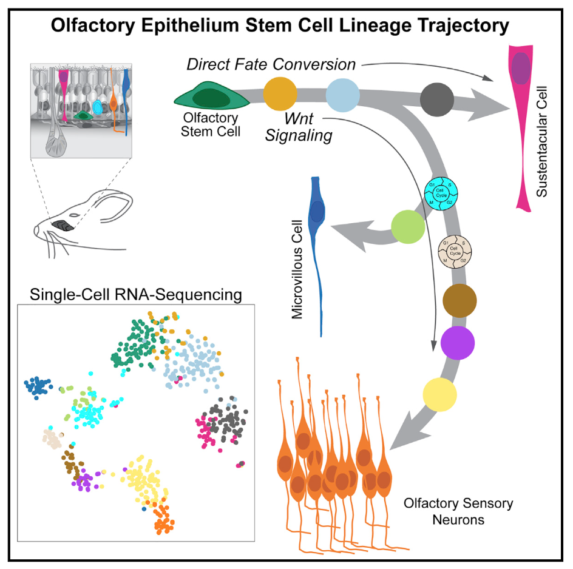
```

## Motivation

```{r, results="asis", out.width="100%"}
knitr::include_graphics("img/pseudo1.png")
```

## Motivation

```{r, results="asis", out.width="100%"}
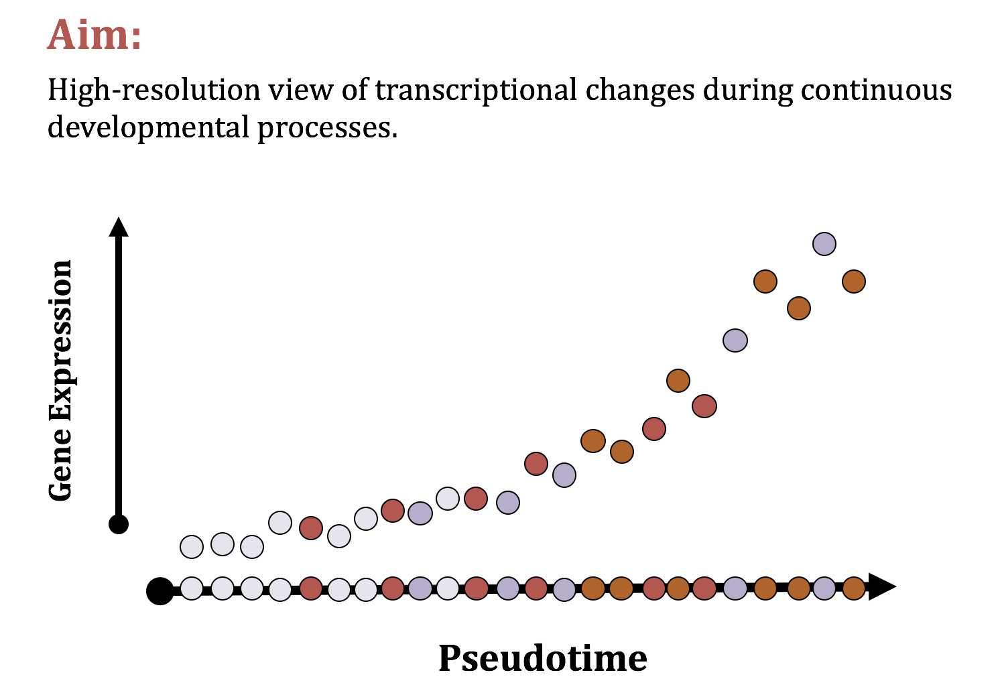
```

## Motivation

```{r, results="asis", out.width="100%"}
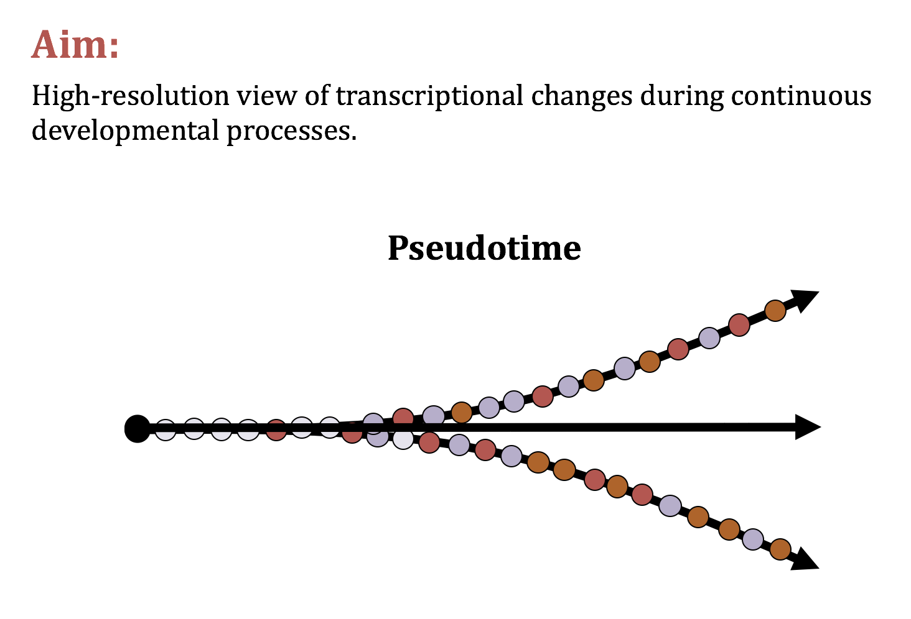
```

## The slingshot algorithm

We start from a proper representation of the cells in some space defined by their gene expression (usually after dimensionality reduction).

We have identified a set of $K$ clusters.

1. Identification of lineages
    - treat clusters as nodes in a graph
    - draw a minimum spanning tree (MST) between the nodes
    - lineages are ordered sets of clusters
    - semi-supervised: set the starting cluster (root of the tree) and optionally a set of known end points (leaves)

2. Draw a "smooth" path through the lineages
    - use of _principal curves_ (Hastie and Stuetzle, 1989)
    - shrink curves together in shared paths (simultaneous principal curves)
    - project each cell onto the principal curve(s) to infer pseudotime

## The slingshot algorithm

```{r, results="asis", out.width="100%"}
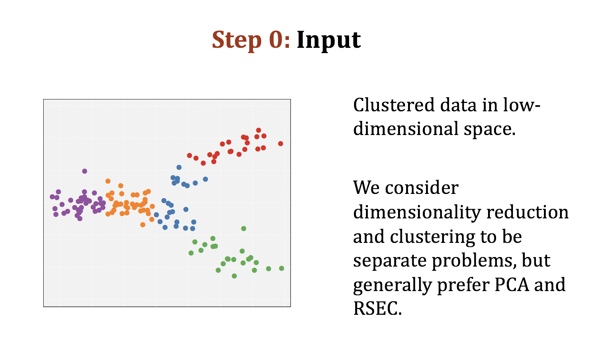
```

## The slingshot algorithm

```{r, results="asis", out.width="100%"}
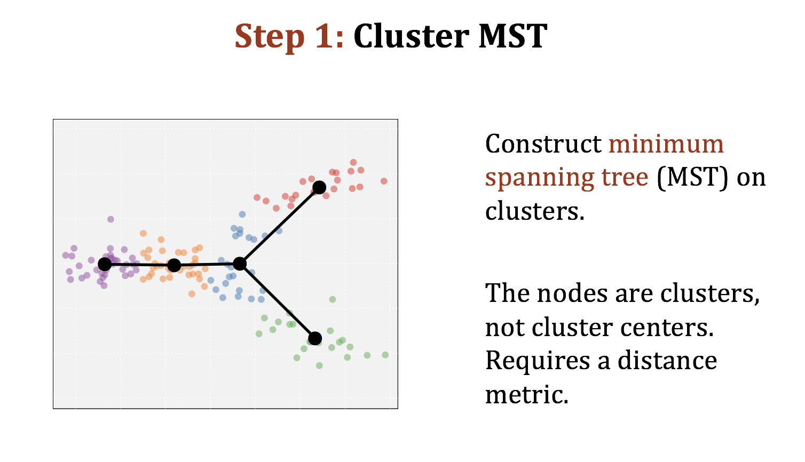
```

## The slingshot algorithm

```{r, results="asis", out.width="100%"}
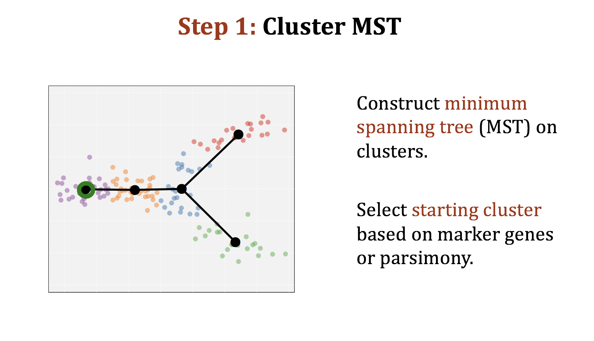
```

## The slingshot algorithm

```{r, results="asis", out.width="100%"}
knitr::include_graphics("img/sling151.png")
```

## The slingshot algorithm

```{r, results="asis", out.width="100%"}
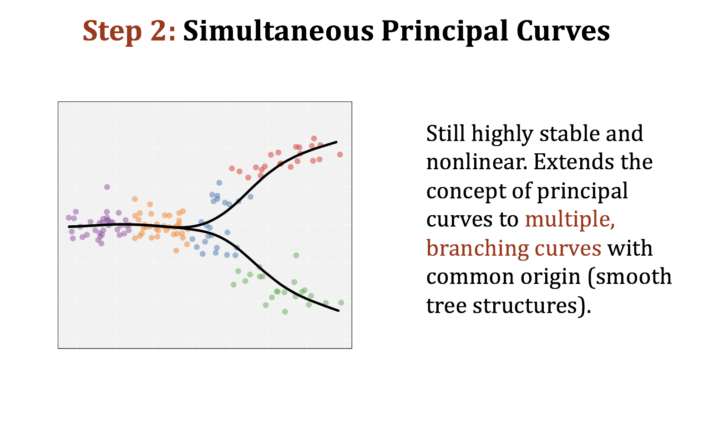
```

## The slingshot algorithm

```{r, results="asis", out.width="100%"}
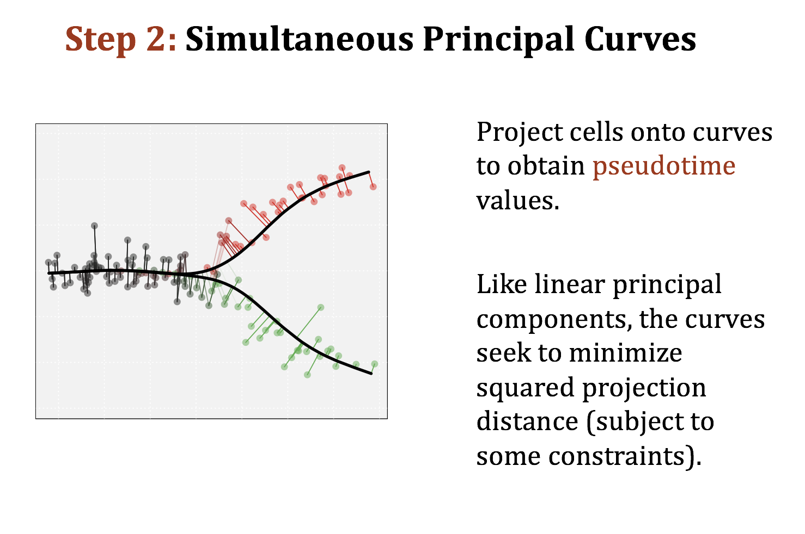
```

## Shape-sensitive distance

Constructing an MST involves specifying a distance measure between nodes.

A Mahalanobis-like distance, i.e., a covariance-scaled Euclidean distance, that accounts for cluster shape, works well in practice.

$$
d^2(\mathcal{C}_i,\mathcal{C}_j) \equiv (\bar{X}_i - \bar{X}_j)^T (S_i + S_j)^{-1} (\bar{X}_i - \bar{X}_j),
$$

## Biological meaningful supervision

Slingshot allows two forms of supervision during lineage identification:

- initial state (root)
- terminal states (leaves)

Like other methods, Slingshot requires the user to identify the _initial cluster_ or _root node_.

Slingshot optionally allows the specification of _terminal cell states_, imposing a _local constraint_ on the MST algorithm.

## Principal Curves algorithm (Hastie and Stuetzle, 1989)

Iteratively follow these steps:

1. Project all data points onto the curve and calculate the arc length from the beginning of the curve to each point’s projection. Setting the lowest value to zero, this produces pseudotimes.

2. For each dimension $j$, use the cells' pseudotimes to predict their coordinates, typically with a smoothing spline.
    - This produces a set of $J'$ functions which collectively map pseudotime values defining a smooth curve in $J'$ dimensions.

3. Repeat this process until convergence, using the sum of squared distances between cells' actual coordinates and their projections on the curves to determine convergence.

## Simultaneous Principal Curves

To allow for multiple lineages, we modify the principal curves algorithms in two ways:

- We incorporate cell weights to allow cells to contribute differently to different lineages.

- We add a _shrinkage_ procedure to ensure smooth branching events.

The shrinkage is performed by first recursively constructing an average curve for each branching event, then recursively shrinking the branching lineage curves toward this average.

## Shrinkage

We construct _non-increasing_ curve-specific weights, with $w_m(0) = 1$ (maximum shrinkage)
    - diverging curves always share the same initial point
    
Shrink the diverging curves toward the average curve:

$$
\mathbf{c}_m^\text{new}(t) \equiv w_m(t)\mathbf{c}_{\text{avg}}(t) + (1-w_m(t))\mathbf{c}_m(t).
$$

## The `slingshot` package

```{r, echo=TRUE, eval=FALSE}
library(slingshot)
ce <- slingshot(ce, reducedDim = "MDS", 
                start.clus = "c1")
```

## Thank you!

Email: \texttt{risso.davide@gmail.com}

Twitter: \texttt{@risso1893}

Github: \texttt{github.com/drisso}


```{r, results="asis", out.width="50%", eval=TRUE}

```

