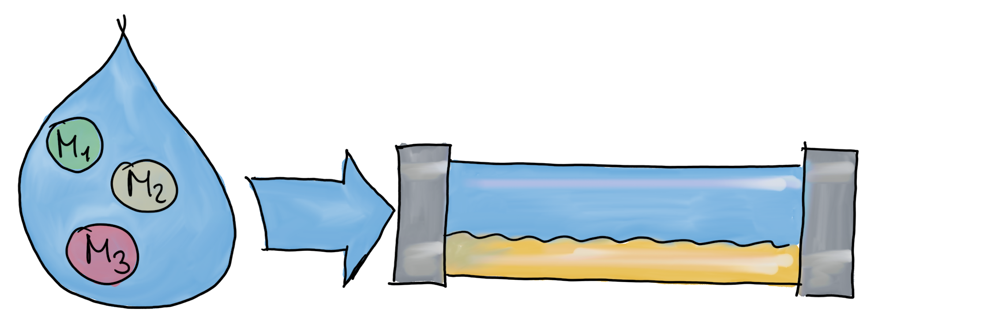
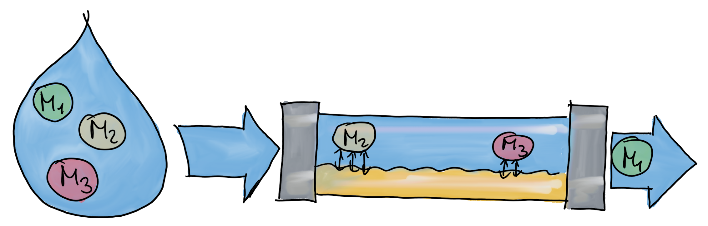
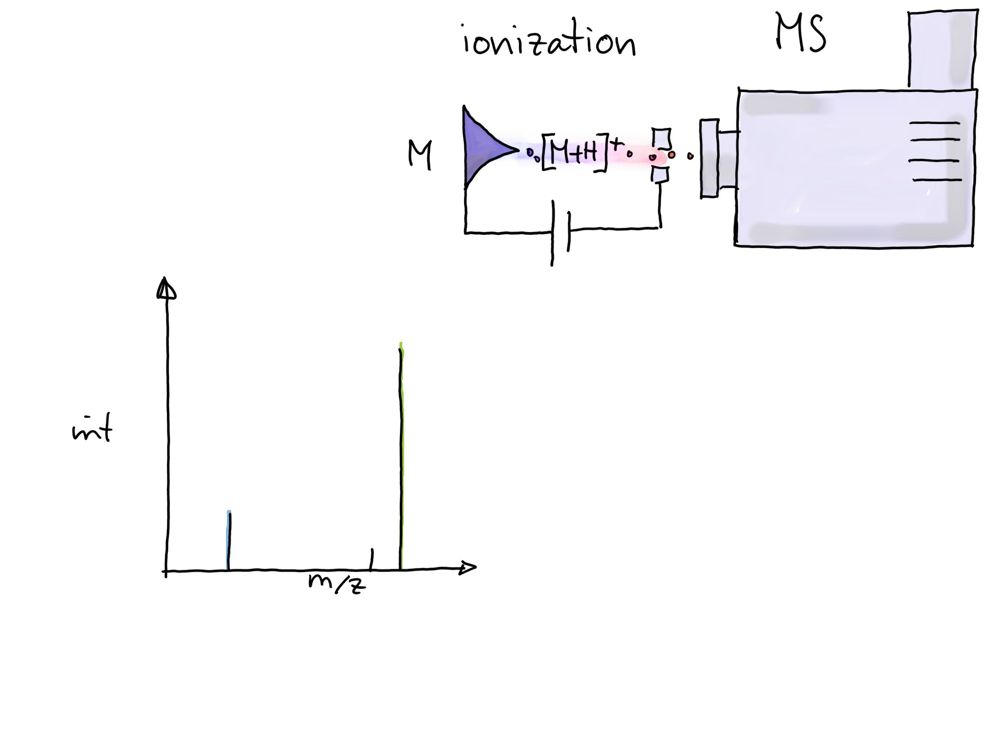
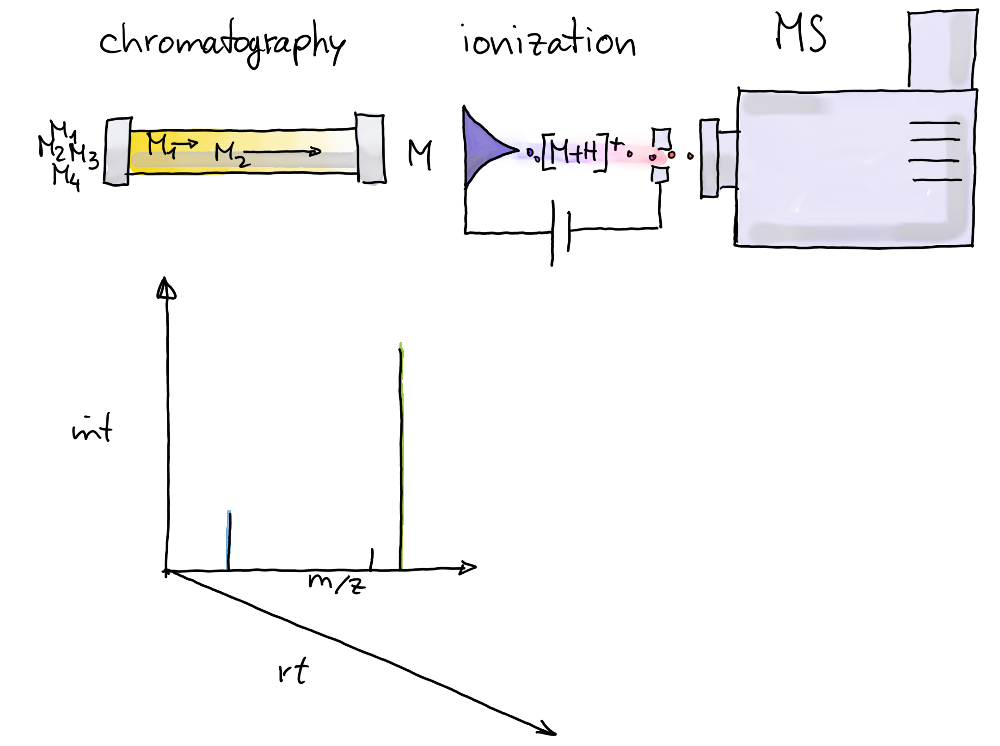
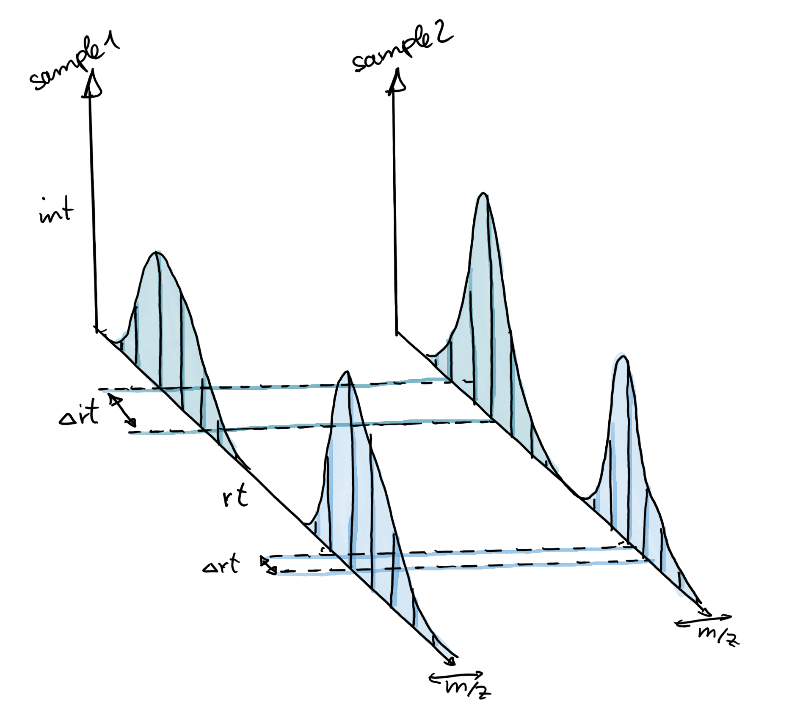

<style type="text/css">

slides > slide:not(.nobackground):after {
  content: '';
}

slides > slide {
    -webkit-transition:none !important;transition:none !important;
}

.build > * {
  -webkit-transition: opacity 0.1s ease-in-out;
  -webkit-transition-delay: 0.1s;
  -moz-transition: opacity 0.1s ease-in-out 0.1s;
  -o-transition: opacity 0.1s ease-in-out 0.1s;
  transition: opacity 0.1s ease-in-out 0.1s;
}

</style>

<!--
Export to pdf:
webshot function from webshot package.
Might have to change stuff in the style sheet to make it working.
library(webshot)
install_phantomjs()
fn <- paste0("file://", normalizePath("metabolomics.html"))
webshot(fn, "metabolomics.pdf", delay = 4, vwidth = 1024, vheight = 768)
-->

## Content

- Introduction to metabolomics
- Preprocessing of LC-MS data in Bioconductor
- Normalization
- Annotation/identification

## Metabolite? Metabolism?

- [Glycolysis](https://en.wikipedia.org/wiki/Glycolysis)

```{r out.width = "750px", echo = FALSE}
knitr::include_graphics("images/glycolysis_01.png")
```

## Metabolite? Metabolism?

- [Glycolysis](https://en.wikipedia.org/wiki/Glycolysis)

```{r out.width = "750px", echo = FALSE}
knitr::include_graphics("images/glycolysis_02.png")
```

<!-- ## Metabolite? Metabolism? -->

<!-- - [Glycolysis](https://en.wikipedia.org/wiki/Glycolysis) -->

<!-- ```{r out.width = "750px", echo = FALSE} -->
<!-- knitr::include_graphics("images/glycolysis_03.png") -->
<!-- ``` -->

## Metabolite? Metabolism?

- [Glycolysis](https://en.wikipedia.org/wiki/Glycolysis)

```{r out.width = "750px", echo = FALSE}
knitr::include_graphics("images/glycolysis_04.png")
```

## Metabolite? Metabolism?

- [Glycolysis](https://en.wikipedia.org/wiki/Glycolysis)

```{r out.width = "750px", echo = FALSE}
knitr::include_graphics("images/glycolysis_06.png")
```

## Metabolite? Metabolism?

- [Glycolysis](https://en.wikipedia.org/wiki/Glycolysis)

```{r out.width = "750px", echo = FALSE}
knitr::include_graphics("images/glycolysis_10.png")
```

## Metabolite? Metabolism?

- [Glycolysis](https://en.wikipedia.org/wiki/Glycolysis)

```{r out.width = "750px", echo = FALSE}
knitr::include_graphics("images/glycolysis_11.png")
```

## Metabolite? Metabolism?

- [Glycolysis](https://en.wikipedia.org/wiki/Glycolysis)

```{r out.width = "750px", echo = FALSE}
knitr::include_graphics("images/glycolysis_12.png")
```

- Metabolites: intermediates and products of cellular processes.

## Metabolomics? {.build}

- Large-scale study of small molecules (metabolites) in a system (cell, tissue,
  organism).

<div>
- Comparison of the different -omes:
</div>
<div>
  - **Genome**: what can happen.
</div>
<div>
  - **Transcriptome**: what appears to be happening.
</div>
<div>
  - **Proteome**: what makes it happen.
</div>
<div>
  - **Metabolome**: what actually happened.
</div>
<div>
- Metabolome influenced by genetic **and** environmental factors.
</div>

## How can we measure metabolites? {.build}

<div>
- Nuclear Magnetic Resonance (NMR) - not covered here.
- Mass spectrometry (MS)-based metabolomics.
</div>

<div>
- Targeted/untargeted metabolomics:
</div>
<div>
  - **targeted**: quantitative measurement of selected metabolites.
</div>
<div>
  - **untargeted**: semi-quantitative measurement of all metabolites (detectable
    with the setup) in a sample.
</div>


## Mass Spectrometry (MS)

<div style="position:absolute; top:28%; left:7%; width:400px">
```{r out.width = "400px", echo = FALSE}
knitr::include_graphics("images/MS_ionization_mod.png")
```
</div>

## Mass Spectrometry (MS)

<div style="position:absolute; top:28%; left:7%; width:400px">
```{r out.width = "400px", echo = FALSE}
knitr::include_graphics("images/MS_ionization_mod.png")
```
</div>
<div style="position:absolute; top:20%; left:53%; width:300px">
```{r out.width = "300px", echo = FALSE}
knitr::include_graphics("images/Spectrum1_mod.png")
```
</div>

<div style="position:absolute; top:65%;left:7%">
> - **Problem:** unable to distinguish between metabolites with the same 
    mass-to-charge ratio (m/z).
> - **Solution:** separate metabolites prior to MS by another property.
</div>


## Liquid chromatography {.build}

<div>
- Sample is dissolved in a fluid (mobile phase).

<div style="position:absolute; top:75%;left:25%">
```{r out.width = "500px", echo = FALSE}
knitr::include_graphics("images/LC_01.png")
```
</div>
</div>

## Liquid chromatography

- Sample is dissolved in a fluid (mobile phase).

- Mobile phase carries analytes through a column with a stationary phase.


<div style="position:absolute; top:75%;left:25%">
```{r out.width = "500px", echo = FALSE}

```
</div>


## Liquid chromatography

- Sample is dissolved in a fluid (mobile phase).

- Mobile phase carries analytes through a column with a stationary phase.

- Separation based on affinity for the column's stationary phase.


<div style="position:absolute; top:75%;left:25%">
```{r out.width = "500px", echo = FALSE}

```
</div>


## Liquid chromatography

- Sample is dissolved in a fluid (mobile phase).

- Mobile phase carries analytes through a column with a stationary phase.

- Separation based on affinity for the column's stationary phase.

- [HILIC](https://en.wikipedia.org/wiki/Hydrophilic_interaction_chromatography)
(hyrophilic liquid interaction chromatography):

  - Hydrophilic, polar stationary phase.
  
  - Analytes solved in mobile phase.
  
  - Analytes separated by polarity: low polarity elute first, high polarity
    later.

<div style="position:absolute; top:75%;left:25%">
```{r out.width = "500px", echo = FALSE}

```
</div>


<!-- Now comes the incremental LC-MS description -->
## | **Liquid Chromatography Mass Spectrometry (LC-MS)** {.notransition}

```{r out.width = "700px", echo = FALSE}

```

## | **Liquid Chromatography Mass Spectrometry (LC-MS)** {.notransition}

```{r out.width = "700px", echo = FALSE}

```

## | **Liquid Chromatography Mass Spectrometry (LC-MS)** {.notransition}

```{r out.width = "700px", echo = FALSE}
knitr::include_graphics("images/LCMS_Spectrum2.png")
```

## | **Liquid Chromatography Mass Spectrometry (LC-MS)** {.notransition}

```{r out.width = "700px", echo = FALSE}
knitr::include_graphics("images/LCMS_Spectrum3.png")
```

## | **Liquid Chromatography Mass Spectrometry (LC-MS)** {.notransition}

```{r out.width = "700px", echo = FALSE}
knitr::include_graphics("images/LCMS_Spectrum4.png")
```

## | **Liquid Chromatography Mass Spectrometry (LC-MS)** {.notransition}

```{r out.width = "700px", echo = FALSE}
knitr::include_graphics("images/LCMS_Spectrum5.png")
```

## | **Liquid Chromatography Mass Spectrometry (LC-MS)** {.notransition}

```{r out.width = "700px", echo = FALSE}
knitr::include_graphics("images/LCMS_Spectrum6.png")
```

## | **Liquid Chromatography Mass Spectrometry (LC-MS)** {.notransition}

```{r out.width = "700px", echo = FALSE}
knitr::include_graphics("images/LCMS_Spectrum6.png")
```

<div style="position:absolute; left:50%; top:55%">
LC-MS data has thus 3 dimensions:

- intensity, m/z, retention time tuples.
- analyze the data along retention time.

</div>


## LC-MS data preprocessing

> - Chromatographic peak detection
> - Alignment
> - Correspondence

## Chromatographic peak detection

- Aim: identify chromatographic peaks in the data.

```{r out.width = "500px", echo = FALSE}
knitr::include_graphics("images/LCMS-data.png")
```

## Chromatographic peak detection

- Aim: identify chromatographic peaks in the data.

```{r out.width = "500px", echo = FALSE}
knitr::include_graphics("images/LCMS-data-peaks.png")
```

## Chromatographic peak detection

- Aim: identify chromatographic peaks in the data.

```{r out.width = "500px", echo = FALSE}
knitr::include_graphics("images/LCMS-data-peaks.png")
```
<div style = "position:absolute; left:520px; top:300px;">
- allow different rt-widths
- allow some scattering on m/z
</div>

## Chromatographic peak detection {.build}

<div>
- __centWave__ [Tautenhahn et al. BMC Bioinformatics, 2008]:
</div>
<div>
- Step 1: identify regions of interest.

```{r out.width = "500px", echo = FALSE}
knitr::include_graphics("images/centWave-ROI.png")
```
</div>

## Chromatographic peak detection

- Step 2: peak detection using continuous wavelet transform.
- Allows detection of peaks with different widths.

```{r out.width = "500px", echo = FALSE}
knitr::include_graphics("images/centWave-CWT.png")
```

## Chromatographic peak detection {.build}

- After reading the data with `readMSData` (`MSnbase` package):
- `xcms`: `findChromPeaks` function, passing settings along with an
  algorithm-specific parameter object.

```{r echo = FALSE, warning = FALSE, message = FALSE}
library(xcms)
library(doParallel)
registerDoParallel(2)
register(bpstart(DoparParam()), default = TRUE) 
fls <- dir(system.file("sciex", package = "msdata"), full.names = TRUE)

## Define a data.frame with additional information on the files.
pd <- data.frame(file = basename(fls), injection_idx = c(1, 19),
                 sample = c("POOL_1", "POOL_2"), group = "POOL")
## Read the data
data <- readMSData(fls, pdata = new("NAnnotatedDataFrame", pd), 
                   mode = "onDisk")
data <- pickPeaks(smooth(data, method = "SavitzkyGolay", halfWindowSize = 6))
```

```{r message = FALSE}
cwp <- CentWaveParam(peakwidth = c(2, 10), snthresh = 5)
data <- findChromPeaks(data, param = cwp)
head(chromPeaks(data), n = 3)
```


## Alignment {.build}

- Chromatography subject to (random and systematic) noise.
- Same analyte may elute at different time in different runs.

```{r echo = FALSE, out.width = "370px"}

```

- Retention time shifts depend on the LC setup.


## Alignment {.build}

<div>
- Many algorithms available [Smith et al. Brief Bioinformatics 2013]
</div>

<div>
- `xcms`: `adjustRtime` function with `PeakDensityParam` [Smith et al. Anal. chem.
    2006] or `ObiwarpParam` [Prince et al. Anal. chem. 2006].
</div>

<div>
```{r echo = FALSE, message = FALSE, warning = FALSE, fig.width = 10, fig.height = 3}
pdp <- PeakDensityParam(sampleGroups = data$group, bw = 1.8,
                        minFraction = 1, binSize = 0.02)
data <- groupChromPeaks(data, pdp)
pgp <- PeakGroupsParam(minFraction = 1, span = 0.6)
data <- adjustRtime(data, param = pgp)

par(mfrow = c(1, 2), mar = c(4, 4.5, 0.9, 0.5))
plot(chromatogram(data, aggregationFun = "max", adjustedRtime = FALSE,
                  rt = c(70, 220)), main = "raw")
plot(chromatogram(data, aggregationFun = "max", rt = c(70, 220)),
     main = "adjusted")
```
</div>

## Correspondence {.build}

- Aim: group peaks across samples, assuming they represent the same ion.
- Depends on proper alignment.

```{r echo = FALSE, out.width = "700px"}
knitr::include_graphics("images/correspondence2_01.png")
```

## Correspondence

- Aim: group peaks across samples, assuming they represent the same ion.
- Depends on proper alignment.

```{r echo = FALSE, out.width = "700px"}
knitr::include_graphics("images/correspondence2_02.png")
```

## Correspondence

- Aim: group peaks across samples, assuming they represent the same ion.
- Depends on proper alignment.

```{r echo = FALSE, out.width = "700px"}
knitr::include_graphics("images/correspondence2_03.png")
```


## Correspondence {.build}

- `xcms`: `groupChromPeaks` with `NearestPeaksParam` [Katajamaa et
  al. Bioinformatics 2006] and `PeakDensityParam` [Smith et al. Anal. chem.
  2006].

<div>
- peak density approach (for a given m/z slice):

```{r echo = FALSE, out.width = "700px"}
knitr::include_graphics("images/correspondence2_01.png")
```
</div>

## Correspondence

- `xcms`: `groupChromPeaks` with `NearestPeaksParam` [Katajamaa et
  al. Bioinformatics 2006] and `PeakDensityParam` [Smith et al. Anal. chem.
  2006].

- peak density approach (for a given m/z slice):

```{r echo = FALSE, out.width = "700px"}
knitr::include_graphics("images/correspondence2_density.png")
```


## Normalization {.build}

<div>
- Effects related to batch/measurement run.
- LC-dependent effects: seem to affect each metabolite in a different way.
</div>

<div>
```{r echo = FALSE, out.width = "700px"}
knitr::include_graphics("images/FT07853.png")
```
</div>

## Normalization {.build}

<div>
- Good practice:
  - QC control samples measured repeatedly.
  - Internal standards.
  - Replicates.
  - Measurement of samples in randomized order.
</div>
<div>
- Popular methods:
  - RUV [De Livera et al. Anal. Chem. 2015] 
  - linear models [Wehrens et al. Metabolomics 2016]
  - linear and higher order models [Brunius et al. Metabolomics 2016].
</div>

## Identification {.build}

- Features have to be annotated to metabolites.

```{r echo = FALSE, warning = FALSE, message = FALSE}
data <- groupChromPeaks(data, param = PeakDensityParam(
                                  sampleGroups = data$group,
                                  bw = 1.8, binSize = 0.02, minFraction = 0.4))
res <- cbind(featureDefinitions(data), featureValues(data, value = "into"))
res <- res[, c(1, 4, 10, 11)]
colnames(res)[3:4] <- c("POOL_1", "POOL_2")
head(res, n = 4)
```

- Match compounds based on features' m/z.

- Will result in an 1:n mapping.

## Identification based on m/z matching{.build}

<div>
- Databases containing masses of (synthetic and biological) compounds.
  - The Human Metabolome Database (HMDB): <small>https://hmdb.ca</small>
  - Chemical Entities of Biological Interest: https://www.ebi.ac.uk/chebi
  - PubChem (human and other animals) https://pubchem.ncbi.nlm.nih.gov
  - ...
</div>
<div>
- m/z is **not** the mass.
</div>
<div>
- Mass of an [M+H]+ ion: m/z - mass of 1 hydrogen.
</div>
<div>
- Different ions from the same compound: [M+H]+, [M+2H]++, [M+Na]+, ...
</div>

## Improved identification {.build}

Identify compounds based on m/z **and**:

<div>
- **retention time**: requires lab-internal database with approximate retention
  times for specific compounds (manually defined).
</div>
<div>
- **MS2 spectrum**:
  - Needs MS2 data of the compounds (e.g. SWATH data).
  - Only works if reference spectrum available in database.
</div>
<div>
- Up and coming: `CompoundDb` package (similar to `ensembldb` and alike):
  contains compound data + spectra.
</div>


## Afternoon metabolomics lab

- LC-MS data handling (`MSnbase`).
- LC-MS data preprocessing using `xcms`.

<div style="position:absolute; top:42%; left:42%;">
```{r, echo = FALSE, out.width = "170px"}
knitr::include_graphics("images/xcms_hl.png")
```
</div>
