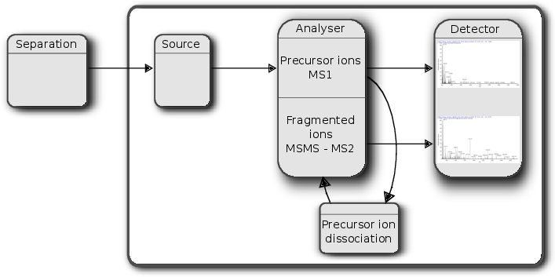
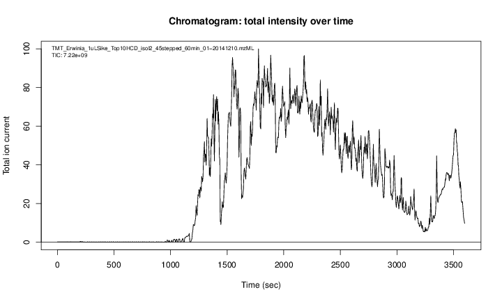
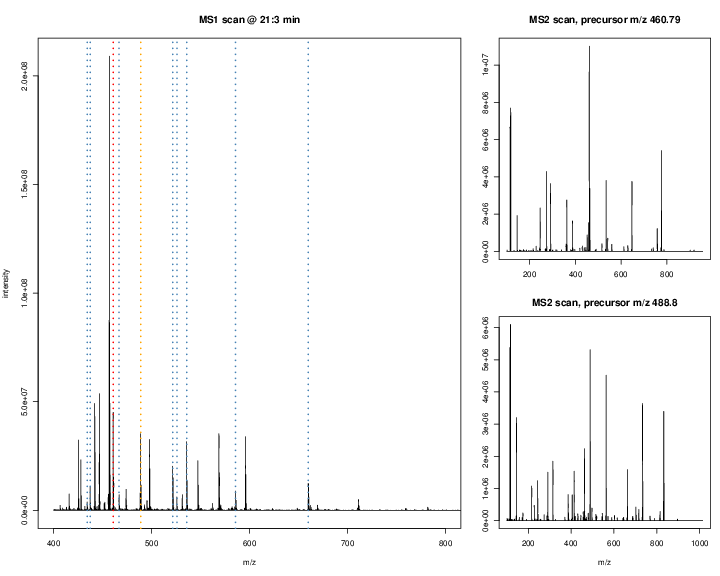
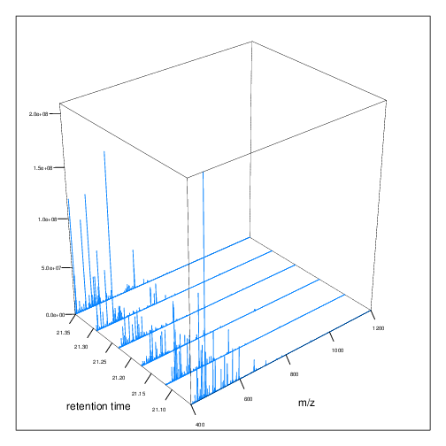
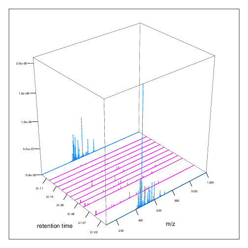
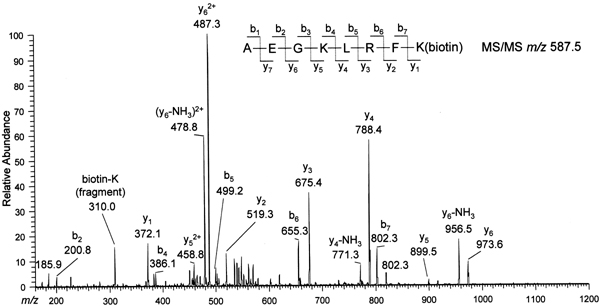
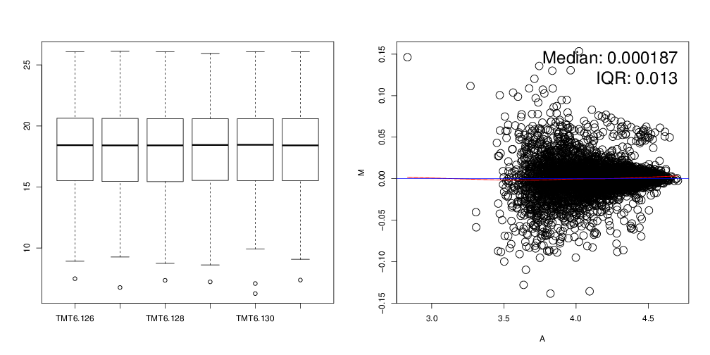

## Mass spectrometry and proteomics using Bioconductor

```
Laurent Gatto                      Computational Proteomics Unit
https://lgatto.github.io           University of Cambridge
lg390@cam.ac.uk                    @lgatt0
```

Link to slides/source.

## Licence

These slides are available under a creative common
[CC-BY license](http://creativecommons.org/licenses/by/4.0/). You are
free to share (copy and redistribute the material in any medium or
format) and adapt (remix, transform, and build upon the material) for
any purpose, even commercially.


## Table of content

- Mass spectrometry
- Raw MS data (linked to the how MS works section)
- MS quantitation: MS1 vs MS2 (MS3), label-free vs labelled
- Peptide identification and protein inference
- Proteomics data processing overview
- Some packages of interest

```{r env, echo=FALSE, message=FALSE, warning=FALSE}
library("BiocStyle")
library("MSnbase")
library("RforProteomics")
library("Pbase")
library("cputools")
```

# Mass spectrometry

## { .fullpage }



## { .fullpage }



## { .fullpage }


## { .fullpage }



## { .fullpage }



## { .fullpage }



# Mass spectometry in R

## In R

```{r mzr1, eval=TRUE}
library("msdata")
library("mzR")
fls <- proteomics(full = TRUE)
basename(fl <- fls[2])
rw <- openMSfile(fl)
rw
```

## Accessors 

```{r mzr2}
softwareInfo(rw)
str(spectra(rw, 10:11))
str(header(rw))
```

## `MSnExp`

Using `MSnExp` objects from the `r Biocpkg("MSnbase")` package to
conveniently and efficiently manage raw MS experiments.

## 


```{r msb, message=FALSE}
library("MSnbase")
(x <- readMSData2(fl))
```

## 

```{r msb2, cache=TRUE}
table(msLevel(x))
head(centroided(x))
table(isCentroided(x), msLevel(x))
centroided(x) <- isCentroided(x)
```

## 

```{r}
library("magrittr")
x2 <- x %>%
    filterMsLevel(2L) %>%
    filterMz(c(126, 132))
x2
```


## { .fullpage }

```{r p1}
data(itraqdata)
plot(itraqdata[[22]], full = TRUE, reporters = iTRAQ4)
```

## { .fullpage }

```{r pp}
itraqdata2 <- pickPeaks(itraqdata)
plot(itraqdata2[[22]], itraqdata2[[26]])
```

# Proteomics

## Proteomics

- Peaks in MS1 are peptides
- MS2 spectra are peptides fragments
- Use the fragmentation pattern to deduce the peptide sequence
- De nove sequencing
- Database search

## { .fullpage }



<br/>
<div style="font-size:70%">
Credit `abrg.org`
</div>

## Database search

- Protein sequences (fasta file)
- In silico digestion
- Matching of expected (in silico) to observed (MS2)

## { .fullpage }

```{r fargments}
library("MSnbase")
cid <- calculateFragments("AEGKLRFK",
                          type=c("b", "y"), z=2)
ht(cid, n = 3)
```

## Identification in R

```{r}
idf <- system.file("mzid", "Tandem.mzid.gz", package = "msdata")
id <- openIDfile(idf)
softwareInfo(id)
enzymes(id)
str(psms(id))
```

## Searching in R

- `r Biocpkg("MSGFplus")`
- `r Biocpkg("rTANDEM")`


## Protein inference


# Proteomics data

## Proteomics data

### Raw data:
- MS1 and MS2 over retention time
- MS1 or MS2 (MS3) for quantitation
- MS2 for identitication

### Protein database:
- to match MS2 spectra against

## Proteomics data

| File/format   |  package  |
|---------------|-----------|
| Raw (`mz*ML`) | `mzR`, `MSnbase` |
| mzTab         | `MSnbase` |
| `mgf`         | `MSnbase` |
| `mzIdentML`   | `mzR`, `mzID` |
| `mzQuantML`   | `NA`     |


# Quantitiative proteomics

## 

|                | MS1         | MS2        |
|----------------|-------------|------------|
| **Labelled**   | SILAC, N15  | iTRAQ, TMT |
| **Label-free** | XIC         | Spectral counting |

## MSnSet


## 

```{r addid}
quantFile <- dir(system.file(package = "MSnbase", dir = "extdata"),
                 full.name = TRUE, pattern = "mzXML$")
identFile <- dir(system.file(package = "MSnbase", dir = "extdata"),
                 full.name = TRUE, pattern = "dummyiTRAQ.mzid")
x <- readMSData(quantFile)
x <- addIdentificationData(x, identFile)
fData(x)$pepseq
```

## 

```{r qnt}
xq <- quantify(x, reporters = iTRAQ4, method = "max")
exprs(xq)
headf(Data(xq))
```

## 

```{r eval=FALSE}
qt <- quantify(rx, reporters = TMT6)
## qt <- readMSnSet("quantdata.csv", ecols = 5:11)
nqt <- normalise(qt, method = "vsn")
boxplot(exprs(nqt))
MAplot(nqt[, 1:2])
```

## { .fullpage }



## Packages of interest

All MS and proteomics Bioc packages (from [biocViews]()):

```r
RforProteomics::proteomicsPackages()
RforProteomics::massSpectrometryPackages()
```
- `MSnID`, `MSstats`, `msmsTests`
- Many Bioconductor packages for the statistical and downstream
  analysis

## More examples

- Lab this afternoon
- [Proteomics workflow](http://bioconductor.org/help/workflows/proteomics/)
  on the Bioc site
- `RforProteomics` package
```{r r4p, eval=FALSE}
library("RforProteomics")
RforProteomics()
RProtVis()
citation(package = "RforProteomics")
```


## References

- RforProteomics vignette
- MS/proteomics workflow

## Acknowledgements

### Development

- Sebastian Gibb, Johannes Rainer

### Funding: 
- BBSRC

**Thank you for your attention**

