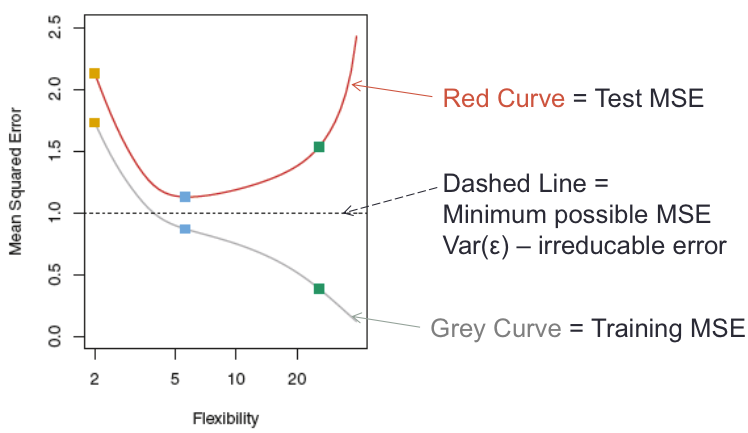
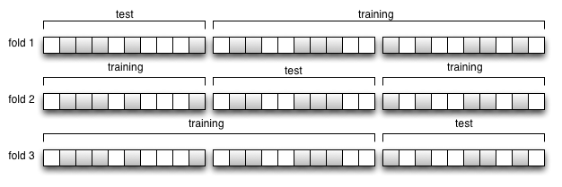
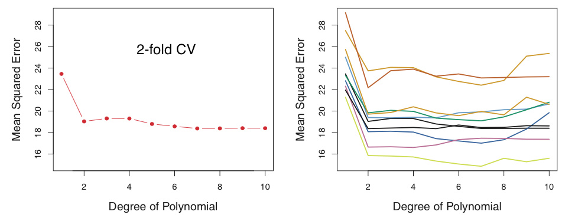
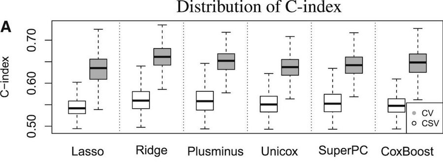
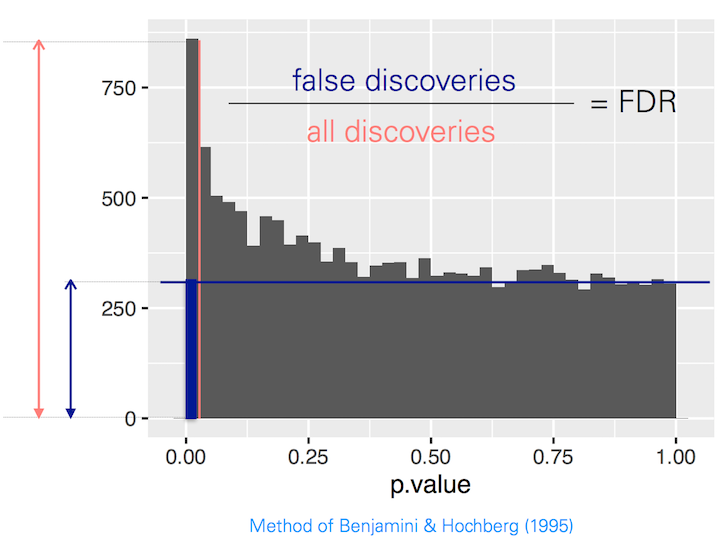
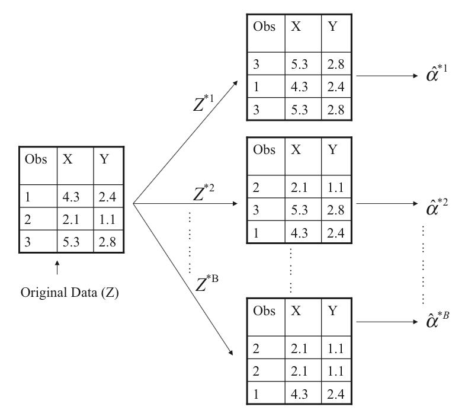
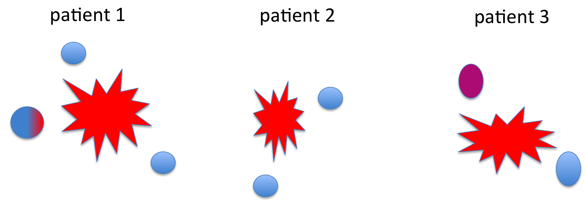
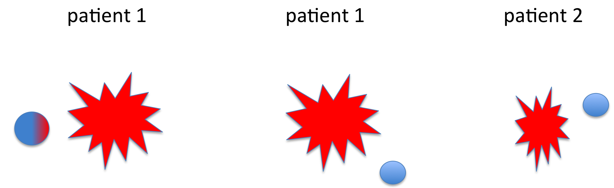
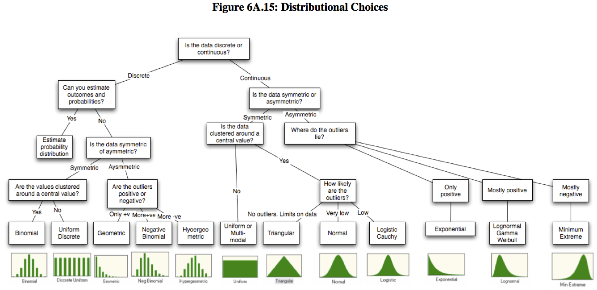

---
title: "Resampling Methods"
author: "Levi Waldron, CUNY School of Public Health <p> levi.waldron@sph.cuny.edu <p>
waldronlab.github.io / waldronlab.org"
date: "June 15, 2017"
output:
  slidy_presentation: null
---

## Outline and introduction

* Objectives: prediction or inference?
* Cross-validation
* Bootstrap
* Permutation Test
* Monte Carlo Simulation

\tiny
ISLR Chapter 5: James, G. _et al._ An Introduction to Statistical Learning: with Applications in R. (Springer, 2013). This book can be downloaded for free at http://www-bcf.usc.edu/~gareth/ISL/getbook.html

## Why do regression?

<center> **Inference** </center>

* Questions:
     - _Which_ predictors are associated with the response?
     - _How_ are predictors associated with the response?
     - Example: do dietary habits influence the gut microbiome?

* Linear regression and generalized linear models are the workhorses
     - We are more interested in interpretability than accuracy
     - Produce interpretable models for inference on coefficients

**Bootstrap, permutation tests**

## Why do regression? (cont'd)

<center> **Prediction** </center>

* Questions:
     - How can we predict values of $Y$ based on values of $X$
     - Examples: Framingham Risk Score, OncotypeDX Risk Score

* Regression methods are still workhorses, but also less-interpretable machine learning methods
     - We are more interested in accuracy than interpretability
     - _e.g._ sensitivity/specificity for binary outcome
     - _e.g._ mean-squared prediction error for continuous outcome

**Cross-validation**

# Cross-validation

## Why cross-validation?



**Under-fitting, over-fitting, and optimal fitting**

## K-fold cross-validation approach

* Create $K$ "folds" from the sample of size $n$, $K \le n$
1. Randomly sample $1/K$ observations (without replacement) as the validation set
2. Use remaining samples as the training set
3. Fit model on the training set, estimate accuracy on the validation set
4. Repeat $K$ times, not using the same validation samples
5. Average validation accuracy from each of the validation sets



## Variability in cross-validation



## Cross-validation summary

* In prediction modeling, we think of data as _training_ or _test_
     - Cross-validation estimates test set error from a training set
* Training set error always decreases with more complex (flexible) models
* Test set error as a function of model flexibility tends to be U-shaped
     - The low point of the U represents the optimal bias-variance trade-off, or the most appropriate amount of model flexibility
* Computationally, $K$ models must be fitted
     - 5 or 10-fold CV are popular choices
     - can be repeated for smoothing (e.g. see Braga-Neto et al 2004. Is cross-validation valid for small-sample microarray classification?. Bioinformatics, 20(3), 374-380.)

## Cross-validation caveats

* Be very careful of information "leakage" into test sets, _e.g._:
    - feature selection using all samples
    - "human-loop" over-fitting
    - changing your mind on accuracy measure
    - try a different dataset

http://hunch.net/?p=22

## Cross-validation caveats (cont'd)

* Tuning plus accuracy estimation requires **nested** cross-validation
* Example: high-dimensional training and test sets simulated from identical true model
    - Penalized regression models tuned by 5-fold CV
    - Tuning by cross-validation does _not_ prevent over-fitting

 \centerline{\includegraphics[height=1in]{images/Waldron_Fig1B.png}}


\small
Waldron _et al._: **Optimized application of penalized regression methods to diverse genomic data.** Bioinformatics 2011, 27:3399–3406.

## Cross-validation caveats (cont'd)

* Cross-validation estimates assume that the sample is representative of the population



\small
Bernau C _et al._: **Cross-study validation for the assessment of prediction algorithms.** Bioinformatics 2014, 30:i105–12.

# Permutation test

## Permutation test

* Classical hypothesis testing: $H_0$ of test statistic derived from assumptions about the underlying data distribution
    + _e.g._ $t$, $\chi^2$ distribution
* Permutation testing: $H_0$ determined empirically using permutations of the data where $H_0$ is guaranteed to be true

```{r, echo=FALSE, fig.height=4.5}
set.seed(1)
xdat=matrix(rnorm(1000), ncol=20)
ydat=sample(0:1, size=nrow(xdat), replace=TRUE)
x = xdat + 2*ydat
pc=prcomp(x)
##Plot PCA
par(mfrow=c(1,2))
plot(pc$x[, 1:2], col=ydat+1, pch=ydat+1, cex=1.5, main="original data")
yperm=sample(ydat)
plot(pc$x[, 1:2], col=yperm+1, pch=yperm+1, cex=1.5, main="permuted data")
```

## Steps of permutation test:

  1. Calculate test statistic (e.g. T) in observed sample 
  2. Permutation:
       (i) Sample without replacement the response values ($Y$), using the same $X$
       (ii) re-compute and store the test statistic T
       (iii)  Repeat R times, store as a vector $T_R$
  3. Calculate empirical p value: proportion of permutation $T_R$ that exceed actual T

## Calculating a p-value

$$
P = \frac{sum \left( abs(T_R) > abs(T) \right)+ 1}{length(T_R) + 1}
$$

* Why add 1? 
    + Phipson B, Smyth GK: **Permutation P-values should never be zero: calculating exact P-values when permutations are randomly drawn.** Stat. Appl. Genet. Mol. Biol. 2010, 9:Article39.

## Calculating a False Discovery Rate

* calculate # all discoveries from unpermuted data
* estimate # false discoveries by averaging over permutations



## Permutation test - pros and cons

* Pros:
    + does not require distributional assumptions
    + can be applied to any test statistic
    + applicable to False Discovery Rate estimation

* Cons: 
    + less useful for small sample sizes
    + in naive implementations, can get p-values of "0"

## Example from (sleep) data:
 - Sleep data show the effect of two soporific drugs (increase in hours of sleep compared to control) 
 on 10 patients.

```{r, echo=FALSE}
data(sleep)
summary(sleep)
```


## t-test for difference in mean sleep

```{r, echo=FALSE}
(Tresult = t.test(extra ~ group, data=sleep))
Tactual = Tresult$statistic
```

## Permutation test instead of t-test

```{r}
set.seed(1)
permT = function(){
  index = sample(1:nrow(sleep), replace=FALSE)
  t.test(extra ~ group[index], data=sleep)$statistic
}
Tr = replicate(999, permT())
(sum(abs(Tr) > abs(Tactual)) + 1) / (length(Tr) + 1)
```

# Bootstrap

## The Bootstrap



\centering ISLR Figure 5.11: Schematic of the bootstrap

## Uses of the Bootstrap

* The Bootstrap is a very general approach to estimating sampling uncertainty, e.g. standard errors
* Can be applied to a very wide range of models and statistics
* Robust to outliers and violations of model assumptions

## How to perform the Bootstrap

* The basic approach:
     1. Using the available sample (size $n$), generate a new sample of size $n$ (with replacement)
     2. Calculate the statistic of interest
     3. Repeat
     4. Use repeated experiments to estimate the variability of your statistic of interest

## Example: bootstrap in the sleep dataset

* We used a permutation test to estimate a p-value
* We will use bootstrap to estimate a confidence interval

```{r}
t.test(extra ~ group, data=sleep)
```

## Example: bootstrap in the sleep dataset

```{r}
set.seed(2)
bootDiff = function(){
  boot = sleep[sample(1:nrow(sleep), replace = TRUE), ]
  mean(boot$extra[boot$group==1]) - 
    mean(boot$extra[boot$group==2])
}
bootR = replicate(1000, bootDiff())
bootR[match(c(25, 975), rank(bootR))]
```

note: better to use `library(boot)`

## Example: oral carcinoma recurrence risk

* Oral carcinoma patients treated with surgery
* Surgeon takes "margins" of normal-looking tissue around to tumor to be safe
    - number of "margins" varies for each patient
* Can an oncogenic gene signature in histologically normal margins predict recurrence?

<small>
Reis PP, Waldron L, _et al._: **A gene signature in histologically normal surgical margins is predictive of oral carcinoma recurrence.** BMC Cancer 2011, 11:437.
</small>

## Example: oral carcinoma recurrence risk

* Model was trained and validated using the maximum expression of each of 4 genes from any margin



## Bootstrap estimation of HR for only one margin



## Example: oral carcinoma recurrence risk

From results:

*Simulating the selection of only a single margin from each patient, the 4-gene signature maintained a predictive effect in both the training and validation sets (median HR = 2.2 in the training set and 1.8 in the validation set, with 82% and 99% of bootstrapped hazard ratios greater than the no-effect value of HR = 1)*

# Monte Carlo

## What is a Monte Carlo simulation? 

* "Resampling" is done from known theoretical distribution
* Simulated data are used to estimate the probability of possible outcomes
    - most useful application for me is _power estimation_
    - also used for Bayesian estimation of posterior distributions
   
## How to conduct a Monte Carlo simulation

*  **Steps of a Monte Carlo  simulations:**
     1.  Sample randomly from the simple distributions in each step
     2.  Estimate the complex function for the sample
     3.  Repeat this a large number of times

## Random distributions form the basis of Monte Carlo simulation



Credit: Markus Gesmann
http://www.magesblog.com/2011/12/fitting-distributions-with-r.html

## Power Calculation for a follow-up sleep study

* What sample size do we need for a future study to detect the same effect on sleep, with 90% power and $\alpha = 0.05$?

```{r}
power.t.test(power=0.9, delta=(2.33-.75), 
        sd=1.9, sig.level=.05,
        type="two.sample", alternative="two.sided")
```

## The same calculation by Monte Carlo simulation

* Use `rnorm()` function to draw samples
* Use `t.test()` function to get a p-value
* Repeat many times, what % of p-values are less than 0.05?

## R script
```{r}
set.seed(1)
montePval = function(n){
   group1 = rnorm(n, mean=.75, sd=1.9)
   group2 = rnorm(n, mean=2.33, sd=1.9)
   t.test(group1,group2)$p.value
}
sum(replicate(1000, montePval(n=32)) < 0.05) / 1000
```

## Summary: resampling methods 

|  | Procedure | Application |
|------------------|---------------------------------|----------------------------|
| Cross-Validation | Data is randomly divided into subsets. <br> Results validated across sub-samples. | Model tuning <br> Estimation of prediction accuracy |
| | | |
| Permutation Test | Samples of size N drawn at random *without* replacement. | Hypothesis testing |

## Summary: resampling methods 

|  | Procedure | Application |
|------------------|---------------------------------|----------------------------|
| Bootstrap | Samples of size N drawn at random *with* replacement. | Confidence intervals, hypothesis testing |
| | | |
| Monte Carlo | Data are sampled from a known distribution | Power estimation, Bayesian posterior probabilities |

## Links

- A built [html][] version of this lecture is available.
- The [source][] R Markdown is also available from Github.

[html]: http://rpubs.com/lwaldron/CSAMA2017_resampling
[source]: https://github.com/Bioconductor/CSAMA/tree/2017/lecture/4-thursday/lecture-16-resampling
