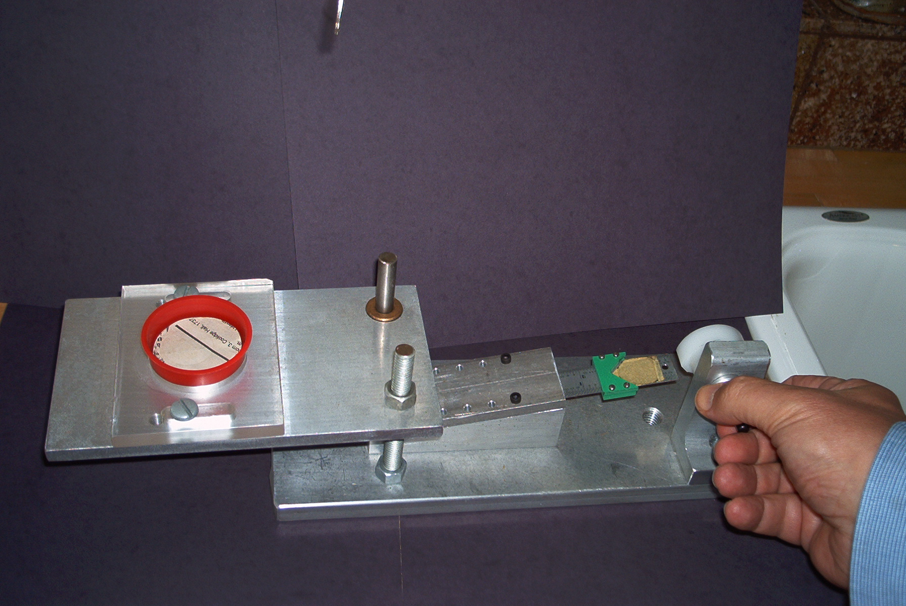
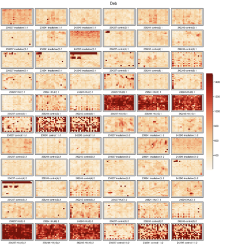
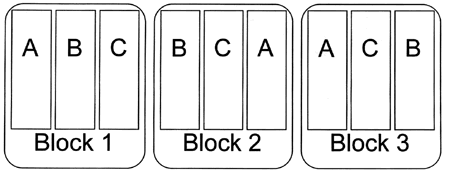
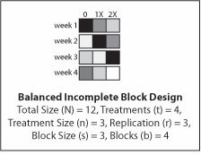
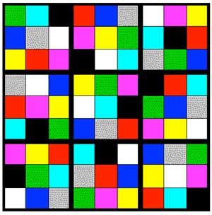
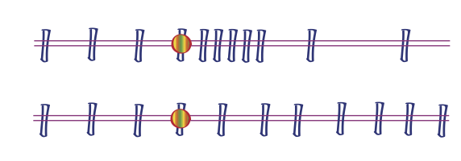
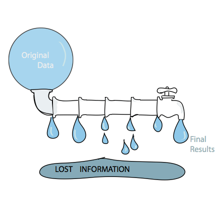

# Design of High Throughput Experiments 

<link href='http://fonts.googleapis.com/css?family=Lato&subset=latin,latin-ext' rel='stylesheet' type='text/css'>

<style type="text/css"> 
.small-code pre code {
  font-size: 1em;
}
body{
  font-family: Lato;
  font-size: 24pt;
  max-width: 1000px;
  margin-left: auto;
  margin-right: auto;
  line-height: 1.5;
}
h1{
  font-family: Lato;
  font-size: 32pt;
  color: #0080FF;
}
h2,h3,h4,h5,h6{
  font-family: Lato;
  font-size: 24pt;
  color: #0080FF;
}
b, strong {
 color: #0080FF;
}
.main-container {
  max-width: 1800px;
  margin-left: auto;
  margin-right: auto;
  line-height:1.5;
}

</style>

```{r initialize, echo = FALSE, warning = FALSE}
## Set default options for code chunks
knitr::opts_chunk$set(tidy = FALSE, cache = TRUE, autodep = TRUE,
     dev = "png", dpi = 300,
     size = "small",
     message = FALSE, error = FALSE, warning = TRUE)

input_dir = function(x)
  path.expand(file.path("/Users/whuber/svnco/CUBook", x))

## output width
base::options(width = 70,  continue = " ")

## set seed - to have reproducibility
set.seed(0xbedada)
```

RA Fisher                  |  Pioneer of Experimental Design
:-------------------------:|:------------------------------------------:
`){width="50%"}|  *To consult the statistician after an experiment is finished is often merely to ask him to conduct a post mortem examination. He can perhaps say what the experiment died of.*
[@fisher1935design]        |  (Presidential Address to the First Indian Statistical Congress, 1938. Sankhya 4, 14-17).  

# Goals for this Lecture

-   Resource allocation and experimental design: an iterative process.
-   Dealing with the different types of variability; partitioning variability
-   Transformations
-   Types of experiments, studies, ...
-   Power, sample size and efficiency.
-   Things to worry about: dependencies, batch effects, unwanted variation.
-   Compression, redundancy and sufficiency
-   Computational best practices

# The Art of "Good Enough"

- Experimental design rationalizes the tradeoffs imposed by having finite resources. 
- Our measurement instruments have limited resolution and precision; often we don't know these at the outset and have to collect preliminary data providing estimates. 
- Sample sizes are limited for practical, economic, and sometimes ethical reasons. 
- We may only be able to observe the phenomenon of interest indirectly rather than directly. 
- Our measurements may be overlaid with nuisance factors over which we have limited control. 
- There is little point in prescribing unrealistic ideals: we need to make pragmatic
choices that are feasible.

# Types of studies / experiments

## Experiment

- everything is exquisitely controlled

## Retrospective observational studies 

- we take what we get, opportunistic; no control over study participants, assignment of important factors, confounding 

## Prospective, controlled studies 

- e.g. clinical trials
- randomization, blinding
- ethical constraints (incl. money and time).

## Meta-analysis

- We did not design the experiments or studies ourselves, nor collect the data.
- Retrospective analysis of data that already happen to exist.


# Illustration: experiment

Well-characterized cell line growing in laboratory conditions on defined media, temperature
and atmosphere. 

We administer a precise amount of a drug, and after
72h we measure the activity of a specific pathway reporter. 

# Illustration: challenges with studies

We recruited 200 patients that have a disease, fulfill 
inclusion criteria (e.g. age, comorbidities, mental capacity) and ask
them to take a drug each day exactly at 6 am. After 3 months, we take an
MRI scan and lots of other biomarkers to see whether and how the disease
has changed or whether there were any other side effects. 

- People may forget to take the pill or take it at the wrong time. 
- Some may feel that the disease got worse and stop taking the drug.
- Some may feel that the disease got better and stop taking the drug. 
- Some may lead a healthy life-style, others eat junk food. 
- They have varying levels of disease to start with. 
- And all of these factors may be correlated with each other in unpredictable ways.

What to do about this?

# Examples

-  We modeled the sampling noise in RNA-seq and 16S rRNA with a Gamma-Poisson distribution.
-  We estimated sequencing depth bias with the library size factors.
-  We modeled sampling biases caused by the two different RNA-Seq protocols in the pasilla data
   (single-, paired-end) by introducing a blocking factor into our (generalized) linear model.

# What is a good normalization method?

```{r norm, results = "hide", warning = FALSE, message = FALSE, fig.width = 6, fig.height = 3, out.width = "100%"}
library("DESeq2")
library("airway")
library("ggplot2")
library("dplyr")
library("gridExtra")
data("airway")
aw = DESeqDataSet(airway, design = ~ cell + dex) %>% estimateSizeFactors
sizeFactors(aw)

samples = c("SRR1039513", "SRR1039517") 

myScatterplot = function(x) {
  as_tibble(x) %>% 
  mutate(rs = rowSums(x)) %>%
  filter(rs >= 2) %>%
  ggplot(aes(x = asinh(SRR1039513), 
             y = asinh(SRR1039517))) + geom_hex(bins = 50) +
    coord_fixed() + 
    geom_abline(slope = 1, intercept = 0, col = "orange") + 
    theme(legend.position = "none")
}

grid.arrange(
  myScatterplot(counts(aw)),
  myScatterplot(counts(aw, normalized = TRUE)),
  ncol = 2)
```
```{r runDESeq, echo = FALSE, warning = FALSE, message = FALSE}
library("magrittr")
aw = DESeqDataSet(airway, design = ~ cell + dex) %>% DESeq  
```

- If the normalization is 'off', we can have increased variability between replicates
- ... and/or apparent systematic differences between different conditions that are not real
- $\to$ false positives, false negatives

What do we want from a good normalization method:

- remove technical variation
- but *keep* biological variation

Possible figure of merit?

- signal-to-noise ratio

# Occam's razor

<div style="text-align: center;"> 
{width="35%"}
William of Ockham
</div>

If one can explain a phenomenon without assuming this or that hypothetical entity, there is no ground for assuming it.

One should always opt for an explanation in terms of the fewest possible causes, factors, or variables.

# Error models: Noise is in the eye of the beholder

The efficiency of most biochemical or physical processes involving
DNA-polymers depends on their sequence content, for instance,
occurrences of long homopolymer stretches, palindromes, GC content. 

These effects are not universal, but can also
depend on **factors** like concentration, temperature, which enzyme is used,
etc. 

When looking at RNA-Seq data, should we treat GC content as noise
or as bias? 

# One person's noise can be another's bias

`){width="10%"}  We may think that the outcome of tossing a coin is completely random. 

If we meticulously registered the initial conditions of the
coin flip and solved the mechanical equations, we could predict which
side has a higher probability of coming up: noise becomes bias. 

<div style="text-align: center;"> 
{width="50%"}
[P. Diaconis, S. Holmes, et al.](https://news.stanford.edu/pr/2004/diaconis-69.html)
</div>

We use probabilistic
modelling as a method to bring some order into our ignorance -- but let's
keep in mind that these models are a reflection of our subjective
ignorance, not an objective property of the world. 

# Biological versus technical replicates

Imagine we want to test whether a weight loss drug works. Which of the
following designs is better?

-   A person is weighed on milligram precision scales, with 20 replicates. He/she follows the diet, and four weeks later, (s)he is weighed again, with 20 replicates. The data are recorded by a specifically trained technician.

-   5 people weigh themselves on their bathroom scales and self-report the number. Four weeks later, they weigh themselves and report again. So we have 5 replicates.

This example shows the difference between technological versus biological replicates. 

Some design decisions in HT biology are similar, if more subtle:

- sequencing libraries
- cell lines
- CRISPR guides

# Quiz

For reliable variant calling with current sequencing technology, you need ca. 
$30\times$ coverage per genome.

In the *1000 genomes project*, the average depth of the data produced was 5.1 for 1,092 individuals. Why was that study design chosen?

# What exactly is a technical versus biological replicate?

In fact, the terminology is too simplistic. Error can creep in at many different levels:

- different labs, 
- different operators within one lab, 
- different technologies they use, 
- different machines from the same technology, 
- different variants of the protocol, 
- different strains, litters, sexes, individual animals

We will use the notion of blocks.

If we know about these nuisance factors and have kept
track of them, we can (should) include them explicitely as bias terms in our
models. 

If we did not keep track, we can try to use latent factor models (SVA, PEER, RUV)
to identify them from the data. 


# A lack of units

Pre-modern measurement systems measured lengths in feet, arms, inches (first joint of an index finger), weights in stones, volumes in multiples of the size of a wine jar, etc.

In the [International System of Units](https://en.wikipedia.org/wiki/International_System_of_Units): meters, seconds, kilograms, Ampères, ... are defined based on universal physical constants. A meter measured by a lab in Australia using one instrument has the same meaning as a meter measured a year later by a lab in Stanford using a different instrument, by a space probe in the Kuiper belt, or ETs on Proxima Cen b.

Measurements in biology are, unfortunately, rarely that comparable. 

Often, absolute values are not reported (these would require units), but only fold changes with regard to some local reference. 

Even when absolute values exist (e.g., read counts in an RNA-Seq experiment) they usually do not translate into universal units such as molecules per cell or mole per milliliter.


# Regular and catastrophic noise

Regular noise can be modelled by simple probability models such as
independent normal distributions, Poissons, or mixtures such as
Gamma-Poisson or Laplace. 

We can use relatively
straightforward methods to take noise into account in our data analyses.

The real world is more complicated: measurements can be completely off the scale (a sample swap, a contamination or a software bug), and multiple errors often come together: e.g., a whole microtiter plate went bad, affecting all data measured from it. 

Such events are harder to model or even correct for -- our best chance to deal with them is data quality assessment, outlier detection and documented removal.

# Keeping track: Dailies

`){width="30%"} | A film director will view daily takes, to correct potential lighting, shooting issues before they affect too much footage. It is a good idea not to wait until all the runs of an experiment have been finished before looking at the data. 
----------------------- |:-----------------------------:

Intermediate data analyses and
visualizations will track eventual unexpected sources of variation in
the data and enable you to adjust the protocol. 

It is important to be aware of sources of variation as
they occur and adjust for them.

<!--
# Phylochip example

<div style="text-align: center;"> 
`){width="50%"}
</div>
-->

# RNAi screen example

<div style="text-align: center;"> 
{width="50%"}
</div>

# Basic principles in the design of experiments

- Balancing
- Avoidance of confounding
- Blocking
- Randomization
- Attention to detail

# Clever combinations and balancing: a motivating example

`){width="20%"} | A pharmacist's balance weighing analogy (@Hotelling1944 and @Mood1946). 
----------------:|:---------------------------

Experimental design aims to maximize the available resources. One strategy is to capitalize on cancellations and symmetries. An interesting example is a weighing scheme devised by Hotelling.

Consider a set of eight objects of unknown weights $m=(m_1,\ldots,m_8)$.

For our simulation study, we create a vector of true $m$ randomly.

```{r HotellingsExpt}
m = sample(seq(2, 16, by = 2), 8)  + round(rnorm(8, 1), 1) %T>% print
```

## Method 1: Naive method, eight weighings

First, let's weigh each $m_i$ individually.

Suppose our scale has errors distributed normally with a SD of 0.1. We simulate the measurements (incl. individual errors) as follows. We also compute the root of the mean of their squares (RMS) as a measure of overall error.

```{r SimpleWeighing}
X_1to8 = m + rnorm(length(m), mean = 0, sd = 0.1)
X_1to8
errors_1to8 = X_1to8 - m
errors_1to8
rms = function(x) sqrt(mean(x^2))
rms(errors_1to8)
```

## Method 2: Hotelling's method, eight weighings

```{r HotellingsMethod, message = FALSE, warning = FALSE}
library("survey")
h8 = hadamard(6)
coef8 = 2 * h8 - 1
coef8
```

We use the columns of this matrix to guide our new weighing scheme.

The first column says we should put all 8 pieces on one side of the balance and weigh them, call this `Y[1]`. 

The second column says: place 
`r paste(which(h8[, 2] > 0), collapse = ", ")` on one side of the balance and 
`r paste(which(h8[, 2] < 0), collapse = ", ")` on the other and evaluate the difference. Call the result `Y[2]`.

And so on.

Each of the eight weighings has a normal error with sd = 0.1.

```{r}
Y = m  %*% coef8 + rnorm(length(m), mean = 0, sd = 0.1)
mhat = Y %*% t(coef8) / 8
```

Now, because we know the true $m$, we can compute the errors and their sum of squares:

```{r Hoterrors}
errors_hotel = as.vector(mhat) - m
errors_hotel
rms(errors_hotel)
rms(errors_1to8) / rms(errors_hotel)
```


# Proper simulation
We saw that the second method had RMS about `r round(rms(errors_1to8) / rms(errors_hotel))` times smaller than the first. Were we just lucky?

- Repeat Hotelling's weighing experiment B = 10,000 times with different
$m$ and look at the sampling distributions of the variances of the
errors in both schemes

- Guess at the relationship between the RMS results.

```{r bootstrapHotelling, message=FALSE, warning=FALSE, fig.width = 2.7, fig.height = 2.7}
tcoef8 = t(coef8) / 8
errs = replicate(10000, {
  m = sample(seq(2, 16, by = 2), 8) + round(rnorm(8, 1), 1)
  X_1to8 = m + rnorm(length(m), mean = 0, sd = 0.1)
  err_1to8 = X_1to8 - m
  Y = coef8 %*% m + rnorm(length(m), mean = 0, sd = 0.1)
  mhat = tcoef8 %*% Y
  err_hotel = mhat - m
  c(rms(err_1to8), rms(err_hotel))  
})

library("ggplot2")
library("tibble")
ggplot(tibble(ratio = errs[1,] / errs[2,]), aes(x = log2(ratio))) +
  geom_histogram(bins =  50)
```

We say that the second scheme is more efficient than the first by a factor of $\sqrt{8}$ because the RMS errors generated by the measurement are $\sqrt{8}$ times lower ($\log_2\sqrt{8}\approx$ `r round(log2(sqrt(8)), 1)`).

# One factor at a time?

Ibn Sina (Avicenna)  | | Physician Scientist
-------------------:|:----------------:|:-------------------        
`){width="100%"} | {width="100%"} | His *Canon of Medicine (1020)*  lists seven rules of experimental design, including the need for controls and replication, the danger of confounding and the necessity of changing only one factor at a time.

## This dogma was overthrown in the 20th century by RA Fisher.


# Comparing two levels of one factor: healthy or diseased.

```{r illustrateboxplots, echo = FALSE, warning = FALSE, message = FALSE}
require("gridExtra")
library("ggplot2")
library("ggbeeswarm")
library("dplyr")
states = factor(c("healthy", "tumor")[rep(c(1, 2), 6)])
times = c(1,1,1,1,2,2,2,2,3,3,3,3)
facte = 0.5 * times
`Biomarker A` = rep(c(1.5,2), 6) + rnorm(12,0,0.1)
`Biomarker B` = facte + rep(c(0.5,1), 6) + rnorm(12,0,0.3)
`Biomarker C` = rep(c(1.5,2),60) + rnorm(120,0,0.3)
batch = factor(c("Batch1", "Batch2")[rep(c(1,2),6)])
states_60 = factor(c("healthy","tumor")[rep(c(1,2),60)], levels=c("healthy","tumor"))
dfN = tibble(states_60,`Biomarker C`)
mN = summarise(group_by(dfN, states_60),med=median(`Biomarker C`))
pN = ggplot(dfN, aes(x=states_60, y=`Biomarker C`))

pN1= pN+geom_boxplot(alpha=0.5,col="blue") +
      geom_point(size=2,alpha=0.5) +
  geom_segment(data=mN,aes(y=med[1],yend=med[2]),x=1.5,xend=1.5, col="red",arrow = arrow(length = unit(0.25, "cm"), ends = "both", type = "closed"))
  
pNb=pN+geom_boxplot(alpha=0.5,col="blue")+
      geom_beeswarm(size=2,alpha=0.5)

batdef=tibble(states,`Biomarker B`,`Biomarker A`,times,batch)
ms0=summarize(group_by(batdef,states),y=median(`Biomarker A`))
p0= ggplot(batdef, aes(x=states, y=`Biomarker A`))
p0= p0+geom_boxplot(alpha=0.5,col="blue") +
  geom_point(size=2)
p0batch= ggplot(batdef, aes(x=states, y=`Biomarker A`,color=batch))
p0batch= p0batch+geom_boxplot(alpha=0.5,col="blue") +
  geom_point(size=2) + theme(legend.position = "none")
p0effect= p0 + geom_segment(
  data = ms0, aes(y = y[1], yend = y[2]),
  x = 1.5,  xend = 1.5, col="red",
  arrow = arrow(length = unit(0.25, "cm"), ends = "both", type = "closed"))

p = ggplot(batdef, aes(states, `Biomarker B`, times))
p2 = p + geom_boxplot() +  
  geom_point(color=times,size=2,alpha=0.5)
p1 = p + geom_boxplot(alpha=0.5,col="blue") +  
  geom_point(size=2,alpha=0.5)
```

```{r p0p0eff, fig.width = 4, fig.height = 2, out.width="100%"}
grid.arrange(p0, p0effect, ncol = 2)
```

However, suppose the experiment was done in two "batches", and we color the data according that:

```{r p0p0batch, fig.width = 4, fig.height = 2, out.width="100%"}
grid.arrange(p0, p0batch, ncol = 2)
```

We cannot conclude because we are in the presence of **confounding**.

Now suppose the experiment has higher noise levels, and the same number of points as in the previous study. Then, the sample sizes (2 x 6) is not enough. With the same error and a bigger sample size (2 x 60), it looks better.

```{r, fig.width = 4, fig.height = 2, out.width="100%"}
grid.arrange(p1, pN1, ncol=2)
```

The experiment at $n_1=n_2=6$ is not **powerful** enough.

```{r}
t.test(`Biomarker B` ~ states, data = batdef)
```

With the same effect size and a larger sample size,
we have the **power** to see the difference:

```{r}
t.test(`Biomarker C`~ states_60, data = dfN)
```

# Lessons from these toy examples

 - Success of an experiment: seeing difference if it is truely there.
 - Knowing where the difference comes from.      
 - True positive rate: power.
 - Spread (e.g., variances) matters as much as the locations (e.g., means).
 
Depends on: 

1) Effect size (**unchangeable**)
2) Control and documentation of all factors (block effects, date / time / operator etc.).
3) Noise (variability in measurements)
4) Sample size: remember the standard error of the mean is $$\frac{\sigma^2}{n}$$
 
# Decomposition of variability: analysis of variance.

```{r block, echo=FALSE, fig.width = 4, fig.height = 2, out.width="100%"} 
grid.arrange(p1,p2, ncol=2)
``` 

# Blocking: the case of paired experiments.

`){width="100%"} | Each pot in Darwin's *Zea Mays* experiment is a block, only the factor of interest should be different (pollination method), all other factors should be kept equal within a block.<br> A balanced design is an experimental design where all the different factor combinations have the same number of observation replicates.  Such data are particularly easy to analyse because the effect of each factor is identifiable.<br> When there are (likely) nuisance factors, it is good to make sure they are balanced with the factors of interest. Sometimes this is inconvenient or impractical for logistic or economic reasons -- but in such cases analysts are on thin ice and need to proceed with caution.|
|-------------------------:|:------------------------------|

# Comparing paired versus unpaired design

When comparing various possible designs, we do power
simulations. 

Here, we suppose the sample size is 15 in each group and the <span>effect
size</span> is 0.2. We also need to make assumptions about the standard
deviations of the measurements, here we suppose both groups have the
same sd=0.25.

```{r zeamays}
n = 15
effect = 0.2
pots   = rnorm(15, 0, 1)
noiseh = rnorm(15, 0, 0.25)
noisea = rnorm(15, 0, 0.25)
autoz  = pots + noisea
hybrid = pots + effect + noiseh
```

Perform a simple and a paired $t$-test. Which is more powerful in this case?

```{r}
t.test(hybrid, autoz, paired = FALSE)
t.test(hybrid, autoz, paired = TRUE)
```

Maybe we were just lucky (due to randomness in our simulation) here.

To confirm, run a parametric bootstrap experiment. Generate data as above `B=1000` times and compute the average probability of rejection, if allowing for a false positive rate $\alpha=0.05$.

```{r bootstrapPower}
pvals = replicate(1000, {
  pots   = rnorm(15,0,1)
  noiseh = rnorm(15,0,0.25)
  noisea = rnorm(15,0,0.25)
  autoz  = pots + noisea
  hybrid = pots + effect + noiseh
  sapply(c(FALSE, TRUE), function(prd) 
    setNames(t.test(hybrid, autoz, paired = prd)$p.value, paste(prd))
  )
}) 
rowMeans(pvals < 0.05)
```

We can plot the p-values obtained using both methods:

```{r pvaluescompare, fig.width = 3.5, fig.height= 2.5, out.width="80%"}
library("tidyr")
pivot_longer(as_tibble(t(pvals)), cols = rownames(pvals)) %>%
  transform(name = paste("paired =", name)) %>%
  ggplot(aes(x = value, fill = name)) + 
    geom_histogram(binwidth = 0.02, alpha = exp(-1))
```

# Exercises   

- Make a function that compares the power of the two types of tests
for different values of the effect size, sample size, standard deviation among the pots.
- Use your function to find out which of the standard deviations (pots
or noise) has the largest effect on the improvement produced by pairing
for $n = 15$.

```{r powerPairedUnpaired}
powercomparison = function(potsd = 1, noisesd = 0.25, n = 15, effect = 0.2,
                           B = 1000, pthresh = 0.05) {
  pv = replicate(B, {
    pots   = rnorm(n, 0, potsd)
    noiseh = rnorm(n, 0, noisesd)
    noisea = rnorm(n, 0, noisesd)
    autoz  = pots + noisea
    hybrid = pots + effect + noiseh
    sapply(c(FALSE, TRUE), function(prd) 
      setNames(t.test(hybrid, autoz, paired = prd)$p.value, paste(prd))
    )
  })
  rowMeans(pv < pthresh)
}
```

Here are a few examples showing that when the pots sd is smaller than the
noise sd, pairing hardly makes a difference. If the pots variability is
larger than that of the measurement noise, pairing makes a big
difference.

```{r}
powercomparison(potsd = 0.5,  noisesd = 0.25)
powercomparison(potsd = 0.25, noisesd = 0.5)
powercomparison(potsd = 0.25, noisesd = 0.1)
powercomparison(potsd = 0.1,  noisesd = 0.25)
```

For 100 plants of each type and the two SDs being 0.5, the power of the
paired test is nearly 80%.

```{r}
powercomparison(potsd = 0.5, noisesd = 0.5, n = 100)
```

Lesson: take into account a natural pairing of the observations -- for instance, studies of patients before and after a treatment.

What can be done when pairing is not available?

Try to create pairs of subjects that have as much similarity as possible
through matching age, gender (sex), background health etc. One is treated, the
other serves as a control.


# "Block what you can, randomize what you cannot" 

(George Box, 1978)

Often we don't know which nuisance factors will be important, or we
cannot plan for them ahead of time. 

In such cases, randomization is a practical strategy: at least in the limit of large enough sample size, the effect of any nuisance factor should average out.

## Randomized Complete Block Design
{width="50%"}

"The design space is divided into uniform units to account for any variation so that observed differences within units are largely due to true differences between treatments. Treatments are then assigned at random to the subjects in the blocks - once in each block. The defining feature of the Randomized Complete Block Design is that each block sees each treatment exactly once." ([Trudi Grant](https://pbgworks.org/sites/pbgworks.org/files/RandomizedCompleteBlockDesignTutorial.pdf))

## Balanced Incomplete Block Design
{width="50%"}

## Complete Factorial Latin Squares
{width="50%"}

(Latin square: n × n array filled with n different symbols, each occurring exactly once in each row and exactly once in each column)

# Randomization decreases bias

 - Humans are bad at assigning treatments truly at random 
 - Random assignment reduces unconscious bias 
    (special samples treated differently, "balancing things out", ...)
 - Randomization also helps with unknown nuisance factors.    

## Randomization helps inference

 - if the sample is randomly generated from a population, we can infer
   something about the population we drew from
  
## Random does not mean haphazardly
 - Need to use a random number generator and a seed.
   
# Controls, positive and negative: why?

We often need to remove variation due to unknown factors, or decompose variability according to its different sources; this is classically done using analysis of variance that can accomodatefactors such as subject or batch effects.

Usually these decompositions require at least 3 replicate measurements in each `cell`. 

Removal of effects from unknown sources can only be done through the use of **negative controls**. 

Calibration of the effect size in an experiment also requires the use of 
**positive controls**; spike-ins (for instance External RNA Control Consortium
controls as used in @Risso2014) where a known quantity or a known
expression level aid in these calibrations and are a standard part of
many experimental protocols.

Validation in independent data / independent lines of argument

If it is too good to be true, it usually is....

# How many replicates do I need?

We saw how we can use preliminary data and simulations to calculate how many replicates are needed to achieve, say, a 80% true positive rate, if we know the effect size. 

Now, recall the discussion of experiments versus studies. 

For the cell line experiment, we might get the correct result already from one replicate; usually we'll do two or three to be sure. 

On the other hand, for the study, our intuition tells us that there is so much uncontrolled variability that 20 is likely far too few, and we may need 200 or 2,000 patients for a reliable result. The number depends on the amount of uncontrolled variability, and the effect size. A pragmatic approach is to check out previous successful (or unsuccessful) experiments or studies that did something comparable and use simulations, subsampling or bootstrapping to get an estimate of our proposed new study's power. Here are more details about how to go about this in practice.

# Power depends on sample sizes, effect sizes and variability.

 - Example of two batches with different variability.
 - Examples of one treatment where the variance is larger.
 - Need to accomodate **heteroscedasticity** (unequal variances) with different sample sizes.

# Effective sample size for dependent data.

Dependent data require **larger** samples (intuition: each sample contains **less** information)
    
A sample of independent observations is more informative than the same number of dependent observations. 

Suppose you want to do an opinion poll by knocking at people's doors and asking them a question. 

- Scenario 1: pick $n$ people at $n$ random places throughout the country. 
- Scenario 2: to save travel time, you pick $n/3$ random places and then at each of these interview three people who live next door to each other. 

In both cases, the number of people polled is $n$, but if we assume that people living in the same neighborhood are more likely to have the same opinion, the data from Scenario 2 are (positively) correlated.  To explore this, let's do a simulation.

```{r effective_sample_size_sim, fig.width = 4, fig.height = 2.5, out.width = "80%", fig.cap = "Density estimates for the polling result using the two sampling methods. The correlated method has higher spread. The truth is indicated by the vertical line."}
doPoll = function(n = 100, numPeoplePolled = 12) {
  opinion = sort(rnorm(n))
  i1 = sample(n, numPeoplePolled)
  i2 = sample(seq(3, n, by = 3), numPeoplePolled / 3)
  i2 = c(i2, i2 - 1, i2 - 2)
  c(independent = mean(opinion[i1]), correlated = mean(opinion[i2]))
}
responses = replicate(5000, doPoll())
ggplot(pivot_longer(as_tibble(t(responses)), cols = rownames(responses)), 
       aes(x = value, col = name)) + geom_density() +
  geom_vline(xintercept = 0) + xlab("Opinion poll result")
```

There are `r formals(doPoll)$n` people in the country, of which in the first approach (`i1`) we randomly sample `r formals(doPoll)$numPeoplePolled`. In the second approach, we sample `r formals(doPoll)$numPeoplePolled / 3` people as well as two neighbors for each (`i2`). The *opinion* in our case is a real number, normally distributed in the population with mean 0 and standard deviation 1.

We model the spatio-sociological structure of our country by sorting the houses from most negative to most positive opinion in the first line of the `doPoll` function.


##  Time course: equalize the dependence structure by taking more frequent samples when there is more "going on".


{width="60%"}

# Mean-Variance Relationships and Transformations

You've seen examples for data transformations that compress or stretch the space of quantitativemeasurements in such a way that the measurements' noise variance  (**not:** the signal variance) is more similar throughout -- i.e., no longer highly dependent on the mean value.

The mean-variance relationship of a measurement technology can in principle be any function, but in many cases, the following prototyic relationships hold:

1.  constant: the variance is independent of the mean ("additive noise", $Y=\mu+\varepsilon$)

2.  Poisson: the variance is proportional to to the mean ("shot noise", $N\sim\text{Poi}(\mu)$)

3.  quadratic: the standard deviation is proportional to the mean,
    therefore the variance grows quadratically ("multiplicative noise", $Y=\mu \cdot e^\varepsilon$)

Do you know examples for biological assays (or measurement technologies) whose
data show these types of relationships?

Real data can also be affected by a combination of these. For instance:

- with DNA microarrays, the fluorescence intensities are subject to a
combination of background noise that is largely independent of the
signal (additive noise), and multiplicative noise whose standard deviation is
proportional to the signal [@RockeDurbin:2001]. Therefore, for bright
spots the multiplicative noise dominates, whereas for faint ones, the
background.

- in RNA-Seq, low counts are dominated by Poisson noise, high counts by the multiplicative noise.

We recall from Chapter 5 that for data with a mean-variance
relationship $v(\mu)$ the variance-stabilizing transformation
$g:\mathbb{R}\to\mathbb{R}$ fulfills the condition
$$g'(x)=\frac{1}{\sqrt{v(x)}}$$

a) What are the variance-stabilizing transformations associated with the
above three prototypic mean-variance relationships?
b) What is the variance stabilizing transformation that is appropriate
for $v(\mu) = v_0 + c\,\mu^2$, where $v_0>0$ is a positive constant?


# Data quality assessment and quality control

- data quality assessment (QA): steps taken to measure and monitor data quality
- data quality control (QC): removing bad data

These pervade all phases of an analysis, from assembling the raw data over transformation, summarization, model fitting, hypothesis testing or screening for ``hits'' to interpretation.  QA-related questions include:

- How do the marginal distributions of the variables look (histograms, ECDF plots)?
- How do their joint distributions look (scatter plots, pairs plot)?
- How well do replicates agree (as compared to different biological conditions)? Are the magnitudes of the differences between several conditions plausible?
- Is there evidence of batch effects? These could be of a categorical (stepwise) or continuous (gradual) nature, e.g., due to changes in experimental reagents, protocols or environmental factors. Factors associated with such effects may be explicitly known, or unkown and latent; often they are somewhere in between (e.g., when a measurement apparatus slowly degrades over time)

For the last two sets of questions, heatmaps, principal component plots and other ordination plots are useful.

`){width="60%"}

Henry Ford's (possibly apocryphal) quote: ``If I had asked people what they wanted, they would have said faster horses.'' (https://corporate.ford.com/history.html) expresses the view of quality as **fitness for purpose**, versus **adherence to specifications**.

It is not easy to nail down (mathematically define)  quality, and the word is used with many meanings. See also http://en.wikipedia.org/wiki/Quality_(business) 

# Longitudinal Data

Longitudinal data have time as a covariate. 

The first question is whether we are looking at a handful of time points -- say, the response of a cell line measured 48h, 72h and 84h after exposure to a drug; or a long and densely sampled time series such as patch clamp data in electrophysiology or a movie from life cell microscopy.

In the first case, time is usually best thought of as just another experimental factor, in the same way as we consider the concentration or the choice of drug. One analysis strategy could be to first identify the "best", or biologically most indicative, time point, and then focus on that. Or we can ask whether there is any effect at all, regardless of the time. We then just need to make sure that we account for the dependencies between the measurements over time, and effective sample
sizes. When designing the experiment, we'll also try to sample more densely at those times when we expect most to happen.

In the second case, time series, we'll often want to fit dynamical models to the data. We have many choices:

-   (Hidden) Markov models
-   Change point detection
-   Ordinary differential equations or reaction-diffusion models
-   Piece-wise deterministic stochastic processes
-   Autoregressive models
-   Non-parametric smoothing followed by clustering or classification
    into prototypic shapes

# Don't Pretend You Are Dumb

There is some attraction to seemingly "unbiased" approaches that analyse
the data at hand without any reference to what is already known. Such
tendencies are reinforced by the fact that statistical methods have
often been developed to be generic, for instance, working of a general
matrix without specific reference to what the rows and column might
signify.

Generic approaches are a good way to get started, and for analyses that are highly powered and straightforward, such an an approach might work out. But often, it is wasteful. Recall the example of an RNA-Seq experiment for differential expression. As we saw in the *RNA-Seq* and *Hypothesis Testing* lectures, we could perform a hypothesis test for differential expression for each annotated gene, regardless of its read counts, and then run a multiple testing method that treats all tests as exchangeable. But this is inefficient - we can improve our detection power by filtering out, or downweighting, the hypotheses with lower test power, or with lower prior probability of being alternative.

Other examples include:

-   Penalisation or feature selection in high-dimensional regression or
    classification. It is easy to use schemes that treat all features
    the same, for instance, standardize all of them to zero mean and
    unit variance. But sometime we know that some classes of features
    are likely to be more or less informative than
    others.

-   You can also use graphs to represent "other" data (networks) and use
    approaches like the group or graph lasso to
    structure your penalties in high-dimensional modelling.

-   Unsupervised clustering of your objects of interests (samples,
    genes, etc.) and subsequent search for over-represented annotations.
    Instead, just check whether the members of groups defined by the
    annotations are more similar than two randomly picked objects.

# Leaky pipelines and statistical sufficiency

{width="25%"}

Data analysis pipelines in high-throughput biology often work as **funnels** that successively summarise and compress the data. In high-throughput sequencing, we may start with individual sequencing reads, then align them to a reference, then only count the aligned reads for each position, summarise positions to genes (or other kinds of regions), then "normalize" these numbers by library size, etc. 

At each step, we loose some information, and it is important to make sure we still have enough information for the task at hand. The problem is particularly burning if we use a data pipeline built from a series of separate components without enough care being taken ensuring that all the information necessary for ulterior steps is conserved.

Statisticians have a concept for whether certain summaries enable the
reconstruction of all the relevant information in the data:
**sufficiency**. E.g., in a Bernoulli random experiment with a known
number of trials, $n$, the number of successes is a sufficient statistic
for estimating the probability of success $p$.

In a 4-state Markov chain (A,C,G,T) such as the one we saw in Lecture 2, what are the sufficient statistics for the estimation of the transition probabilities?

Iterative approaches akin to what we saw when we used the EM algorithm
can sometimes help avoid information loss. For instance, when analyzing
mass spectroscopy data, a first run guesses at peaks individually for
every sample. After this preliminary spectra-spotting, another iteration
allows us to borrow strength from the other samples to spot spectra that
may have been labeled as noise.

# Sharpen Your Tools: Reproducible Research

Analysis projects often begin with a simple script, perhaps to try out a
few initial ideas or explore the quality of the pilot data. Then more
ideas are added, more data come in, other datasets are integrated, more
people become involved. Eventually the paper needs to be written,
figures be redone properly, and the analysis be saved for the
scientific record and to document its integrity. Here are a few tools
that can help with such a process.

**Use an integrated development environment.** <span>RStudio</span> is a
great choice; there are also other platforms such as Emacs or Eclipse.

**Use literate programming** tools such as <span>Rmarkdown</span> or
Jupyter. This is more readable (for yourself and for others) than
burying explanations and usage instructions in comments in the source
code or in separate README files, in addition you can directly embed
figures and tables in these documents. Such documents are often good
starting points for the supplementary material of your paper.

**Anticipate re-engineering of the data formats and the software.** The
first version of how you choose to represent the data and structure the
analysis workflows will rarely be the best. Don't be afraid to make
a clean cut and redesign them as soon as you notice that you are doing a
lot of awkward data manipulations or repetitive steps. This is time
well-invested. Sometimes it also helps to unearth bugs.

**Reuse existing tools.** Don't reinvent the wheel and rather spend your
time on things that are actually new. Before implementing a 'heuristic'
or a temporary hack that analyses your data in a certain way, spend a
couple of minutes researching to see if something like this hasn't been
done before. More often than not, it has, and there is a clean,
scalable, and already tested solution.

**Use version control**, such as git. This takes some time to learn, but in
the long run will be infinitely better than all your self-grown attempts
at managing evolving code with version numbers, switches and the like.
Moreover, this is also the sanest option for collaborative work on code,
and it provides an extra backup of your codebase, especially if the
server is distinct from your workplace machine.

**Use functions** rather than copy-pasting 
stretches of code.

**Use the R package system.** Soon you'll note recurring function or
variable definitions that you want to share between your individual
scripts. It is fine to use the R function to manage them initially, but
it is never to early to move them into your own package at the latest
when you find yourself starting to write README files or long emails
explaining others how to use some script or another. Assembling existing
code into an R package is not hard by any means, and offers you many
goodies including standardized and convenient ways to provide
documentation, to show code usage examples, to test the correct
functioning of your code, and to version it. Quite likely you'll soon
appreciate the benefit of using namespaces.

**Centralize the location of the raw data files and streamline the
derivation of intermediate data.** Store the input data at a centralized
file server that is professionally backed up. Mark the files as
read-only. Have a clear and linear workflow for computing the derived
data (e.g., normalised, summarised, transformed etc.) from the raw files,
and store these in a separate directory. Anticipate that this workflow
will need to be re-run several times, and version it. Use or similar
tools to mirror these files on your personal computer.

**Integration.** When developing downstream analysis ideas that bring
together several different data types, you don't want to do the
conversion from data type specific formats to the representations that
machine learning or generic statistical methods use each time on an ad
hoc basis. Have a *recipe* script that assembles the different
ingredients and cooks them up as an easily consumable matrix, data
frame or Bioconductor.

**Keep a hyperlinked webpage with an index of all analyses.** This is
helpful for collaborators (especially if the page and the analysis can
be accessed via a web browser) and also a good starting point for the
methods part of your paper. Structure it in chronological or logical
order, or a combination of both.

# Data representation

Combining all the data so it is ready for analysis or visualisation often involves a lot of shuffling around of the data, until they are in the right shape and
format for an analytical algorithm or a graphics routine. 

Errors can occur, lost labels, lost information: be safe, redundancy is good.


# Wide vs long table format

Recall Hiiragi data (for space reasons we print only the first five rows and columns):

```{r wide}
data("x", package = "Hiiragi2013")
dfw = as.data.frame(exprs(x))
dfw[1:5, 1:5]
dim(dfw)
```

This dataframe has `r ncol(df)` columns of data, one for each sample (annotated by the column names). Its rows correspond to the `r nrow(df)` probes, annotated by the probe identifiers. This is an example for a data table in *wide format*.

```{r pivot_longer}
dfw$probeid = rownames(dfw)
dfl = pivot_longer(dfw, 
            cols = colnames(x),
            names_to = "Embryonic Day") %T>% print
```

In `dfl`, each row corresponds to exactly one measured value, stored in the column named `value`. Then there are additional columns that store the associated covariates.

Now suppose we want to store somewhere not only the probe identifiers
but also the associated gene symbols. 

In `dfw`, we could stick them as an additional column, and perhaps also throw in the genes' ENSEMBL identifier for good measure. But now we
have a problem: the dataframe now has some columns that
represent different samples, and others that refer to information for
all samples (the gene symbol and identifier) and we somehow have to
know this when interpreting the dataframe. This is what Hadley Wickham
calls **untidy data**. 

In contrast, in `dfl`, we can add these columns, yet still know that each row forms exactly one observation, and all information associated with that observation is in the same row.

# Tidy data 

In tidy data 

1.  each variable forms a column,

2.  each observation forms a row,

3.  each type of observational unit forms a table.

# Using tidy data wisely

See also https://www.huber.embl.de/msmb/Chap-Design.html#tidy-data-using-it-wisely

## Efficiency (lack of)

Even though there are only `r nrow(dfw)` probe-gene symbol relationships, we are storing them `r nrow(dfl)` times in the rows of `dfl`. 

## Standardization (lack of)

We may choose to call these columns `probeid` and `geneid`, but the next person might call them `probe_id` and `gene_id`, or even something completely different. When we find a dataframe that was made by someone else and that contains such-named columns, we may hope, but have no guarantees, that these are valid gene symbols. 

Addressing such issues is behind the object-oriented design of the specialized data structures in Bioconductor, such as the class `SummarizedExperiment`.

## Matrices versus dataframes

Representation of the matrix may also simply be more natural and mathematically stringent - e.g., if we want to apply PCA / dimension reduction, or classification.

# Summary

There are two types of variation in an experiment or study: those of interest, those that are unwanted. 

We usually cannot rid ourselves of all the unwanted variation, but we saw how we can used balanced randomized designs, data transformations. 

Reproducible workflows

Open science: make data and code available


# Further Reading

Book chapter

Lecture and chapter presented merely a pragmatic introduction to design, there are many book long treatments of the subject that offer detailed advice on setting up experiments: @wu2011experiments; @box1978statistics; @glass2007experimental

## References 