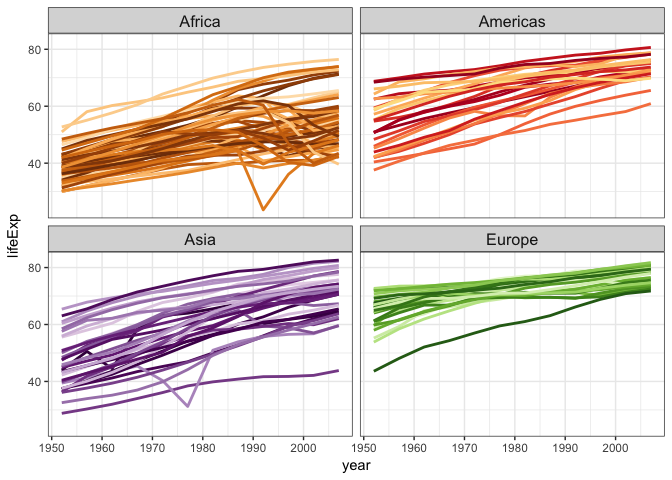

01-functions.R
================
jenny
Fri Jun 16 09:29:45 2017

``` r


## Write your own R functions, part 1
library(gapminder)
library(tidyverse)
#> + ggplot2 2.2.1             Date: 2017-06-16
#> + tibble  1.3.3                R: 3.3.2
#> + tidyr   0.6.3               OS: OS X El Capitan 10.11.6
#> + readr   1.1.1              GUI: X11
#> + purrr   0.2.2.9000      Locale: en_CA.UTF-8
#> + dplyr   0.7.0               TZ: Europe/Rome
#> + stringr 1.2.0           
#> + forcats 0.2.0
#> Conflicts -----------------------------------------------------------------
#> * filter(),  from dplyr, masks stats::filter()
#> * lag(),     from dplyr, masks stats::lag()


## Hello Gapminder
str(gapminder)
#> Classes 'tbl_df', 'tbl' and 'data.frame':    1704 obs. of  6 variables:
#>  $ country  : Factor w/ 142 levels "Afghanistan",..: 1 1 1 1 1 1 1 1 1 1 ...
#>  $ continent: Factor w/ 5 levels "Africa","Americas",..: 3 3 3 3 3 3 3 3 3 3 ...
#>  $ year     : int  1952 1957 1962 1967 1972 1977 1982 1987 1992 1997 ...
#>  $ lifeExp  : num  28.8 30.3 32 34 36.1 ...
#>  $ pop      : int  8425333 9240934 10267083 11537966 13079460 14880372 12881816 13867957 16317921 22227415 ...
#>  $ gdpPercap: num  779 821 853 836 740 ...
ggplot(gapminder %>% filter(continent != "Oceania"),
       aes(x = year, y = lifeExp, group = country, color = country)) +
  geom_line(lwd = 1, show.legend = FALSE) + facet_wrap(~ continent) +
  scale_color_manual(values = country_colors) +
  theme_bw() + theme(strip.text = element_text(size = rel(1.1)))
```



``` r


## Max - min life expectancy, for each continent or, imagine 😱😱, country
## The Smelly Version
africa <- gapminder[gapminder$continent == "Africa", ]
africa_mm <- max(africa$lifeExp) - min(africa$lifeExp)
americas <- gapminder[gapminder$continent == "Americas", ]
americas_mm <- max(americas$lifeExp) - min(americas$lifeExp)
asia <- gapminder[gapminder$continent == "Asia", ]
asia_mm <- max(asia$lifeExp) - min(africa$lifeExp)
europe <- gapminder[gapminder$continent == "Europe", ]
europe_mm <- max(europe$lifeExp) - min(europe$lifeExp)
oceania <- gapminder[gapminder$continent == "Oceania", ]
oceania_mm <- max(oceania$lifeExp) - min(oceania$lifeExp)
(df <- tibble(
  continent = c("Africa", "Asias", "Americas", "Europe", "Oceania"),
  max_minus_min = c(africa_mm, americas_mm, asia_mm, europe_mm, oceania_mm)
))
#> # A tibble: 5 x 2
#>   continent max_minus_min
#>       <chr>         <dbl>
#> 1    Africa        52.843
#> 2     Asias        43.074
#> 3  Americas        59.004
#> 4    Europe        38.172
#> 5   Oceania        12.115


## How to fix?
##
## Write a function!                         <-- OUR TOPIC
## Use with a high-level iteration approach


## Max - min
## Get something that works!!!


## learn the landscape
min(gapminder$lifeExp)
#> [1] 23.599
max(gapminder$lifeExp)
#> [1] 82.603
range(gapminder$lifeExp)
#> [1] 23.599 82.603

## some natural solutions
max(gapminder$lifeExp) - min(gapminder$lifeExp)
#> [1] 59.004
with(gapminder, max(lifeExp) - min(lifeExp))
#> [1] 59.004
range(gapminder$lifeExp)[2] - range(gapminder$lifeExp)[1]
#> [1] 59.004
with(gapminder, range(lifeExp)[2] - range(lifeExp)[1])
#> [1] 59.004
diff(range(gapminder$lifeExp))
#> [1] 59.004

## Internalize this "answer" for eye-ball-ometric testing

## Skateboard >> perfectly formed rear-view mirror
```


``` r
## Turn the working interactive code into a function
max_minus_min <- function(x) max(x) - min(x)
max_minus_min(gapminder$lifeExp)
#> [1] 59.004
## same answer? good!


## Test on new inputs

## artificial inputs where you know answer ... at least sort of
max_minus_min(1:10)
#> [1] 9
max_minus_min(runif(1000))
#> [1] 0.9972745


## Test on real data but *different* real data
max_minus_min(gapminder$gdpPercap)
#> [1] 113282
max_minus_min(gapminder$pop)
#> [1] 1318623085
## check by hand or sanity check


## Test on weird stuff you might to do late at night
max_minus_min(gapminder)
#> Error in FUN(X[[i]], ...): only defined on a data frame with all numeric variables
max_minus_min(gapminder$country)
#> Error in Summary.factor(structure(c(1L, 1L, 1L, 1L, 1L, 1L, 1L, 1L, 1L, : 'max' not meaningful for factors
max_minus_min("eggplants are purple")
#> Error in max(x) - min(x): non-numeric argument to binary operator
## Do you want to read these error messages at 3a.m.?


## Scary things
max_minus_min(gapminder[c('lifeExp', 'gdpPercap', 'pop')])
#> [1] 1318683072
max_minus_min(c(TRUE, TRUE, FALSE, TRUE, TRUE))
#> [1] 1
## Do you want your function to "work" on such input?


### Check the validity of arguments

## Rule of Repair: When you must fail, fail noisily and as soon as possible.

## stopifnot
mmm <- function(x) {
  stopifnot(is.numeric(x))
  max(x) - min(x)
}
mmm(gapminder)
#> Error: is.numeric(x) is not TRUE
mmm(gapminder$country)
#> Error: is.numeric(x) is not TRUE
mmm("eggplants are purple")
#> Error: is.numeric(x) is not TRUE
mmm(gapminder[c('lifeExp', 'gdpPercap', 'pop')])
#> Error: is.numeric(x) is not TRUE
mmm(c(TRUE, TRUE, FALSE, TRUE, TRUE))
#> Error: is.numeric(x) is not TRUE

## if then stop
## when you care enough to write an error message
mmm2 <- function(x) {
  if (!is.numeric(x)) {
    stop('I am so sorry, but this function only works for numeric input!\n',
         'You have provided an object of class: ', class(x)[1])
  }
  max(x) - min(x)
}
mmm2(gapminder)
#> Error in mmm2(gapminder): I am so sorry, but this function only works for numeric input!
#> You have provided an object of class: tbl_df

## GOOD STOPPING POINT
```
